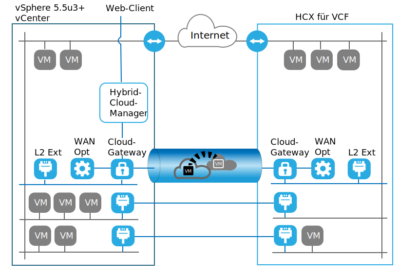

---

copyright:

  years:  2016, 2019

lastupdated: "2019-02-15"

subcollection: vmwaresolutions

---
# VMware HCX on IBM Cloud - Einführung
{: #hcx-archi-intro}

Der VMware HCX on IBM Cloud-Service ermöglicht die Erstellung einer nahtlosen Verbindung zwischen Instanzen von IBM Cloud for VMware Solutions und einem lokalen virtualisierten VMware-Rechenzentrum.

IBM Cloud for VMware Solutions umfasst voll automatisierte schnelle Bereitstellungen von Konfigurationen für VMware vCenter Server on IBM Cloud (VCS) oder VMware Cloud Foundation on IBM Cloud (VCF) in IBM Cloud. Diese Angebote ergänzen die lokale Infrastruktur und ermöglichen die Ausführung vorhandener und zukünftiger Workloads in IBM Cloud ohne Konvertierung, da sie dieselben Tools, Kenntnisse und Prozesse verwenden, die auch lokal verwendet werden. Weitere Informationen finden Sie unter [IBM Architecture Center](https://www.ibm.com/devops/method/content/architecture/virtualizationArchitecture).

Der VMware HCX on IBM Cloud-Service baut diese Hybridität aus, indem er die Erstellung nahtloser Netzwerkerweiterungen und die bidirektionale Migration von Workloads ermöglicht und so VCS- oder VCF-Instanzen mit vorhandenen lokalen virtualisierten Rechenzentren zusammenführt.

Die VMware HCX on IBM Cloud-Komponenten, die als virtuelle Maschinen am IBM Cloud VMware-Zielstandort bereitgestellt werden, ermöglichen den Aufbau einer Verbindung zu den VMware HCX on IBM Cloud-Komponenten, die am lokalen Peer-Quellenstandort installiert sind.

Abbildung 1. VMware Cloud Foundation – Hybrid-Cloud-Services

Durch diese Verbindung wird eine flexible Interkonnektivität zwischen lokalen Standorten und IBM Cloud hergestellt und u. a. folgende Funktionalitäten ermöglicht:
* Einfache Interkonnektivität - Logische Netzverbindungen können ohne großen Aufwand über eine beliebige physische Verbindung hergestellt werden, z. B. über das öffentliche Internet, ein privates VPN oder über eine direkte Verbindung.
* Layer-2-Erweiterung - Lokale Netze werden in die Cloud erweitert. Zu diesen Netzen zählen auch lokale Teilnetze und IP-Adressierung.
* Verschlüsselung - Der Datenaustausch im Netz wird zwischen den beiden Standorten sicher verschlüsselt.
* Netzoptimierung - Wählt die beste Verbindung aus und nutzt die Verbindung effizient aus, sodass der Datenaustausch im Netz mit maximaler Geschwindigkeit erfolgt.
* Datendeduplizierung – Eine Reduktion des Netzverkehrs um bis zu 50% kann durch intelligentes Routing erreicht werden: Wenn eine Workload verschoben wird, kann das "Proximity Routing" den Netzpfad (d. h. Gateway) ändern, sodass der Datenaustausch im Netz das Gateway des Zielstandorts verwendet (anstelle eines "Hairpinnings" zum ursprünglichen Standort).
* Migration ohne Ausfallzeit – Ein aktives System kann mit vMotion in oder aus der Cloud verschoben werden.
* Geplante Migration - Eine beliebige Anzahl virtueller Maschinen kann an den Zielstandort repliziert und dann zu einem bestimmten Zeitpunkt an diesem Standort aktiviert werden und die Systeme ersetzen, die am ursprünglichen Standort ausgeführt werden.
* Migration von Sicherheitsrichtlinien - Wenn NSX lokal verwendet wird, werden zusammen mit der Workload alle vorhandenen Sicherheitsrichtlinien oder Firewalls verschoben.

## Zugehörige Links
{: #hcx-archi-intro-related}

* [IBM Architecture Center](https://www.ibm.com/devops/method/content/architecture/virtualizationArchitecture)
