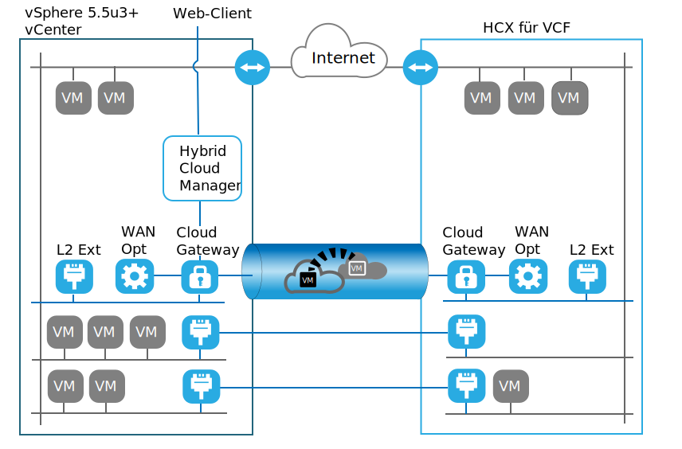
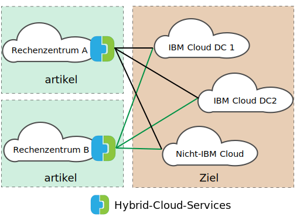

---

copyright:

  years:  2016, 2019

lastupdated: "2019-05-06"

subcollection: vmware-solutions

---
# Übersicht über VMware HCX on IBM Cloud
{: #hcx-archi-overview}

VMware HCX on IBM Cloud kann lokale vSphere® vCenter™-Netze nahtlos in IBM Cloud for VMware Solutions-Bereitstellungen integrieren. Durch die hybride Vernetzung werden lokale vSphere vCenter-Netze hin zu IBM Cloud erweitert, wodurch die bidirektionale Mobilität der virtuellen Maschinen (VMs) unterstützt wird.

HCX ist Eigner der Verfahren für Quellen- und Zielverschlüsselung, gewährleistet so konsistente Sicherheit und stellt den Zugang für hybride Workflows wie die Migration von virtuellen Maschinen und Netzerweiterungen bereit.

Dieses Produktangebot erstellt ein optimiertes, softwaredefiniertes WAN, um die Performance des erweiterten Netzes zu erhöhen, wodurch die Leistung annähernd LAN-Geschwindigkeit erreicht. HCX ermöglicht außerdem bidirektionale Workloads und die Migration von VMware NSX®-Sicherheitsrichtlinien hin zu IBM Cloud. HCX lässt sich in vSphere vCenter integrieren und wird über vSphere Web Client verwaltet.

## Layer-2-Netz-Erweiterung
{: #hcx-archi-overview-layer-2-net}

HCX ermöglicht es einer vorhandenen lokalen vSphere-Bereitstellung, ein Netz sicher von der lokalen vCenter-Instanz in ein IBM Cloud-Rechenzentrum zu erweitern, in dem VMware vCenter Server ausgeführt wird. Diese Funktion wird durch die folgenden Elemente aktiviert:
* HCX stellt eine Appliance mit dem Namen "Layer 2 Concentrator" (Layer-2-Konzentrator, L2C) bereit.
* Erweiterte Netze werden mit IBM Cloud-NSX-Edge-Appliances verbunden, die in VMware vCenter Server bereitgestellt sind.
* Es können mehrere Standard-Layer-2-Konzentratoren bereitgestellt werden, um Skalierbarkeit zu erzielen und den Durchsatz von Seiten der lokalen vCenter-Instanz zu erhöhen.
* Virtuelle Maschinen, die über das Cloud-Gateway und über ein erweitertes Layer-2-Netz migriert werden, können ihre IP- und MAC-Adressen beibehalten.

## Migration virtueller Maschinen
{: #hcx-archi-overview-vm-mig}

HCX bietet drei Methoden zur Verschiebung von virtuellen Maschinen: Migration mit geringer Ausfallzeit, Migration mit vSphere vMotion und Cold Migration.

### Migration mit geringer Ausfallzeit
{: #hcx-archi-overview-low-downtime-mig}

Die Migration mit geringer Ausfallzeit beruht auf der vSphere-Replikation, einer verteilten Technologie, die im VMware ESX®/ESXi®-Hypervisor implementiert ist. Die lokale HCX-Bereitstellung erstellt ein Replikat einer virtuellen Live-Maschine in IBM Cloud und führt eine Umschaltung durch, um die virtuelle Quellenmaschine auszuschalten und die migrierte virtuelle Maschine einzuschalten.

Der Migrationspfad führt immer über das Cloud-Gateway. Die Übertragung kann über das Internet, ein erweitertes Layer-2-Netz oder eine Direktverbindung erfolgen.

Eine virtuelle Maschine kann in beide Richtungen mehrere Male migriert werden.

### vMotion-Migration
{: #hcx-archi-overview-vmotion-mig}

Virtuelle Live-Maschinen können mit der vMotion-Migration über ein Netz übertragen werden, das hin zu IBM Cloud erweitert wurde. Die vMotion-Migration wird auch als "Migration ohne Ausfallzeit" oder "cloudumfassende vMotion" bezeichnet.

### Cold Migration
{: #hcx-archi-overview-cold-mig}

Mit einer Cold Migration können Sie eine ausgeschaltete VM über ein erweitertes Netz, das mit dem Layer-2-Konzentrator erstellt wird, hin zu IBM Cloud übertragen.

### Merkmale, die allen Migrationsmethoden gemeinsam sind
{: #hcx-archi-overview-cold-mig-features}

Zu den weiteren Merkmalen, die allen drei Migrationstypen gemeinsam sind, gehört die softwaredefinierte WAN-Optimierung, mit der sich Durchsatz und Geschwindigkeit der Migration erhöhen lassen. Darüber hinaus kann die Migration für einen bestimmten Zeitpunkt geplant werden und es kann der Hostname, der Name der virtuellen Maschine oder beides beibehalten werden.

## Funktionen des Netzes
{: #hcx-archi-overview-net-features}

Die folgenden Netzfunktionen sind in das Cloud-Gateway und die Layer-2-Konzentratoren integriert.

### Intelligente Flussweiterleitung
{: #hcx-archi-overview-intel-flow-routing}

Diese Funktion wählt automatisch die beste Verbindung basierend auf dem Internet-Pfad aus und überflutet effizient die gesamte Verbindung, sodass die Workloads schnellstmöglich verschoben werden. Wenn größere Datenflüsse, wie z. B. Sicherung oder Replikation, eine CPU-Konkurrenzsituation verursachen, werden kleinere Datenflüsse zwecks einer verbesserten Leistung des interaktiven Datenverkehrs an weniger ausgelastete CPUs weitergeleitet.

### Proximity Routing
{: #hcx-archi-overview-prox-routing}

Das Proximity Routing stellt sicher, dass die Weiterleitung zwischen virtuellen Maschinen, die mit erweiterten und weitergeleiteten Netzen verbunden sind (sowohl lokal als auch in der Cloud), symmetrisch ist. Diese Funktion setzt Advanced Networks Services mit dynamischem Routing voraus, das zwischen dem Kundenstandort und der Cloud konfiguriert ist.

Wenn Benutzer ihre Netze in die Cloud erweitern, wird die Layer-2-Konnektivität auf IBM Cloud-Netze erweitert. Ohne Routenoptimierung jedoch müssen die Layer-3-Kommunikationsanforderungen zum lokalen weiterzuleitenden Ursprungsnetz zurückkehren. Diese Rückgabe wird als _Tromboning_ oder _Hairpinning_ bezeichnet.

Das Tromboning ist ineffizient, da Pakete zwischen dem Ursprungsnetz und der Cloud hin- und hergesendet werden müssen, selbst wenn sich sowohl die Quellen- als auch die Ziel-VM in der Cloud befindet.

Zur Ineffizienz kommt hinzu, dass die Kommunikation fehlschlagen kann, wenn der Weiterleitungspfad statusabhängige Firewalls oder andere Inline-Geräte beinhaltet, die auf beide Seiten der Verbindung zugreifen können müssen. Ein Fehlschlagen der VM-Kommunikation (ohne Routenoptimierung) tritt auf, wenn der Austrittspfad aus der Cloud entweder das erweiterte Layer-2-Netz oder das Netz mit Weiterleitung der Organisation sein kann. Dem lokalen Netz ist der "Direktaufruf" des erweiterten Netzes nicht bekannt. Dieses Problem wird als asymmetrisches Routing bezeichnet. Die Lösung besteht darin, Proximity Routing zu aktivieren, sodass dem lokalen Netz die Routen von IBM Cloud mitgeteilt werden können.

Das Cloud-Gateway verwaltet einen Bestand an virtuellen Maschinen in der Cloud. Es erkennt auch den Status der virtuellen Maschine. Folgende Status sind möglich:
* Mit vMotion in die Cloud übertragen (Migration ohne Ausfallzeit).
* Mit hostbasierter Replikation in die Cloud migriert (Migration mit geringer Ausfallzeit).
* In der Cloud erstellt (in einem erweiterten Netz).

### Sicherheit
{: #hcx-archi-overview-sec}

Das Cloud-Gateway bietet Suite B-konformes AES-GCM mit IKEv2, AES-NI-Auslagerung und durchflussbasierter Zugangssteuerung. HCX ist außerdem Eigner der Verfahren für Quellen- und Zielverschlüsselung, gewährleistet so konsistente Sicherheit und stellt den Zugang für hybride Workflows wie die Migration von virtuellen Maschinen und Netzerweiterungen bereit. Sicherheitsrichtlinien, die definiert und einer lokalen virtuellen Maschine zugeordnet sind, können zusammen mit der virtuellen Maschine hin zu IBM Cloud migriert werden.

Die Richtlinienmigration ist nur unter den folgenden Bedingungen verfügbar:
* Im lokalen Rechenzentrum muss NSX 6.2.2 oder höher aktiv sein.
* In vSphere handelt es sich bei der Sicherheitsrichtlinie um einen einzelnen NSX-Abschnitt, der eine Vielzahl von Regeln enthalten kann.
* Es kann eine Gruppe von IP- oder MAC-Adressen angegeben werden, die an der Richtlinie beteiligt sein sollen. Der Name der Gruppe von IP- bzw. MAC-Adressen darf 218 Zeichen nicht überschreiten.
* Unterstützte Regeln geben Layer-3-IP-Adressen bzw. -Gruppen von IP-Adressen oder aber Layer-2-MAC-Adressen bzw. -Gruppen von MAC-Adressen als Quelle oder Ziel an.

## Komponenten von HCX
{: #hcx-archi-overview-comp-hcx}

Der VMware HCX on IBM Cloud-Service stellt vier virtuelle Appliances bereit, die sowohl im lokalen Rechenzentrum als auch auf dem IBM Cloud-Ziel installiert und konfiguriert werden. In diesem Abschnitt werden die vier erforderlichen virtuellen Appliances einzeln beschrieben. Optional können abhängig vom Implementierungsdesign Edge-Einheiten erforderlich sein.

### HCX-Manager
{: #hcx-archi-overview-hcx-man}

Die virtuelle HCX-Manager-Appliance stellt eine Erweiterung in die lokale vCenter-Instanz dar. Sie wird als virtuelle Maschine bereitgestellt und die zugehörige Dateistruktur enthält die anderen virtuellen Hybrid-Services-Appliances. Der HCX-Manager überwacht die Bereitstellung und Konfiguration des Cloud-Gateways, der Layer-2-Konzentratoren und der virtuellen WAN-Optimierungs­Appliance, sowohl lokal als auch in IBM Cloud.

### Hybrid-Cloud-Gateway
{: #hcx-archi-overview-hcg}

Das Hybrid-Cloud-Gateway (CGW) verwaltet einen sicheren Kanal zwischen der lokalen vSphere-Bereitstellung und IBM Cloud. HCX verwendet eine starke Verschlüsselung, um eine Site-to-Site-Verbindung mit IBM Cloud zu booten.

Der sichere Kanal zwischen vSphere und IBM Cloud verhindert Sicherheitsprobleme im Form einer "mittleren Meile" des Netzes. Das Cloud-Gateway umfasst auch die vSphere-Replikationstechnologie, mit der bidirektionale Migrationen durchgeführt werden können.

### WAN-Optimierung
{: #hcx-archi-overview-wan-opt}

Die WAN-Optimierungs-Appliance ist die Komponente, die WAN-Bedingungen setzt, um die Auswirkungen der Latenzzeit zu reduzieren. Zudem enthält sie eine vorwärtsgerichtete Fehlerkorrektur zur Behebung von Szenarios mit Paketverlusten und Deduplizierung von redundanten Datenverkehrsmustern. Diese reduzieren die Bandbreitennutzung und stellen die bestmögliche Nutzung der verfügbaren Netzkapazität zur Verfügung, um die Datenübertragung zu und von IBM Cloud zu beschleunigen.

Wichtig: Die Migration von virtuellen Maschinen beruht auf der Kombination aus Cloud-Gateway und WAN-Optimierungs­Appliance, mit der eine beispiellose Mobilität zwischen der lokalen vSphere-Instanz und IBM Cloud erreicht wird. Darüber hinaus profitiert die Layer-2-Erweiterung von der WAN-Optimierung, wenn der Datenpfad über das Cloud-Gateway weitergeleitet wird.

### Layer-2-Konzentratoren
{: #hcx-archi-overview-layer-2-conc}

Die Layer-2-Konzentrator-Appliances ermöglichen die Erweiterung eines Layer-2-Netzes vom lokalen vSphere-Rechenzentrum hin zu IBM Cloud. Die Layer-2-Konzentratoren besitzen zwei Schnittstellen:
* Interne Trunkschnittstelle: Bearbeitet den virtuellen Maschinen-Datenverkehr lokal für die erweiterten Netze mithilfe einer translationalen Brückenzuordnung zu einem entsprechenden hin zu IBM Cloud erweiterten Netz.
* Uplink-Schnittstelle: HCX verwendet diese Schnittstelle, um eingekapselten Overlay-Datenverkehr an und von IBM Cloud zu senden. Über diese Schnittstelle werden Anwendungsdaten gesendet.

## Implementierungsarchitektur: Verbindung zu IBM Cloud über das öffentliche Internet herstellen
{: #hcx-archi-overview-connect-pub-internet}

In diesem Abschnitt wird das Layout der HCX-Komponenten innerhalb von IBM Cloud und mit lokalen Clients beschrieben. In diesem Design gibt die Architektur ein Hub-und-Peripherie-Modell an, das zwischen der Quellenumgebung und IBM Cloud vorhanden ist. Auf diese Weise dient die Quellenumgebung als Hub mit Verbindungen zu verschiedenen IBM Cloud-Umgebungen, wie in der folgenden Darstellung gezeigt.

Die Quelle kann auch in der IBM Cloud-Umgebung platziert werden. Peripherien sind immer Cloud-Bereitstellungen innerhalb dieses Designs, wie in der folgenden Abbildung dargestellt.

### Übersicht über die Verwendung
{: #hcx-archi-overview-usage-ovw}

Die folgenden Tasks werden von vSphere Web Client ausgeführt:
* Bereitstellung der virtuellen HCX-Appliances und Konfiguration von softwaredefinierten WAN-Komponenten.
* Erweiterung der lokalen VLAN- und VXLAN-Netze von der lokalen vCenter-Instanz in die Cloud (IBM Cloud).
* Migration von Workloads in die Cloud und zurück.

### Grundlegende Abhängigkeiten innerhalb des Designs
{: #hcx-archi-overview-base-design}

Bevor die Komponenten genauer beschrieben werden, muss die Basisimplementierung verstanden werden, die als Teil dieses Designs erforderlich ist.
* Die Quellenumgebung muss eine vSphere-Implementierung enthalten, die von vCenter Server verwaltet wird. Unterstützte Versionen von vCenter sind 5.5U3 oder vCenter 6.0U2 und höher, wobei ESXi 5.5 oder höher für Hybrid-Cloud-Services erforderlich ist.
* Wird NSX verwendet, dann Version 6.2.2 oder höher. NSX ist für die Richtlinienmigration erforderlich.
* Wenn cloudumfassende vMotion vorgesehen ist, gelten für Clouds dieselben Affinitätsbeschränkungen, wie sie lokal gelten.
* Die Quellenumgebung muss über eine Methode verfügen, um eine Verbindung zu Cloud-Umgebungen herzustellen. Dies schließt öffentlichen Internetzugang oder private Verbindungen über IBM Cloud Direct Link ein. Andere Verbindungen als das öffentliche Internet zu weiteren Cloud-Anbietern werden hier nicht beschrieben.
* Die VMs der Quellenumgebung und die Netze, die migriert oder erweitert werden sollen, müssen sich in Portgruppen innerhalb eines virtuellen verteilten Switch oder eines virtuellen verteilten Switch von Cisco Nexus 1000v befinden.
* IBM Cloud muss mindestens eine Instanz von VMware vCenter Server enthalten.
* Ausreichend Ressourcen für die virtuellen Appliances.
* Die Netze müssen den Appliances die Kommunikation sowohl mit lokalen als auch mit fernen virtuellen Appliances und anderen virtuellen Maschinen ermöglichen.
* In Anhang A zu den Portzugriffsvoraussetzungen sind die Ports aufgelistet, die geöffnet werden müssen, damit die virtuellen Hybrid-Cloud-Services-Appliances erfolgreich installiert werden können.
* Ein vSphere-Servicekonto, dem die Systemrolle des vCenter Server-Administrators zugewiesen ist.
* Ausreichend Plattenspeicherplatz für die Installation von Hybrid-Cloud-Services und den zugehörigen Service-Appliances.
* Ausreichende IP-Adressen für die bei der Installation bereitgestellten lokalen VMs.
* Wenn der SSO-Server ein ferner Server ist, muss die URL von vCenter, dem externen SSO-Server oder dem Platform Services Controller (PSC), auf dem der externe Suchservice ausgeführt wird, angegeben werden. Wenn der HCX-Service bei vCenter registriert ist, muss diese URL angegeben werden.

## Zugehörige Links
{: #hcx-archi-overview-related}

* [VMware HCX on IBM Cloud - Einführung](/docs/services/vmwaresolutions/archiref/hcx-archi?topic=vmware-solutions-hcx-archi-intro)
