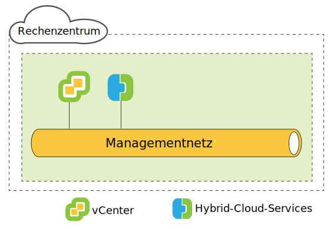
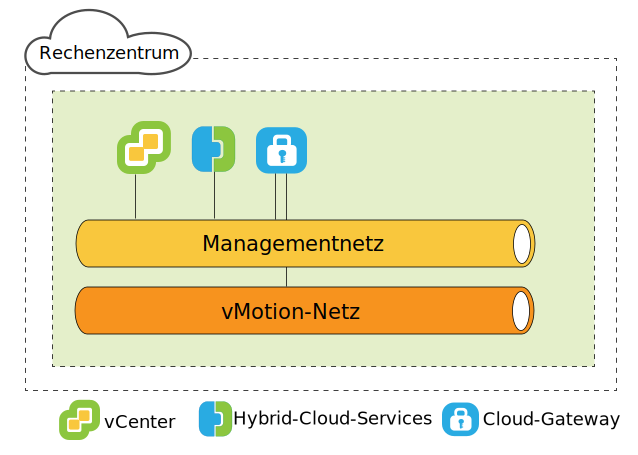
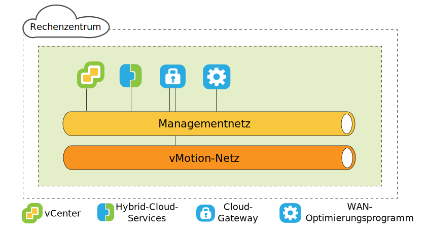
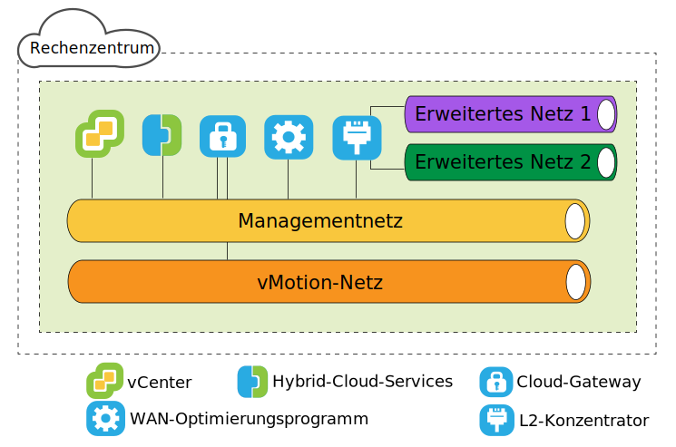

---

copyright:

  years:  2016, 2019

lastupdated: "2019-06-12"

subcollection: vmware-solutions

---

{:tip: .tip}
{:note: .note}
{:important: .important}

# VMware HCX on IBM Cloud - quellenseitige Architektur
{: #hcx-archi-source}

Überprüfen Sie die Architektur jeder einzelnen HCX-Komponente, die in der Quellenumgebung bereitgestellt wird.

## Einführung in HCX
{: #hcx-archi-source-intro-hcx}

Die HCX-Technologie integriert vSphere vCenter-Netze nahtlos in IBM Cloud VCS-Plattformen. Durch die hybride Vernetzung werden lokale vSphere vCenter-Netze hin zu IBM Cloud erweitert, wodurch die Mobilität der virtuellen Maschinen (VMs) unterstützt wird.

In dieser Einführung werden die Tasks zusammengefasst, die ausgeführt werden können, sowie die Funktionen, die die Migration und Netzerweiterung unterstützen und verbessern.

* HCX ist Eigner der Verfahren zur Quellen- und Zielverschlüsselung, gewährleistet so konsistente Sicherheit und stellt den Zugang für hybride Workflows wie die Migration von virtuellen Maschinen und Netzerweiterungen bereit.
* HCX erstellt ein optimiertes, softwaredefiniertes WAN, um die Performance des erweiterten Netzes zu erhöhen, wodurch die Leistung annähernd LAN-Geschwindigkeit erreicht.
* HCX ermöglicht außerdem bidirektionale Workloads und die Migration von VMware NSX-Sicherheitsrichtlinie in IBM Cloud Networking Services.
* HCX lässt sich in vSphere vCenter integrieren und wird über vSphere Web Client verwaltet.

## Layer-2-Netz-Erweiterung
{: #hcx-archi-source-layer-2-ext}

* Sichere Erweiterung eines Netzes von einer vCenter-Instanz hin zu IBM Cloud.
* HCX stellt den High Throughput Layer 2 Concentrator (Layer-2-Konzentrator mit hohem Durchsatz, HT L2C) bereit.
* Die erweiterten Netze können mit IBM Cloud NSX-Edge-Appliances verbunden werden.
* Es können mehrere Standard-Layer-2-Konzentratoren bereitgestellt werden, um Skalierbarkeit zu erzielen und den Durchsatz zu erhöhen.
* Virtuelle Maschinen, die über das Cloud-Gateway und über ein erweitertes Layer-2-Netz migriert werden, können ihre IP- und MAC-Adressen beibehalten.

## Methoden zur Migration virtueller Maschinen
{: #hcx-archi-source-vm-mig-methods}

### Migration mit geringer Ausfallzeit
{: #hcx-archi-source-low-downtime-mig}

Die Migration mit geringer Ausfallzeit beruht auf der vSphere-Replikation - einer verteilten Technologie, die im VMware ESX/ESXi-Hypervisor implementiert ist. HCX erstellt ein Replikat einer virtuellen Live-Maschine, verschiebt es in IBM Cloud und führt eine Umschaltung durch, um die virtuelle Quellenmaschine auszuschalten und die migrierte virtuelle Maschine einzuschalten.
* Der Migrationspfad führt immer über das Cloud-Gateway. Die Übertragung kann über das Internet, ein erweitertes Layer-2-Netz oder eine Direktverbindung erfolgen.
* Eine virtuelle Maschine kann in beide Richtungen mehrere Male migriert werden.

### vMotion-Migration
{: #hcx-archi-source-vmotion-mig}

Die vMotion-Migration verwendet vMotion, um eine virtuelle Live-Maschine über ein Netz zu übertragen, das in IBM Cloud erweitert wird. Die vMotion-Migration wird auch als "Migration ohne Ausfallzeit" oder "cloudumfassende vMotion" bezeichnet.

### Cold Migration
{: #hcx-archi-source-cold-mig}

Sie können eine ausgeschaltete virtuelle Maschine über ein erweitertes Netz an IBM Cloud übertragen.

### Allgemeine Funktionen
{: #hcx-archi-source-common-feat}

* Ein optionales softwaredefiniertes WAN-Optimierungsprogramm, falls installiert, verbessert Migration, Durchsatz und Geschwindigkeit.
* Die Migration kann auf einen geplanten Zeitpunkt festgelegt werden.
* Eine migrierte virtuelle Maschine kann ihren Hostnamen, den Namen der virtuellen Maschine oder beides beibehalten.

## Funktionen des Netzes
{: #hcx-archi-source-net-feat}

Die folgenden Netzfunktionen sind in das Cloud-Gateway und die Layer-2-Konzentratoren integriert.

* Intelligent Flow Routing - Wählt automatisch die beste Verbindung basierend auf dem Internet-Pfad aus und überflutet effizient die gesamte Verbindung, sodass die Workloads schnellstmöglich verschoben werden. Wenn größere Datenflüsse, wie z. B. Sicherung oder Replikation, eine CPU-Konkurrenzsituation verursachen, werden kleinere Datenflüsse zwecks einer verbesserten Leistung des interaktiven Datenverkehrs an weniger ausgelastete CPUs weitergeleitet.
* Proximity Routing - Stellt sicher, dass die Weiterleitung zwischen virtuellen Maschinen, die mit erweiterten und weitergeleiteten Netzen verbunden sind (sowohl lokal als auch in der Cloud), symmetrisch ist.
* Sicherheit - Das Cloud-Gateway bietet Suite B-konformes AES-GCM mit IKEv2, AES-NI-Auslagerung und durchflussbasierter Zugangssteuerung. HCX ist Eigner der Verfahren zur Quellen- und Zielverschlüsselung, gewährleistet so konsistente Sicherheit und stellt den Zugang für hybride Workflows wie die Migration von virtuellen Maschinen und Netzerweiterungen bereit.
  Eine Sicherheitsrichtlinie, die in der lokalen vCenter-Instanz definiert und einer virtuellen Maschine zugeordnet ist, kann zusammen mit der virtuellen Maschine migriert werden.

## Erläuterungen zu HCX
{: #hcx-archi-source-understand-hcx}

HCX unterstützt eine Viele-zu-viele-Beziehung zwischen lokalen vCenter-Instanzen und IBM Cloud. vCenter Server im Verbindungsmodus wird unterstützt.

Während der Installation wird die virtuelle HCX-Manager-Appliance importiert und als Plug-in für die lokale vCenter-Instanz konfiguriert. Dieses Plug-in wird anschließend verwendet, um die softwaredefinierte WAN-Servicebereitstellung zu konfigurieren. Die automatisierte Konfiguration stellt jede Hybrid-Service-Appliance als virtuelle Maschine in der lokalen vCenter-Instanz und eine entsprechende virtuelle Maschine in IBM Cloud bereit.

Für eine erfolgreiche Bereitstellung ist Folgendes erforderlich:
* Ausreichend Ressourcen für die virtuellen Appliances
* Das Netz muss den Appliances die Kommunikation sowohl mit lokalen als auch mit fernen virtuellen Appliances sowie anderen VMs ermöglichen.

## Übersicht über die Implementierung
{: #hcx-archi-source-deployment-ovw}

Die virtuelle HCX-Manager-Maschine wird zuerst installiert. Sie verwaltet die Installation aller anderen virtuellen Servicemaschinen-Appliances, lokal wie auch in der Cloud.

Bei den folgenden Schritten handelt es sich um grundlegende Installationsaufgaben:
1. Fordern Sie die OVA-Datei der virtuellen Appliance von Hybrid Cloud Enterprise an.
2. Installieren Sie in vSphere Web Client die virtuelle HCX-Manager-Appliance in der lokalen vCenter-Instanz, die eine Verbindung zu IBM Cloud herstellt.
3. Registrieren Sie über vSphere Web Client einen IBM Cloud-Endpunkt beim HCX-Plug-in. Durch die Registrierung wird die Eins-zu-eins-Beziehung zwischen der lokalen HCX-Instanz und der HCX-Instanz in IBM Cloud eingerichtet.
4. Installieren und konfigurieren Sie die virtuellen Service-Appliances.
5. Für jede lokal installierte Appliance stellt das Installationsprogramm eine entsprechende virtuelle Service-Appliance in der IBM Cloud-Zielmaschine bereit.
6. Nach der Installation steuert der HCX-Manager sowohl die lokale als auch die ferne virtuelle Service-Appliance. In IBM Cloud verwaltet HCX die bereitgestellten softwaredefinierten WAN-Komponenten als Service.

### Leistungsaspekte der Bereitstellungskomponente
{: #hcx-archi-source-perf-consid}

Die Architekturplanung umfasst die zu migrierenden VMs, die Netze, die für den virtuellen Datenverkehr verwendet werden, und die Netze, die erweitert werden sollen.  

Für die Bereitstellungskomponenten gelten die folgenden Mindest- und Höchstwerte:
* vSphere vCenter. Die HCX-Manager-Appliance muss in der vCenter-Instanz installiert sein, die die Hybrid-Services benötigt. Pro vCenter-Instanz kann es nur eine HCX-Bereitstellung geben. Diese Einschränkung gilt für den Verbindungsmodus. Die HCX-Management-Appliance wird nur in der primären vCenter-Instanz installiert. HCX unterstützt bis zu fünf registrierte vCenter-Instanzen im Verbindungsmodus.
* Cloud-Registrierungen. Die maximale Anzahl an Cloud-Endpunkten beträgt zehn. Um die Anzahl der Endpunkte zu ermitteln, überwacht Hybrid-Cloud-Services die vCenter-Verbindungen in die Cloud.

### Maximale Anzahl von Migrationen und Netzerweiterungen
{: #hcx-archi-source-max-mig-net-extension}

* Maximale Anzahl gleichzeitig ablaufender Tasks der Migration mit geringer Ausfallzeit: 15
* Maximale Anzahl gleichzeitig ablaufender Tasks der L2C-Erweiterung: 1
* Maximale Anzahl gleichzeitiger Tasks für die vMotion-Migration: 1

### HCX Management Enterprise
{: #hcx-archi-source-hcxme}

Die HCX Management Enterprise-OVA wird in der Quellenumgebung bereitgestellt und als Plug-in für die vCenter Server-Instanz registriert, die die Quellen-vSphere-Infrastruktur verwaltet. Dieses Plug-in wird anschließend verwendet, um die Migration und die Netzservices zu definieren, die erforderlich sind, um die cloudumfassende Migration und die L2-Netz-Erweiterung zu ermöglichen.

Pro vCenter-Instanz kann es nur eine HCX-Bereitstellung geben. Diese Einschränkung gilt für den Verbindungsmodus; die HCX-Management-Appliance wird nur in der primären vCenter-Instanz installiert. Der HCX-Manager unterstützt bis zu fünf registrierte vCenter-Instanzen im Verbindungsmodus.
{:note}

### Virtuelle HCX-Appliances
{: #hcx-archi-source-hcxva}

Bei dem Installationspaket handelt es sich um eine OVA-Datei, die das Hybrid-Cloud-Services-Plug-in enthält. Diese Management-Appliance für Hybrid-Cloud-Services wird installiert und konfiguriert, um anschließend zur Konfiguration der virtuellen Maschinen für Service-Appliances verwendet zu werden.
* HCX-Manager
* Hybrid-Cloud-Gateway
* Layer-2-Konzentratoren
* WAN-Optimierungsprogramme

### HCX-Manager
{: #hcx-archi-source-hcxm}

Das HCX-Manager-Plug-in wird nur lokal bereitgestellt. Es verwaltet die virtuellen Service-Appliances für SD-WAN. Die virtuelle HCX-Manager-Appliance ist eine Erweiterung in die vCenter-Quelleninstanz und wird als virtuelle Maschine bereitgestellt. Die Dateistruktur dieser Appliance enthält alle virtuellen Hybrid-Services-Appliances. Der HCX-Manager überwacht die Bereitstellung und Konfiguration des Cloud-Gateways, der Layer-2-Konzentratoren und der virtuellen WAN-Optimierungs­Appliance, sowohl lokal als auch in der Cloud.

Die virtuelle Appliance kann mit Thin Provisioning oder Thick Provisioning für das Festplattenlaufwerk installiert werden. Standardmäßig werden Festplattenlaufwerke für virtuelle Service-Appliances mit Thin Provisioning bereitgestellt.

Nachdem der Service, die Konfiguration der virtuellen Appliance und die Bereitstellung abgeschlossen sind, melden Sie sich bei dieser virtuellen Maschine an, um das Managementportal für Hybrid-Cloud-Services verwenden zu können.

### HCX-Cloud-Gateway
{: #hcx-archi-source-hcg}

Das HCX-Cloud-Gateway erstellt und pflegt einen sicheren Kanal zwischen vSphere und IBM Cloud.

HCX verwendet eine starke Verschlüsselung, um eine Site-to-Site-Verbindung mit IBM Cloud zu booten. Der sichere Kanal zwischen vSphere und IBM Cloud erreicht Multi-Tenant-Funktionalität für vSphere-Protokolle, die Tenant-agnostisch sind, und um Sicherheitsprobleme im Form einer "mittleren Meile" des Netzes zu verhindern.

Das Cloud-Gateway umfasst auch die vSphere-Replikationstechnologie, mit der bidirektionale Migrationen durchgeführt werden können.

### WAN-Optimierungsprogramm
{: #hcx-archi-source-wan-opt}

HCX stellt auch ein softwaredefiniertes WAN-Optimierungsprogramm zur Verfügung. Die WAN-Optimierungs-Appliance ist eine stark empfohlene Komponente, die WAN-Bedingungen setzt, um die Auswirkungen der Latenzzeit zu reduzieren. Zudem enthält sie eine vorwärtsgerichtete Fehlerkorrektur zur Behebung von Szenarios mit Paketverlusten und Deduplizierung von redundanten Datenverkehrsmustern. Diese reduzieren die Bandbreitennutzung und stellen die bestmögliche Nutzung der verfügbaren Netzkapazität zur Verfügung, um die Datenübertragung zu und von IBM Cloud zu beschleunigen.

Die Migration von virtuellen Maschinen beruht auf der Kombination aus Cloud-Gateway und WAN-Optimierungs­Appliance, mit der eine unerreichte Mobilität zwischen der lokalen vSphere-Instanz und IBM Cloud erreicht wird.

### Layer-2-Konzentrator
{: #hcx-archi-source-layer-2-conc}

Der Network Extension Service wird vom Layer-2-Konzentrator (L2C) bereitgestellt. Er erweitert ein Layer-2-Netz vom lokalen vSphere-Rechenzentrum hin zu IBM Cloud und ermöglicht eine nahtlose Migration zwischen dem Rechenzentrum und der Cloud. Der Layer-2-Konzentrator ist erforderlich, um das lokale Netz nach IBM zu erweitern.

Die Layer-2-Konzentrator-Appliance besitzt zwei Schnittstellen:
* Interne Trunk-Schnittstelle: Bearbeitet den Datenverkehr der virtuellen Maschinen lokal für die erweiterten Netze mithilfe einer translationalen Brückenzuordnung zu einem entsprechenden erweiterten Netz in IBM Cloud.
* Uplink-Schnittstelle: HCX verwendet diese Schnittstelle, um eingekapselten Overlay-Datenverkehr an und von IBM Cloud zu senden. Über diese Schnittstelle werden Anwendungsdaten gesendet.

### Nur Migration
{: #hcx-archi-source-mig-only}

Die Minimalkonfiguration für die Migration erfordert nur den HCX-Manager und die Cloud-Gateway-Appliances. Es ist möglich, virtuelle Maschinen ohne Netzerweiterung zu migrieren. In diesem Fall wird von der virtuellen Maschine nach der Migration eine neue IP-Adresse mithilfe des Service für die Gastanpassung abgerufen.

Um ein Netz zu erweitern und die ursprüngliche IP-Adresse zu verwalten, muss ein verteilter virtueller Switch in der lokalen vSphere vCenter-Instanz konfiguriert werden.

Durch eine WAN-Optimierung kann die Geschwindigkeit in den beschriebenen Situationen verbessert werden. Die Konfiguration des Cloud-Gateways für die Verwendung einer Hochgeschwindigkeitsverbindung (zum Beispiel eine Direktverbindung) erhöht die Geschwindigkeit, da eine höhere Bandbreitenverbindung für WAN-optimierten Datenverkehr geschaffen wird.

Die Migration von virtuellen Maschinen für erweiterte Netzen in IBM Cloud ist vorteilhaft, da dadurch Ausfallzeit reduziert wird und die Konfiguration auf der virtuellen Maschine nicht geändert wird. Die virtuelle Maschine kann die IP-Adressen, MAC-Adressen, Computernamen und VM-Namen beibehalten. Durch das Beibehalten dieser Eigenschaften wird die Migration auf IBM Cloud erheblich vereinfacht und es werden einfache Rückgaben an das lokale Rechenzentrum ermöglicht. Die Funktion "Network Extension" erfordert einen verteilten vSphere-Switch, der mit vSphere Enterprise Plus Edition bereitgestellt wird.

### Anforderungen an IP-Adressen
{: #hcx-archi-source-ip-req}

Für die Bereitstellung von HCX muss sowohl lokal als auch in der Zielinstanz von IBM Cloud die richtige Anzahl von IP-Adressen verfügbar sein.

* vMotion-Adresse
  Die Verwaltung eines separaten Netzes für vMotion ist im lokalen Rechenzentrum gängige Praxis. Das Cloud-Gateway muss Zugriff auf das vMotion-Netz haben. Ist dies nicht der Fall, wird für die Kommunikation mit dem vMotion-Netz eine zusätzliche IP-Adresse benötigt.

* Lokal
  * Eine IP-Adresse für die HCX-Manager-Appliance.
  * Eine für jedes Cloud-Gateway; wenn ein separates vMotion-Netz vorhanden ist, muss eine hinzugefügt werden.
  * Eine für jeden Standard-Layer-2-Konzentrator.

* IBM Cloud
  * Zwei IP-Adressen pro HCX-Manager-Appliance, die mit IBM Cloud verbunden ist. Die Adressen können verwendet werden, um eine Verbindung zum Internet oder zu einer oder mehreren Direktverbindungen herzustellen.
  * Wenn eine separate vMotion-Netzverbindung vorhanden ist, muss eine hinzugefügt werden.

### Feature "Proximity Routing"
{: #hcx-archi-source-prox-routing-feat}

Proximity Routing ist eine Netzfunktion, die aktiviert werden kann, wenn das Cloud-Gateway konfiguriert ist.

Das Proximity Routing stellt sicher, dass die Weiterleitung zwischen virtuellen Maschinen, die mit erweiterten und weitergeleiteten Netzen verbunden sind (sowohl lokal als auch in der Cloud), symmetrisch ist. Diese Funktion setzt voraus, dass dynamisches Routing zwischen dem Kundenstandort und der Cloud konfiguriert ist.

Wenn Benutzer ihre Netze auf die Cloud erweitern, wird die Layer-2-Konnektivität auf IBM Cloud erweitert. Ohne Routenoptimierung jedoch müssen die Layer-3-Kommunikationsanforderungen zum lokalen weiterzuleitenden Ursprungsnetz zurückkehren. Diese Rückgabe wird als "Tromboning" oder "Hairpinning" bezeichnet.

Das Tromboning ist ineffizient, da Pakete zwischen dem Ursprungsnetz und der Cloud hin- und hergesendet werden müssen, selbst wenn sich sowohl die Quellen- als auch die Ziel-VM in der Cloud befindet. Zur Ineffizienz kommt hinzu, dass die Kommunikation fehlschlagen kann, wenn der Weiterleitungspfad statusabhängige Firewalls oder andere Inline-Geräte beinhaltet, die auf beide Seiten der Verbindung zugreifen können müssen. Ein Fehlschlagen der VM-Kommunikation (ohne Routenoptimierung) tritt auf, wenn der Austrittspfad aus der Cloud entweder das erweiterte Layer-2-Netz oder das VCS NSX Edge-Gateway sein kann. Dem lokalen Netz ist der "Direktaufruf" des erweiterten Netzes nicht bekannt. Dieses Problem wird als asymmetrisches Routing bezeichnet. Die Lösung besteht darin, Proximity Routing zu aktivieren, sodass das lokale Netz die Routen von IBM Cloud lernen kann.

Um das Tromboning zu verhindern, verwendet HCX intelligentes Routenmanagement und wählt Routen aus, die für den Status der virtuellen Maschine geeignet sind. Das Cloud-Gateway verwaltet einen Bestand an virtuellen Maschinen in der Cloud. Es erkennt auch den Status der virtuellen Maschine. Folgende Status sind möglich:
* Mit vMotion in die Cloud übertragen (Migration ohne Ausfallzeit).
* Mit hostbasierter Replikation in die Cloud migriert (Migration mit geringer Ausfallzeit).
* In der Cloud erstellt (in einem erweiterten Netz).

### Asymmetrisches Routing mit der Proximity Routing-Lösung
{: #hcx-archi-source-asymm-routing}

Im Diagramm befinden sich die `N*a`-Komponenten auf der linken Seite im lokalen Rechenzentrum, die `N*b`-Komponenten auf der rechten Seite hingegen in der Cloud.

R1 ist das Standardgateway für N1-b. Deshalb muss N1-b zu R1 zurückkehren, damit der Datenverkehr durch R2 geleitet wird. Um ein asymmetrisches Routing zu verhindern, fügt HCX Hostrouten in das NSX-Overlay der IBM Cloud VCS-Bereitstellung ein. Wenn die virtuelle Maschine in der Cloud neu erstellt oder mit niedriger Ausfallzeit migriert wurde, wird die Hostroute sofort eingefügt.

Wurde die virtuelle Maschine mit vMotion übertragen, wird die Route erst dann eingefügt, wenn die virtuelle Maschine neu gestartet wird. Wenn Sie bis nach dem Warmstart warten, stellen Sie sicher, dass die lokalen statusabhängigen Einheiten die vorhandene Sitzung weiterhin bedienen, bis die virtuelle Maschine neu gestartet wurde. Nach dem Neustart sind die Routing-Informationen lokal und in der Cloud konsistent.

Das heißt, R1 kann Routing verwenden, um eine bestimmte virtuelle Maschine über R2 zu erreichen, anstatt das lokal verbundene erweiterte Netz zu verwenden. R2 ist vollständiger Eigner des Pfades für andere Netze, die virtuelle Maschinen mit aktiviertem Proximity Routing erreichen sollen.

### Beibehaltung von MAC-Adressen
{: #hcx-archi-source-mac-addr-ret}

* Die Option zum Beibehalten der MAC-Adresse wird über ein Kontrollkästchen im Migrationsassistenten aktiviert. Dieses ist nur bei der replikationsbasierten Migration sichtbar.
* Standardmäßig ist die Option **MAC-Adresse beibehalten** aktiviert, wenn sich die virtuelle Quellenmaschine in einem erweiterten Netz befindet, und inaktiviert, wenn das Netz nicht erweitert wurde. Wenn die MAC-Adresse nicht beibehalten wird, ruft die virtuelle Maschine nach Abschluss der Migration eine neue Adresse ab. Die Entscheidung, eine MAC-Adresse beizubehalten oder eine neue anzufordern, kann sich auf den Migrationsprozess und den Netzdatenfluss nach der Migration auswirken.
* Das Beibehalten der MAC-Adresse kann aus folgenden Gründen erforderlich sein:
  * Lizenzen auf Basis der MAC-Adresse: Manche Softwareprodukte paaren die Lizenz mit der MAC-Adresse der VM. Wenn Sie die MAC-Adresse einer virtuellen Maschine ändern, wird die Lizenz ungültig.
  * Linux-NIC-Reihenfolge: Unter Linux kann sich die NIC-Ethernet-Einheitennummer nach einem Neustart ändern, wenn die MAC-Adresse einer virtuellen Maschine geändert wurde. Eine Änderung der Einheitennummer kann die Reihenfolge der NIC-Darstellung im Betriebssystem ändern, was zur Störung von Anwendungen oder Scripts führen könnte, die von der NIC-Reihenfolge abhängig sind.
  * Weniger Ausfallzeiten, wenn das Netz erweitert wird: Wenn die virtuelle Maschine über ein erweitertes Netz migriert wird, minimiert die Option **MAC-Adresse beibehalten** die Ausfallzeit, da dem Netz keine neue MAC-Adresse angegeben werden muss.
  * Das Kontrollkästchen befindet sich während der Migrationsoperation auf der Seite **Zielnetz auswählen**.

### Migration von Sicherheitsrichtlinien
{: #hcx-archi-source-sec-policy-mig}

Mit der Funktion für Richtlinienmigration können verteilte NSX-Firewallregeln von einer lokalen vCenter-Instanz in eine für VCS HCX aktivierte Cloud verschoben werden. Eine Richtlinienmigration ist möglich, wenn eine virtuelle Maschine mittels Migration mit niedriger Ausfallzeit oder vMotion über ein Netz verschoben wird, das mit dem Layer-2-Konzentrator für hohen Durchsatz erweitert wurde.
* Im lokalen Rechenzentrum muss NSX 6.2.2 oder höher aktiv sein.
* In vSphere handelt es sich bei der Sicherheitsrichtlinie um einen einzelnen NSX-Abschnitt, der eine Vielzahl von Regeln enthalten kann. Pro virtuelles Rechenzentrum einer Organisation kann es nur einen Abschnitt (eine Richtlinie) geben.
* Es kann eine Gruppe von IP- oder MAC-Adressen angegeben werden, die an der Richtlinie beteiligt sein sollen. Der Name der Gruppe von IP- bzw. MAC-Adressen darf 218 Zeichen nicht überschreiten.
* Alle Regeln in einem Abschnitt müssen einen eindeutigen Namen haben. Für die Regel muss ein Name angegeben werden.
Unterstützte Regeln geben Layer-3-IP-Adressen bzw. -Gruppen von IP-Adressen oder aber Layer-2-MAC-Adressen bzw. -Gruppen von MAC-Adressen als Quelle oder Ziel an.

Regeln, die Sicherheitsgruppen oder Anwendungsgruppen für Quelle oder Ziel angeben, werden nicht migriert.
{:note}

Jede Änderung an der migrierten Richtlinie wird an alle VMs weitergegeben, die diese Richtlinie verwenden.

## Zugehörige Links
{: #hcx-archi-source-related}

* [Installation und Konfiguration in der Quelle](/docs/services/vmwaresolutions/archiref/hcx-archi?topic=vmware-solutions-hcx-archi-install-cfg-src)
