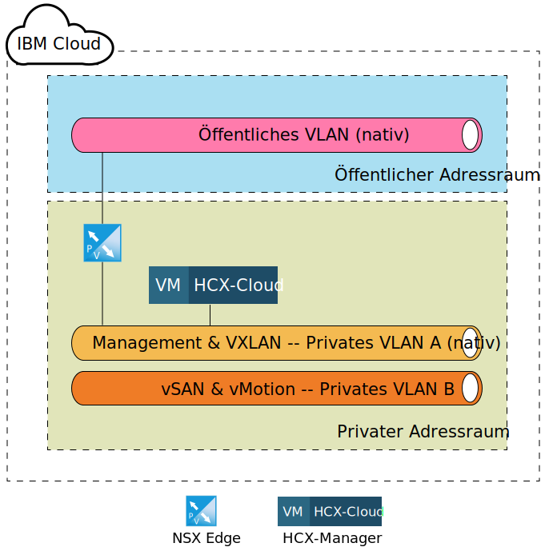
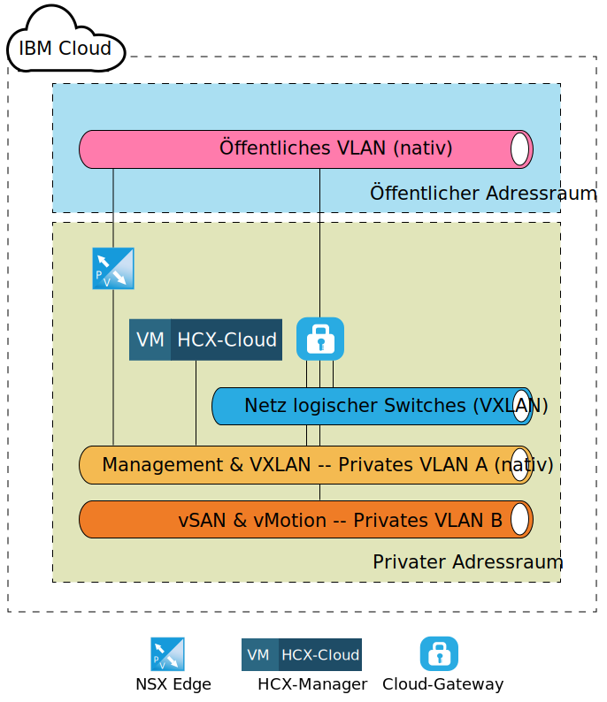
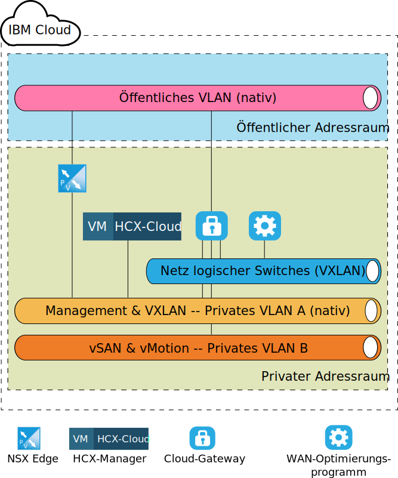
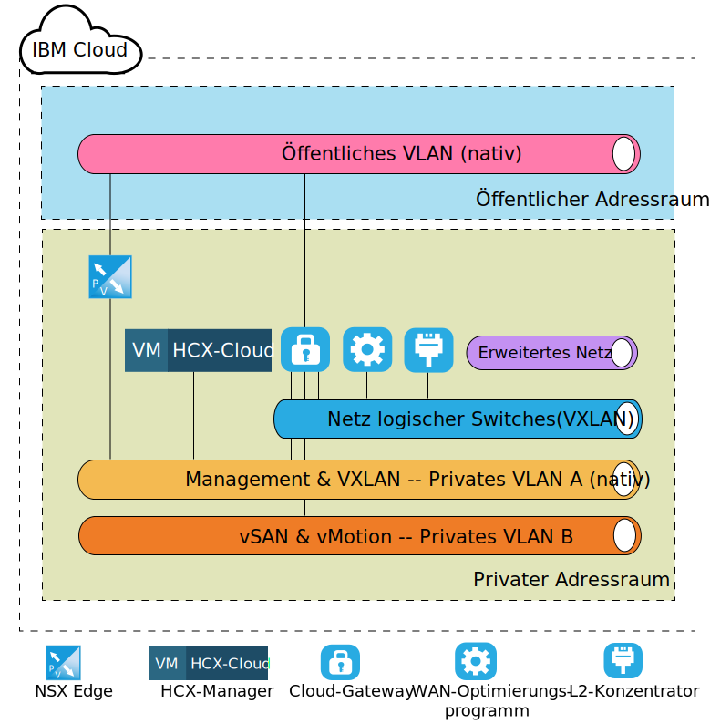

---

copyright:

  years:  2016, 2019

lastupdated: "2019-02-15"

---
# VMware HCX on IBM Cloud - Zielarchitektur auf Komponentenebene
{: #hcx-archi-target}

In diesem Abschnitt wird die Architektur der einzelnen HCX-Komponenten beschrieben, die in der IBM Cloud-Umgebung bereitgestellt werden. Es wird das Peripherie- (Ziel-) Bereitstellungsmodell innerhalb von IBM Cloud erläutert.

## NSX Edge
{: #hcx-archi-target-nsx-edge}

Die erste Komponente, die in IBM Cloud konfiguriert wird, ist ein Paar von virtuellen NSX Edge-Maschinen. Es ist wichtig zu beachten, dass alle IBM Cloud for VMware Solutions-Bereitstellungen eine Edge-Einheit für die abgehende Kommunikation von IBM CloudDriver installieren und konfigurieren. Wenngleich diese ESG für die Kommunikation von Hybrid-Cloud-Services wiederverwendet werden kann, wird empfohlen, ein neues Paar bereitzustellen.

Die virtuellen NSX Edge-Maschinen sind als Aktiv/Passiv-Paar von XL-NSX Edge-Einheiten konfiguriert. Diese Einheiten werden für die Verbindung mit der IBM Cloud VMware-Umgebung unter Verwendung einer öffentlichen Internetverbindung verwendet. Die XL-NSX Edge wurde für die interne Umgebung ausgewählt, da sie für Umgebungen mit Lastausgleichsfunktion mit Millionen gleichzeitig ablaufender Sitzungen geeignet ist, die nicht unbedingt einen hohen Durchsatz erfordern. Im Rahmen des Konfigurationsprozesses wird die NSX-Edge mit dem öffentlichen IBM Cloud-VLAN und dem IBM Cloud Private-VLAN verbunden, das für die Managementinfrastruktur vorgesehen ist.

Tabelle 1. Bereitstellung von NSX Edge

| Komponente | Konfiguration |
|-----------|---------------|
| CPU       | 6 vCPU        |
| RAM       | 8 GB          |
| Platte      | 4,5 GB VMDK in gemeinsamem Speicher mit 4 GB Swap |

Da die NSX Edge-Instanzen in der internen oder dedizierten Bereitstellung als aktiv/passiv konfiguriert sind, muss der Benutzer vSphere DRS- (Distributed Resource Scheduler) Anti-Affinitätsregeln erstellen, um sicherzustellen, dass die NSX Edge-Instanzen nicht auf demselben Host wie ihre jeweilige Peer-Appliance ausgeführt werden.

Tabelle 2. Anti-Affinitätsregeln für NSX Edge

| Feld     | Wert         |
|-----------|---------------|
| Name      | Externer NSX Edge-Gateway |
| Typ      | Separate virtuelle Maschinen |
| Mitglieder   | NSX Edge 1 |
|           | NSX Edge 2 |

Zusätzlich zu den NSX Edge-Appliances, die in IBM Cloud bereitgestellt sind, wird die virtuelle HCX Manager-Appliance bereitgestellt, wenn der VMware HCX on IBM Cloud-Service bestellt wird. Nach Bereitstellung dieser Appliance ist NSX Edge für die Verwendung des Lastausgleichs aktiviert und mit Anwendungsprofilen konfiguriert, die für die eingehende Verbindung von der Quelle ein Zertifikat verwenden. Die NSX Edge-Instanz ist außerdem mit Lastausgleichspools konfiguriert, die auf die Appliances von HCX Manager, vCenter und PSC verweisen. Zusätzlich wird ein virtueller Server mit einer virtuellen IP-Adresse (VIP) in der öffentlichen Schnittstelle mit Regeln erstellt, die die Pools mit VIP verbinden. Die folgenden Tabellen zeigen ein Beispiel für die Konfiguration des virtuellen Servers und des Pools auf der NSX Edge.

Tabelle 3. VIP-Konfiguration for NSX Edge - virtuelle Server

| Feld     | Wert         |
|-----------|---------------|
| ID des virtuellen Servers | virtualServer-1 |
| Name | HCX-VIP |
| Beschreibung | LB-VIP |
| Standardpool | pool-1 |
| IP-Adresse | 254 |
| Protokoll | HTTPS |
| Port | 443 |

Tabelle 4. VIP-Konfiguration for NSX Edge - Details der virtuellen Server

| Feld     | Wert         |
|-----------|---------------|
| Beschreibung | LB-VIP |
| Verbindungslimit | 0 |
| Serviceinfügungsstatus | Inaktiviert |
| Anwendungsprofil | applicationProfile-1 |
| Grenzwert für Verbindungsrate | 0 |
| Beschleunigungsstatus | Inaktiviert |
| Serviceprofilstatus |  |

Tabelle 5. VIP-Konfiguration für NSX Edge - Regel

| Feld     | Wert         |
|-----------|---------------|
| Regel-ID | applicationRule-1 |
| Name | appRule1 |
| Script | acl isHibridity url_beg /hibridity     acl isWebSso url_beg /websso     acl isVCenter url_beg /vsphere-client     use_backend nspPool001 if isHybridity     use_backend vcPool001 if isVCenter     use_backend ssoPool001 if isWebSso |

Tabelle 6. Poolkonfiguration für NSX Edge - Poolzusammenfassung

| Pool-ID | Name       | Algorithmus   | Überwachungs-ID |
|---------|------------|-------------|------------|
| pool-1  | nspPool001 | ROUND-ROBIN |            |
| pool-3  | ssoPool001 | ROUND-ROBIN |            |
| pool-2  | vcPool001  | ROUND-ROBIN |            |

Tabelle 7. Poolkonfiguration für NSX Edge - Pooldetails

| Feld           | Wert     |
|-----------------|-----------|
| Beschreibung     |           |
| Transparent     | Inaktiviert  |
| Name            | HCX-CLOUD |
| Gewichtung          | 1         |
| Überwachungsport    | 8443      |
| Max. Verbindungen | 0         |
| Min. Verbindungen | 0         |

## HCX-Manager
{: #hcx-archi-target-hcxm}

Die HCX-Manager-Komponente ist die erste Appliance, die bereitgestellt wird, nachdem die NSX Edge-Appliances für das Ziel konfiguriert wurden. Diese Appliance wird als Hauptschnittstelle zur Cloud-Umgebung für die Quellenkomponenten verwendet und bildet eine abstrahierte Netzbenutzerschnittstelle, die zum Hinzufügen, Bearbeiten und Löschen von Netzen sowie zum Entwerfen und Konfigurieren von Routing ohne direkte Verwendung von NSX verwendet werden kann. Als Ergebnis der Integration von vCenter und NSX wird der HCX-Manager-Appliance eine private portierbare IP-Adresse im Management-VLAN zugeordnet.

Darüber hinaus wird sie für den Zugriff auf vCenter und NSX mit einem bestimmten Benutzer konfiguriert. Es ist unbedingt zu beachten, dass die IP-Adresse des HCS-Managers mit der IP-Adresse identisch ist, die in der NSX Edge-Instanz für den Lastausgleich verwendet wird.

Nach der Bereitstellung und Konfiguration der HCX-Manager-Cloudkomponente erstellen die Quellenkomponenten eine Verbindung zum HCX-Manager über die in NSX ESG konfigurierten VIP-Adressen. Sobald diese Verbindung hergestellt ist, werden das Cloud-Gateway und das WAN-Optimierungsprogramm als Appliances in IBM Cloud bereitgestellt.

Abbildung 1. Ziel - Hybrid-Cloud-Services-Appliance

## Cloud-Gateway
{: #hcx-archi-target-cloud-gateway}

Eine virtuelle Appliance wird bereitgestellt, nachdem eine Verbindung zwischen der Quelle und der Ziel-Cloud hergestellt wurde. Diese Appliance ist das Cloud-Gateway (CGW), das verwendet wird, um einen sicheren Kanal zwischen der als Quelle festgelegten vSphere-Umgebung und IBM Cloud zu verwalten. Die Dimensionierung der CGW-Appliance, die in IBM Cloud bereitgestellt wird, ist in Tabelle 3 zur Cloud-Gateway-Bereitstellung aufgeführt.

Tabelle 8. Cloud-Gateway-Bereitstellung

| Komponente | Konfiguration |
|-----------|---------------|
| CPU       | 8 vCPU        |
| RAM       | 3 GB          |
| Platte      | 2,0 GB VMDK in gemeinsamem Speicher |

Dieses bereitgestellte Cloud-Gateway ist so konfiguriert, dass es sich im Management-VLAN (privates portierbares Teilnetz) sowie im vMotion-VLAN (Private Portable Subnet) der IBM Cloud for VMware Solutions-Bereitstellung befindet. Darüber hinaus wird eine weitere Schnittstelle im öffentlichen VLAN (öffentlich, portierbar) für Verbindungen konfiguriert, die über das öffentliche Internet hergestellt werden. Der öffentliche Zugriff ist nicht erforderlich, wenn eine direkte Verbindung besteht (bei bestehender privater Verbindung). Die letzte Verbindung, die dem Cloud-Gateway zugeordnet wird, ist ein logischer Switch, der im Anschluss an die Standortpaarung erstellt und konfiguriert wird.

Bei diesem logischen Switch handelt es sich um ein privates, nicht weiterleitbares Netz, das als Kommunikationskanal zwischen dem Cloud-Gateway und dem WAN-Optimierungsprogramm verwendet wird (beschrieben im Abschnitt 4.1.4 WAN (TBD)).

Die folgende Abbildung zeigt ein allgemeines Komponentendiagramm der Cloud-Gateway-Appliance und der zugewiesenen Verbindungen.

Abbildung 2. Cloud-Gateway-Bereitstellung

## WAN-Optimierungsprogramm
{: #hcx-archi-target-wan-opt}

Die zweite Komponente, die bereitgestellt wird, ist die Appliance des WAN-Optimierungsprogramms. Das WAN-Optimierungsprogramm ist zwar optional, aber es setzt WAN-Bedingungen, um die Auswirkungen der Latenzzeit zu reduzieren. Zudem enthält es eine vorwärtsgerichtete Fehlerkorrektur zur Behebung von Szenarios mit Paketverlusten und Deduplizierung von redundanten Datenverkehrsmustern.

Diese reduzieren die Bandbreitennutzung und stellen die bestmögliche Nutzung der verfügbaren Netzkapazität zur Verfügung, um die Datenübertragung zu und von IBM Cloud zu beschleunigen. Das WAN-Optimierungsprogramm ist speicherintensiv und erfordert für eine ordnungsgemäße Funktion eine ausreichende Anzahl von E/A-Operationen pro Sekunde. Daher befindet sich das WAN-Optimierungsprogramm im vSAN-Speicher innerhalb der VCF-Umgebung und des Endurance-Speichers und unterstützt mehr als 2.000 IOPS innerhalb einer vCenter Server-Bereitstellung. Die Dimensionierungsspezifikationen für die Appliance des WAN-Optimierungsprogramms sind in der folgenden Tabelle enthalten.

Tabelle 9. Dimensionierung der Appliance des WAN-Optimierungsprogramms

| Komponente | Konfiguration |
|-----------|---------------|
| CPU       | 8 vCPU        |
| RAM       | 14 GB          |
| Platte      | 30 GB VMDK + 70 GB VMDK in gemeinsamem Speicher |

Im Gegensatz zum Cloud-Gateway ist die Appliance des WAN-Optimierungsprogramms an nur einen logischen Switch angeschlossen, um die Kommunikation zwischen ihr selbst und dem Cloud-Gateway zu ermöglichen. Diese Appliance ist erforderlich, wenn das WAN-Optimierungsprogramm innerhalb der Quellenumgebung verwendet wird. In der folgenden Abbildung ist eine Ansicht des Netzlayouts zu sehen.

Abbildung 3. Bereitstellung des WAN-Optimierungsprogramms

## Layer-2-Konzentrator
{: #hcx-archi-target-layer-2-conc}

Die dritte Komponente wird als "Layer-2-Konzentrator" (L2-Konzentrator oder L2C) bezeichnet und ist Teil der Network Extension Services. Der L2C ist die virtuelle Maschine, die die Erweiterung von lokalen Rechenzentrumsnetzen hin zu IBM Cloud ermöglicht. Der L2C erweitert lokale VLANs und/oder VXLANs. Jeder L2C bietet eine Erweiterung auf bis zu 4096 VLANs. Bei Paarung mit seinem lokalen Partner kann jeder L2C bis zu 1 Gb/s pro "Fluss" und bis zu einem Aggregat von 4 Gb/s pro VLAN (oder VXLAN) bereitstellen. Wenn mehr Netzdurchsätze erforderlich sind, wird auch die Bereitstellung von weiteren L2C-Appliances unterstützt.

Im Rahmen dieses Designs wird die L2C-Appliance so bereitgestellt, dass ein Kunde über das öffentliche Internet oder das private Netzwerk mittels Direktverbindung mehrere VLANs und VLXANs hin zu IBM Cloud erweitern kann. Die Dimensionierungsspezifikationen für die L2C-Appliance für IBM Cloud ist in der folgenden Tabelle aufgeführt.

Tabelle 10. Dimensionierung der L2C-Appliance für hohen Durchsatz

| Komponente | Konfiguration |
|-----------|---------------|
| CPU       | 8 vCPU        |
| RAM       | 38 GB          |
| Platte      | 2 GB VMDK in gemeinsamem Speicher |

Die L2C-Appliance wird sowohl im Management-VLAN als auch im öffentlichen VLAN bereitgestellt. Die öffentliche Schnittstelle ist für den Anwendungsdatenverkehr vorgesehen, der für die Quelle des erweiterten Netzes gebunden ist. Weitere Verbindungen wie z. B. die erweiterten Netze werden erstellt und an die L2C-Appliance angehängt, nachdem der Quellenadministrator die Netzerweiterung hin zu IBM Cloud initiiert hat. Beispiele für diese Netze und Verbindungen sind in der folgenden Abbildung dargestellt.

Abbildung 4. Bereitstellung des L2-Konzentrators

## Zugehörige Links
{: #hcx-archi-target-related}

* [Installation und Konfiguration in der Quelle](/docs/services/vmwaresolutions/archiref/hcx-archi?topic=vmware-solutions-hcx-archi-source)
