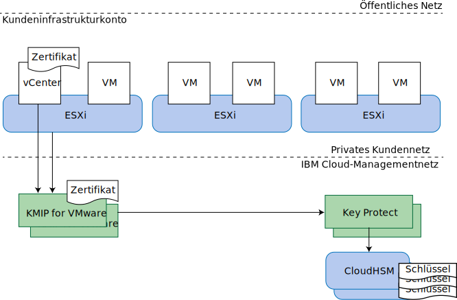

---

copyright:

  years:  2016, 2019

lastupdated: "2019-01-25"

---

{:tip: .tip}
{:note: .note}
{:important: .important}

# KMIP for VMware - Design

KMIP for VMware on {{site.data.keyword.cloud}} stellt einen Schlüsselmanagementservice bereit, der mit der VMware vSAN- und der VMware vSphere-Verschlüsselung kompatibel ist. Dabei wird [IBM Key Protect](/docs/services/key-protect/index.html) verwendet, um den Stammschlüssel und den Datenschlüsselspeicher bereitzustellen.

**Hinweis**: In diesem Release ist KMIP for VMware on {{site.data.keyword.cloud_notm}} ausschließlich auf die vSphere-Verschlüsselung begrenzt.

## Optionen für die Speicherverschlüsselung

KMIP for VMware ist sowohl mit der VMware vSAN-Verschlüsselung als auch mit der vSphere-Verschlüsselung kompatibel. Beide Lösungen sind in der Hypervisor-Schicht implementiert, bieten jedoch geringfügig unterschiedliche Funktionen. Bewerten Sie diese Funktionen entsprechend Ihren Anforderungen.

### VMware vSAN-Verschlüsselung

Die VMware vSAN-Verschlüsselung ist nur auf vSAN-Datenspeicher anwendbar. Mit dieser Lösung stellen VMware vCenter und Ihre VMware ESXi-Hosts eine Verbindung zu einem Schlüsselmanagementserver wie KMIP for VMware her, um Verschlüsselungsschlüssel abzurufen. Diese Schlüssel werden verwendet, um einzelne Plattenlaufwerke zu schützen, die für Ihren vSAN-Datenspeicher verwendet werden, einschließlich der Cache- und der Kapazitätsplatten. Die vSAN-Verschlüsselung wird so implementiert, dass die Vorteile der vSAN-Komprimierung und -Deduplizierung genutzt werden.

Da die vSAN-Verschlüsselung auf Datenspeicherebene angewendet wird, besteht ihr primäres Ziel in der Vermeidung von Datensicherheitslücken bei einem Verlust der physischen Plattenlaufwerke. Die vSAN-Verschlüsselung ist außerdem vollständig kompatibel mit allen Sicherungs- und Replikationstechnologien von virtuellen Maschinen, wie z. B. vSphere Replication, Cross-vCenter vMotion, VMware HCX, Zerto, Veeam und IBM Spectrum Protect Plus.

Bei der vSAN-Verschlüsselung wird die Host-zu-Host-vSAN-Replikationskommunikation innerhalb Ihres Clusters nicht verschlüsselt. Die vSAN-Verschlüsselung ist nicht auf andere Speicherlösungen wie {{site.data.keyword.cloud_notm}} Endurance-Dateispeicher und Blockspeicher anwendbar. Für die vSAN-Verschlüsselung ist die vSAN Enterprise-Lizenz erforderlich.
{:note}

### vSphere-Verschlüsselung

Die VMware vSphere-Verschlüsselung ist auf alle Typen von VMware-Speicher anwendbar, einschließlich vSAN-Speicher und {{site.data.keyword.cloud_notm}} Endurance-Dateispeicher und Blockspeicher.

Mit dieser Lösung stellen vCenter Server und Ihre ESXi-Hosts eine Verbindung zu einem Schlüsselmanagementserver wie KMIP for VMware her, um Verschlüsselungsschlüssel abzurufen. Diese Schlüssel werden verwendet, um Platten einzelner virtueller Maschinen (VM) entsprechend Ihren VM-Speicherrichtlinien zu schützen.

Da die vSphere-Verschlüsselung auf der Plattenebene der virtuellen Maschine ausgeführt wird, kann sie eine Gefährdung der Daten bei einem Verlust von physischen Plattenlaufwerken oder VM-Platten verhindern. Zahlreiche Sicherungs- und Replikationstechnologien können keine effektiven Sicherungen und Replikationen bereitstellen, da die zur Verfügung stehenden Daten verschlüsselt sind. 

Daher ist die vSphere-Verschlüsselung nicht mit der vSphere-Replikation, Cross-vCenter vMotion, VMware HCX, Zerto oder IBM Spectrum Protect Plus kompatibel. Bei einer korrekten Konfiguration ist Veeam Backup and Replication jedoch kompatibel mit der vSphere-Verschlüsselung. 

### Weitere Hinweise

Wenn die eine oder die andere Verschlüsselungsart in Ihrem vSphere-Cluster aktiviert ist, erstellt VMware einen zusätzlichen Schlüssel, um Ihre ESXi-Kernspeicherauszüge zu verschlüsseln, da diese Speicherauszüge möglicherweise sensible Daten wie Schlüsselmanagement-Berechtigungsnachweise, Verschlüsselungsschlüssel oder entschlüsselte Daten enthalten. Lesen Sie hierzu die Informationen über [vSphere-Verschlüsselung für virtuelle Maschinen und Kernspeicherauszüge](https://docs.vmware.com/en/VMware-vSphere/6.5/com.vmware.vsphere.security.doc/GUID-63728E8B-810D-418B-B1AA-6A0A2F92AABE.html).

Wenn KMIP for VMware zusammen mit vSAN- oder vSphere-Verschlüsselung verwendet wird, gibt es mehrere Ebenen für den Schlüsselschutz.

Wenn Sie vorhaben, die Schlüssel rotieren zu lassen, lesen Sie die folgenden Informationen zu den möglichen Rotationsebenen für die Schlüssel:
* Ihr Stammschlüssel für Kunden (Customer Root Key, CRK) schützt sämtliche VMware-Schlüssel. Die Schlüssel können innerhalb der IBM Key Protect-Instanz rotieren, die Ihrer KMIP for VMware-Instanz zugeordnet ist.
* KMIP for VMware verwendet Ihren CRK zum Schutz der selbst generierten und an VMware verteilten Schlüssel. VMware betrachtet diese als Schlüsselverschlüsselungsschlüssel ("key encrypting keys", KEKs).
  * Wenn Sie die vSphere-Verschlüsselung verwenden, können Sie die Schlüssel mit dem PowerShell-Befehl **Set-VMEncryptionKey** rotieren lassen.
  * Wenn Sie die vSAN-Verschlüsselung verwenden, können Sie die Schlüssel in der vSAN-Benutzerschnittstelle rotieren lassen.
* VMware verwendet solche KEKs zum Schutz der tatsächlichen Schlüssel, mit denen es Plattenlaufwerke und VM-Platten verschlüsselt. Sie können diese Schlüssel durch Erstellen eines neuen Schlüssels rotieren lassen, was von WMware als "deep rekey" bezeichnet wird. Bei dieser Operation werden alle Ihre verschlüsselten Daten erneut verschlüsselt, was möglicherweise einige Zeit in Anspruch nimmt.
  * Wenn Sie die vSphere-Verschlüsselung verwenden, können Sie einen "deep rekey" mit dem PowerShell-Befehl **Set-VMEncryptionKey** durchführen.
  * Wenn Sie die vSAN-Verschlüsselung verwenden, können Sie einen "deep rekey" über die vSAN-Benutzerschnittstelle durchführen.

## KMIP for VMware

Die VMware vSAN-Verschlüsselung und die vSphere-Verschlüsselung sind mit vielen Schlüsselmanagementservern kompatibel. KMIP for VMware stellt einen von IBM verwalteten Schlüsselmanagementservice bereit, der IBM Key Protect verwendet, um Ihnen die volle Kontrolle über Ihre Schlüssel zu ermöglichen. Andere {{site.data.keyword.cloud_notm}}-Services wie Cloud Object Storage lassen sich auch in Key Protect integrieren. Dies macht sie zu Ihrem zentralen Steuerungspunkt für das Schlüsselmanagement in {{site.data.keyword.cloud_notm}}.

### Schlüssel innerhalb von Schlüsseln

Schlüsselmanagementsysteme verwenden häufig ein Verfahren, das als *Envelope-Verschlüsselung* bezeichnet wird, um Schlüssel in andere Schlüssel einzuschließen oder durch sie zu schützen. Solche Schlüssel werden als *Stammschlüssel* oder *Schlüsselverschlüsselungsschlüssel* (key encrypting keys, KEKs) bezeichnet. Für den Zugriff auf einen Schlüssel müssen Sie diesen entschlüsseln oder das Wrapping aufheben, indem Sie den entsprechenden Rootschlüssel verwenden. Das Löschen des Stammschlüssels ist eine effektive Methode, um alle Schlüssel ungültig zu machen, die dieser geschützt hat. Diese Schlüssel müssen nicht in der Nähe des Stammschlüssels gespeichert sein. Wichtig ist die Steuerung des Zugriffs auf den Stammschlüssel.

{{site.data.keyword.cloud_notm}} Key Protect stellt diesen Service mit einem *Stammschlüssel für Kunden* (CRK) bereit. Key Protect speichert CRKs ausschließlich in der {{site.data.keyword.cloud_notm}} CloudHSM-Hardware, aus der sie nicht extrahiert werden können. Diese CRKs werden dann verwendet, um weitere Verschlüsselungsschlüssel einzuschließen, wie z. B. die von KMIP for VMware für Ihre VMware-Instanz generierten Verschlüsselungsschlüssel.

VMware implementiert dasselbe Konzept für seine Schlüssel. KMIP for VMware stellt VMware auf Anfrage einen Schlüssel bereit. VMware wiederum verwendet diesen Schlüssel als KEK, um die endgültigen Schlüssel einzuschließen oder zu verschlüsseln, die zum Verschlüsseln Ihrer vSAN-Plattenlaufwerke oder Platten von virtuellen Maschinen verwendet werden. Diese letzten Schlüssel werden als Datenverschlüsselungsschlüssel (data encrypting keys, DEKs) bezeichnet.

Es ergibt sich also folgende Kette von Verschlüsselungen:
* Der Stammschlüssel für Kunden (customer root key, CRK) wird in IBM Key Protect permanent gespeichert.
* Der Schlüsselverschlüsselungsschlüssel (key encrypting key, KEK) wird von KMIP for VMware generiert und vCenter Server sowie den ESXi-Hosts in Ihrer Instanz zur Verfügung gestellt. 
* VMware generiert einen Datenverschlüsselungsschlüssel (data encrypting key, DEK), der zusammen mit der vSAN-Platte oder der Platte der virtuellen Maschine gespeichert wird.

KMIP for VMware speichert die eingeschlossene Form der KEKs innerhalb von IBM Key Protect. Wenngleich die KEKs vom CRK verschlüsselt gesichert sind und nicht in einem HSM gespeichert werden müssen, ist ihre Existenz, wenn Sie sie in IBM Key Protect speichern, für Sie sichtbar und sie dürfen gelöscht werden, wenn Sie einzelne Schlüssel widerrufen müssen.

### Authentifizierung und Autorisierung

Ihre Speicherverschlüsselungslösung setzt sich aus drei Komponenten zusammen: dem VMware-Cluster, der KMIP for VMware-Instanz und der Key Protect-Instanz.

VMware vCenter und ESXi authentifizieren sich bei Ihrer KMIP for VMware-Instanz unter Verwendung von Zertifikaten, die Sie in VMware vCenter installieren oder generieren, wenn Sie eine KMS-Verbindung (Key Management Server) erstellen. Sie installieren das öffentliche Zertifikat in KMIP for VMware, um den oder die vCenter-Clients anzugeben, die eine Verbindung herstellen dürfen. Jeder Client hat die Berechtigung für alle Schlüssel, die in dieser KMIP for VMware-Instanz gespeichert sind.

Ihre KMIP for VMware-Instanz erhält den Zugriff auf Ihre Key Protect-Instanz durch eine {{site.data.keyword.cloud_notm}} Identity and Access Management (IAM)-Service-ID, der die entsprechende Berechtigung erteilt wurde. Die Service-ID muss mindestens über Zugriff auf die Plattformanzeigefunktion und über Service-Verwaltungszugriff auf Ihre Key Protect-Instanz verfügen. KMIP for VMware verwendet den Stammschlüssel für Kunden (Customer Root Key, CRK) Ihrer Wahl in der Key Protect-Instanz und speichert alle KEKs, die für VMware generiert werden, in eingeschlossener Form in der Key Protect-Instanz.

### Topologie

Abbildung 1. Komponenten von KMIP for VMware on {{site.data.keyword.cloud_notm}}

KMIP for VMware ist in einer Reihe von IBM Cloud Mehrzonen-Regionen (MZRs) verfügbar. Die vollständige Liste finden Sie unter [KMIP for VMware bestellen](/docs/services/vmwaresolutions/services/kmip_standalone_ordering.html).

In jeder MZR stellt KMIP for VMware zwei Serviceendpunkte für das private IBM Cloud-Netz zwecks hoher Verfügbarkeit bereit. Konfigurieren Sie beide Endpunkte in Ihrer Konfiguration des vCenter-Schlüsselmanagementservers (KMS) als KMS-Cluster. Eine Liste der Endpunkte in den einzelnen MZR sowie die KMIP-Serverzertifikatsignaturen finden Sie unter [KMIP for VMware-Service](/docs/services/vmwaresolutions/services/kmip_standalone_ordering.html).

KMIP for VMware stellt auch eine Verbindung zu IBM Cloud Key Protect her, indem es das private IBM Cloud-Netz und nicht das öffentliche Internet verwendet.

Für den Zugriff auf KMIP for VMware über das private Netz muss Ihr IBM Cloud-Infrastrukturkonto für das virtuelle Routing und die Weiterleitung (Virtual Routing and Forwarding, VRF) aktiviert und die Weiterleitungen der IBM Cloud-Serviceendpunkte zu den VRF-Routen Ihres Kontos hinzugefügt worden sein. Weitere Informationen finden Sie unter [Konto für Serviceendpunkte aktivieren](/docs/services/service-endpoint/enable-servicepoint.html#cs_cli_install_steps).

### Zugehörige Links

* [Lösungsübersicht](/docs/services/vmwaresolutions/archiref/kmip/overview.html)
* [Bereitstellung und Verwaltung](/docs/services/vmwaresolutions/archiref/kmip/implementation.html)
* [IBM Key Protect](/docs/services/key-protect/index.html)
