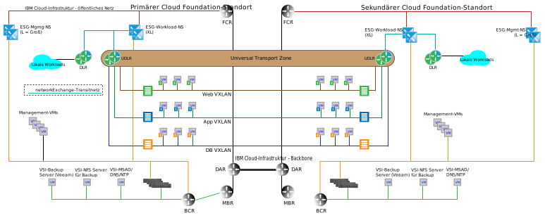

---

copyright:

  years:  2016, 2019

lastupdated: "2019-04-02"

subcollection: vmware-solutions

---

# Architektur mit mehreren Standorten
{: #nsx-multi_site}

Ein wichtiges Differenzierungsmerkmal zwischen {{site.data.keyword.cloud}} und anderen Cloudangeboten ist die Fähigkeit, dedizierte Rechenleistung weltweit bereitzustellen und automatisch eine bedarfsgesteuerte Infrastruktur mit dem Netz in Ihrem privaten {{site.data.keyword.cloud_notm}}-Konto zu verbinden. Die softwaredefinierten Netzfunktionen von VMware vCenter Server zusammen mit {{site.data.keyword.cloud_notm}} stellen eine differenzierte globale Infrastruktur bereit, die innerhalb weniger Tage erstellt werden kann. In den folgenden Abschnitten wird ein Beispiel für eine Architektur mit mehreren Standorten beschrieben, das zeigt, was mit der Out-of-the-box-Funktionalität von vCenter Server erreicht werden kann.

## Cross-vCenter NSX-Umgebung
{: #nsx-multi_site-cross-env}

Die Cross-vCenter NSX-Funktionalität ermöglicht die Verknüpfung von bis zu neun NSX-Managern - in einer Beziehung von einem primären und acht sekundären NSX-Managern. vCenter Server in einer ELM-Beziehung (Enhanced Linked Mode) sind zwar nicht für den Betrieb von Cross-vCenter NSX erforderlich, sie bieten jedoch die folgenden Vorteile:

* Vereinfachte Erstellung einer Primär/Sekundär-Beziehung mithilfe von SSO-Berechtigungsnachweisen (SSO = Single Sign-on)
* Konfiguration der vCenter Server-Automation für die DNS-Namensauflösung für alle verbundenen Standorte
* Zentrales Management auf einen Blick über alle Standorte hinweg für NSX- und normale vCenter-Funktionen

## Beispiel für mehrere Standorte
{: #nsx-multi_site-example}

Im folgenden Beispiel werden eine NSX Universal Transport Zone zu den Basismanagement- und Workloadtopologien hinzugefügt, die in den vorherigen Abschnitten beschrieben wurden, und außerdem die folgenden Merkmale umgesetzt:

* Die Universal Transport Zone erstreckt sich über zwei {{site.data.keyword.CloudDataCents_notm}} oder PODs innerhalb eines {{site.data.keyword.CloudDataCent_notm}}.
* Nachdem die Transportzone hinzugefügt wurde, werden mehrere VXLANs zusammen mit einem Universal Distributed Router hinzugefügt, der sich über die neuen VXLANs erstreckt.
* Sie müssen Uplinks zu den Workload-ESGs an beiden Standorten konfigurieren. Bei dieser Konfiguration können virtuelle Maschinen (VMs) am lokalen Standort zum lokalen ESG traversieren.
* Für den eingehenden Datenverkehr ist eine globale Lastausgleichsfunktion erforderlich. Informieren Sie sich über die {{site.data.keyword.cloud_notm}}-Angebote für einen globalen Lastausgleich, um diese Anforderung zu erfüllen.
* Für dieses Beispiel ist VMware NSX Enterprise Edition erforderlich.

Abbildung 1. Topologie mit mehreren Standorten

## Zugehörige Links
{: #nsx-multi_site-related}

* [Netzservices unter {{site.data.keyword.cloud_notm}}](/docs/services/vmwaresolutions/archiref/nsx?topic=vmware-solutions-nsx-networking_services)
