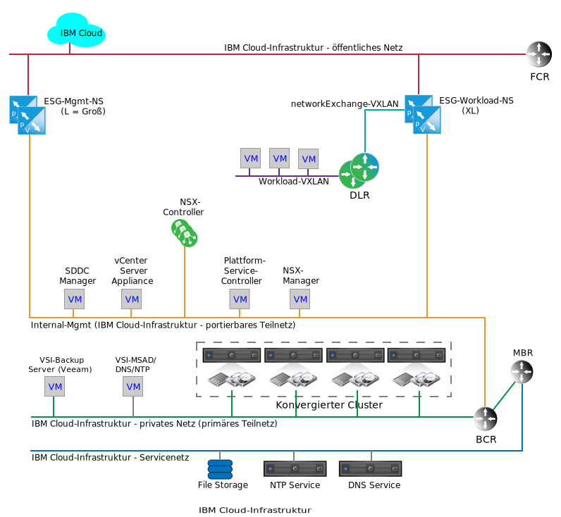
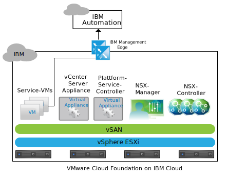
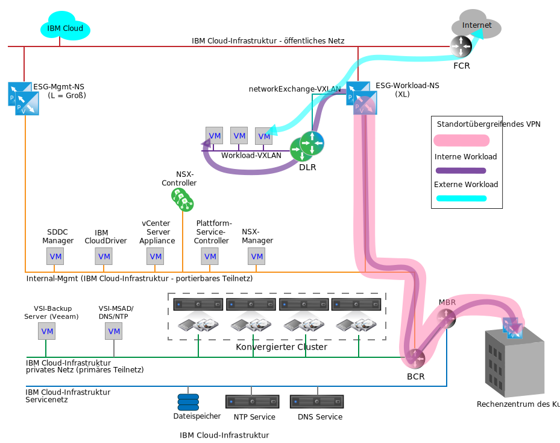

---

copyright:

  years:  2016, 2018

lastupdated: "2018-10-29"

---

{:tip: .tip}
{:note: .note}
{:important: .important}

# Netzservices unter IBM Cloud

Die Netzservices unter {{site.data.keyword.cloud}} bestehen aus zwei Paaren von VMware NSX Edge Services Gateways (ESGs) für die Kommunikation zwischen {{site.data.keyword.cloud_notm}} und entweder dem öffentlichen Internet oder einem Netz am Standort des Kunden durch ein Virtual Private Network (VPN). Diese ESGs werden getrennt, um die interne {{site.data.keyword.cloud_notm}}-Managementfunktion, Ausgangsdatenverkehr und den Eingang von kundenbezogenem Netzverkehrs zu unterstützen.

Die folgende Grafik zeigt ein vereinfachtes Netzdiagramm, in dem das Paar von Management-ESGs und das Paar von Workload-ESGs dargestellt wird. Sie zeigt außerdem einen NSX-DLR (Distributed Logical Router) und das Workload-VXLAN. Diese Komponenten sind als Einstiegslösung für Kundenworkloads konzipiert und setzen noch kein spezielles Wissen zur Einrichtung in NSX voraus. Ein DLR wird in der Regel eingesetzt, um den Datenverkehr zwischen VMware Cloud Foundation oder VMware vCenter Server und Ost-West-Datenverkehr zwischen separaten Layer-2-Netzen in der Instanz weiterzuleiten. Dies steht im Gegensatz zum Verhalten eines ESG, das den Nord-Süd-Netzverkehr vereinfacht, der die Cloud Foundation- oder vCenter Server-Instanz traversiert.

Abbildung 1. Cloud-Netzservices unter Cloud Foundation

Während ein einzelnes ESG möglicherweise für den Management- und Workloaddatenverkehr beim Kunden ausreicht, kann beim Design eine Trennung von Management und Kundendatenverkehr vorgenommen werden, um eine versehentliche Fehlkonfiguration des Management-ESGs zu verhindern.

Bei einer fehlerhaften Konfiguration oder Inaktivierung des Management-ESGs ist die Cloud Foundation- oder vCenter Server-Instanz zwar funktionsfähig, aber es werden alle Portalmanagementfunktionen inaktiviert.
{:note}

## IBM Management Services NSX Edge

Das IBM Management-ESG ist ein dedizierter NSX Edge-Cluster, der dem {{site.data.keyword.cloud_notm}}-Managementnetzverkehr vorbehalten ist. Es ist nicht für die Traversierung von Datenverkehr einer Komponente vorgesehen, die nicht von der Cloud Foundation- oder vCenter Server-Automation bereitgestellt und verwaltet wird.

Das Management-ESG bietet einen Kommunikationspfad zwischen Add-on-Service-VMs, die in Cloud Foundation- oder vCenter Server-Instanzen enthalten sind, und der IBM Automation-Infrastruktur in {{site.data.keyword.cloud_notm}}, wie dies für Cloud Foundation aus folgender Grafik hervorgeht.

Abbildung 2. Management-Edge-Kommunikation unter Cloud Foundation

Durch die einfache Kommunikation zwischen bestimmten Add-on-Service-VMs und ihren entsprechenden Lizenzierungs- und Messsystemen werden die NSX ESGs in einer umfangreichen Konfiguration in einem Aktiv/Passiv-HA-Paar (HA = High Availability) dimensioniert und im Managementressourcenpool des konvergierten Cloud Foundation-Clusters oder des vCenter Server-Clusters bereitgestellt. Die folgende Tabelle enthält eine Zusammenfassung der IBM Management NSX ESG-Bereitstellung.

Tabelle 1. Spezifikationen für IBM Management NSX ESG

| IBM Management NSX Edge | vCPU | Speicher | Plattengröße | Speicherposition |
|:----------------------- |:---- |:------ |:--------- |:---------------- |
| IBM Management NSX ESG 1 | 2 | 1 GB | 1 GB | vSAN Data Store (Cloud Foundation); Shared Attached Storage for Management (vCenter Server) |
| IBM Management NSX ESG 2 | 2 | 1 GB | 1 GB | vSAN Data Store (Cloud Foundation); Shared Attached Storage for Management (vCenter Server) |

### Management-Services

Ein abgehender Zugriff ist für die folgenden Services erforderlich:

* Zerto Virtual Manager. Wenn Zerto on {{site.data.keyword.cloud_notm}} installiert ist, ist für die Lizenzaktivierung und Nutzungsberichte ein abgehender Zugriff auf das Internet erforderlich.
* Veeam Backup and Replication. Wenn Veeam on {{site.data.keyword.cloud_notm}} installiert ist, ist für das Herunterladen von Produkt- und Lizenzaktualisierungen ein abgehender Zugriff auf das Internet erforderlich.
* FortiGate Virtual Appliance on {{site.data.keyword.cloud_notm}} erfordert für die Lizenzaktivierung und -überwachung einen abgehenden Zugriff auf das Internet.
* F5 on {{site.data.keyword.cloud_notm}} erfordert für die Lizenzaktivierung einen abgehenden Zugriff auf das Internet.

### Edge-Schnittstellen

Die Konfiguration der ESG-Schnittstellen definiert, auf welche L2-Netze das ESG zugreifen kann. Für das Cloud Foundation- und vCenter Server-Lebenszyklusmanagement ist es erforderlich, dass bestimmten VMs, die sich im Management-VLAN befinden, die Traversierung zum öffentlichen VLAN ermöglicht wird. Die folgenden Schnittstellen werden bei der Bereitstellung definiert:

Tabelle 2. NSX ESG-Schnittstellenkonfiguration

| Schnittstelle | Schnittstellentyp | Verbunden mit | Beschreibung |
|:--------- |:-------------- |:------------ |:----------- |
| Öffentlicher Uplink | Uplink | **SDDC-DportGroup-External** | Öffentliche Internetschnittstelle |
| Privater Uplink | Uplink | **SDDC-DportGroup-Mgmt** | Interne private Netzschnittstelle |
| Intern | Intern | Workload-HA-VXLAN |  Interne Schnittstelle für HA-Paar-Heartbeat; Portgruppe an SDDC-Dswitch-Private **SDDC-Dswitch-Private** |

### Teilnetze

Die folgenden Teilnetze werden für das Management-ESG verwendet:

Tabelle 3. NSX ESX-IP-Konfiguration

| Schnittstelle | Schnittstellentyp | IPv4-Teilnetztyp | Bereich | Beschreibung |
|:--------- |:-------------- |:----------------- |:----- |:----------- |
| Öffentlicher Uplink | Uplink | {{site.data.keyword.cloud_notm}} portierbar, öffentlich | /30 – gibt eine zuordnungsfähige IP-Adresse aus | Öffentliche Internetschnittstelle |
| Privater Uplink | Uplink | {{site.data.keyword.cloud_notm}} portierbar, privat (vorhandenes Management) | /26 – gibt 61 zuordnungsfähige IP-Adressen aus | Interne private Netzschnittstelle |
| Intern | Intern | Link-Local | 169.254.0.0/16 | Interne Schnittstelle für ESG-HA-Paar-Kommunikation |

### NAT-Definitionen

Network Address Translation (NAT) wird im Management-ESG verwendet, um die Traversierung des Netzverkehrs zwischen zwei IP-Adressräumen zu ermöglichen. Dies geschieht normalerweise, um über das Internet weiterleitbare IPs beizubehalten oder interne IPs aus Sicherheitsgründen vor öffentlichen IPs zu verdecken. NAT wird auch für die TCP- und UDP-Portumleitung verwendet (TCP = Transmission Control Protocol, UDP = User Datagram Protocol). Der Managementdatenverkehr wird immer von innerhalb der Cloud Foundation- und vCenter Server-Instanz initiiert. Dies setzt voraus, dass nur eine Quellen-NAT (SNAT) für das Management-ESG definiert ist. Eine individuelle SNAT wird nicht für jede interne VM erstellt, die einen Service hostet, der von der Instanz ausgehen muss.

Tabelle 4. NSX ESG-NAT-Konfiguration

| Auf Schnittstelle angewendet | Quellen-IP-Bereich | Übersetzte Quellen-IP |
|:-------------------- |:--------------- |:-------------------- |
| Öffentlicher Uplink | Individuelle IP-Adressen (Management, portierbar /26) | {{site.data.keyword.cloud_notm}} portierbar, öffentlich |

### Routing

Wenn Services in VMs, die durch das Management-ESG traversieren müssen, möglicherweise auch zu {{site.data.keyword.cloud_notm}}-Services im privaten {{site.data.keyword.cloud_notm}}-Netz des Kunden gelangen müssen, ist die folgende Konfiguration erforderlich, um diese Kommunikation zu ermöglichen.

Während es schwierig ist vorherzusagen, welcher Ziel-IP-Bereich als Ziel für Verbindungen im Internet benötigt wird, verweist jeder Service, der von {{site.data.keyword.cloud_notm}} bereitgestellt und verwaltet wird, auf das Management-ESG als Standardgateway. Eine statische Route ist erforderlich, um den Datenverkehr zwangsweise für die Services über den {{site.data.keyword.cloud_notm}} BCR zu leiten, die für externe Netzverbindungen benötigt werden.

Die folgenden Konfigurationen werden für jeden Service empfohlen, der das Management-ESG für die Traversierung aus einer Cloud Foundation- oder vCenter Server-Instanz verwendet:
* Das Standardgateway ist ein Management-ESG.
* Eine statische Route ist für interne {{site.data.keyword.cloud_notm}}-Ziele erforderlich.

Wenn der Service oder die VM auf das Kunden-ESG zugreifen muss, müssen statische Routen innerhalb des Service oder der VM verwaltet werden und auf das Kunden-ESG verweisen.

Für das Management-ESG sind derzeit keine automatischen Routing-Protokolle konfiguriert.

### VXLAN-Definitionen

Für das Management-HA-Paar ist ein Netz zur Verbindung der internen Schnittstellen erforderlich. Verwenden Sie einen vorhandenen vSwitch, eine Portgruppe oder ein VXLAN. Für dieses Design wird ein dediziertes VXLAN für die HA-Heartbeat-Kommunikation des Management-ESG-HA-Paars erstellt.

Tabelle 5. NSX ESG-VXLAN-Definitionen

| NSX ESG-VXLAN-Definitionen | Transportzone | Typ |
|:------------------------- |:-------------- |:---- |
| Mgmt.-HA | transport-1 | global |

### Firewallregeln

Standardmäßig ist das Management-ESG so konfiguriert, dass der gesamte Datenverkehr verweigert wird.

**Verweigern:** Der gesamte Datenverkehr wird ohne Antwort gelöscht, es sei denn, dieser Datenverkehr darf die Firewall aufgrund einer vorherigen (in der Reihenfolge vorgeordneten) Regel oder Regelmenge passieren. Die automatische Regelgenerierung wird ausgewählt, um den Steuerdatenverkehr zum ESG-Paar zu ermöglichen.

Zusätzlich zu den automatisch generierten Regeln werden die folgenden Firewallregeln festgelegt:

Tabelle 6. NSX ESG-Firewallkonfiguration

| Service | Quelle | Ziel | Protokoll | Aktion |
|:------- |:------ |:----------- |:-------- |:------ |
| Zerto on {{site.data.keyword.cloud_notm}} | Zerto Management VM | Beliebig | Port 443 | Zulassen |
| Veeam on {{site.data.keyword.cloud_notm}} | Veeam Backup and Replication VM | Beliebig | Port 443 | Zulassen |
| FortiGate Virtual Appliance on {{site.data.keyword.cloud_notm}} | Service-VMs | Beliebig | Port 443 | Zulassen |
| F5 on {{site.data.keyword.cloud_notm}} | Service-VMs | Beliebig | Port 443 | Zulassen |
| Beliebig | Beliebig | Beliebig | Beliebig | Verweigern |

## IBM Workload NSX Edge

Das IBM Workload-ESG ist Teil einer einfachen Topologie, die für die Workload-Netzkommunikation konzipiert ist. Im folgenden Abschnitt wird beschrieben, wo Workloads designgemäß an ein Netz in einer Cloud Foundation- oder vCenter Server-Instanz angehängt werden können. Dies ist ein Ausgangspunkt für das Anhängen von lokalen Netzen und IP-Adressräumen an eine bestimmte Cloud Foundation- oder vCenter Center-Instanz und stellt die Basis für eine echte Hybrid Cloud-Architektur dar.

Ein Kundennetz, das mit den öffentlichen und privaten {{site.data.keyword.cloud_notm}}-Netzen verbunden ist, ermöglicht den eingehenden und abgehenden Workloadzugriff auf Internetdatenverkehr, aber auch die Einrichtung eines standortübergreifenden VPN auf der Basis von öffentlichen oder privaten {{site.data.keyword.cloud_notm}}-Netzen. Dies ermöglicht eine beschleunigte Wertschöpfungszeit hinsichtlich der Anbindung lokaler Netze, da es Monate dauern kann, bis ein dediziertes Wide Area Network (WAN) aufgrund hoher Kundensicherheitsanforderungen betriebsbereit ist. Nachdem jedoch ein dedizierter Link vorhanden ist, kann das VPN zur Traversierung des Links gedreht werden, ohne dass das Overlay-Netz innerhalb des VPN-Tunnels oder in der Cloud Foundation- oder vCenter-Serverinstanz beeinträchtigt wird. Danach kann die öffentliche Schnittstelle für das Workload-ESG bei Bedarf aus einer Sicherheitsperspektive entfernt werden.

Die Topologie in der folgenden Abbildung setzt sich aus den folgenden NSX-Komponenten zusammen:
* NSX Edge-Appliance (ESG)
* Distributed Logical Router (DLR)
* VXLAN (L2 over L3)

Abbildung 3. Beispiel für ein Netzflussdiagramm

### Edge-Schnittstellen für IBM Workload NSX Edge

Wie beim Management-ESG definiert die Konfiguration der ESG-Schnittstellen die L2-Netze, auf die das ESG zugreifen kann. Das Design der Workloadtopologie sieht unter anderem vor, ein SDN-Overlay (SDN = Software-Defined Networking) einzurichten, um Workloads gegen den zugrunde liegenden {{site.data.keyword.cloud_notm}}-Adressraum zu isolieren. Dieses Design ist die Grundlage für das BYOIP-Design. Daher werden die folgenden Schnittstellen bei der Bereitstellung definiert:

Tabelle 7. Workload Edge-Schnittstellenkonfiguration

| Schnittstelle | Schnittstellentyp | Verbunden mit | Beschreibung |
|:--------- |:-------------- |:------------ |:----------- |
| Öffentlicher Uplink | Uplink | SDDC-DportGroup-External | Öffentliche Internetschnittstelle |
| Privater Uplink | Uplink | SDDC-DportGroup-Mgmt | Interne private Netzschnittstelle |
| Transit-Uplink | Uplink | Workload-Transit | Transit-VXLAN zwischen Workload-ESG und Workload-DLR |
| Intern | Intern | Workload-HA-VXLAN | Interne Schnittstelle für ESG-HA-Paar-Heartbeat |

Bei diesem Design wird ein DLR eingesetzt, um ein potenzielles Ost-West-Routing zwischen L2-Netzen für lokale Workloads zu ermöglichen. Da es sich bei dieser Topologie um ein einfaches Beispiel handelt, wird nur ein L2-Netz beschrieben, das für Workloads bestimmt ist. Das Hinzufügen zusätzlicher Sicherheitszonen kann einfach durch Aufnahme zusätzlicher VXLANs, die neuen Schnittstellen beim DLR zugeordnet sind, erreicht werden. In der folgenden Tabelle sind die zu konfigurierbaren DLR-Schnittstellen aufgeführt:

Tabelle 8. DLR-Schnittstellen

| Schnittstelle | Schnittstellentyp | Verbunden mit | Beschreibung |
|:--------- |:-------------- |:------------ |:----------- |
| Transit-Uplink | Uplink | Workload-Transit | Transit-VXLAN zwischen Workload-ESG und Workload-DLR |
| Workload-Uplink | Uplink | Workload | VXLAN für Workloadverbindungen |
| Intern | Intern | Workload-HA-VXLAN | Interne Schnittstelle für ESG-HA-Paar-Heartbeat |

### Teilnetze für IBM Workload NSX Edge

Die folgenden Teilnetze werden für das Workload-ESG verwendet:

Tabelle 9. IP-Konfiguration für DLR und Workload-ESG

| Schnittstelle | Schnittstellentyp | IPv4-Teilnetztyp | Bereich | Beschreibung |
|:--------- |:-------------- |:----------------- |:----- |:----------- |
| Öffentlicher Uplink (ESG) | Uplink | {{site.data.keyword.cloud_notm}} portierbar, öffentlich | /30 – gibt eine zuordnungsfähige IP-Adresse aus | Öffentliche Internetschnittstelle (der Kunde kann separat zusätzliche IPs bestellen) |
| Privater Uplink (ESG) | Uplink | {{site.data.keyword.cloud_notm}} portierbar, privat (vorhandenes Management) | /26 – gibt 61 zuordnungsfähige IP-Adressen aus | Interne private Netzschnittstelle |
| Intern (ESG und DLR) | Intern | Link-Local | 169.254.0.0/16 | Interne Schnittstelle für ESG-HA-Paar-Kommunikation |
| Transit-Uplink (ESG und DLR) | Uplink | Zugeordnet nach Kunde | TBD | Transit-Netzverbindung für ESG zum DLR |
| Workload (DLR) | Uplink | Zugeordnet nach Kunde | TBD | Workloadteilnetz |

### NAT-Definitionen für IBM Workload NSX Edge

NAT wird im Workload-ESG verwendet, um die Traversierung des Netzverkehrs zwischen zwei IP-Adressräumen zu ermöglichen. Für das ESG muss NAT die Kommunikation nicht nur zu Internetzielen ermöglichen, sondern zu allen IP-Bereichen, die auf {{site.data.keyword.cloud_notm}} zurückgehen. Bei diesem Design kann der Workloaddatenverkehr ins Internet gelangen, aber nicht zum Management- oder einem der {{site.data.keyword.cloud_notm}}-Netze. Daher muss im Workload-ESG nur ein SNAT definiert sein. Dabei ist zu beachten, dass das gesamte Workload-portierbare Teilnetz für die Traversierung durch SNAT konfiguriert wird.

Auch wenn es möglich ist, NAT zu verwenden, um die Workloadkommunikation über mehrere Instanzen von Cloud Foundation oder vCenter Server zu ermöglichen, ist dies nicht mehr praktikabel, wenn viele Workloads über Instanzen hinweg verbunden werden müssen. Beispiele für die Verwendung erweiterter NSX-Funktionen zum Erstellen eines L2-Overly-Transit-Netzes über Cloud Foundation- oder vCenter Server-Instanzen hinweg finden Sie unter [Architektur mit mehreren Standorten](multi_site.html).

Tabelle 10. Workload-ESG-NAT-Regeln

| Auf Schnittstelle angewendet | Quellen-IP-Bereich | Übersetzte Quellen-IP | NAT-aktiviert oder -inaktiviert |
|:-------------------- |:--------------- |:-------------------- |:----------------------- |
| Öffentlicher Uplink (Workload-ESG) | Kundendefiniert | {{site.data.keyword.cloud_notm}} portierbare, öffentliche IP | Kundendefiniert (Standard inaktiviert) |

### Routing für IBM Workload NSX Edge

Bei diesem Design müssen die Workloads, die den DLR zum Workload-ESG traversieren, nur auf das Internet zugreifen können. Das Workload-ESG muss den Pfad zum Workload-VXLAN und zu allen in Zukunft hinter dem DLR erstellten Workload-VXLAN/-Teilnetzen erkennen. Auch wenn dies durch statische Routen über das ESG erreicht werden kann, soll die Workloadtopologie ein Best-Practice-Design aufzeigen. Deshalb ist das OSPF-Protokoll (Open Shortest Path First) zwischen dem Workload-ESG und dem Downstream-DLR konfiguriert.

Weitere Informationen zur Konfiguration finden Sie im Abschnitt [Configure OSPF Protocol](https://pubs.vmware.com/NSX-6/index.jsp?topic=%2Fcom.vmware.nsx.admin.doc%2FGUID-6E985577-3629-42FE-AC22-C4B56EFA8C9B.html).

Tabelle 11. Dynamisches Routing

| Bereich | OSPF-Typ | OSPF-Schnittstellen-IP | OSPF-Authentifizierung |
|:---- |:--------- |:----------------- |:------------------- |
| 51 | Stub | Zuordnen einer IP für jeden DLR und jedes ESG im RFC1918-Transit-Netz | Keine |

### Firewallregeln für IBM Workload NSX Edge

Standardmäßig ist das Workload-ESG so konfiguriert, dass der gesamte Datenverkehr verweigert wird.

**Verweigern:** Der gesamte Datenverkehr wird ohne Antwort gelöscht, es sei denn, dieser Datenverkehr darf die Firewall aufgrund einer vorherigen (in der Reihenfolge vorgeordneten) Regel oder Regelmenge passieren. Die automatische Regelgenerierung wird ausgewählt, um den Steuerdatenverkehr zum ESG-Paar zu ermöglichen.

Zusätzlich zu den automatisch generierten Regeln werden die folgenden Firewallregeln festgelegt:

Tabelle 12. Workload-ESG-Firewallregeln

| Service | Quelle | Ziel | Protokoll | Aktion |
|:------- |:------ |:----------- |:-------- |:------ |
| Workloads | Workloadteilnetz | Beliebig | Beliebig | Zulassen |
| Beliebig | Beliebig | Beliebig | Beliebig | Verweigern |

### VXLAN-Definitionen für IBM Workload NSX Edge

Die ESG- und DLR-HA-Paare der Workloadtopologie erfordern L2-Segmente (VXLAN) für die Verbindung der internen Schnittstellen, Datentransit zwischen den beiden und für Workloads.

Tabelle 13. Interne Schnittstellen für das Workload-ESG

| VXLAN-Name | Cloud Foundation- oder vCenter Server-Transportzone | Typ |
|:---------- |:------------------------------------------------- |:---- |
| Workload-HA | transit-1 | Global |
| Workload-Transit | transit-1 | Global |
| Workload | transit-1 | Global |

### ESG-DLR-Einstellungen für IBM Workload NSX Edge

Standardmäßig ist die Protokollierung für alle neuen NSX Edge-Appliances aktiviert. Die Standardprotokollierungsstufe ist NOTICE.

### Zugehörige Links

* [Design von NSX Edge Services Gateway](nsx_design.html)
* [Architektur mit mehreren Standorten](multi_site.html)
