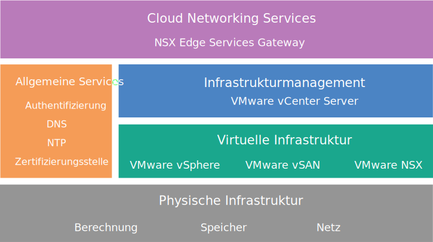

---

copyright:

  years:  2016, 2018

lastupdated: "2018-10-01"

---

# NSX Edge Services Gateway-Design

Die Lösung 'NSX Edge Services Gateway on {{site.data.keyword.cloud}}' bietet VMware-Technologie, die in {{site.data.keyword.CloudDataCents_notm}} auf der ganzen Welt bereitgestellt wird. {{site.data.keyword.vmwaresolutions_short}} bietet zwei Lösungsarchitekturen, die mit NSX Edge Services Gateway in Zusammenhang stehen.

## Internes Architekturdesign

Die interne Architektur gibt die Bereitstellung der erforderlichen NSX Edge-Komponenten in einem Ressourcenpool in einem konvergierten VMware Cloud Foundation-Cluster oder einem VMware vCenter Server-Cluster an.

**Hinweis:** VMware vSAN ist in der folgenden Abbildung optional.

Abbildung 1. Cloud Networking Services on {{site.data.keyword.cloud_notm}}

## Design einer dedizierten Architektur

Die dedizierte Architektur stellt die erforderlichen NSX Edge-Komponenten in einem separaten vSphere-Cluster mit zwei Knoten bereit, der für die Verwendung von NSX Edge dediziert ist und die kritische Interaktion mit der physischen Netzinfrastruktur ermöglicht. Die dedizierte Architektur weist die folgenden Merkmale und Funktionen auf:

* Bietet On-Ramp- und Off-Ramp-Konnektivität zu physischen Netzen. Beispiel: Nord-Süd-L3-Routing bei virtuellen NSX Edge-Appliances.
* Ermöglicht die Kommunikation mit physischen Geräten, die mit VLANs in den physischen Netzen über NSX-L2-Bridging verbunden sind, und hostet die Steuerungs-VM für das DLR-Routing (Distributed Logical Router).
* Kann über zentrale logische oder physische Services verfügen. Beispiele: Firewall, Lastausgleichsfunktionen, VPN-Überwachungskomponenten (Virtual Private Network), Log Insight VMs.
* NSX-Controller können in einem Edge-Cluster gehostet werden, wenn ein dediziertes vCenter verwendet wird, um die Rechen- und Edge-Ressourcen zu verwalten.
* Edge-Clusterressourcen haben eine Anti-Affinitäts-Anforderung, um die aktive Standby-Konfiguration zu schützen oder um die Bandbreitenverfügbarkeit bei einem Ausfall aufrechtzuerhalten.

## Private IBM Cloud-IP-Adressbereiche und 'Bring Your Own IP'-Adressbereiche

Der private IP-Adressbereich (RFC1918) behält die Verwendung von Netzbereichen dem internen Einsatz im Unternehmen vor (kein Einsatz im Internet). Die physische {{site.data.keyword.cloud_notm}}-Netzinfrastruktur verwendet einen bestimmten privaten Adressraum (RFC1918) - 10.x.x.x/8 - über alle Standorte weltweit hinweg. Diese IP-Adressbereiche überschneiden sich nicht über mehrere Kundenkonten hinweg oder innerhalb eines {{site.data.keyword.cloud_notm}}-Kundenkontos. Innerhalb eines Kundenkontos kann jeder {{site.data.keyword.cloud_notm}} zugeordnete private IP-Adressraum bei aktiviertem VLAN-Spanning eine Weiterleitung zu jedem anderen privaten {{site.data.keyword.cloud_notm}}-IP-Adressbereich in beliebigen {{site.data.keyword.CloudDataCents_notm}} bewirken.

Dies macht es zwar einfach, eine weltweit verbundene Infrastruktur in Ihrem Konto einzurichten, aber der feste IP-Adressraum kann problematisch sein, wenn Sie Ihr Rechenzentrum durch das Routing in {{site.data.keyword.cloud_notm}} erweitern möchten und Sie denselben privaten Adressraum wie {{site.data.keyword.cloud_notm}} verwenden. Die Lösung besteht darin, NSX zu verwenden, um eine Overlay-Topologie in der Cloud Foundation- oder vCenter Server-Infrastruktur zu erstellen, wobei der Adressraum Ihrer eigenen BYOIP-Adresse (BYOIP = Bring Your Own IP) von der Interaktion mit einem {{site.data.keyword.cloud_notm}} zugewiesenen privaten IP-Adressraum isoliert wird. NSX ist in der Lage, ein L2-VPN zur Verfügung zu stellen, um den internen BYOIP-Adressraum innerhalb des Tunnels über externe, möglicherweise überlappende IP-Adressräume zu überbrücken.

### Zugehörige Links

* [Lösungsübersicht](../solution/solution_overview.html)
