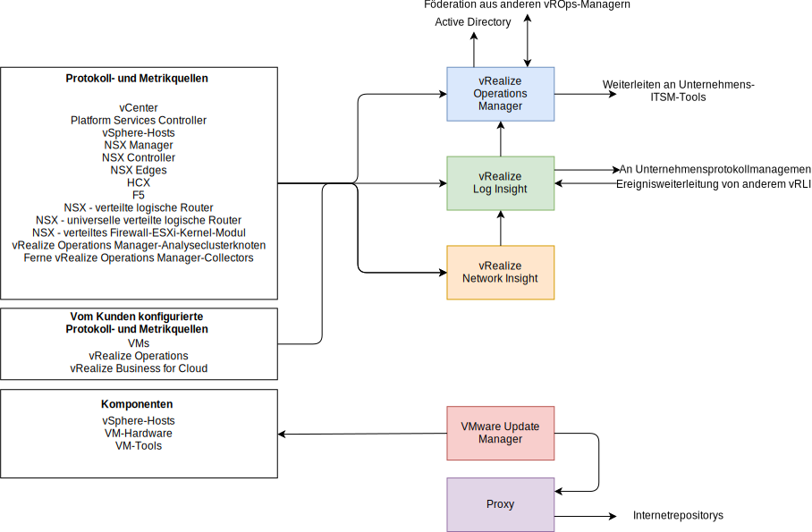
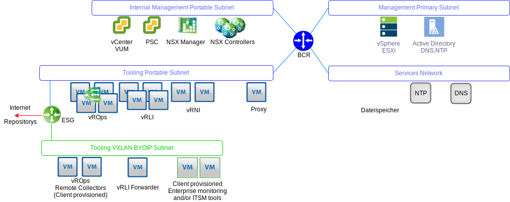

---

copyright:

  years:  2016, 2019

lastupdated: "2019-06-03"

---

# Übersicht über die Operations Management-Architektur
{: #opsmgmt-arch}
Die Architektur der Produkte in der Operations Management-Schicht stellt eine zentralisierte Überwachung mit Protokollierungsdaten aus {{site.data.keyword.vmwaresolutions_full}} bereit. Von der Operations Management-Schicht werden in Echtzeit die physische Infrastruktur, die virtuelle Infrastruktur und optional die Rechenworkloads des Clients überwacht.

Ganz grob werden die folgenden Informationen erfasst:
* Topologiedaten, z. B. physische und virtuelle Rechen-, Netz- und Speicherobjekte.
* Überwachungsdaten, z. B.:
  * Metriken - strukturierte Daten wie Leistung und Kapazität
  * Protokolle - unstrukturierte Daten wie Systemereignisse

## Operations Management-Abläufe
{: #opsmgmt-arch-flows}

Im folgenden Diagramm werden die wichtigsten Interaktionen und die Integration der Operations Management-Tools dargestellt.

{{site.data.keyword.vmwaresolutions_short}} Operations Management besteht aus den folgenden Schritten:
* Überwachung - vRealize Operations Manager (vROps) verfolgt und analysiert die Ausführung mehrerer Objekte in der {{site.data.keyword.vmwaresolutions_short}}-Architektur mithilfe von Analyse-Algorithmen. Diese Algorithmen helfen vROps, das Verhalten dieser Objekte zu lernen und vorherzusagen. Systemadministratoren greifen auf diese Informationen über Ansichten, Berichte und Dashboards zu.

  Wenn es ein Problem in der Umgebung gibt, generiert vROps Alerts, die einem der drei folgenden Auswirkungstypen zugerechnet werden können:
    * Statusalerts - weisen auf Probleme hin, die sich auf den Status der Umgebung auswirken können und sofort behoben werden müssen.
    * Risikoalerts - weisen auf Probleme hin, bei denen es sich nicht um unmittelbare Bedrohungen handelt, die aber zeitnah behoben werden müssen.
    * Effizienzalerts – liefern Informationen zur Verbesserung der Leistung oder zur Konsolidierung von Ressourcen.

  Bei vROps-Alerts handelt es sich um Ereignisse, die in den überwachten Objekten auftreten, wenn die Datenanalyse auf Abweichungen von normalen Metrikwerten hinweist oder wenn ein Problem mit einer der überwachten Komponenten auftritt. vROps-Alerts werden einer der folgenden Kategorien zugeordnet:
    * Kritisch - muss sofort behoben werden.
    * Sofort - muss so bald wie möglich behoben werden.
    * Warnung - muss geprüft werden, wenn die Zeit es zulässt.

* Protokollierung - vRealize Log Insight (vRLI) stellt ein Echtzeit-Protokollmanagement und eine Echtzeit-Protokollanalyse mit auf maschinellem Lernen basierter Gruppierung, einer leistungsfähigen Suche und einer die physischen und virtuellen Objekte in der {{site.data.keyword.vmwaresolutions_short}}-Architektur umspannenden Fehlerbehebung bereit. vRLI sammelt Daten von vSphere-Hosts mithilfe des `syslog`-Protokolls. Es erfasst außerdem Ereignisse, Tasks und Alarmdaten für andere VMware-Produkte wie vCenter Server. Es kann in vROps integriert werden, um Benachrichtigungsereignisse zu senden und Launch-in-Context zu aktivieren. Andere Objekte in der {{site.data.keyword.vmwaresolutions_short}}-Architektur, die `syslog`-Daten versenden können, verweisen auf vRLI. Optional kann der Client ein beliebiges System konfigurieren, das Syslog-Daten senden kann, um diese Daten an vRLI weiterzuleiten.

* Netzzustand - vRealize Network Insight ist ein Analysetool, das Folgendes proaktiv aktiviert:
  * Überwachung von Netzzustand und Leistung.
  * End-to-End--Fehlerbehebung.
  * Umfassende Sichtbarkeit und Analyse.
  * Mikrosegmentierungsbasiertes Konformitätsmanagement.

* Patching und Upgrades - vSphere Update Manager (VUM) stellt ein zentralisiertes, automatisches Patch- und Versionsmanagement für VMware vSphere-Hosts und virtuelle Maschinen (VMs) (nicht für das Betriebssystem oder für Apps) bereit.

## Operations Management-Netz
{: #opsmgmt-arch-network}

Im folgenden Diagramm wird ein Überblick über das Netz dargestellt.

* Ein privates portierbares Tools-Teilnetz wird eingerichtet, um einen {{site.data.keyword.cloud_notm}}-IP-Adressraum bereitzustellen, der zunächst für die Erstbereitstellung der virtuellen Maschinen für die Tools verwendet wird. Es geht dann aber in die Verantwortung des Clients über, um den IP-Adressraum für einen Scale-out der Tools zu verwalten. VMs in diesem Teilnetz erfordern Zugriff auf die Komponenten, die in den Teilnetzen für Management und internes Management gehostet sind.
* Das Tools-VXLAN-Teilnetz wird verwendet, um den BYOIP-IP-Adressbereich bereitzustellen, der zunächst für die Erstbereitstellung der Tools-VMs verwendet wird, dann aber in die Verantwortung des Clients übergeht, um den IP-Adressraum für einen Scale-out der Tools zu verwalten. VMs in diesem Teilnetz erfordern Zugriff auf die Komponenten, die in den Overlay-Teilnetzen gehostet sind. Das ESG stellt NAT zwischen den {{site.data.keyword.cloud_notm}}- und den BYOIP-Adressräumen bereit.
* Die fernen vROps-Kollektoren werden von dem Client bereitgestellt, wenn vROps zum Überwachen ihrer Compute-VMs genutzt werden soll.
* Die vRLI-Weiterleitungsserver geben Protokollnachrichten von den Overlay-Komponenten an den vRLI-Cluster weiter. Der Client kann auch seine Compute-VMs so konfigurieren, dass sie bei Bedarf diese Weiterleitungsserver verwenden.
* VMware Update Manager (VUM) stellt Aktualisierungen für vSphere-Hosts und VM-Hardware und -Tools bereit. VUM verwendet den Proxy, um Zugriff auf die Internetrepositorys zu erhalten.

vROps erfasst Daten von Objekten in der Umgebung. Alle Daten, die erfasst werden, werden als Metrikbeobachtung oder -wert bezeichnet. vROps verwendet den vCenter-Adapter, um unaufbereitete Metriken von vCenter zu erfassen. Neben der Erfassung von Metriken berechnet vROps Kapazitätsmetriken, Badge-Metriken und Metriken zur Überwachung des Status Ihres Systems. Alertdefinitionen sind eine Kombination von Symptomen und Empfehlungen, die Problembereiche angeben und Alerts generieren, auf die Sie reagieren müssen.

## Überwachte Komponenten
{: #opsmgmt-arch-components}

### Überwachung von vCenter
{: #opsmgmt-arch-components-vcenter}

Die Überwachung von vCenter erfolgt mit vROps und dem VMware SDDC Health Management Pack. vRLI erfasst die Protokolldaten von vCenter, das Content-Pack für vSphere ergänzt die Protokolle um spezifische Informationen und sendet wiederum Alerts an vROps.

Das VMware SDDC Health Management Pack überwacht den SDDC Management-Stack und stellt Badges für Status und Alerts im Zusammenhang mit der Konfiguration und Konformität von SDDC-Produktkomponenten bereit, darunter vCenter.

### Überwachung von vSphere-Hosts
{: #opsmgmt-arch-components-hosts}

Die Überwachung der vSphere-Hosts erfolgt mit vROps über vCenter und der Erfassung von Protokollen über vRLI.

### Überwachung von vSAN
{: #opsmgmt-arch-components-vsan}

Zur Überwachung von vSAN werden vROps und vRLI verwendet. In vCenter gibt es einen zusätzlichen Satz an vSAN-Statusprüfungen, die verwendet werden können. Die Installation des Management Pack for vSAN stellt zusätzliche Dashboards für die Überwachung von vSAN bereit.

vROps generiert einen Alert, wenn ein Problem in den SDDC-Produktkomponenten im Speicherbereichsnetz auftritt, das vom VMware vSAN-Adapter überwacht wird. Ein Alert, der mit der Konfigurationskonformität und dem Status verknüpft ist, wird über das VMware SDDC Health Solution Management Pack aus VMware vSAN Management Pack übergeben. vSAN wird mit dem vROps vSAN Management Pack über die vCenter-Appliance mithilfe eines vSAN-Adapters überwacht. Das Standarderfassungsintervall beträgt fünf Minuten und der vSAN-Adapter erfasst auch die Metriken der Dienste für Statusprüfung und Leistung von vSphere-Objekten. Das Intervall des Diensts für Statusprüfung wird in der vSphere-Schnittstelle konfiguriert und beträgt standardmäßig 60 Sekunden.

Um sicherzustellen, dass der vSAN-Adapter alle Leistungsdaten erfassen kann, muss der vSAN-Leistungsdienst in vSphere aktiviert sein.

### Überwachung von NSX für vSphere
{: #opsmgmt-arch-components-nsxv}

Zur Überwachung von NSX werden die folgenden Tools implementiert:
* vRealize Operations Manager (vROps)
* vRealize Log Insight (vRLI)
* vRealize Network Insight (vRNI)

Damit können Systemadministratoren VMware NSX überwachen, verwalten und relevante Fehler beheben. Das vROps Management Pack for VMware NSX bietet Einblicke in die Netztopologie. NSX-Dashboards geben einen schnellen Überblick über die NSX-Umgebung und den Status ihrer Komponenten. Die Korrelation zwischen NSX-Objekten und vSphere-Objekten ermöglicht eine einfache Fehlerbehebung.

vROps verwendet das Management Pack, um von VMware NSX Konfigurations-, Leistungs- und Supportdaten abzufragen. Für vROps konvertiert das Management Pack die Abfrageanforderungen in REST-API-Aufrufe, um die erforderlichen Daten von NSX Manager abzurufen.

Die NSX-Komponenten müssen so konfiguriert werden, dass sie Syslog an vRLI senden.

* NSX Manager - [Angeben von Syslog-Server](https://pubs.vmware.com/NSX-6/topic/com.vmware.nsx.admin.doc/GUID-EA70974C-07F8-469D-8A9D-0ED54F0C8F34.html#GUID-EA70974C-07F8-469D-8A9D-0ED54F0C8F34){:new_window}.
* NSX Controller - [Konfigurieren von NSX Controllern](https://kb.vmware.com/s/article/2092228){:new_window}.
* NSX Edge - [Konfigurieren von fernen Syslog-Servern](https://pubs.vmware.com/NSX-6/topic/com.vmware.nsx.admin.doc/GUID-9C25E097-E2CC-461A-9DA6-E8118D16EE62.html#GUID-9C25E097-E2CC-461A-9DA6-E8118D16EE62){:new_window}.
* Firewall - Sie müssen den fernen Syslog-Server für jeden Cluster konfigurieren, der die Firewall aktiviert hat. Der ferne Syslog-Server wird im Attribut `Syslog.global.logHost` angegeben.

NSX Flow Monitoring kann in NSX Manager verwendet werden, um zu bestimmen, welcher Datenverkehr zugelassen und welcher blockiert wird. Bei Bedarf kann eine Anschlussspiegelung für einen vSphere Distributed Switch konfiguriert werden.

### Überwachung von NSX-T
{: #opsmgmt-arch-components-nsxt}

Zur Überwachung von NSX-T werden die folgenden Tools implementiert:

* vRealize Operations Manager (vROps)
* vRealize Log Insight (vRLI)

Das VMware SDDC Health Management Pack überwacht die folgenden Komponenten:
* Logische Switches - Überwacht den Verwaltungsstatus der logischen Switches.
* Controller-Cluster - Überwacht die bereitgestellte Anzahl von Clusterknoten für HA und verwaltet das Quorum.
* Controllerknoten - Überwacht die Knotenkonnektivität mit dem Controller-Cluster und dem Managerknoten.
* Edge-Knoten - Überwacht den Laufstatus des Edge-Knotens und seine Konnektivität mit dem Controller-Cluster und den Managerknoten.
* NSX-T Management Services.
* T0-Router-Service - Überwacht die statische Route, NAT, BGP, BFD und die Services zur Neuverteilung von Routen.
* T1-Router-Service - Überwacht die statische Route, NAT und die Services zur Routenmitteilung.

### Überwachung von vRealize Operations Manager
{: #opsmgmt-arch-components-vrops}

Das VMware SDDC Health Management Pack verfügt über Alertdefinitionen für folgende Ereignisse:
* Die aktuelle Dimensionierung der vRealize Operations Manager-Knoten reicht für die angegebene Last nicht aus.
* Die Konfiguration des Clusterknotens folgt nicht der VRealize Operations Manager-Dimensionierungsrichtlinie.
* Die aktuelle Dimensionierung des fernen Kollektors reicht für die angegebene Last nicht aus.
* Die Konfiguration des fernen Kollektors folgt nicht der VRealize Operations Manager-Dimensionierungsrichtlinie.
* vRealize Operations-Cluster hat die empfohlene Anzahl von Analyseknoten überschritten.

### Überwachung von vRealize Log Insight
{: #opsmgmt-arch-components-vrli}

vRLI unterstützt Alerts, die Benachrichtigungen zum Status auslösen und Benachrichtigungen generieren, wenn ein wichtiges Systemereignis auftritt, z. B. wenn der Plattenspeicherplatz beinahe erschöpft ist und vRealize Log Insight mit dem Löschen oder Archivieren alter Protokolldateien beginnen muss.

## Systemvoraussetzungen
{: #opsmgmt-arch-requirements}

Das Design verwendet die folgende Menge und Größe von Appliances:

Tabelle 1. Zusammenfassung der Systemvoraussetzungen für operative Tools

||vROps|vRLI|vRNI|Proxy|
|---|---|---|---|---|---|
|VM-Menge|4|4|1+1|1|
|vCPU|8|8|4 + 8|4|
|RAM-GB|32|16|12 + 32|0,5|
|Platten-GB|254|1042|158 + 1000|80|

## Softwareversionen
{: #opsmgmt-arch-versions}

Tabelle 2. Softwareversionen für operative Tools

|Produktname|Version|
|---|---|
|VMware vRealize Operations Manager Advanced oder höher|7.0|
|vRealize Operations Management Pack for NSX for vSphere|3.5.2|
|vRealize Operations Management Pack for Storage Devices|7.0.0|
|vRealize Operations Management Pack for Site Recovery Manager|8.1.1|
|VMware vRealize Log Insight|4.7|
|vRealize Log Insight Content Pack for NSX for vSphere|3.8|

## Zugehörige Links
{: #opsmgmt-arch-components-related}

* [Übersicht über vCenter Server on {{site.data.keyword.cloud_notm}} with Hybridity Bundle](/docs/services/vmwaresolutions/archiref/vcs?topic=vmware-solutions-vcs-hybridity-intro)
