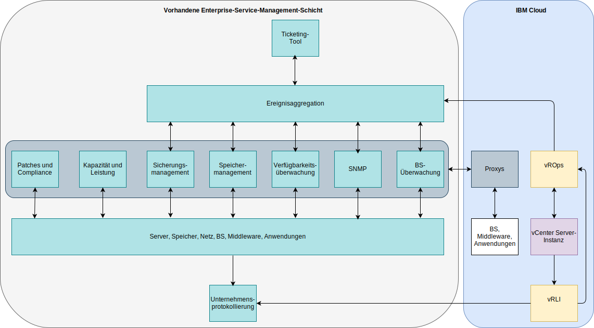

---

copyright:

  years:  2016, 2019

lastupdated: "2019-05-16"

---

# Integration
{: #opsmgmt-integration}

In dieser Dokumentation wird die Schicht des operativen Managements im Design behandelt, wobei manche Unternehmen diese Schicht möglicherweise in ihre Service-Management-Schicht integrieren möchten. In diesem Abschnitt finden Sie Anleitungen für diese Integration. In diesem Design ist vROps der zentrale Punkt, über den alle Alerts zugänglich sind. 

Die folgenden Kategorien von Integration sind möglich: 
* Nach Norden – Integration aus vROps in andere Tools: 
  * Benachrichtigung über Alerts an SMTP-Server oder Tools wie Slack oder PagerDuty. 
  * Ticketintegration in ein Service-Desk-Tool wie ServiceNow. 
  * Initialisierung von vRealize Orchestrator-Workflows zum Beheben von Problemen, die von vROps erkannt werden. 
* Nach Süden – Integration aus Service-Management- oder Cloud-Management-Tools: 
  * vRealize Automation konfiguriert die Überwachung, wenn eine neue Workload hinzugefügt wird. 
  * Aktualisierung von vROps-Objekten mit Ereignisaufbereitung aus externen Quellen. 

vROps stellt die folgenden ausgehenden Alert-Plug-ins bereit: 
* Automatisierte Aktion – standardmäßig aktiviert. 
* Standard-E-Mail - Simple Mail Transfer Protocol (SMTP) zum Senden von Alertbenachrichtigungen von vRealize Operations Manager per E-Mail an relevante Personen. 
* SNMP-Trap – protokolliert Alerts auf Ihrem SNMP-Trap-Server. 
* REST-Benachrichtigung - sendet vROps-Alerts an eine andere REST-aktivierte Anwendung, in der Sie einen REST-Web-Service aktiviert haben, der diese Nachrichten akzeptiert. 
* Protokolldatei – aktiviert vROps zum Protokollieren von Alerts in einer Datei auf jedem Ihrer vRealize Operations Manager-Knoten. Wenn Sie vRealize Operations Manager als Cluster mit mehreren Knoten installiert haben, verarbeitet und protokolliert jeder Knoten die Alerts für die Objekte, die er überwacht. Jeder Knoten protokolliert die Alerts für die von ihm verarbeiteten Objekte. 
* Smarts SAM-Benachrichtigung - sendet Alertbenachrichtigungen an EMC Smarts Server Assurance Manager. 
* Netzfreigabe - sendet Berichte an einen gemeinsam genutzten Standort, unterstützt SMB Version 2.0. 

Benachrichtigungen sind Alertbenachrichtigungen, die die Filterkriterien in den Benachrichtigungsregeln erfüllen, bevor sie nach Norden an externe Systeme gesendet werden. Benachrichtigungsregeln werden für die erforderlichen ausgehenden Alerts konfiguriert, damit diese gefiltert werden können, bevor sie an das ausgewählte externe System gesendet werden. Mithilfe der Benachrichtigungsliste werden diese Regeln verwaltet. 

## Anwendungsfall für die Integration
{: #opsmgmt-integration-usecase}

Dieser Beispielanwendungsfall basiert auf einer vorhandenen generischen Service-Management-Schicht eines Unternehmens. Der Kunde verfügt über eine vCenter Server-Instanz mit der Operations Management-Option und möchte diese Plattform in seine Service-Management-Plattform integrieren. Er verwendet ein Ereignisaggregationssystem, um die Alerts zu integrieren, die von den domänenspezifischen Überwachungstools generiert werden: 

* Ein Toolset zum Überwachen des Betriebssystems, der Middleware und der Anwendungen in allen UNIX-, Linux- und Windows-Workloads. Dieses Tool überwacht jedoch nicht Infrastrukturkomponenten wie VMware, Netzeinheiten oder Speicher. 
* Ein SNMP-Manager für den Empfang von SNMP-Traps aus der Netzinfrastruktur. Dieses Tool erfasst auch SNMP-Messwerte zu Aktivierung der Alertausgabe für Leistung und Kapazität. 
* Ein Backup-Management-Tool für die Verwaltung von Sicherungen. 
* Ein Speichermanagementtool für die Verwaltung von Speicherarrays. 
* Ein Verfügbarkeitstool, das die Erreichbarkeit der Einheiten mit Ping testet. 

Die Service-Management-Schicht umfasst außerdem folgende Elemente: 

* Ein Serverkapazitäts- und Leistungsanalysetool zum Erfassen von Metriken für die Bereitstellung von Berichten. 
* Ein Patching- und Compliance-Server zum Aktualisieren von Betriebssystem, Middleware und Anwendungen sowie zum Messen der Konformität auf diesen Plattformen. 
* Ein Ticketing-Tool zum Verwalten von Tickets für Vorfälle, Probleme und Änderungen. Dieses Tool ist gleichzeitig die Configuration Management Database (CMDB) des Unternehmens. Das Tool kann E-Mails oder SMS-Nachrichten an das Operationsteam senden. 
* Ein Unternehmensprotokollierungssystem, das Protokolle aus allen Systemen erfasst und vom Sicherheitsteam verwaltet wird. 

Nachdem vROps installiert wurde, integriert der Kunde dieses Tool mithilfe des SNMP-Trap-Plug-ins unter Verwendung der nach Norden gesendeten Benachrichtigung. Um vROps zu integrieren, müssen die von vROps gesendeten Traps so geparst werden, dass die Ereignismanagementumgebung des Kunden Alerts erstellen und aufbereiten kann. Das Management-Tool-Team hat die VMware-MIBs von VMware heruntergeladen und in ihrer Ereignismanagementumgebung installiert. 

vRLI ist für die Weiterleitung aller Ereignisse an das Unternehmensprotokollierungssystem in Übereinstimmung mit den Richtlinien des Kunden konfiguriert. 

Der Kunde möchte sein vorhandenes Betriebssystem, seine vorhandene Middleware und die Anwendungsüberwachungstools verwenden, deshalb wurden Proxys in {{site.data.keyword.cloud}} zum Erfassen und Weiterleiten von Metriken und Alerts eingesetzt. 

## Zugehörige Links
{: #opsmgmt-integration-related}

* [Übersicht über vCenter Server on {{site.data.keyword.cloud_notm}} with Hybridity Bundle](/docs/services/vmwaresolutions/archiref/vcs?topic=vmware-solutions-vcs-hybridity-intro)
* [Realize Operations-RESTful-API](https://docs.vmware.com/en/vRealize-Operations-Manager/7.0/vrealize-operations-manager-70-api-guide.pdf){:new_window}
* [VMware-Code-API-Explorer](https://code.vmware.com/apis?socv=1&numPerPage=164&sorter=pv){:new_window}
* [Postman Client Collection Tool for vRealize Operations](https://code.vmware.com/samples/4663/postman-client-collection-for-vrealize-operations-rest-apis){:new_window}
* [VMware PowerCLI-Blog](https://blogs.vmware.com/PowerCLI/2016/05/getting-started-with-powercli-for-vrealize-operations-vr-ops.html){:new_window}
* [Webhook-Shims](https://blogs.vmware.com/management/2017/01/vrealize-webhooks-infinite-integrations.html){:new_window}
