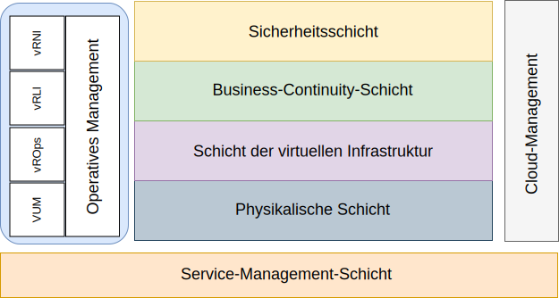

---

copyright:

  years:  2016, 2019

lastupdated: "2019-05-17"

---

# Einführung
{: #opsmgmt-intro}

Diese Referenzarchitektur soll als Leitfaden und zur Einschränkung der Instanziierungen von {{site.data.keyword.vmwaresolutions_full}}-Architekturen dienen. 

Außerdem bietet sie Folgendes: 
* Allgemeine Sprache für die unterschiedlichen Beteiligten
* Konsistente Implementierung der Technologie zur Problemlösung
* Unterstützte Validierung von Lösungen anhand einer bewährten Referenzarchitektur
* Förderung der Einhaltung von allgemeinen Standards, Spezifikationen und Mustern

Das primäre Ziel dieser Referenzarchitektur ist, die Operations Management-Funktionalität zu dokumentieren, um die Überwachung und Alertausgabe der für den Kunden implementierten {{site.data.keyword.vmwaresolutions_short}}-Umgebung zu ermöglichen. Die Tools wurden unter Berücksichtigung von Best Practice-Parametern und -Schwellenwerten zur Verwendung durch das Operationsteam des Kunden konfiguriert. 

Das Design erlaubt es dem Kunden, die folgenden Tasks auszuführen: 
* Scale-up oder Scale-down nach Bedarf. 
* Installation eigener Unternehmensüberwachungstools wie durch die zugehörigen operativen Richtlinien vorgegeben. 
* Integration der Tools in die unternehmenseigene ITSM-Plattform (IT-Service-Management). 

## Operations Management
{: #opsmgmt-intro-opsmgmt}

{{site.data.keyword.vmwaresolutions_short}} basiert auf den folgenden Architekturschichten: 

* Physische Schicht - Die unterste Ebene der Architektur ist die physische Schicht, die aus den Rechen-, Netz- und Speicherkomponenten besteht, die von {{site.data.keyword.cloud_notm}} genutzt werden: 
  * {{site.data.keyword.baremetal_short}}, auf dem die Management-, Edge- und Rechenworkloads ausgeführt werden. 
  * {{site.data.keyword.cloud_notm}}-Netz, das aus VLANs, Teilnetzen, Front-End- und Back-End-Kundenroutern (FCR/BCR) besteht. 
  * VSAN-Speicher, bei dem es sich um einen konsolidierten Datenspeicher aus den SSDs im {{site.data.keyword.baremetal_short}}- oder Endurance-Speicher handelt. 

* Schicht der virtuellen Infrastruktur - Die Schicht der virtuellen Infrastruktur setzt auf den Komponenten der physischen Schicht auf. Die Schicht der virtuellen Infrastruktur steuert den Zugriff auf die zugrunde liegende physische Infrastruktur. Außerdem steuert und ordnet sie Ressourcen für das Management und die Berechnung von Workloads zu. Die Management-Workloads bestehen aus Elementen in der Schicht der virtuellen Infrastruktur selbst, sowie aus Elementen in den Schichten für Cloud-Management, Service-Management, Business-Continuity und Sicherheit. 

* Business-Continuity-Schicht – Diese Schicht enthält Elemente zur Unterstützung von Business-Continuity durch Datensicherung, Wiederherstellung und Disaster-Recovery. Weitere Informationen finden Sie in den Abschnitten zur {{site.data.keyword.vmwaresolutions_short}}-Sicherungs- und Wiederherstellungsarchitektur und zu den Disaster-Recovery-Referenzarchitekturen für Veeam, Spectrum Protect Plus und Zerto. 

* Sicherheitsschicht – Diese Schicht besteht aus den Elementen zur Reduzierung des Risikos und zur Erhöhung der Konformität. Weitere Informationen finden Sie in den Referenzarchitekturen für Fortinet, F5, NSX, HyTrust und Caveonix. 

In diesem Dokument wird die folgende Schicht zur {{site.data.keyword.vmwaresolutions_short}}-Architektur hinzugefügt: 

* Operations Management-Schicht - Die Architektur der Operations Management-Schicht umfasst Managementkomponenten, die Unterstützung für die physischen und virtuellen Schichten und optional für die Rechenworkloads in Echtzeit bereitstellen. Die Operations Management-Schicht kennt die {{site.data.keyword.vmwaresolutions_short}}-Topologie: physische, virtuelle, Rechen-, Netz- und Speicherressourcen. Die Operations Management-Schicht besteht in erster Linie aus der Überwachungs- und Protokollierungsfunktionalität. 

  Die Informationen werden in der folgenden Form erfasst: 
    * Metriken - strukturierte Daten wie Leistung und Kapazität
    * Protokolle - unstrukturierte Daten wie Systemereignisse

Die Operations Management-Schicht besteht aus den folgenden Tools: 

* vRealize Operations Manager (vROps) - vROps verwendet Daten, die aus Systemressourcen (Objekten) erfasst werden, um Probleme in den überwachten Systemkomponenten zu identifizieren, und schlägt für viele Probleme Korrekturmaßnahmen vor. Für komplexere Probleme bietet vROps umfassende analytische Werkzeuge, um versteckte Probleme sichtbar zu machen, komplexe technische Probleme zu untersuchen, Trends zu erkennen oder einen Drilldown durchzuführen, um den Status einzelner Objekts zu erfassen. 
* vRealize Log Insight (vRLI) - vRLI bietet ein intelligentes Protokollmanagement für Infrastruktur und Anwendungen in jeder Umgebung. Diese hoch skalierbare Protokollmanagementlösung stellt intuitive, einsetzbare Dashboards, ausgereifte Analysen und eine umfassende Erweiterbarkeit durch Drittanbieter über physische, virtuelle und Cloudumgebungen hinweg bereit. 
* vRealize Network Insight (vRNI) - vRNI stellt intelligente Operationen für softwaredefinierte Netze und Sicherheit bereit. Es macht virtuelle und physische Netze sichtbar, bietet operative Ansichten zur Verwaltung und Skalierung von NSX-Bereitstellungen und beschleunigt die Planung und Bereitstellung von Mikrosegmentierungen. 
* VMware Update Manager (VUM) - VUM aktiviert zentrales, automatisiertes Patch- und Versionsmanagement für VMware vSphere und bietet Upgrading und Patching von vSphere-Hosts, Installation und Aktualisierung von Software anderer Anbieter auf Hosts sowie Upgrading von VM-Hardware, VMware-Tools und virtuellen Appliances. 

Für eine vollständige Unternehmensarchitektur sind unter Umständen die folgenden Schichten erforderlich, sie befinden sich jedoch außerhalb der {{site.data.keyword.vmwaresolutions_short}}-Architektur: 

* Cloud-Management-Schicht - Die Cloud-Management-Schicht ist die oberste Schicht der Cloudarchitektur. Diese Schicht fordert Ressourcen an und koordiniert die unteren Schichten Benutzerschnittstelle oder Anwendungsprogrammierschnittstelle (API). vRealize Automation aktiviert Cloud Automation in der {{site.data.keyword.cloud_notm}}. Weitere Informationen finden Sie in der [Referenzarchitektur für vRealize Automation (vRA)](https://www.ibm.com/cloud/garage/files/IBM_Cloud_for_VMware_Solutions_VRA_Architecture_v1.pdf){:new_window}. 

Weitere Informationen dazu, wie diese Architektur durch die Integration von Chef erweitert werden kann, finden Sie unter [Referenzarchitektur für vRA mit Chef-Integration](https://www.ibm.com/cloud/garage/files/IBM_Cloud_for_VMware_Solutions_VRA_Chef_Integration_Architecture.pdf){:new_window}. 

* Service-Management-Schicht – Diese Schicht konzentriert sich auf den kompletten Lebenszyklus der IT-Umgebung und wird typischerweise auf Unternehmensebene implementiert, wobei sie Eingaben aus allen IT-Operations- und -Technologiesilos kombiniert. Diese Schicht wurde üblicherweise in IT Service Management-Frameworks (ITSM) konzipiert wie IT Infrastructure Library (ITIL) und ISO/IEC 20000. Dabei handelt es sich um Frameworks von Best Practices für die Bereitstellung von IT-Services in den Prozessen und Phasen des IT-Service-Lebenszyklus. Auf Produktebene wird ITSM durch ein zentralisiertes Workflow-Management-System für die Behandlung von Vorfällen, Serviceanforderungen, Problemen, Änderungen und Wissen im Zusammenhang mit einer Configuration Management Database verkörpert. 

## Zugehörige Links
{: #opsmgmt-intro-related}

* [Übersicht über vCenter Server on {{site.data.keyword.cloud_notm}} with Hybridity Bundle](/docs/services/vmwaresolutions/archiref/vcs?topic=vmware-solutions-vcs-hybridity-intro)
