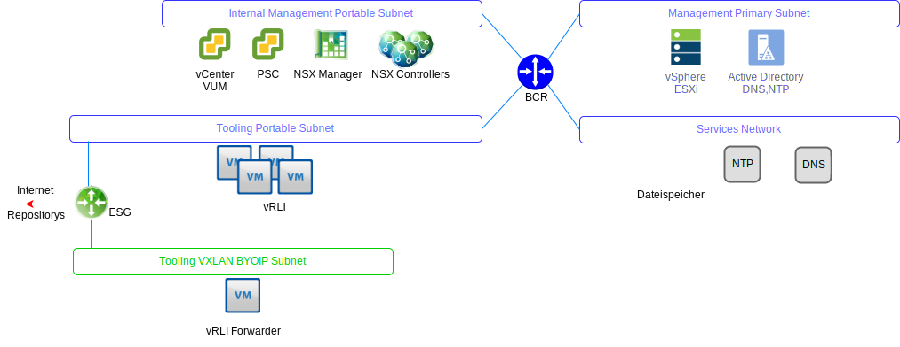
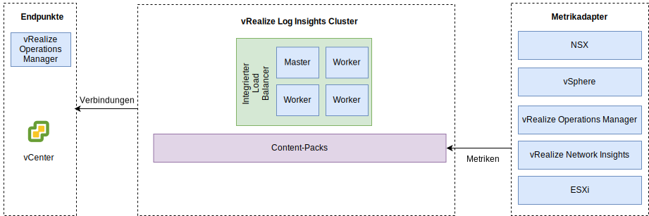

---

copyright:

  years:  2016, 2019

lastupdated: "2019-03-06"

---

# vRealize Log Insights
{: #opsmgmt-vrli}

Die vRealize Log Insight-Umgebung (vRLI) besteht aus vier virtuellen Maschinen (VMs) mit einer integrierten Lastausgleichsfunktion.

Dieses Muster unterstützt:
* 30.000 VMs
* 75 GB Protokolldaten pro Tag
* 5.000 Ereignisse pro Sekunde

vRealize Log Insight (vRLI) aktiviert eine echtzeitorientierte Protokollierung für Komponenten in der {{site.data.keyword.vmwaresolutions_full}}-Umgebung. Das Design stellt einen vRLI-Cluster mit vier Knoten pro Instanz bereit. Diese Konfiguration bietet fortlaufende Verfügbarkeit und höhere Raten für die Aufnahme von Daten in Protokolle.

In diesem Design verfügt jeder Standort über einen unabhängigen vRLI-Cluster, der auf dem Management-Cluster bereitgestellt wird. Der vRLI-Cluster wird mithilfe von portierbaren {{site.data.keyword.cloud_notm}}-IP-Adressen im Tools-Teilnetz bereitgestellt. Dies vereinfacht die Kommunikation mit allen Komponenten, die aus dem {{site.data.keyword.cloud_notm}}-RFC1918-Adressraum heraus adressiert werden. Zu diesen Komponenten gehören vSphere-Hosts, vCenter, Platform Services Controller, NSX Manager und NSX Controller. Ein vRLI-Cluster enthält einen Masterknoten und mindestens zwei Workerknoten mit einer integrierten Lastausgleichsfunktion.

* Masterknoten - Erforderlicher Anfangsknoten im Cluster. Der Masterknoten ist für Abfragen und die Aufnahme von Daten in Protokolle verantwortlich. Die Webbenutzerschnittstelle des Masterknotens ist die zentrale Stelle für diesen vRealize Log Insight-Cluster. Alle Datenabfragen werden an den Master gerichtet, der die Workload wiederum an die Worker verteilt.
* Workerknoten - Mindestens drei Knoten sind erforderlich, um einen Cluster zu bilden, von dem weitere Worker für einen Scale-Out hinzugefügt werden können. Von einem Workerknoten werden Protokolle gepflegt und lokal gespeichert.
* Integrierte Lastausgleichsfunktion - Diese Funktion stellt Hochverfügbarkeit unter Verwendung einer proprietären Lastausgleichskonfiguration bereit (keine externe Lastausgleichsfunktion erforderlich).
* Log Insight-Weiterleitungsserver – Wird bereitgestellt, um Protokolle von den NSX-Overlay-Komponenten zu empfangen. Zudem kann er von einem Client genutzt werden, wenn Protokolle von Compute-VMs gesendet werden sollen. Der Log Insight-Weiterleitungsserver ist ein einzelner vRealize Log Insight-Masterknoten, der als ferner Syslog-Aggregator zum Weiterleiten von Alerts an den vRLI-Cluster dient. Da sich die VXLAN-gestützten Adressen außerhalb des BYOIP-Adressbereichs befinden, müssen NAT-Regeln im NSX ESG implementiert werden.

Folgende Größen sind verfügbar, die passende Größe ist ausgewählt:
* Klein – 2.000 Ereignisse pro Sekunde
* Mittel – 5.000 Ereignisse pro Sekunde
* Groß - 15.000 Ereignisse pro Sekunde

vRLI erfasst Protokolle, um Überwachungsinformationen zur Umgebung zentral bereitzustellen.

vRLI erfasst Protokollereignisse aus der folgenden virtuellen Infrastruktur und von den folgenden Cloud-Management-Komponenten (Protokollierungsclients):
* vCenter
* ESXi-Hosts
* NSX Manager
* NSX Controller
* NSX Edge-Service-Gateways
* NSX - verteilte logische Routerinstanzen
* NSX - universelle verteilte logische Router
* NSX - verteiltes Firewall-ESXi-Kernel-Modul
* vRealize Operations Manager-Analyseclusterknoten und ferne Kollektoren
* vRLI-Instanz in den anderen Instanzen als Folge von Ereignisweiterleitung

Die folgenden Protokollierungsclients werden unterstützt, sind aber in diesem Design nicht integriert:
* vRealize Automation Appliance
* vRealize Orchestrator (eingebettet in vRealize Automation Appliance)
* vRealize IaaS Web Server
* vRealize IaaS Management Server
* vRealize IaaS DEM
* vRealize IaaS Proxy Agents
* vRealize Business-Server
* vRealize Business-Datenkollektor

## Systemvoraussetzungen
{: #opsmgmt-vrli-requirements}

Damit alle Protokolldaten aus den Protokollquellen in der Umgebung aufgenommen werden können, müssen die vRLI-Knoten korrekt dimensioniert sein. Dieses Design basiert auf einer Appliance mittlerer Größe:

Tabelle 1. Log Insight-Systemeinstellungen für Master- und Replikatknoten

| Attribut                | Spezifikation                     |
| ------------------------ | --------------------------------- |
| vCPU                     | 8                                 |
| Speicher                   | 18 GB                             |
| Platte (Thick Provisioning) | 530 GB (490 GB für Ereignisspeicher) |

Jede virtuelle vRLI-Appliance verfügt über drei virtuelle Standardplatten und kann mehr virtuelle Platten für die Speicherung verwenden.
* Festplatte 1 - 20 GB für das Stammdateisystem
* Festplatte 2 - 510 GB für eine Bereitstellung mittlerer Größe; enthält zwei Partitionen:
  * /storage/var - für Systemprotokolle
  * /storage/core storage - für erfasste Protokolle (ca. 475 GB Plattenspeicherplatz verfügbar)

## Netzbetrieb
{: #opsmgmt-vrli-network}

Die Bereitstellung der vRLI-Appliance erfordert drei IP-Adressen aus dem privaten portablen Tools-Teilnetz. vRLI benötigt Zugriff auf:
* vCenter-Appliance
* vRealize Log Insight-Appliance
* NSX-V/T-Appliances
* Tools-Erweiterung VXLAN
* Kundennetze
* NTP-Server (`time.services.softlayer.com`)
* {{site.data.keyword.vmwaresolutions_short}} Active Directory/DNS
* Für die fernen Kollektoren sind NAT-Regeln für das NSX ESG erforderlich, um die Konnektivität zum Masterknoten, zum Masterknotenreplikat und zu den Datenknoten zu ermöglichen.

## Ports
{: #opsmgmt-vrli-ports}

Tabelle 2. Log Insight-Ports

| Beschreibung                                                   | Port       | Protokoll |
| ------------------------------------------------------------- | ---------- | -------- |
| Ausgehender Syslog-Datenverkehr konfiguriert als Ziel des Weiterleitungsservers | 514        | TCP, UDP |
| Syslog-Daten über SSL                                          | 1514, 6514 | TCP      |
| Log Insight-Aufnahme-API                                     | 9000       | TCP      |
| Log Insight-Aufnahme-API über SSL                            | 9543       | TCP      |
| SSH-Zugriff auf Appliance                                       | 22         | TCP      |
| Benutzerschnittstelle                                                | 80, 443    | TCP      |
| NTP                                                           | 123        | UDP      |
| SMTP                                                          | 25         | TCP      |
| DNS                                                           | 53         | UDP      |
| LDAP/LDAPS                                                    | 389, 636   | TCP      |
| LDAP GC                                                       | 3268/3269  | TCP      |
| vCenter                                                       | 443        | TCP      |
| vRealize Operations Manager-Appliance                         | 443        | TCP      |

## Authentifizierung
{: #opsmgmt-vrli-auth}

Das Benutzermanagement für vRLI erfordert VMware Identity Manager (vIDM), der in Active Directory integriert werden kann. Servicekonten werden für die Kommunikation zwischen Anwendungen aus vRealize Operations Manager zu den folgenden Adaptern mit dem Mindestsatz an Berechtigungen verwendet, die für die Metrikerfassung und die Topologiezuordnung erforderlich sind.
* NSX Manager
* vCenter
* vSAN

## Content-Packs in vRealize Log Insight
{: #opsmgmt-vrli-content}

Content-Packs bieten eine zusätzliche differenzierte Überwachung der virtuellen Infrastruktur und ermöglichen, dass Protokolle abgerufen, extrahiert und in ein lesbares Format geparst werden können. Auf diese Weise speichert vRLI Protokollabfragen und Alerts und Sie können Dashboards für eine effiziente Überwachung verwenden.

Folgende Komponenten werden standardmäßig installiert:
* Allgemein
* VMware vSphere
* VMware vSAN
* VMware vROps

Außerdem installiert dieses Design Folgendes:
* VMware NSX for vSphere
* vRealize Network Insight

Weitere Content-Packs können aus [vRealize Log Insight Content Pack](https://marketplace.vmware.com/vsx/?contentType=2&listingStyle=table){:new_window} abgerufen werden.

## Zugehörige Links
{: #opsmgmt-vrli-related}

* [Übersicht über vCenter Server on {{site.data.keyword.cloud_notm}} with Hybridity Bundle](/docs/services/vmwaresolutions/archiref/vcs?topic=vmware-solutions-vcs-hybridity-intro)
* [Dimensionierung der virtuellen vRealize Log Insight-Appliance](https://docs.vmware.com/en/vRealize-Log-Insight/4.6/com.vmware.log-insight.getting-started.doc/GUID-284FC5F4-B832-47A7-912E-D407A760CAE4.html){:new_window}
* [vRealize Log Insight](https://docs.vmware.com/en/vRealize-Log-Insight/index.html){:new_window}
