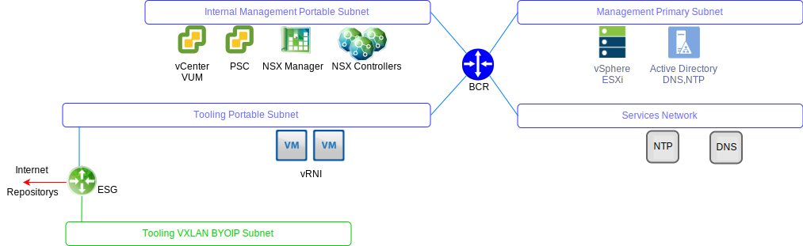
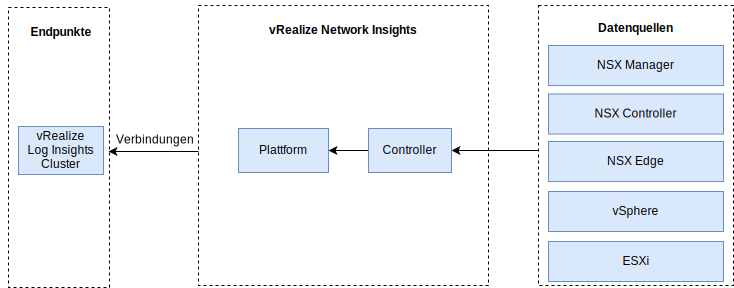

---

copyright:

  years:  2016, 2019

lastupdated: "2019-05-17"

---

# vRealize Network Insight
{: #opsmgmt-vrni}

Die vRealize Network Insight-Umgebung (vRNI) besteht aus zwei virtuellen Maschinen (VMs), einer Plattform (UI) und einem Controllerknoten. 

Die vRNI-Plattform-Appliance stellt die Analysen, die Benutzerschnittstelle und das Datenmanagement bereit und stellt eine Verbindung zur Controller-Appliance her, die Daten aus den verschiedenen Datenquellen wie NSX Edges, vCenter usw. erfasst. Alle vRNI-Komponenten nutzen private portierbare {{site.data.keyword.cloud}}-IP-Adressen. vRLI wird als Syslog-Server für vRNI konfiguriert. 

## Systemvoraussetzungen
{: #opsmgmt-vrni-requirements}

Diese Architektur unterstützt 3000 VMs mit einer mittleren Bausteingröße. 

Tabelle 1. Network Insight-Systemvoraussetzungen für die Plattform

| Attribut | Spezifikation |
|---|---|
| vCPU | 8 |
| Speicher | 32 GB |
| Platte (Thin Provisioning) | 1 TB |

Tabelle 2. Network Insight-Systemvoraussetzungen für Kollektoren

| Attribut | Spezifikation |
|---|---|
| vCPU | 4 |
| Speicher | 12 GB |
| Platte (Thin Provisioning) | 200 GB |

## Netzbetrieb
{: #opsmgmt-vrni-network}

Die Bereitstellung der vRNI-Appliance erfordert zwei IP-Adressen aus dem privaten portablen Tools-Teilnetz. Für die Netzkonnektivität erfordert vRNI Zugriff auf: 
* vCenter-Appliance
* vRealize Log Insight-Appliance
* NSX-V/T-Appliances
* Tools-Erweiterung VXLAN
* Kundennetze
* NTP-Server (time.services.softlayer.com)
* {{site.data.keyword.vmwaresolutions_short}} Active Directory/DNS

## Ports
{: #opsmgmt-vrni-ports}

Tabelle 3. Network Insight-Ports

| Beschreibung |Port | Protokoll |
|---|---|---|
| Kommunikation zwischen den VMs von vRealize Network Insight | 443 | HTTPS |
| Services, für die Internetzugriff erforderlich ist  svc.ni.vmware.com support2.ni.vmware.com reg.ni.vmware.com|443|HTTPS
| Log Insight-Aufnahme-API | 9000 | TCP |
| Log Insight-Aufnahme-API über SSL | 9543 | TCP |
| Benutzerschnittstelle | 80,443 | TCP |
| NTP |123 | UDP |
| SMTP | 25 | TCP |
| DNS| 53 | UDP |
| LDAP/LDAPS | 389, 636 | TCP |
| ESXi | 2055 | TCP |
| VMware vSphere / NSX | 443 | TCP |

## Authentifizierung
{: #opsmgmt-vrni-auth}

Die vRNI-Benutzerauthentifizierung ist direkt mit einem Active Directory-Server verbunden.

## Zugehörige Links
{: #opsmgmt-vrni-links}

* [Übersicht über vCenter Server on {{site.data.keyword.cloud_notm}} with Hybridity Bundle](/docs/services/vmwaresolutions/archiref/vcs?topic=vmware-solutions-vcs-hybridity-intro)
* [vRealize Network Insights](https://docs.vmware.com/en/VMware-vRealize-Network-Insight/index.html){:new_window}
