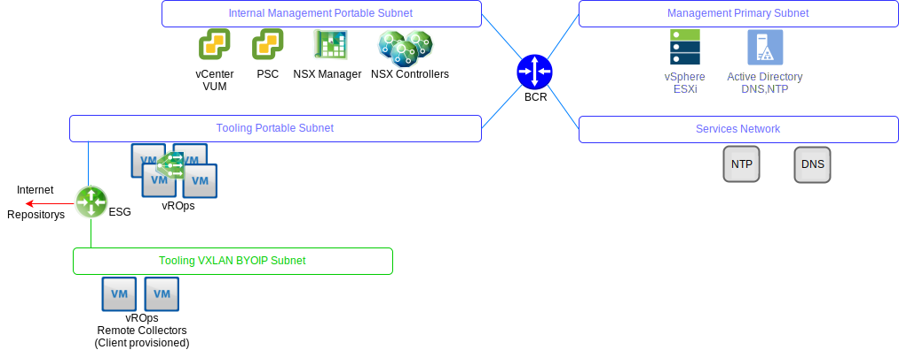
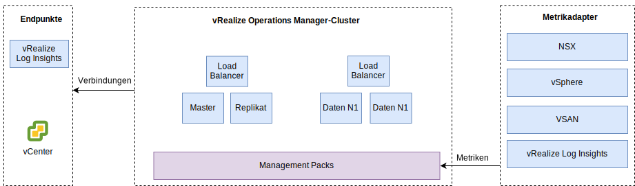

---

copyright:

  years:  2016, 2019

lastupdated: "2019-06-03"

---

# vRealize Operations Manager-Design
{: #opsmgmt-vrops}

Der vROps-Analysecluster enthält die Knoten, die Daten von den überwachten Komponenten analysieren und speichern. In dieser Bereitstellung gibt es vier Knoten und zwei NSX-Lastausgleichsfunktionen. Bei dieser Größe können Sie bis zu 30.000 VMs überwachen und 9.000.000 Metriken erfassen.

Der Analysecluster mit 4 Knoten besteht aus den folgenden Komponenten:
* Masterknoten – Der Masterknoten ist der Anfangsknoten in einem vROps-Cluster. In einer umfangreichen Umgebung verwaltet dieser Knoten alle anderen Knoten.
* Masterknotenreplikat – Dieser Knoten ermöglicht Hochverfügbarkeit auf dem Masterknoten.
* Datenknoten – Der Datenknoten ermöglicht einen Scale-out von vROps in größeren Umgebungen; in diesem Design werden zwei Datenknoten bereitgestellt.

Darüber hinaus verwendet das Design ferne Kollektorknoten, die als Proxy-Relay-Server fungieren, um nur Daten zu erfassen und an die Master-/Datenknoten weiterzuleiten. Datenknoten und ferne Kollektoren können hinzugefügt werden, um abhängig von der Umgebungsgröße einen Scale-up durchzuführen. Die Verteilung von vROps-Komponenten in VLANs/VXLANs wird im folgenden Diagramm dargestellt.

* Masterknoten, Masterknotenreplikat und Datenknoten werden im Tools-Teilnetz mithilfe von portierbaren {{site.data.keyword.cloud_notm}}-IP-Adressen bereitgestellt, um die Kommunikation mit allen Komponenten zu vereinfachen, die aus dem {{site.data.keyword.cloud_notm}}-RFC1918-Adressraum heraus adressiert werden, darunter vSphere-Hosts, vCenter, Platform Services Controller, NSX Manager und NSX Controller. Eine NSX-Lastausgleichsfunktion wird zusammen mit einem VIP für HA verwendet.
* Da Kundenworkloads die IP-Adressierung aus dem BYOIP-Adressraum verwenden, verwendet dieses Design ferne Kollektoren, die in einem VXLAN gehostet sind. Diese fernen Kollektoren werden nicht als Teil von {{site.data.keyword.vmwaresolutions_full}} Automation konfiguriert und müssen vom Kunden manuell implementiert werden.

Auf den vROps-Analysecluster wird über eine Managementbenutzerschnittstelle oder mithilfe einer API zugegriffen; er kann in folgende Komponenten integriert werden:
* vCenter
* vRealize Log Insight

Der Kunde kann eine manuelle Integration in die folgenden Produkte durchführen, wenn diese bereitgestellt wurden:
* vRealize Automation
* vRealize Business

vROps erfasst Daten von folgenden Produkten:
* vSphere - vCenter, Platform Services Controller, vSphere-Hosts
* NSX - NSX Manager, NSX Controller und NSX Edges
* vRLI

Der Kunde kann vROps manuell konfigurieren, um Daten von vRealize Automation und vRealize Business for Cloud zu erfassen.

## Systemvoraussetzungen
{: #opsmgmt-vrops-requirements}

Der Analysecluster besteht aus einem Masterknoten, einem Masterknotenreplikat und zwei Datenknoten, um Scale-out und Hochverfügbarkeit zu ermöglichen. Zusätzliche Datenknoten können zum Zweck eines Scale-ups hinzugefügt werden. Der Analysecluster kann auf bis zu acht Knoten mittlerer Größe skaliert werden.

Tabelle 1. Operations Manager-Systemeinstellungen für Master-/Replikatknoten

| Attribut | Spezifikation |
|---|---|
| vCPU | 8 |
| Speicher | 32 GB |
| Platte (Thick Provisioning) | 254 GB |

Tabelle 2. Operations Manager-Systemeinstellungen für Datenknoten

| Attribut | Spezifikation |
|---|---|
| vCPU | 8 |
| Speicher | 32 GB |
| Platte (Thick Provisioning) | 254 GB |

Wenn eine Überwachung der Compute-VMs erforderlich ist, muss der Client zwei ferne Kollektorknoten in einem VXLAN installieren. Die Größe einer standardmäßigen virtuellen Appliance für den fernen Kollektor beträgt 2 vCPUs mit 4 GB RAM und die Standardgröße des Appliance-VMDK ist ausreichend. Die fernen Kollektorknoten werden mit Thin Provisioning-Platten bereitgestellt, da ferne Kollektoren keine Analysen ausführen oder Daten speichern.

Tabelle 3. Operations Manager-Einstellungen für den Lastausgleich

| Einstellung | Lastausgleichsfunktion 1 | Lastausgleichsfunktion 2|
|---|---|---|
| Name | vrops-ui | vrops-data |
| Intervall | 30 | 5 |
| Zeitlimit | 5 | 15 |
| Max. Wiederholungen | 3 | |
| Typ | HTTPS | TCP |
| Methode | Get | -- |
| URL | /suite-api/api/deployment/node/status | -- |
| Empfang | ONLINE | -- |
| Algorithmus | ROUND-ROBIN | LEASTCONN |
| Pool | Vier Knoten von vROPs | Vier Knoten von vROPs |

Weitere Informationen finden Sie in [vRealize Automation-Lastausgleich (PDF)](https://docs.vmware.com/en/vRealize-Automation/7.5/vrealize-automation-load-balancing.pdf){:new_window}.

## Netzbetrieb
{: #opsmgmt-vrops-network}

Die Bereitstellung der vROps-Appliance erfordert sechs IP-Adressen aus dem privaten portierbaren Tools-Teilnetz. Für die Netzkonnektivität erfordert vROps Zugriff auf:
* vCenter-Appliance
* vRealize Log Insight-Appliance
* NSX-V/T-Appliances
* Tools-Erweiterung VXLAN
* Kundennetze
* NTP-Server (`time.services.softlayer.com`)
* {{site.data.keyword.vmwaresolutions_short}} Active Directory/DNS
* Für die fernen Kollektoren sind NAT-Regeln für das NSX ESG erforderlich, um die Konnektivität zum Masterknoten, zum Masterknotenreplikat und zu den Datenknoten zu ermöglichen. 

## Ports
{: #opsmgmt-vrops-ports}

Tabelle 4. Operation Manager-Ports

| Komponente | Protokoll | Port |
|---|---|---|
| vCenter | TCP | 443 |
| DNS | TCP/UDP | 53 |
| LDAP/LDAPS | TCP | 389/636 |
| LDAP GC | TCP | 3268/3269 |
| NTP | UDP | 123 |
| SMTP | TCP | 25 |
| SNMP | UDP | 161 |

### Authentifizierung
{: #opsmgmt-vrops-auth}

Das Benutzermanagement für vROps erfordert VMware Identity Manager (vIDM), der in Active Directory integriert werden kann. Servicekonten werden für die Kommunikation zwischen Anwendungen aus vRealize Operations Manager zu den folgenden Adaptern mit dem Mindestsatz an Berechtigungen verwendet, die für die Metrikerfassung und die Topologiezuordnung erforderlich sind:

* NSX Manager
* vCenter
* vSAN

## Management Packs
{: #opsmgmt-vrops-management}

Von Management Packs für vROps werden Operational Management-Funktionen der vROps-Plattform erweitert, sodass produktspezifische Alerts und Dashboards bereitgestellt werden.

Die folgenden Management Packs sind in vROps standardmäßig installiert:
* Management Pack for VMware vCenter Server
* Management Pack for vRealize Log Insight
* Management Pack for vSAN
* Management Pack for vRealize Automation
* Management Pack for vRealize Business for Cloud

Die folgenden Komponenten werden von {{site.data.keyword.vmwaresolutions_short}} installiert:
* VMware SDDC Health Management Pack
* Management Pack for NSX for vSphere
* vRealize Operations Federation Management Pack
* Management Pack for Hybrid Cloud Extension (HCX)

Weitere Management Packs können vom Kunden installiert werden. Weitere Informationen finden Sie unter [Management Packs im VMware Exchange](https://marketplace.vmware.com/vsx/?contentType=1&listingStyle=table){:new_window}.

### Management Pack for VMware vCenter Server
{: #opsmgmt-vrops-management-vCenter}

Dieses standardmäßig verfügbare Management Pack erweitert die Funktionalität von vROps auf vCenter, um die Erfassung von Objekten, Metriken und Alerts zu ermöglichen.

### Management Pack for vRealize Log Insight
{: #opsmgmt-vrops-management-vrli}

Dieses standardmäßig verfügbare Management Pack erweitert die Funktionalität von vROps auf vRLI, um die Überwachung der vRLI-Umgebung sowie die Integration von Ereignissen und Alerts aus vRLI in vROps zu ermöglichen.

### Management Pack for vSAN
{: #opsmgmt-vrops-management-vsan}

vRealize Operations Management Pack for vSAN aktiviert vSAN-spezifische Dashboards für die Auswertung, Verwaltung und Optimierung der Leistung von vSAN-Objekten und vSAN-aktivierten Objekten.

### VMware SDDC Health Management Pack
{: #opsmgmt-vrops-management-sddc}

Das VMware SDDC Health Management Pack for vROps überwacht den SDDC Management-Stack und stellt farbcodierte Metriken für Status und Effizienz verschiedener Komponenten bereit, die Teil des SDDC Management-Stacks sind. Über die Dashboards im VMware SDDC Health Management Pack können Sie die folgenden Komponenten der vCenter Server-Instanz und -Management-Tools überwachen:
* vRealize Operations Manager
* NSX for vSphere/VMware NSX-T
* VMware vSAN
* vRealize Log Insight
* vCenter Server

Darüber hinaus können auch die folgenden Komponenten überwacht werden, wenn der Kunde diese installiert hat:
* vRealize Automation
* vRealize Orchestrator
* vRealize Business for Cloud
* VMware Site Recovery Manager

Das VMware SDDC Health Management Pack stellt die folgenden Dashboards bereit:
* SDDC Management Health Overview Dashboard - Sie können das SDDC Management Health Overview Dashboard zum Anzeigen und Analysieren der anwendungsspezifischen Probleme in den SDDC-Komponenten verwenden.
* SDDC Health Historic Trend Dashboard - Das VMware SDDC Health Management Pack enthält das SDDC Health Historic Trend Dashboard, das die Statusentwicklung für die einzelnen Komponenten in dem SDDC-Stack anzeigt.
* SDDC vRealize Operations Manager Sizing Dashboard - Das SDDC vRealize Operations Manager Sizing Dashboard stellt vRealize Operations Manager Clusterkapazität zum Verarbeiten von Objekten und Metriken bereit.

Die Plug-ins im VMware SDDC Health Management Pack erfassen Metriken für Objekttypen, die in den Plug-ins enthalten sind. Das Management Pack erfasst Statusmetriken für folgende Komponenten:
* vCenter Server
* Management Pack for NSX for vSphere
* vRealize Automation
* vRealize Operations Manager
* vRealize Business
* vRealize Log Insight
* VMware Site Recovery Manager
* vCenter HA
* VMware vSAN Health
* Services in vCenter Server Appliance
* vRealize Operations Manager Sizing
* vRealize Orchestrator

### Management Pack for NSX-T
{: #opsmgmt-vrops-management-nsxt}

Das NSX-T Management Pack erweitert zentrale vROps-Analysen, Korrelation, Vorhersagekapazität und Visualisierungsfunktionen auf virtuelle Netze. Das Pack enthält Folgendes:
* Konfigurationssicherheit
* Status
* Leistung
* Kapazität
* Fehlerbehebung für NSX-T-Objekte

### Management Pack for NSX for vSphere
{: #opsmgmt-vrops-management-nsxv}

Das NSX for vSphere Management Pack bietet Operations Management-Abdeckung für Bereitstellungen der virtuellen NSX-Netztechnologien von VMware. Dieses Management Pack erweitert zentrale vROps-Analysen, Korrelation, Vorhersagekapazität und Visualisierungsfunktionen auf virtuelle Netze. Die Abdeckung umfasst Konfigurationssicherheit, Status, Leistung, Kapazität und Fehlerbehebung für logische NSX-Switches, logische Router, Edge-Services, verteilte Firewall und Lastausgleichsfunktionen.

Das NSX for vSphere Management Pack ist systemnah integriert in vROps und vSphere-Hostdaten sind mit den NSX-Services korreliert, die auf diesen Hosts ausgeführt werden. Mit der Protokollintegration via vRLI werden Fehler- und Ausfallbedingungen, die über Protokollnachrichten ausgelöst werden, als Alerts in den Objekt- und Problemfenstern des Management Packs angezeigt.

### vRealize Operations Federation Management Pack
{: #opsmgmt-vrops-management-federation}

vRealize Operations Federation Management Pack ermöglicht eine zentrale vROps-Bereitstellung an mehreren Standorten. Es ermöglicht eine Bereitstellung von vROps mit der Option, Schlüsselmetriken für bestimmte Objekte aus vROps-Bereitstellungen zu empfangen.

### Management Pack for Hybrid Cloud Extension (HCX)
{: #opsmgmt-vrops-management-hcx}

vRealize Operations Management Pack for HCX erweitert die Operations Management-Funktionen von vROps auf hybride Funktionen von HCX. Mit dem Management Pack können Sie Metriken, Änderungsereignisse und Informationen zur Ressourcentopologie aus HCX erfassen. Es ermöglicht die Überwachung, Isolation und Auflösung von Leistungsengpässen in den HCX-Verbindungen, Migrationen oder geschützten Workloads.

## Zugehörige Links
{: #opsmgmt-vrops-management-links}

* [Übersicht über vCenter Server on {{site.data.keyword.cloud_notm}} with Hybridity Bundle](/docs/services/vmwaresolutions/archiref/vcs?topic=vmware-solutions-vcs-hybridity-intro)
* [Dimensionierungsrichtlinien für vRealize Operations Manager 7.0](https://kb.vmware.com/s/article/57903){:new_window}
* [vRealize Operations Manager-Dokumentation](https://docs.vmware.com/en/vRealize-Operations-Manager/index.html){:new_window}
* [Management Pack for vSAN](https://marketplace.vmware.com/resources/vsx/product_files/31742/original/Management-Pack-for-vSAN-Guide6d2a8895b022a5f626a86e8e84b031b5.pdf){:new_window}
* [vSAN-Cluster aktualisieren](/docs/services/vmwaresolutions/archiref/vum?topic=vmware-solutions-vum-updating-vsan)
* [Handbuch zu Management Pack for vSAN](https://marketplace.vmware.com/resources/vsx/product_files/31742/original/Management-Pack-for-vSAN-Guide6d2a8895b022a5f626a86e8e84b031b5.pdf){:new_window}
* [Informationen zur vSAN-Statusprüfung](https://kb.vmware.com/s/article/2114803){:new_window}
* [Inbetriebnahme von VMware NSX](https://www.vmware.com/content/dam/digitalmarketing/vmware/en/pdf/products/nsx/vmware-operationalizing-nsx.pdf){:new_window}
* [NSX-Operationshandbuch](https://communities.vmware.com/servlet/JiveServlet/previewBody/30079-102-2-40474/NSX-Operations-Guide-v6.1.pdf){:new_window}
