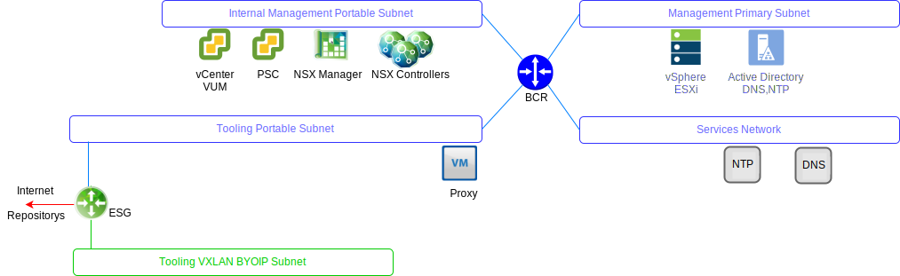

---

copyright:

  years:  2016, 2019

lastupdated: "2019-05-16"

---

# VMware Update Manager
{: #opsmgmt-vum}

VMware Update Manager (VUM) ermöglicht ein zentrales, automatisiertes Patch- und Versionsmanagement für VMware vSphere sowie die Ausführung der folgenden Tasks in Ihrer VMware vCenter Server on {{site.data.keyword.cloud}}-Umgebung: 
* Anwenden von Upgrades und Patches auf vSphere ESXi-Hosts
* Installieren und Aktualisieren von Software anderer Anbieter auf den Hosts
* Durchführen von Upgrades für VM-Hardware, VMware-Tools und virtuelle Appliances

Das Design von VMware Update Manager im Detail finden Sie unter [Einführung in VMware Update Manager](https://cloud.ibm.com/docs/services/vmwaresolutions/archiref/vum/vum-intro.html#vmware-update-manager-introduction){:new_window}.

## Zugehörige Links
{: #opsmgmt-vum-links}

* [Übersicht über vCenter Server on {{site.data.keyword.cloud_notm}} with Hybridity Bundle](/docs/services/vmwaresolutions/archiref/vcs?topic=vmware-solutions-vcs-hybridity-intro)
* [VMware Update Manager](https://docs.vmware.com/en/VMware-vSphere/6.5/com.vmware.vsphere.update_manager.doc/GUID-F7191592-048B-40C7-A610-CFEE6A790AB0.html){:new_window}
