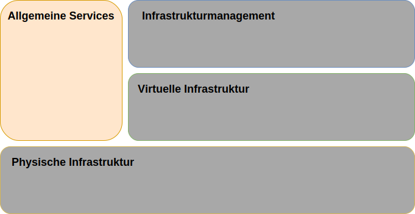
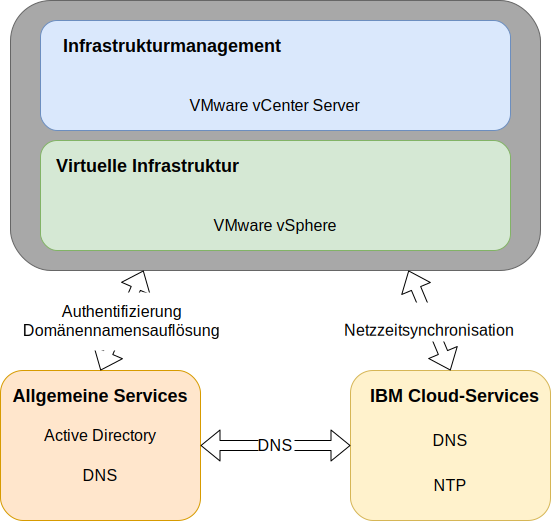

---

copyright:

  years:  2016, 2019

lastupdated: "2019-03-19"

subcollection: vmware-solutions

---

{:tip: .tip}
{:note: .note}
{:important: .important}

# Design der allgemeinen Services
{: #design_commonservice}

Allgemeine Services stellen die Services bereit, die von anderen Services auf der Cloud-Management-Plattform verwendet werden. Zu den allgemeinen Services der Lösung gehören Identitäts- und Zugriffsservices, Domänennamensservices, NTP-Services, SMTP-Services und Zertifizierungsstellenservices.

Abbildung 1. Allgemeine Services 

## Identitäts- und Zugriffsservices
{: #design_commonservice-identity-access}

In diesem Design wird Microsoft Active Directory (MSAD) für das Identitätsmanagement verwendet. In diesem Design werden eine oder zwei virtuelle Maschinen für Active Directory im Rahmen der vCenter Server-Bereitstellungsautomatisierung bereitgestellt. vCenter wird zur Verwendung der MSAD-Authentifizierung konfiguriert.

### Microsoft Active Directory
{: #design_commonservice-msad}

Standardmäßig wird eine einzelne Active Directory-VSI (VSI - Virtual Server Instance) auf der {{site.data.keyword.cloud}}-Infrastruktur bereitgestellt.

Das Design bietet darüber hinaus die Option, zwei hoch verfügbare MSAD-Server als dedizierte Windows Server-VMs im Management-Cluster bereitzustellen.

Wenn Sie die Option mit zwei hoch verfügbaren MSAD-Servern auswählen, sind Sie für die Bereitstellung der Microsoft-Lizenzierung und -Aktivierung verantwortlich.
{:note}

Active Directory dient nur zur Authentifizierung von Zugriffen für die Verwaltung der VMware-Instanz und nicht zur Speicherung von Benutzern der Workloads in bereitgestellten Instanzen. Der Gesamtstrukturrootname des Active Directory-Servers stimmt mit dem DNS-Domänennamen überein, den Sie angeben. Dieser Domänenname wird nur für die primäre vCenter Server-Instanz angegeben, wenn mehrere Instanzen verknüpft sind. Bei verknüpften Instanzen enthält jede Instanz einen Active Directory Server, der sich im Rootreplikatring der Gesamtstruktur befindet. Die DNS-Zonendateien werden ebenfalls auf die Active Directory Server repliziert.

### vSphere-SSO-Domäne
{: #design_commonservice-vsphere-sso}

Die SSO-Domäne (Single Sign On) für vSphere wird als erster Authentifizierungsmechanismus für eine einzelne Instanz oder mehrere verknüpfte Instanzen verwendet. Die SSO-Domäne dient außerdem dazu, eine VMware-Instanz oder mehrere verknüpfte Instanzen mit dem MSAD-Server zu verbinden. Die folgende SSO-Konfiguration wird angewendet:  
* Die SSO-Domäne von `vsphere.local` wird immer verwendet.
* Für VMware-Instanzen, die an eine vorhandene Instanz gebunden sind, wird der integrierte Platform Services Controller (PSC) mit der SSO-Domäne der vorhandenen Instanz verknüpft.
* Der SSO-Standortname stimmt mit dem Instanznamen überein.

## Domänennamensservices
{: #design_commonservice-dns}

DNS (Domänennamensservices) in diesem Design wird nur für das Cloud-Management und die Infrastrukturkomponenten verwendet.

### Primäre vCenter Server-Instanz
{: #design_commonservice-primary-vcs}

Die vCenter Server-Bereitstellung verwendet die bereitgestellten AD-VSIs als DNS-Server für die Instanz. Alle bereitgestellten Komponenten (vCenter mit integriertem PSC, NSX und ESXi-Hosts) werden so konfiguriert, dass sie auf den Active Directory-Server als DNS-Standardserver verweisen. Sie können die Konfiguration der DNS-Zone anpassen, sofern Ihre Konfiguration die Konfiguration der bereitgestellten Komponenten nicht beeinträchtigt.
- In diesem Design werden DNS-Services auf den AD-VSIs durch die folgende Konfiguration integriert:
- Die Domänenstruktur wird vom Benutzer angegeben. Der Domänenname kann eine beliebige Anzahl von Ebenen umfassen, bis zu dem Maximum, das alle vCenter Server-Komponenten verarbeiten können. So wird sichergestellt, dass die unterste Ebene die Unterdomäne für die Instanz ist.
    - Der von Ihnen angegebene DNS-Domänenname wird als Rootdomänenname der vCenter Server Active Directory-Gesamtstruktur verwendet. Wenn der DNS-Domänenname zum Beispiel "cloud.ibm.com" lautet, ist der Rootname der Active Directory-Gesamtstruktur "cloud.ibm.com". Die DNS-Domäne und die AD-Domäne sind für alle föderierten Instanzen von vCenter Server identisch.
    - Wählen Sie einen zusätzlichen Namen als Subdomäne der vCenter Server-Instanz aus. Dieser Unterdomänenname muss unter allen verknüpften vCenter Serverinstanzen eindeutig sein.
- Die DNS-Server für Active Directory werden so konfiguriert, dass sie für den DNS-Domänenbereich und den Unterdomänenbereich maßgeblich sind.
- Die DNS-Server für Active Directory werden so konfiguriert, dass sie auf die {{site.data.keyword.cloud_notm}}-DNS-Server für alle anderen Zonen verweisen.
- Alle sekundären Cloud-Regionen, die in die erste oder in die Ziel-Cloud-Region integriert sind, müssen dieselbe DNS-Namensstruktur über der Unterdomäne verwenden.
- Implementieren Sie optional redundante DNS-Server innerhalb des vCenter Server-Clusters. Zwei AD/DNS-Server sind nicht lizenziert konfiguriert. Es liegt in der Verantwortung des Benutzers, Lizenzen für die Windows-Betriebssysteme für diese Server bereitzustellen.
- Wenn für einen einzelnen Standort nur ein AD/DNS-Server bereitgestellt wird, dürfen alle konfigurierten vCenter Server-Komponenten NUR diese einzelne IP-Adresse als DNS-Eintrag haben.

### Sekundäre vCenter Server-Instanzen
{: #design_commonservice-secondary-vcs}

Für die instanzenübergreifende Redundanz: Wenn die erste sekundäre vCenter Server-Instanz einer vorhandenen primären vCenter Server-Instanz oder der aktuellen eigenständigen vCenter Server-Instanz hinzugefügt wird, wird die IP-Adresse der primären AD/DNS-Server-Instanz in der sekundären vCenter Server-Instanz und allen nachfolgenden sekundären vCenter Server-Instanzen verwendet - "sekundärer DNS"-Eintrag für alle Komponenten, die einen DNS-Servereintrag erfordern. Beispiel: ESXi, vCenter und NSX Manager. Dazu gehören Add-on-Komponenten, wie z. B. HCX, Zerto und Veeam. Der sekundäre DNS-Eintrag des primären Standortes wird dann zur AD/DNS-IP-Adresse der ersten sekundären vCenter Server-Instanz geändert.

## NTP-Services
{: #design_commonservice-ntp}

In diesem Design werden die NTP-Server der {{site.data.keyword.cloud_notm}}-Infrastruktur verwendet. Alle bereitgestellten Komponenten werden so konfiguriert, dass sie diese NTP-Server verwenden. Die Tatsache, dass alle Komponenten im Design denselben NTP-Server verwenden, ist für die korrekte Funktion von Zertifikaten und der Active Directory-Authentifizierung von kritischer Bedeutung.

Abbildung 2. NTP- und DNS-Services 

## Zertifizierungsstellenservices
{: #design_commonservice-cas}

VMware vSphere verwendet standardmäßig TLS-Zertifikate, die von der VMware-Zertifizierungsstelle (VMware Certificate Authority - VMCA) signiert werden, die sich auf der VMware Platform Services Controller-Appliance befindet.Diese Zertifikate werden von den Geräten oder Browsern der Endbenutzer nicht anerkannt. Es ist ein bewährtes Sicherheitsverfahren, die an Benutzer gerichteten Zertifikate durch Zertifikate zu ersetzen, die von einer Zertifizierungsstelle (CA) eines anderen Anbieters oder von einer Zertifizierungsstelle des Unternehmens signiert werden. Zertifikate für die Kommunikation zwischen Maschinen können als VMCA-signierte Zertifikate beibehalten werden. Allerdings wird empfohlen, die bewährten Verfahren der jeweiligen Organisation anzuwenden, die in der Regel die Verwendung einer identifizierten Unternehmenszertifizierungsstelle vorsehen.

Sie können die Windows-AD-Server in diesem Design verwenden, um Zertifikate zu erstellen, die von der lokalen Instanz signiert werden. Sie können bei Bedarf jedoch auch Zertifizierungsstellenservices (CA-Services) konfigurieren.

## Zugehörige Links
{: #design_commonservice-related}

* [Design der physischen Infrastruktur](/docs/services/vmwaresolutions/archiref/solution?topic=vmware-solutions-design_physicalinfrastructure)
* [Design der virtuellen Infrastruktur](/docs/services/vmwaresolutions/archiref/solution?topic=vmware-solutions-design_virtualinfrastructure)
* [Design des Infrastrukturmanagements](/docs/services/vmwaresolutions/archiref/solution?topic=vmware-solutions-design_infrastructuremgmt)
