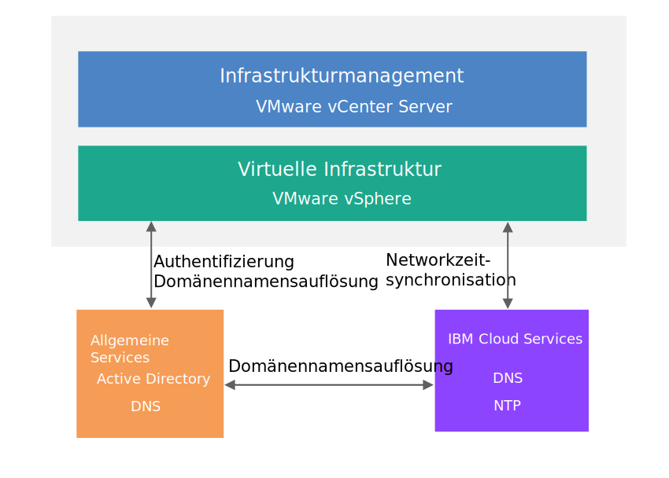

---

copyright:

  years:  2016, 2019

lastupdated: "2019-01-23"

---

{:tip: .tip}
{:note: .note}
{:important: .important}

# Design der allgemeinen Services

Allgemeine Services stellen die Services bereit, die von anderen Services auf der Cloud-Management-Plattform verwendet werden. Zu den allgemeinen Services der Lösung gehören Identitäts- und Zugriffsservices, Domänennamensservices, NTP-Services, SMTP-Services und Zertifizierungsstellenservices.

## Identitäts- und Zugriffsservices

In diesem Design wird Microsoft Active Directory (AD) für das Identitätsmanagement verwendet. In diesem Design werden eine oder zwei virtuelle Maschinen für Windows Active Directory im Rahmen der Cloud Foundation- und vCenter Server-Bereitstellungsautomatisierung bereitgestellt. vCenter wird zur Verwendung der AD-Authentifizierung konfiguriert.

### Microsoft Active Directory

Standardmäßig wird eine einzelne Active Directory-VSI (VSI - Virtual Server Instance) auf der {{site.data.keyword.cloud}}-Infrastruktur bereitgestellt. Das Design bietet darüber hinaus die Option, zwei hoch verfügbare Microsoft Active Directory-Server als dedizierte Windows Server-VMs im Management-Cluster bereitzustellen.

Wenn Sie diese Option wählen, sind Sie für die Microsoft-Lizenzierung und -Aktivierung verantwortlich.
{:note}

Active Directory dient nur zur Authentifizierung von Zugriffen für die Verwaltung der VMware-Instanz und nicht zur Speicherung von Benutzern der Workloads in bereitgestellten Instanzen. Der Gesamtstrukturrootname des Active Directory-Servers stimmt mit dem DNS-Domänennamen überein, den Sie angeben. Dieser Domänenname wird nur für die primäre Cloud Foundation- und vCenter Server-Instanz angegeben, wenn mehrere Instanzen verknüpft sind. Bei verknüpften Instanzen enthält jede Instanz einen Active Directory Server, der sich im Rootreplikatring der Gesamtstruktur befindet. Die DNS-Zonendateien werden ebenfalls auf die Active Directory Server repliziert.

### vSphere-SSO-Domäne

Die SSO-Domäne (Single Sign On) für vSphere wird als erster Authentifizierungsmechanismus für eine einzelne Instanz oder mehrere verknüpfte Instanzen verwendet. Die SSO-Domäne dient außerdem dazu, eine VMware-Instanz oder mehrere verknüpfte Instanzen mit dem Microsoft Active Directory-Server zu verbinden. Die folgende SSO-Konfiguration wird angewendet:  
* Die SSO-Domäne von `vsphere.local` wird immer verwendet.
* Für VMware-Instanzen, die an eine vorhandene Instanz gebunden sind, wird Platform Services Controller (PSC) mit der SSO-Domäne der vorhandenen Instanz verknüpft.
* Der SSO-Standortname stimmt mit dem Instanznamen überein.

## Domain Name Services (DNS)

DNS in diesem Design wird nur für das Cloud-Management und die Infrastrukturkomponenten verwendet.

### VMware vCenter Server

Die vCenter Server-Bereitstellung verwendet die bereitgestellten Active Directory-Server als DNS-Server für die Instanz. Alle bereitgestellten Komponenten (vCenter, PSC, NSX und ESXi-Hosts) werden so konfiguriert, dass sie auf den Active Directory-Server als DNS-Standardserver verweisen. Sie können die Konfiguration der DNS-Zone anpassen, sofern Ihre Konfiguration die Konfiguration der bereitgestellten Komponenten nicht beeinträchtigt.

In diesem Design werden DNS-Services auf den Active Directory-Servern durch die folgende Konfiguration integriert:
* Sie können die Domänenstruktur angeben. Der Domänenname kann eine beliebige Anzahl von Ebenen umfassen (bis zu dem Maximum, das die vCenter-Serverkomponenten verarbeiten können). Die unterste Ebene ist die Unterdomäne für die Instanz.
   * Der von Ihnen angegebene DNS-Domänenname wird als Rootdomänenname der Active Directory-Gesamtstruktur verwendet. Wenn der DNS-Domänenname zum Beispiel `cloud.ibm.com` lautet, ist der Rootdomänenname der Active Directory-Gesamtstruktur `cloud.ibm.com`. Dieser DNS- und Active Directory-Domänenname ist über alle verknüpften vCenter Server-Instanzen hinweg identisch.
   * Sie können zusätzlich einen Unterdomänennamen für die Instanz angeben. Der Unterdomänenname muss unter allen verknüpften vCenter-Serverinstanzen eindeutig sein.
* Die DNS-Server für Active Directory werden so konfiguriert, dass sie für die DNS-Domänenbereich und den Unterdomänenbereich maßgeblich sind.
* Die DNS-Server für Active Directory werden so konfiguriert, dass sie auf die {{site.data.keyword.cloud_notm}}-DNS-Server für alle anderen Zonen verweisen.
* Jede Instanz, die in eine vorhandene Zielinstanz integriert werden soll, muss denselben Domänennamen wie die primäre Instanz verwenden.

### VMware Cloud Foundation

Die Cloud Foundation-Bereitstellung arbeitet mit der VMware Cloud Foundation-Automatisierung, bei der ein eigener DNS-Server verwendet wird, der sich in der VM-Komponente für SDDC Manager befindet. Cloud Foundation-Komponenten, die von SDDC Manager verwaltet werden, wie vCenter, PSC, NSX und ESXi-Hosts, werden durch das Design zur Verwendung der IP-Adresse der SDDC Manager-VM als Standard-DNS konfiguriert.

Da SDDC Manager die Hostnamen für die zugehörigen verwalteten Komponenten generiert und pflegt, wird empfohlen, die zugehörige DNS-Zonendatei nicht direkt zum Hinzufügen und Entfernen von Hosts zu manipulieren.

In diesem Design werden DNS-Services auf den Active Directory-Servern mit der SDDC Manager-VM in der folgenden Konfiguration integriert:
* Sie können die Domänenstruktur angeben. Der Domänenname kann eine beliebige Anzahl von Ebenen umfassen (bis zu dem Maximum, das die Cloud Foundation-Komponenten verarbeiten können).
* Die unterste Ebene ist die Unterdomäne, für SDDC Manager maßgeblich ist.
* Der von Ihnen angegebene DNS-Domänenname wird als Rootdomänenname der Active Directory-Gesamtstruktur verwendet. Wenn der DNS-Domänenname zum Beispiel `cloud.ibm.com` lautet, ist der Rootname der Active Directory-Gesamtstruktur `cloud.ibm.com`. Diese DNS-Domäne und diese Active Directory-Domäne sind über alle verknüpften Cloud Foundation-Instanzen hinweg identisch.
* Sie können zusätzlich einen Unterdomänennamen für die Instanz angeben. Der Unterdomänenname muss unter allen verknüpften Cloud Foundation-Instanzen eindeutig sein.  
* Die DNS-Konfiguration für SDDC Manager wird so geändert, dass sie auf die Active Directory-Server für alle Zonen mit Ausnahme der Zone verweist, für die sie verantwortlich ist.
* Die DNS-Server für Active Directory werden so konfiguriert, dass sie für den DNS-Domänenbereich über der Unterdomäne für die SDDC Manager und die Cloud Foundation-Instanz maßgeblich sind.
* Die DNS-Server für Active Directory werden so konfiguriert, dass sie auf die IP-Adresse von SDDC Manager für die Unterdomänendelegierung der Zone verweisen, für die SDDC Manager maßgeblich ist.
* Die DNS-Server für Active Directory werden so konfiguriert, dass sie auf die {{site.data.keyword.cloud_notm}}-DNS-Server für alle anderen Zonen verweisen.
* Jede sekundäre Instanz, die in die erste oder Zielinstanz integriert werden soll, muss dieselbe DNS-Namensstruktur über der SDDC Manager-Unterdomäne verwenden.

## NTP-Services

In diesem Design werden die NTP-Server der {{site.data.keyword.cloud_notm}}-Infrastruktur verwendet. Alle bereitgestellten Komponenten werden so konfiguriert, dass sie diese NTP-Server verwenden. Die Tatsache, dass alle Komponenten im Design denselben NTP-Server verwenden, ist für die korrekte Funktion von Zertifikaten und der Active Directory-Authentifizierung von kritischer Bedeutung.

Abbildung 1. NTP-Services

## Zertifizierungsstellenservices

VMware vSphere verwendet standardmäßig TLS-Zertifikate, die von der VMware-Zertifizierungsstelle (VMware Certificate Authority - VMCA) signiert werden, die sich auf der VMware Platform Services Controller-Appliance befindet.Diese Zertifikate werden von den Geräten oder Browsern der Endbenutzer nicht anerkannt. Es ist ein bewährtes Sicherheitsverfahren, die an Benutzer gerichteten Zertifikate durch Zertifikate zu ersetzen, die von einer Zertifizierungsstelle (CA) eines anderen Anbieters oder von einer Zertifizierungsstelle des Unternehmens signiert werden. Zertifikate für die Kommunikation zwischen Maschinen können als VMCA-signierte Zertifikate beibehalten werden. Allerdings wird empfohlen, die bewährten Verfahren der jeweiligen Organisation anzuwenden, die in der Regel die Verwendung einer identifizierten Unternehmenszertifizierungsstelle vorsehen.

Sie können die Windows-AD-Server in diesem Design verwenden, um Zertifikate zu erstellen, die von der lokalen Instanz signiert werden. Sie können bei Bedarf jedoch auch Zertifizierungsstellenservices (CA-Services) konfigurieren.

### Zugehörige Links

* [Design der physischen Infrastruktur](/docs/services/vmwaresolutions/archiref/solution/design_physicalinfrastructure.html)
* [Design der virtuellen Infrastruktur](/docs/services/vmwaresolutions/archiref/solution/design_virtualinfrastructure.html)
* [Design des Infrastrukturmanagements](/docs/services/vmwaresolutions/archiref/solution/design_infrastructuremgmt.html)
