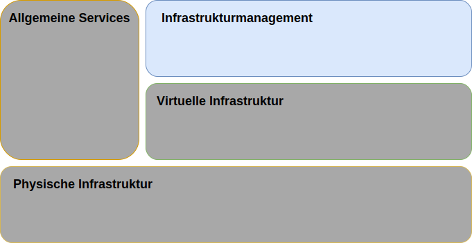

---

copyright:

  years:  2016, 2019

lastupdated: "2019-03-19"

subcollection: vmwaresolutions

---

{:tip: .tip}
{:note: .note}
{:important: .important}

# Design des Infrastrukturmanagements
{: #design_infrastructuremgmt}

Das Infrastrukturmanagement bezieht sich auf die Komponenten, die die VMware-Infrastruktur verwalten.
* Der vCenter Server mit integriertem Platform Services Controller (PSC) ist die zentrale Plattform für die Verwaltung von vSphere-Umgebungen und gehört zu den grundlegenden Komponenten dieser Lösung.
* Der PSC wird in dieser Lösung dazu verwendet, eine Reihe von Infrastrukturservices wie den VMware vCenter Single Sign On-Service, den Lizenzservice, den Suchservice und die VMware-Zertifizierungsstelle bereitzustellen.

Dieses Design verwendet eine PSC-Funktion, die in eine Instanz von vCenter Server integriert ist. Der PSC und der vCenter Server sind in derselben virtuellen Maschine (VM) enthalten.

Abbildung 1. Infrastrukturmanagement 

Dem PSC, der sich in der primären Instanz befindet, wird die SSO-Standarddomäne `vsphere.local` zugeordnet.

## vCenter Server-Design
{: #design_infrastructuremgmt-vcenter}

vCenter Server mit integriertem PSC wird in einem portierbaren Teilnetz im privaten VLAN installiert, das den Management-VMs zugeordnet ist. Das zugehörige Standardgateway wird auf die IP-Adresse eingestellt, die auf dem Back-End-Kundenrouter (BCR) für dieses bestimmte Teilnetz zugeordnet wurde. Die virtuelle Appliance wird mit den Spezifikationen in der folgenden Tabelle konfiguriert.

Tabelle 1. vCenter Server Appliance-Spezifikationen

| Attribut                    | Spezifikation                       |
|------------------------------|-------------------------------------|
| vCenter Server               | Virtual Appliance                   |
| Appliance-Installationsgröße  | Groß (bis zu 1.000 Hosts und 10.000 VMs) |
| Platform Services Controller | Integriert                            |
| Anzahl vCPUs              | 16                                   |
| Speicher                       | 32 GB                               |
| Festplattenspeicher                         | 990 GB auf lokalem Datenspeicher (große Plattenbereitstellung) |
| Plattentyp                    | Thin Provisioning-Platte                    |

### vCenter Server-Datenbank
{: #design_infrastructuremgmt-vcenter-db}

Die vCenter Server-Konfiguration arbeitet mit einer lokalen, eingebetteten PostgreSQL-Datenbank, die in die Appliance integriert ist. Die eingebettete Datenbank dient zur Beseitigung aller Abhängigkeiten von externen Datenbanken und Lizenzierungen.

### vCenter Server-Clusterspezifikation
{: #design_infrastructuremgmt-vcenter-cluster}

Mit diesem Design können Sie die vSphere ESXi-Hosts, die durch die Lösung zur Verfügung gestellt werden, in einem Cluster konfigurieren. Bevor jedoch Cluster erstellt werden können, wird ein Rechenzentrumsobjekt (RZ-Objekt) erstellt, das die Position der vSphere ESXi-Hosts sowie den Pod innerhalb des Rechenzentrums bezeichnet. Nach der Erstellung des RZ-Objekts wird ein Cluster erstellt. Der Cluster wird mit aktivierter VMware vSphere High Availability (HA) und aktiviertem VMware vSphere Distributed Resource Scheduler (DRS) bereitgestellt.

### vSphere Distributed Resource Scheduler
{: #design_infrastructuremgmt-vsphere-drs}

Dieses Design verwendet vSphere Distributed Resource Scheduling (DRS) im ersten Cluster, um VMs anzuordnen, und verwendet DRS in weiteren Clustern, um VMs zur Erzielung ausgeglichener Cluster dynamisch zu migrieren. Die Automatisierungsstufe ist auf vollständig automatisiert eingestellt, sodass die erste Anordnung und Migrationsempfehlungen von vSphere automatisch ausgeführt werden. Ferner wird der Migrationsschwellenwert auf moderat eingestellt, sodass vCenter Empfehlungen der Priorität 1, 2 und 3 anwendet, um wenigstens eine annehmbare Verbesserung in der Lastverteilung des Clusters zu erreichen.

Das Energiemanagement unter Verwendung der Komponente **Distributed Power Management** wird in diesem Design nicht verwendet.
{:note}

### vSphere-Hochverfügbarkeit
{: #design_infrastructuremgmt-vsphere-ha}

In diesem Design wird vSphere High Availability (HA) im ersten Cluster und in weiteren Clustern verwendet, um Verarbeitungsfehler zu erkennen und VMs wiederherzustellen, die in einem Cluster ausgeführt werden. Das vSphere HA-Feature in diesem Design wird mit den im Cluster aktivierten Optionen **Hostüberwachung** (Host Monitoring) und **Zugangssteuerung** (Admission Control) konfiguriert. Darüber hinaus reserviert der erste Cluster die Ressourcen eines Knotens als Ersatzkapazität für die Zugangssteuerungsrichtlinien.

Sie sind dafür verantwortlich, die Zugangssteuerungsrichtlinie anzupassen, wenn der Cluster später erweitert oder verkleinert wird.
{:note}

Die Option der VM-Neustartpriorität (**VM restart priority**) wird standardmäßig auf Mittel ("medium") gesetzt und die Option der Antwort für Hostisolation (**Host isolation response**) wird inaktiviert. Darüber hinaus wird die VM-Überwachung (**VM monitoring**) inaktiviert und die Funktion zum Austausch von Datenspeicherüberwachungssignalen (**Datastore Heartbeating**) wird so konfiguriert, dass alle Clusterdatenspeicher einbezogen werden. Dieses Konzept verwendet die NAS-Datenspeicher, wenn sie vorhanden sind.

## Enhanced vMotion Compatibility (EVC)
{: #design_infrastructuremgmt-evc}

Zur Vereinfachung der vMotion-Kompatibilität zwischen Clusterknoten mit potenziell unterschiedlichen CPU-Funktionen wird der erweiterte vMotion-Kompatibilitätsmodus (EVC) auf Skylake-Ebene aktiviert, um sicherzustellen, dass der vMotion-Kompatibilitätsmodus (EVC) auf Skylake-Ebene aktiviert ist, um die vMotion-Kompatibilität zwischen Clusterknoten zu gewährleisten, wenn neuere Prozessoren innerhalb des {{site.data.keyword.cloud_notm}}-Bestands verwendet werden und dazukommen und die spätere Clustererweiterung ermöglichen, wenn keine Skylake-Prozessorserver nicht im Bestand sind.

### IBM CloudDriver
{: #design_infrastructuremgmt-cloud-driver}

Die wichtige Voraussetzung für diese Lösungen ist die Automatisierung. Die Automatisierung reduziert die Komplexität der Bereitstellung, reduziert die Bereitstellungszeit deutlich und stellt sicher, dass die VMware-Instanz in konsistenter Weise bereitgestellt wird. 

IBM CloudBuilder ist eine kurzlebige virtuelle {{site.data.keyword.cloud_notm}}-Server-Instanz (VSI), die zum Erstellen einer neuen VMware-Instanz und zum Ausführen von Funktionen für das Lebenszyklusmanagement verwendet wird. Sie wird bereitgestellt, wenn eine allgemeine Verwaltung der vCenter Server-Instanz erforderlich ist, und wird wieder gelöscht, wenn dieser Prozess abgeschlossen ist.

IBM CloudDriver kann so konfiguriert werden, dass die Kommunikation mit der {{site.data.keyword.vmwaresolutions_short}}-Managementinfrastruktur über die öffentliche oder optional über eine private Netzverbindung über den {{site.data.keyword.cloud_notm}}-Objektspeicher als Nachrichtenwarteschlange erfolgt. BM CloudDriver ist eine von IBM entwickelte Komponente, auf die kein Benutzer zugreifen kann, und verfügt über die folgenden Attribute und Funktionen:

- Bereitstellung und Konfiguration der vCenter Server-Instanz im Benutzerkonto.
- Hinzufügen von Hosts zu den vCenter Server-Clustern und entfernen von Host aus den vCenter Server-Clustern.
- Hinzufügen von Clustern zu den vCenter Server-Instanzen und entfernen von Clustern aus den vCenter Server-Instanzen.
- Hinzufügen von Add-on-Services und Funktionen zu den vCenter Server-Instanzen oder entfernen von Add-on-Services und Funktionen aus den vCenter Server-Instanzen.

### Automatisierungsablauf
{: #design_infrastructuremgmt-auto-flow}

Im Folgenden wird die Reihenfolge der Ereignisse beschrieben, wenn Sie die {{site.data.keyword.vmwaresolutions_short}}-Konsole verwenden, um eine VMware-Instanz zu bestellen:
1. Bestellung von VLANs und Teilnetzen für den Netzbetrieb von {{site.data.keyword.cloud_notm}}.
2. Bestellung von {{site.data.keyword.cloud_notm}} {{site.data.keyword.baremetal_short}} mit installiertem vSphere Hypervisor.
3. Bestellung der Microsoft Windows-VSI als Active Directory-Domänencontroller.
4. Bereitstellung der CloudDriver-VSI.
5. Validierung der Vernetzung und der bereitgestellten Hardware.
6. Sofern zutreffend: Erstkonfiguration eines vSAN mit einzelnem Knoten.
7. Bereitstellung und Konfiguration von vCenter mit integriertem PSC und NSX.
8. Clustering der übrigen ESXi-Knoten, Erweiterung von vSAN, sofern zutreffend, und Konfiguration von NSX-Komponenten (VTEP).
9. Validierung der Installation und Konfiguration der Umgebung.
10. Bereitstellung optionaler Services, wie Sicherungsserver und -speicher.
11. Entfernung der CloudDriver-VSI.

## IDs und Kennwörter
{: #design_infrastructuremgmt-ids-pwd}

Die IC4V-Managementinfrastruktur speichert alle in der {{site.data.keyword.cloud_notm}}-Managementebene enthaltenen IDs und verschlüsselten Kennwörter des vCenter Servers. Alle Änderungen an diesen Kennwörtern durch den Benutzer können die Automatisierungsfunktionen in vCenter Server unterbrechen.

Sie können geänderte Kennwörter im IC4V-Lösungsportal bereitstellen, damit die Automatisierung die Funktionen ununterbrochen verarbeiten kann. Das Lösungsportal ermöglicht optional die Verifizierung der eingegebenen Passwörter. 

## Zugehörige Links
{: #design_infrastructuremgmt-related}

* [Design der physischen Infrastruktur](/docs/services/vmwaresolutions/archiref/solution?topic=vmware-solutions-design_physicalinfrastructure)
* [Design der virtuellen Infrastruktur](/docs/services/vmwaresolutions/archiref/solution?topic=vmware-solutions-design_virtualinfrastructure)
* [Design der allgemeinen Services](/docs/services/vmwaresolutions/archiref/solution?topic=vmware-solutions-design_commonservice)
