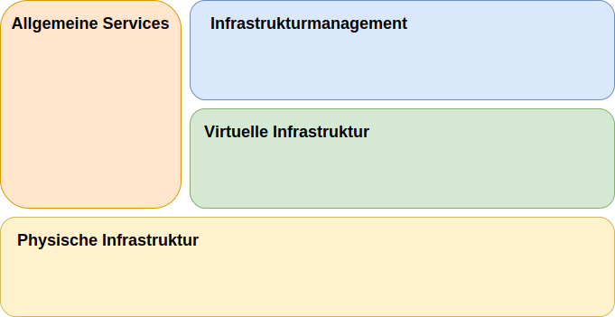

---

copyright:

  years:  2016, 2019

lastupdated: "2019-03-15"

subcollection: vmware-solutions

---
# Komponenten von IBM Cloud for VMware Solutions
{: #design_overview}

{{site.data.keyword.vmwaresolutions_full}} stellt eine Automatisierung zur weltweiten Bereitstellung von VMware-Technologiekomponenten in {{site.data.keyword.CloudDataCents_notm}} bereit.

Zu den Angeboten in diesem Lösungsportfolio gehören VMware vSphere-Produkte in einem automatisch bereitgestellten und konfigurierten Cluster: VMware vSphere ESXi, VMware vCenter Server Appliance mit integriertem Platform Services Controller (PSC), VMware NSX-V oder NSX-T und optional VMware vSAN.

Die Architektur besteht aus einer einzelnen Cloudregion und unterstützt die Erweiterung in weitere Cloudregionen, die sich in einem anderen geografischen Gebiet und in einem anderen {{site.data.keyword.cloud_notm}}-Pod innerhalb desselben Rechenzentrums befinden. Eine Region wird als eindeutige vCenter Serverinstanz definiert. Das Design ermöglicht außerdem eine automatisierte Erweiterung und Verkleinerung der virtuellen Kapazität in einer vCenter Server-Instanz.

Abbildung 1. Lösungskomponenten von {{site.data.keyword.vmwaresolutions_short}}

## Zugehörige Links
{: #design_overview-related}

* [Design der physischen Infrastruktur](/docs/services/vmwaresolutions/archiref/solution?topic=vmware-solutions-design_physicalinfrastructure)
* [Design der virtuellen Infrastruktur](/docs/services/vmwaresolutions/archiref/solution?topic=vmware-solutions-design_virtualinfrastructure)
* [Design der allgemeinen Services](/docs/services/vmwaresolutions/archiref/solution?topic=vmware-solutions-design_commonservice)
* [Design des Infrastrukturmanagements](/docs/services/vmwaresolutions/archiref/solution?topic=vmware-solutions-design_infrastructuremgmt)
