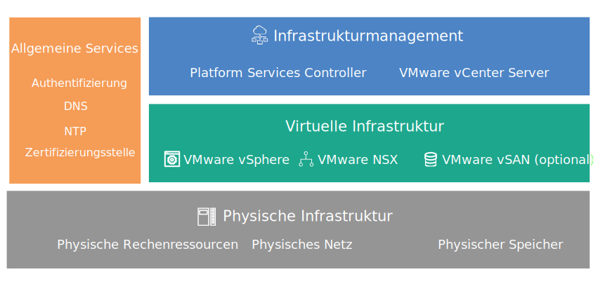

---

copyright:

  years:  2016, 2018

lastupdated: "2018-07-10"

---
# Übersicht über das Design

{{site.data.keyword.vmwaresolutions_full}} stellt eine Automatisierung zur weltweiten Bereitstellung von VMware-Technologiekomponenten in {{site.data.keyword.CloudDataCents_notm}} bereit.

## Lösungsangebote

Die Lösungsangebote beinhalten die folgenden VMware vSphere-Produkte in einem automatisch bereitgestellten und konfigurierten Cluster:
* VMware Cloud Foundation: vSphere ESXi, Platform Services Controller (PSC), VMware vCenter Server Appliance, SDDC Manager, VMware NSX und VMware vSAN.
* VMware vCenter Server: vSphere ESXi, Platform Services Controller (PSC), vCenter Server Appliance, NSX und optional vSAN.

In diesem Design wird bei der Erstbestellung eine Instanz in einem einzelnen Pod in einem {{site.data.keyword.CloudDataCent_notm}} (Rechenzentrum) bereitgestellt. Nach der Erstbereitstellung können Sie die virtuelle Umgebung auf weitere Pods im selben Rechenzentrum oder in anderen Rechenzentren erweitern.

Das Design ermöglicht außerdem eine automatisierte Erweiterung und Verkleinerung der virtuellen Kapazität in einer Cloud Foundation- oder vCenter Server-Instanz.

## VMware on IBM Cloud-Komponenten

Abbildung 1. Komponenten von VMware on {{site.data.keyword.cloud_notm}}

### Zugehörige Links

* [Design der physischen Infrastruktur](design_physicalinfrastructure.html)
* [Design der virtuellen Infrastruktur](design_virtualinfrastructure.html)
* [Design der allgemeinen Services](design_commonservice.html)
* [Design des Infrastrukturmanagements](design_infrastructuremgmt.html)
