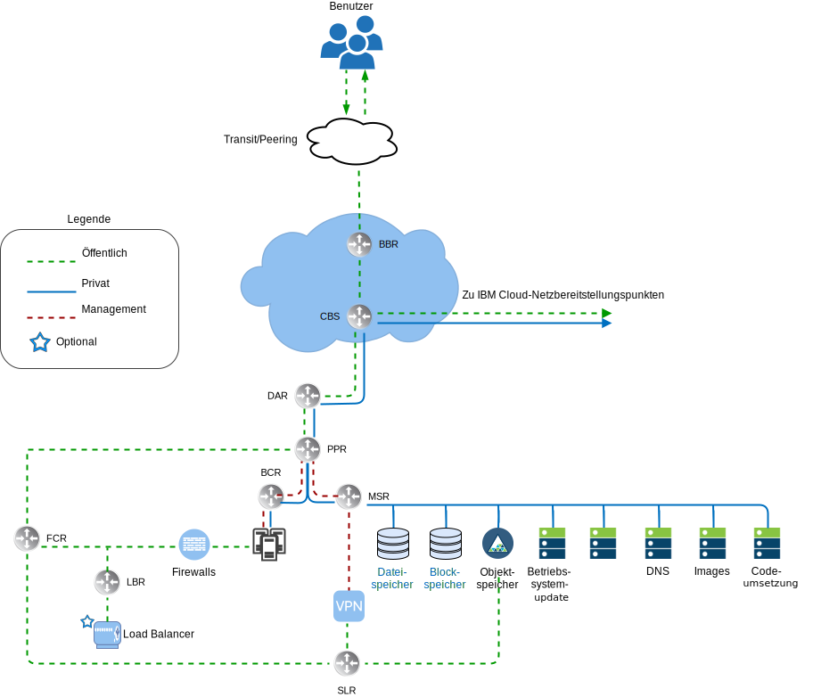
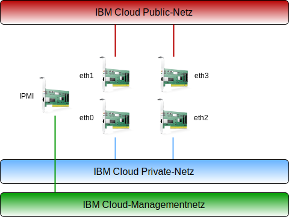
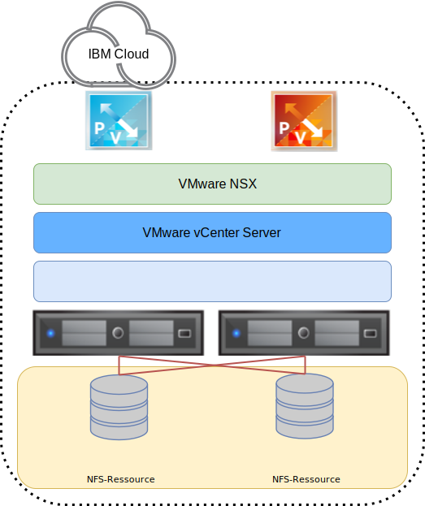

---

copyright:

  years:  2016, 2019

lastupdated: "2019-07-02"

subcollection: vmware-solutions

---

{:tip: .tip}
{:note: .note}
{:important: .important}

# Design der physischen Infrastruktur
{: #design_physicalinfrastructure}

Die physische Infrastruktur besteht aus den folgenden Komponenten:

<dl class="dl">
  <dt class="dt dlterm">Physische Rechenressourcen</dt>
  <dd class="dd">Die physischen Rechenressourcen stellen die physischen Verarbeitungs- und Arbeitsspeicherressourcen bereit, die von der Virtualisierungsinfrastruktur genutzt werden. Für dieses Design werden die Rechenkomponenten durch {{site.data.keyword.baremetal_long}} bereitgestellt und im [VMware Hardware Compatibility Guide (HCG)](https://www.vmware.com/resources/compatibility/search.php) aufgelistet.</dd>
  <dt class="dt dlterm">Physischer Speicher</dt>
  <dd class="dd">Der physische Speicher stellt die von der Virtualisierungsinfrastruktur genutzte Bruttospeicherkapazität bereit. Speicherkomponenten werden entweder durch {{site.data.keyword.baremetal_short}} oder durch ein gemeinsam genutztes NAS-Array (NAS - Network Attached Storage) mit NFS v3 bereitgestellt.</dd>
  <dt class="dt dlterm">Physisches Netz</dt>
  <dd class="dd">Das physische Netz stellt die Netzkonnektivität in die Umgebung bereit, die dann durch die Netzvirtualisierung genutzt wird. Das Netz wird durch das {{site.data.keyword.cloud_notm}}-Servicenetz bereitgestellt und es schließt weitere Services wie DNS und NTP ein.</dd>
</dl>

Weitere Informationen zu den physischen Komponenten finden Sie unter [vCenter Server-Teileliste](/docs/services/vmwaresolutions/vcenter?topic=vmware-solutions-vc_bom).

Weitere Informationen zum Speicher finden Sie im Dokument zur [Architektur des gemeinsam genutzten Speichers](/docs/services/vmwaresolutions/archiref/attached-storage?topic=vmware-solutions-storage-benefits#storage-benefits).

## Design der physischen Rechenressourcen
{: #design_physicalinfrastructure-host-design}

Die in der Lösung verfügbaren Serverkonfigurationen erfüllen oder überschreiten die Mindestanforderungen für die Installation, Konfiguration und Verwaltung von vSphere ESXi. Es stehen verschiedene Konfigurationen für unterschiedliche Anforderungen zur Verfügung. Eine detaillierte Liste der genauen Spezifikationen für die VMware on {{site.data.keyword.cloud_notm}}-Lösung finden Sie in der Teileliste für die [vCenter Server-Instanz](/docs/services/vmwaresolutions/vcenter?topic=vmware-solutions-vc_bom).

Die {{site.data.keyword.baremetal_short}} befindet sich in der {{site.data.keyword.cloud_notm}}.
{:note}

Jede vCenter Server-Instanz beginnt mit einer Bereitstellung mit drei oder vier Hosts, abhängig von der Wahl der Speicherlösung.

Der physische Host verwendet zwei lokal angeschlossene Platten, die dem vSphere ESXi-Hypervisor zugeordnet werden. Sie können weitere Platten unter Verwendung von vSAN, wie unter _Design des physischen Speichers_ beschrieben, oder unter Verwendung von NetApp ONTAP, wie im Dokument zur [NetApp ONTAP Select-Architektur](https://www.ibm.com/cloud/garage/files/IBM_Cloud_for_VMware_Solutions_NetApp_Architecture.pdf) beschrieben, zuordnen. Jeder
physische Host verfügt über redundante Netzverbindungen mit 10 Gb/s für den öffentlichen und den privaten Netzzugriff.

Der Bare-Metal-Server weist die folgenden Spezifikationen auf:
* CPU: Dual oder Quad Intel Xeon, variierende Kern- und Geschwindigkeitskonfiguration
* Hauptspeicher: Variierende Konfiguration, 64 GB oder größer
* Netz: 4 x 10 Gb/s
* Anzahl Laufwerke: 2 oder mehr

## Design des physischen Netzes
{: #design_physicalinfrastructure-net-design}

Der physische Netzbetrieb wird von {{site.data.keyword.cloud_notm}} gesteuert. Lesen Sie die folgenden Beschreibungen des physischen Netzes, das von den IBM Cloud- und physischen Hostverbindungen (VLANs, MTU) zur Verfügung gestellt wird, die den physischen Hosts zugeordnet sind.

### Netzübersicht für IBM Cloud
{: #design_physicalinfrastructure-ibm-cloud-network}

Das physische Netz von {{site.data.keyword.cloud_notm}} ist in zwei unterschiedliche Netze unterteilt: öffentlich und privat. Das private Netz enthält außerdem den Management-IPMI-Datenverkehr (IPMI - Intelligent Platform Management Interface) zu den physischen Servern.

#### Öffentliches Netz
{: #design_physicalinfrastructure-public-net}

{{site.data.keyword.CloudDataCents_notm}} und Netzbereitstellungspunkte haben mehrere Verbindungen mit 1 oder 10 Gb/s zu den Transit- und Peernetzbetreibern der höchsten Ebene. Netzverkehr aus beliebigen Teilen der Welt wird mit dem jeweils nächsten Netzbereitstellungspunkt verbunden und fließt direkt durch das Netz zu dem zugehörigen Rechenzentrum, sodass die Anzahl der Netzhops und Weitergaben zwischen Anbietern minimiert wird.

Im Rechenzentrum stellt {{site.data.keyword.cloud_notm}} eine Netzbandbreite von 1 oder 10 Gb/s für einzelne Server durch ein Paar aus separaten, auf Peerebene zusammengefassten Front-End-Kundenswitches (FCS - Front-end Customer Switch) bereit. Diese zusammengefassten Switches sind mit einem Paar aus separaten Routern, FCR - Front-end Customer Router, für L3-Netzbetrieb verbunden.

Dieses mehrschichtige Design bietet dem Netz die Möglichkeit, in einem {{site.data.keyword.CloudDataCent_notm}} rack-, reihen und podübergreifend zu skalieren.

#### Privates Netz
{: #design_physicalinfrastructure-private-net}

Alle {{site.data.keyword.CloudDataCents_notm}} und Bereitstellungspunkte (PoPs) werden durch den privaten Netzbackbone verbunden. Dieses private Netz ist vom öffentlichen Netz getrennt und ermöglicht Konnektivität zu Services in {{site.data.keyword.CloudDataCents_notm}} auf der ganzen Welt. Die Datenübertragung zwischen {{site.data.keyword.CloudDataCents_notm}} erfolgt über mehrere Verbindungen mit 10 oder 40 Gb/s, die zum privaten Netz bestehen.

Ähnlich wie das öffentliche Netz ist das private Netz dadurch mehrschichtig gestaltet, dass Server und andere Infrastrukturkomponenten mit zusammengefassten Back-end-Kundenswitches (BCS - Back-end Customer Switch) verbunden sind. Diese zusammengefassten Switches sind mit einem Paar aus separaten Back-end-Kundenroutern (BCR - Back-end Customer Router) für L3-Netzbetrieb verbunden. Das private Netz unterstützt zudem die Möglichkeit, für physische Hostverbindungen Jumbo-Frames (MTU 9000) zu verwenden.

#### Managementnetz
{: #design_physicalinfrastructure-mgmt-net}

Zusätzlich zu den öffentlichen und privaten Netzen ist jeder {{site.data.keyword.cloud_notm}}-Server für die Verwaltung mit dem privaten primären Netzteilnetz verbunden. Diese Verbindung ermöglicht IPMI-Zugriff auf den Server unabhängig von seiner CPU-, Firmware- und Betriebssystem-Verwaltung zu Wartungs- und Verwaltungszwecken.

#### Primäre und portierbare IP-Blöcke
{: #design_physicalinfrastructure-ip-blocks}

{{site.data.keyword.cloud_notm}} ordnet zwei Typen von IP-Adressen zur Verwendung in der {{site.data.keyword.cloud_notm}}-Infrastruktur zu:
* Primäre IP-Adressen werden Einheiten (Geräten), Bare Metal Servern und virtuellen Servern zugeordnet, die von {{site.data.keyword.cloud_notm}} bereitgestellt werden. Weisen Sie keine IP-Adressen in diesen Blöcken zu.
* Portierbare IP-Adressen werden zur Verfügung gestellt, die Sie nach Bedarf zuweisen und verwalten können. vCenter Server stellt mehrere portierbare IP-Bereiche zur Verfügung. Verwenden Sie nur die portierbaren IP-Adressbereiche, die bestimmten NSX-T- oder NSX-V-Komponenten zugeordnet und für die Verwendung durch den Kunden angegeben sind. Beispiel: **Customer EDGE**.

Primäre oder portierbare IP-Adressen können an ein beliebiges VLAN in Ihrem Konto weiterleitbar gemacht werden, wenn das Konto als VRF-Konto (VRF - **Virtual Routing and Forwarding**) konfiguriert wurde.

#### Virtual Routing and Forwarding
{: #design_physicalinfrastructure-vrf}

Das {{site.data.keyword.slportal}}-Konto muss als VRF-Konto (Virtual Routing and Forwarding) konfiguriert sein. Dadurch wird das automatische globale Routing zwischen Teilnetz-IP-Blöcken aktiviert. Alle Konten mit direkten Verbindungen (Direct-Link) müssen in VRF-Konten konvertiert oder als solche erstellt werden.

Da verschiedene Konnektivitätsoptionen zusammen mit den Netz-Routing-Optionen erfordern, dass sich das {{site.data.keyword.cloud_notm}}-Konto im VRF-Modus befindet, wird empfohlen, dass sich das Konto im VRF-Modus befindet, bevor Sie vCenter Server bereitstellen.

#### Physische Hostverbindungen
{: #design_physicalinfrastructure-host-connect}

Jeder physische Host in diesem Design verfügt über zwei redundante Paare von Ethernet-Verbindungen mit 10 Gb/s zu jedem (öffentlichen und privaten) {{site.data.keyword.cloud_notm}} Top of Rack-Switch (ToR-Switch). Die Adapter sind als einzelne Verbindungen (ohne Bonding) für Verbindungen mit insgesamt 4 x 10 Gb/s eingerichtet. Dies ermöglicht es NIC-Verbindungen (NIC - Networking Interface Card, Netzschnittstellenkarte), unabhängig voneinander zu arbeiten.

Das Entfernen der physischen Netzkonnektivität zum öffentlichen oder privaten Netz für die Bare-Metal-Server, die innerhalb des vCenter Server-Angebots verwendet werden, ist nicht möglich. Physische Anschlüsse an der internen NIC des Bare-Metal können deaktiviert werden. Die Kabel können jedoch nicht entfernt werden.

#### VLANs und Underlay-to-Overlay-Routing
{: #design_physicalinfrastructure-vlans}

Die Angebote von {{site.data.keyword.vmwaresolutions_short}} beinhalten 3 VLANs, d. h. ein öffentliches und zwei private, die bei der Bereitstellung zugewiesen werden. Wie in der vorherigen Abbildung zu sehen ist, werden das öffentliche VLAN den Verbindungen `eth1` und `eth3` und die privaten VLANs den Verbindungen `eth2` und `eth3` zugeordnet.

Das öffentliche VLAN und das erste private VLAN, das in diesem Design erstellt und zugeordnet wird, sind in {{site.data.keyword.cloud_notm}} standardmäßig nicht mit Tags versehen. Dann wird das weitere private VLAN durch einen Trunk mit den physischen Switch-Ports verbunden und mit Tags in den VMware-Portgruppen versehen, die diese Teilnetze nutzen.

Das private Netz besteht aus zwei VLANs in diesem Design. Drei Teilnetze werden dem ersten dieser VLANs (hier als VLAN "Privat A" bezeichnet) zugeordnet:
* Das erste Teilnetz ist ein primärer privater IP-Teilnetzbereich, den {{site.data.keyword.cloud_notm}} den physischen Hosts zuweist.
* Das zweite Teilnetz wird für virtuelle Maschinen für das Management wie vCenter Server Appliance und Platform Services Controller verwendet.
* Das dritte Teilnetz wird für die eingekapselten Overlay-Netz-Tunnelendpunkte (VTEPs) verwendet, die jedem Host über den NSX Manager zugeordnet sind.

Neben dem VLAN 'Privat A' ist ein zweites privates VLAN (hier als VLAN 'Privat B' bezeichnet) vorhanden, um VMware-Features wie vSAN vMotion und NFS<!--, and iSCSI--> zu unterstützen und die Konnektivität zum NAS-Speicher (NAS - Network Attached Storage) herzustellen. Das VLAN als solches ist in zwei, drei oder vier portierbare Teilnetze unterteilt:
* Das erste Teilnetz wird einer Kernelportgruppe für vMotion-Datenverkehr zugeordnet.
* Die übrigen Teilnetze werden für Speicherdatenverkehr verwendet:
   * Bei Verwendung von vSAN wird ein Teilnetz Kernelportgruppen zugeordnet, die für vSAN-Datenverkehr verwendet werden.
   * Bei Verwendung von NFS-angeschlossenen NAS wird ein Teilnetz einer Portgruppe zugeordnet, die für NFS-Datenverkehr dediziert ist.

Alle Teilnetze, die als Bestandteil einer automatisierten vCenter Server-Bereitstellung konfiguriert werden, verwenden verwaltete {{site.data.keyword.cloud_notm}}-Bereiche. Dadurch wird sichergestellt, dass eine beliebige IP-Adresse an jedes Rechenzentrum innerhalb des {{site.data.keyword.cloud_notm}}-Kontos geleitet werden kann, wenn Sie die Verbindung jetzt oder in Zukunft benötigen.

Die folgende Tabelle gibt Ihnen eine Zusammenfassung.

Tabelle 1. VLAN- und Teilnetzzusammenfassung

| VLAN | Typ | Beschreibung |
|:---- |:---- |:----------- |
| Öffentlich| Primär  | Physischen Hosts für öffentlichen Netzzugriff zugeordnet. Den Hosts wird zwar eine öffentliche IP-Adresse zugewiesen, diese IP-Adresse ist jedoch nicht für die Hosts konfiguriert, sodass sie nicht direkt im öffentlichen Netz zugänglich sind. Stattdessen soll das öffentliche VLAN den öffentlichen Internetzugang für andere Komponenten, wie zum Beispiel NSX Edge Services Gateways (ESGs), bereitstellen. |
| Privat A | Primär  | Einzelnes Teilnetz, das physischen Hosts zugeordnet ist, die von {{site.data.keyword.cloud_notm}} zugeordnet werden. Von der Managementschnittstelle für vSphere-Managementdatenverkehr verwendet. |
| Privat A | Portierbar | Einzelnes Teilnetz, das virtuellen Maschinen zugeordnet ist, die als Managementkomponenten fungieren |
| Privat A | Portierbar | Einzelnes Teilnetz, das NSX-V oder NSX-T VTEP zugeordnet ist |
| Privat B | Portierbar | Einzelnes Teilnetz, das für vSAN (sofern verwendet) zugeordnet ist |
| Privat B | Portierbar | Einzelnes Teilnetz, das für NAS (sofern verwendet) zugeordnet ist |
| Privat B | Portierbar | Einzelnes Teilnetz, das für vMotion zugeordnet ist |

In diesem Design werden alle VLAN-gestützten Hosts und virtuellen Maschinen so konfiguriert, dass sie auf den {{site.data.keyword.cloud_notm}}-Back-End-Kundenrouter (BCR - Back-end Customer Router) des “privaten Netzes” als Standardroute verweisen. Obwohl die vCenter Server-Instanzen die Verwendung von Software-Defined Networking (SDN) ermöglichen, sind Netzoverlays, die in einer VMware-Instanz erstellt werden und das Routing an interne Teilnetze einschließen, den verwalteten {{site.data.keyword.cloud_notm}}-Routern nicht bekannt.

Wenn Sie ein Routing zwischen Overlay und Underlay wünschen, müssen Sie eine IBM Firewall-Einheit für das entsprechende private Standard-VLAN bereitstellen, wenn die vCenter Server-Instanz bereitgestellt wird. Mit diesem Gerät können statische Routen und dynamisches Routingprotokoll-Peering mit den Overlay-Netzgeräten eingefügt werden, um das Routing zwischen der Underlay- und Overlay-Funktion zu ermöglichen.

Die privaten Netzverbindungen werden so konfiguriert, dass sie eine Jumbo-Frame-MTU-Größe von 9000 verwenden, um die Leistung für große Datenübertragungen wie für Speicher- und vMotion-Operationen zu verbessern. Dies ist der maximale MTU-Wert, der in VMware und von {{site.data.keyword.cloud_notm}} zugelassen wird. Die öffentlichen Netzverbindungen verwenden den Standardwert für Ethernet-MTU von 1500. Dieser Wert muss beibehalten werden, da Änderungen zu einer Paketfragmentierung bei der Übertragung über das Internet führen können.

## Design des physischen Speichers
{: #design_physicalinfrastructure-storage-design}

Das Design des physischen Speichers besteht aus der Konfiguration der physischen Platten, die in den physischen Hosts installiert sind, und der Konfiguration des gemeinsam genutzten Network-attached Storage (NAS). Dazu gehören das Betriebssystem (vSphere ESXi) und die Platten, die für die Speicherung der virtuellen Maschinen (VMs) verwendet werden. Speicher für virtuelle Platten kann aus lokalen Platten, die durch VMware vSAN virtualisiert werden, oder aus gemeinsam genutztem Speicher auf Dateiebene oder auf Blockebene bestehen.

### Betriebssystemplatten
{: #design_physicalinfrastructure-os-disks}

Der vSphere ESXi-Hypervisor wird an einer persistenten Position installiert. Daher bestehen die physischen Hosts aus zwei Platten in einer RAID-1-Konfiguration, um die Redundanz für den vSphere-ESXi-Hypervisor zu unterstützen.

### vSAN-Festplatten
{: #design_physicalinfrastructure-vsan-disks}

Dieses Design bietet die Option, entweder VMware vSAN-Speicher oder gemeinsam genutzten Network-attached Storage als primären Datenspeicher für virtuelle Maschinen zu verwenden. Für VMware vSAN wird die Konfiguration mit Hilfe einer Flash-Konfiguration durchgeführt. Dieses Design bietet mehrere Konfigurationsoptionen, einschließlich 2U- und 4U-Chassis, verschiedener Plattenanzahlen und verschiedener Plattengrößen. Alle Konfigurationen verwenden zwei vSAN-Plattengruppen, wobei eine SSD-Platte (Solid State Disk) für Cachefunktionen und eine oder mehrere SSDs für Kapazität verwendet werden. Alle für vSAN-Nutzung zugeordneten Laufwerke werden in einer RAID-0-Konfiguration mit einer einzelnen Platte konfiguriert.

Weitere Informationen zu den unterstützten Konfigurationen finden Sie unter [vCenter Server-Teileliste](/docs/services/vmwaresolutions/vcenter?topic=vmware-solutions-vc_bom).

### Hostübergreifend gemeinsam genutzter Speicher auf Dateiebene
{: #design_physicalinfrastructure-shared-storage}

Bei Verwendung von gemeinsam genutztem Speicher auf Dateiebene wird eine zwei Terabyte große, gemeinsam genutzte NFS-Ressource an die Hosts angehängt, die den ersten VMware-Cluster bilden. Diese gemeinsam genutzte Ressource, die als gemeinsam genutzte Managementressource bezeichnet wird, wird für das Management von Komponenten wie VMware vCenter Server, Platform Services Controller (PSC) und VMware NSX verwendet.

Der Speicher wird mithilfe des Protokolls NFS v3 zugeordnet und unterstützt 2 IOPS pro GB von IBM Cloud.

Sie können beim Kauf oder später weitere gemeinsam genutzte Dateiressourcen für alle Hosts für Ihre Workloads in der Konsole zuordnen und anhängen. Sie können unter den verfügbaren Kapazitätsoptionen für {{site.data.keyword.cloud_notm}} Endurance-Dateispeicher und den Leistungsstufen in dem entsprechenden {{site.data.keyword.CloudDataCent_notm}} auswählen. Alle gemeinsam genutzten Ressourcen werden unter Verwendung des Protokolls NFS v3 zugeordnet. Darüber hinaus ist es möglich, gemeinsam genutzte NFS v3-Dateiressourcen durch Anwenden des NetApp ONTAP Select-Angebots zuzuordnen.

Die Verfügbarkeit der 10 IOPS/GB hängt vom IBM Cloud Data Center ab. {{site.data.keyword.CloudDataCents_notm}}, die das Leistungstier mit 10 IOPS/GB anbieten, schließen auch eine vom Provider verwaltete Verschlüsselung ruhender Daten (AES-256-Verschlüsselung) ein und werden mithilfe von reinem Flashspeicher gesichert. Die Leistungsstufe von 10 IOPS/GB ist auf eine maximale Kapazität von 4 TB beschränkt. Weitere Informationen zu gemeinsam genutztem NAS-Speicher in dieser Lösung finden Sie im Dokument [Architektur des gemeinsam genutzten Speichers](/docs/services/vmwaresolutions/archiref/attached-storage?topic=vmware-solutions-storage-benefits#storage-benefits).

Weitere Informationen zu gemeinsam genutztem NAS-Speicher in dieser Lösung finden Sie im Dokument [Architektur des gemeinsam genutzten Speichers](/docs/services/vmwaresolutions/archiref/attached-storage?topic=vmware-solutions-storage-benefits#storage-benefits).

## Zugehörige Links
{: #design_physicalinfrastructure-related}

* [vCenter Server-Teileliste](/docs/services/vmwaresolutions/vcenter?topic=vmware-solutions-vc_bom)
* [Architektur des gemeinsam genutzten Speichers](/docs/services/vmwaresolutions/archiref/attached-storage?topic=vmware-solutions-storage-benefits#storage-benefits)
* [Architektur von NetApp ONTAP Select](https://www.ibm.com/cloud/garage/files/IBM_Cloud_for_VMware_Solutions_NetApp_Architecture.pdf)
