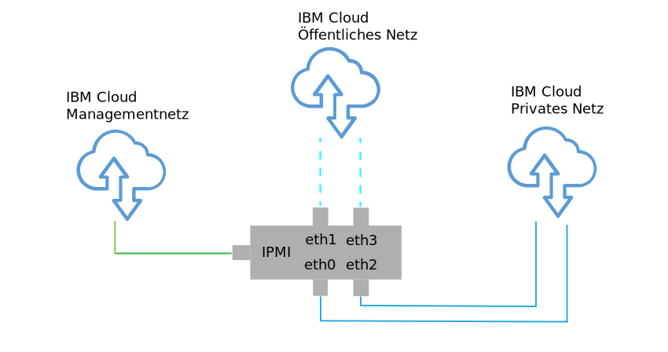
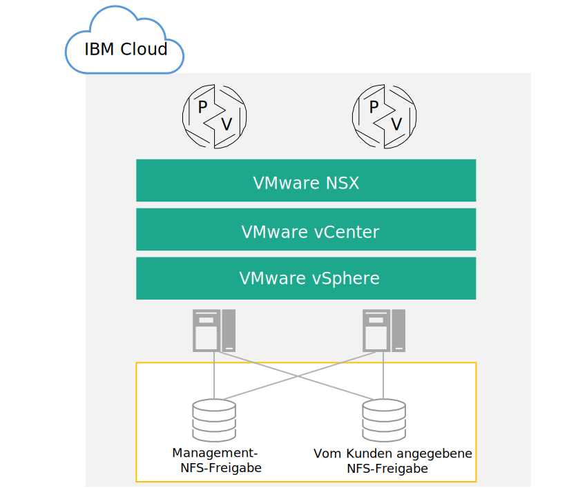

---

copyright:

  years:  2016, 2018

lastupdated: "2018-10-29"

---

{:tip: .tip}
{:note: .note}
{:important: .important}

# Design der physischen Infrastruktur

Die physische Infrastruktur setzt sich aus den folgenden Komponenten zusammen:

<dl class="dl">
  <dt class="dt dlterm">Physische Rechenressourcen</dt>
  <dd class="dd">Die physischen Rechenressourcen stellen die physischen Verarbeitungs- und Arbeitsspeicherressourcen bereit, die von der Virtualisierungsinfrastruktur genutzt werden. Für dieses Design werden die Rechenkomponenten durch {{site.data.keyword.baremetal_long}} bereitgestellt und im [VMware Hardware Compatibility Guide (HCG)](https://www.vmware.com/resources/compatibility/search.php) aufgelistet.</dd>
  <dt class="dt dlterm">Physischer Speicher</dt>
  <dd class="dd">Der physische Speicher stellt die von der Virtualisierungsinfrastruktur genutzte Bruttospeicherkapazität bereit. Speicherkomponenten werden entweder durch {{site.data.keyword.baremetal_short}} oder durch ein gemeinsam genutztes NAS-Array (Network Attached Storage) mit NFSv3 bereitgestellt.</dd>
  <dt class="dt dlterm">Physisches Netz</dt>
  <dd class="dd">Das physische Netz stellt die Netzkonnektivität in die Umgebung bereit, die dann durch die Netzvirtualisierung genutzt wird. Das Netz wird durch das {{site.data.keyword.cloud_notm}}-Servicenetz bereitgestellt und es schließt weitere Services wie DNS und NTP ein.</dd>
</dl>

Weitere Informationen zu den physischen Komponenten finden Sie in der Teileliste für die [Cloud Foundation-Instanz](../../sddc/sd_bom.html) bzw. [vCenter Server-Instanz](../../vcenter/vc_bom.html).

Weitere Informationen zum Speicher finden Sie im Dokument zur [Architektur des gemeinsam genutzten Speichers](https://www.ibm.com/cloud/garage/files/AttachedStorageSolutionArchitecture_v1.0.pdf).

## Physisches Host-Design

"Physischer Host" bezieht sich auf die {{site.data.keyword.baremetal_short}} in der Umgebung, in der Rechenressourcen bereitgestellt werden. Die in dieser Lösung eingesetzten {{site.data.keyword.baremetal_short}} sind von VMware zertifiziert und werden im [VMware Compatibility Guide (HCG)](http://www.vmware.com/resources/compatibility/search.php) aufgeführt.

Die in der Lösung verfügbaren Serverkonfigurationen erfüllen oder überschreiten die Mindestanforderungen für die Installation, Konfiguration und Verwaltung von vSphere ESXi. Es stehen verschiedene Konfigurationen für unterschiedliche Anforderungen zur Verfügung. Eine detaillierte Liste der genauen Spezifikationen für die VMware on {{site.data.keyword.cloud_notm}}-Lösung finden Sie in der Teileliste für die [Cloud Foundation-Instanz](../../sddc/sd_bom.html) bzw. [vCenter Server-Instanz](../../vcenter/vc_bom.html).

Die {{site.data.keyword.baremetal_short}} befindet sich in der {{site.data.keyword.cloud_notm}}.
{:note}

Je nach ausgewählter Speicherlösung beginnt jede Cloud Foundation-Instanz mit einer Bereitstellung von vier Hosts und jede vCenter Server-Instanz mit einer Bereitstellung von drei oder vier Hosts.

Der physische Host verwendet zwei lokal angeschlossene Platten, die dem vSphere ESXi-Hypervisor zugeordnet werden sollen. Sie können weitere Platten unter Verwendung von vSAN, wie unter _Design des physischen Speichers_ beschrieben, oder unter Verwendung von NetApp ONTAP, wie im Dokument zur [NetApp ONTAP Select-Architektur](https://www.ibm.com/cloud/garage/files/IBM_Cloud_for_VMware_Solutions_NetApp_Architecture.pdf) beschrieben, zuordnen. Jeder
physische Host verfügt über redundante Netzverbindungen mit 10 Gb/s für den öffentlichen und den privaten Netzzugriff.

Der Bare-Metal-Server weist die folgenden Spezifikationen auf:
* CPU: Dual Intel Xeon, variierende Kern- und Geschwindigkeitskonfiguration
* Hauptspeicher: Variierende Konfiguration, 128 GB oder größer
* Netz: 4 x 10 Gb/s
* Anzahl Laufwerke: 2 oder mehr

## Design des physischen Netzes

In diesem Abschnitt wird das physische Netz beschrieben, das von der {{site.data.keyword.cloud_notm}} und den physischen Hostverbindungen (VLANs, MTU) zur Verfügung gestellt wird, die den physischen Hosts zugeordnet sind.

Das physische Netz von {{site.data.keyword.cloud_notm}} ist in drei verschiedenartige Netze unterteilt: öffentliches Netz, privates Netz und Managementnetz. Eine Illustration der drei Netze und ihrer Funktionsweise finden Sie unter [{{site.data.keyword.cloud_notm}}-Netz](https://www.ibm.com/cloud-computing/bluemix/our-network).

### Öffentliches Netz

{{site.data.keyword.CloudDataCents_notm}} und Netzbereitstellungspunkte haben mehrere Verbindungen mit 1 oder 10 Gb/s zu den Transit- und Peernetzbetreibern der höchsten Ebene.

Externer Netzverkehr aus beliebigen Teilen der Welt wird mit dem jeweils nächsten Netzbereitstellungspunkt verbunden und fließt direkt durch das Netz zu dem zugehörigen Rechenzentrum, sodass die Anzahl der Netzhops und Weitergaben zwischen Anbietern minimiert wird.

Im Rechenzentrum stellt {{site.data.keyword.cloud_notm}} eine Netzbandbreite von 1 oder 10 Gb/s für einzelne Server durch ein Paar aus separaten, auf Peerebene zusammengefassten Front-End-Kundenswitches (FCS - Front-end Customer Switch) bereit. Diese zusammengefassten Switches sind mit einem Paar aus separaten Front-end-Kundenroutern (FCR - Front-end Customer Router) für L3-Netzbetrieb verbunden.

Dieses mehrschichtige Design bietet dem Netz die Möglichkeit, in einem {{site.data.keyword.CloudDataCent_notm}} rack-, reihen und podübergreifend zu skalieren.

### Privates Netz

Alle {{site.data.keyword.CloudDataCents_notm}} und Bereitstellungspunkte (PoPs)  werden durch einen privaten Netzbackbone verbunden. Das private Netz ist vom öffentlichen Netz getrennt und ermöglicht Konnektivität zu Services in {{site.data.keyword.CloudDataCents_notm}} auf der ganzen Welt. Die Datenübertragung zwischen {{site.data.keyword.CloudDataCents_notm}} erfolgt über mehrere Verbindungen mit 10 oder 40 Gb/s, die zum privaten Netz bestehen.

Ähnlich wie das öffentliche Netz ist das private Netz dadurch mehrschichtig gestaltet, dass Server und andere Infrastrukturkomponenten mit zusammengefassten Back-end-Kundenswitches (BCS - Back-end Customer Switch) verbunden sind. Diese zusammengefassten Switches sind mit einem Paar aus separaten Back-end-Kundenroutern (BCR - Back-end Customer Router) für L3-Netzbetrieb verbunden. Das private Netz unterstützt zudem die Möglichkeit, für physische Hostverbindungen Jumbo-Frames (MTU 9000) zu verwenden.

### Managementnetz

Neben dem öffentlichen und dem privaten Netz ist jeder {{site.data.keyword.cloud_notm}}-Server mit einem Out-of-band-Managementnetz verbunden. Dieses Managementnetz, das über VPN zugänglich ist, ermöglicht zu Wartungs- und Verwaltungszwecken einen IPMI-Zugriff (IPMI - Intelligent Platform Management Interface) auf den Server, der von der zugehörigen CPU, der Firmware und dem Betriebssystem (BS) unabhängig ist.

### Primäre und portierbare IP-Blöcke

{{site.data.keyword.cloud_notm}} ordnet zwei Typen von IP-Adressen zur Verwendung in der {{site.data.keyword.cloud_notm}}-Infrastruktur zu:
* Primäre IP-Adressen werden Einheiten (Geräten), Bare Metal Servern und virtuellen Servern zugeordnet, die von {{site.data.keyword.cloud_notm}} bereitgestellt werden. Weisen Sie keine IP-Adressen in diesen Blöcken zu.
* Portierbare IP-Adressen werden zur Verfügung gestellt, die Sie nach Bedarf zuweisen und verwalten können.

Primäre oder portierbare IP-Adressen können an ein beliebiges VLAN im Kundenkonto weiterleitbar gemacht werden, wenn das **VLAN Spanning** im {{site.data.keyword.slportal}} aktiviert ist oder wenn das Konto als **VRF-Konto** (VRF - Virtual Routing and Forwarding) konfiguriert ist.

### VLAN Spanning

**VLAN Spanning** ist eine {{site.data.keyword.slportal}}-Kontoeinstellung, durch die der IP-Block des primären und portierbaren Teilnetzes aller VLANs im Konto untereinander weitergeleitet werden kann. Wenn die Einstellung **VLAN Spanning** inaktiviert ist, können IP-Blöcke immer noch an {{site.data.keyword.cloud_notm}}-Services weiterleiten, jedoch nicht untereinander.

Für eine transparente Verbindung über verschiedene Teilnetze hinweg, in denen sich die Lösungskomponenten befinden, müssen Sie das **VLAN Spanning** in dem {{site.data.keyword.slportal}}-Konto aktivieren, in dem die Cloud Foundation- und die vCenter Server-Instanz bereitgestellt wurden.

### Virtual Routing and Forwarding (VRF)

Sie können das {{site.data.keyword.slportal}}-Konto auch als VRF-Konto konfigurieren, um ähnliche Funktionen wie das VLAN Spanning zur Verfügung zu stellen, sodass ein automatisches Routing zwischen IP-Teilnetzblöcken möglich wird. Alle Konten mit direkten Verbindungen (Direct-Link) müssen in VRF-Konten konvertiert oder als solche erstellt werden.

Die Konsole von {{site.data.keyword.vmwaresolutions_short}} kann nicht erkennen, ob VRF im {{site.data.keyword.slportal}} aktiviert ist. Sie empfangen eine Warnung, die Sie daran erinnert, sicherzustellen, dass entweder das **VLAN Spanning** oder VRF in Ihrem {{site.data.keyword.slportal}}-Konto aktiviert wird.

### Physische Hostverbindungen

Jeder physische Host im Design verfügt über zwei redundante Paare von Ethernet-Verbindungen mit 10 Gb/s zu jedem (öffentlichen und privaten) {{site.data.keyword.cloud_notm}} Top of Rack-Switch (ToR-Switch). Die Adapter sind als einzelne Verbindungen (ohne Bonding) für Verbindungen mit insgesamt 4 x 10 Gb/s eingerichtet. Dies ermöglicht es NIC-Verbindungen (NIC - Networking Interface Card, Netzschnittstellenkarte), unabhängig voneinander zu arbeiten.

Abbildung 1. Physische NIC-Hostverbindungen

### VLANs

Die Angebote von {{site.data.keyword.vmwaresolutions_short}} beinhalten 3 VLANs, d. h. ein öffentliches und zwei private, die bei der Bereitstellung zugewiesen werden. Wie in Abbildung 2 zu sehen, werden das öffentliche VLAN den Verbindungen 'eth1' und 'eth3' und die privaten VLANs den Verbindungen 'eth0' und 'eth2' zugeordnet.

Das öffentliche VLAN und das erste private VLAN, das in diesem Design erstellt und zugeordnet wird, sind in {{site.data.keyword.cloud_notm}} standardmäßig nicht mit Tags versehen. Das weitere private VLAN wird durch einen Trunk mit den physischen Switch-Ports verbunden und mit Tags in den VMware-Portgruppen versehen, die diese Teilnetze verwenden.

Das private Netz besteht aus zwei VLANs in diesem Design. Drei Teilnetze werden dem ersten dieser VLANs (hier als VLAN "Privat A" bezeichnet) zugeordnet:
* Das erste Teilnetz ist ein primärer privater IP-Teilnetzbereich, den {{site.data.keyword.cloud_notm}} den physischen Hosts zuweist.
* Das zweite Teilnetz wird für virtuelle Maschinen für das Management wie vCenter Server Appliance und Platform Services Controller verwendet.
* Das dritte Teilnetz wird für die VXLAN-Tunnelendpunkte (VTEPs) verwendet, die den einzelnen Hosts durch VMware NSX Manager zugeordnet werden.

Neben dem VLAN "Privat A" ist ein zweites privates VLAN (hier als VLAN "Privat B" bezeichnet) vorhanden, um VMware-Features wie vSAN und vMotion zu unterstützen und die Konnektivität zum NAS-Speicher (NAS – Network Attached Storage) herzustellen. Das VLAN als solches ist in zwei oder drei portierbare Teilnetze unterteilt.

* Das erste Teilnetz wird einer Kernelportgruppe für vMotion-Datenverkehr zugeordnet.
* Die übrigen Teilnetze werden für Speicherdatenverkehr verwendet:
   * Bei Verwendung von vSAN wird ein Teilnetz Kernelportgruppen zugeordnet, die für vSAN-Datenverkehr verwendet werden.
   * Bei Verwendung von NAS wird ein Teilnetz einer Portgruppe zugeordnet, die für NFS-Datenverkehr dediziert ist.

Alle Teilnetze, die als Bestandteil einer automatisierten vCenter Server- oder Cloud Foundation-Bereitstellung konfiguriert werden, verwenden verwaltete {{site.data.keyword.cloud_notm}}-Bereiche. Dadurch wird sichergestellt, dass eine beliebige IP-Adresse an jedes Rechenzentrum innerhalb des {{site.data.keyword.cloud_notm}}-Kontos geleitet werden kann, wenn Sie die Verbindung jetzt oder in Zukunft benötigen.

Dieser Sachverhalt wird in Tabelle 1 zusammengefasst.

Tabelle 1. VLAN- und Teilnetzzusammenfassung

| VLAN | Typ | Beschreibung |
|:---- |:---- |:----------- |
| Öffentlich| Primär  | Physischen Hosts für öffentlichen Netzzugriff zugeordnet. Bei der Erstbereitstellung nicht verwendet. |
| Privat A | Primär  | Einzelnes Teilnetz, das physischen Hosts zugeordnet ist, die von {{site.data.keyword.cloud_notm}} zugeordnet werden. Von der Managementschnittstelle für vSphere-Managementdatenverkehr verwendet. |
| Privat A | Portierbar | Einzelnes Teilnetz, das virtuellen Maschinen zugeordnet ist, die als Managementkomponenten fungieren |
| Privat A | Portierbar | Einzelnes Teilnetz, das NSX-VTEP zugeordnet ist |
| Privat B | Portierbar | Einzelnes Teilnetz, das für vSAN (sofern verwendet) zugeordnet ist |
| Privat B | Portierbar | Einzelnes Teilnetz, das für NAS (sofern verwendet) zugeordnet ist |
| Privat B | Portierbar | Einzelnes Teilnetz, das für vMotion zugeordnet ist |

In diesem Design werden alle VLAN-gestützten Hosts und virtuellen Maschinen so konfiguriert, dass sie auf den {{site.data.keyword.cloud_notm}}-Back-End-Kundenrouter des “privaten Netzes” als Standardroute verweisen. Obwohl die vCenter Server- und Cloud Foundation-Instanzen die Verwendung von Software-Defined Networking (SDN) ermöglichen, sind Netzoverlays, die in einer VMware-Instanz erstellt werden und das Routing an interne Teilnetze einschließen, den verwalteten {{site.data.keyword.cloud_notm}}-Routern nicht bekannt. Daher müssen Sie in der VMware-Instanz möglicherweise in einigen oder allen Managementkomponenten statische Routen erstellen.

Die privaten Netzverbindungen werden so konfiguriert, dass sie eine Jumbo-Frame-MTU-Größe von 9000 verwenden, um die Leistung für große Datenübertragungen wie für Speicher- und vMotion-Operationen zu verbessern. Dies ist der maximale MTU-Wert, der in VMware und von {{site.data.keyword.cloud_notm}} zugelassen wird. Die öffentlichen Netzverbindungen verwenden den Standardwert für Ethernet-MTU von 1500. Dieser Wert muss beibehalten werden, da Änderungen zu einer Paketfragmentierung bei der Übertragung über das Internet führen können.

## Design des physischen Speichers

Das Design des physischen Speichers besteht aus der Konfiguration der physischen Platten, die in den physischen Hosts installiert sind, und der Konfiguration des gemeinsam genutzten Speichers auf Dateiebene. Dazu gehören die Betriebssystemplatten des vSphere ESXi-Hypervisors und die Platten, die für Speicher der virtuellen Maschinen (VMs) verwendet werden. Speicher für virtuelle Platten kann aus lokalen Platten, die durch VMware vSAN virtualisiert werden, oder aus gemeinsam genutztem Speicher auf Dateiebene bestehen.

### Betriebssystemplatten

Der vSphere ESXi-Hypervisor ist zur Installation an einer persistenten Position gedacht. Infolgedessen enthalten die physischen Hosts zwei 1 TB große SATA-Platten in einer RAID-1-Konfiguration, um Redundanz für den vSphere ESXi-Hypervisor zu unterstützen.

### VM-Speicher

Dieses Design bietet die Option, entweder VMware vSAN-Speicher oder gemeinsam genutzten Speicher auf Dateiebene als primären Datenspeicher für VMs zu verwenden.

### vSAN-Festplatten

Für die Verwendung wird VMware vSAN mithilfe einer reinen Flashkonfiguration konfiguriert. Dieses Design bietet mehrere Konfigurationsoptionen, einschließlich 2U- und 4U-Chassis, verschiedener Plattenanzahlen und verschiedener Plattengrößen. Alle Konfigurationen verwenden zwei vSAN-Plattengruppen, wobei eine SSD-Platte (Solid State Disk) für Cachefunktionen und eine oder mehrere SSDs für Kapazität verwendet werden. Alle für vSAN-Nutzung zugeordneten Laufwerke werden in einer RAID-0-Konfiguration mit einer einzelnen Platte konfiguriert.

Weitere Informationen zu den unterstützten Konfigurationen finden Sie in der Teileliste für die [Cloud Foundation-Instanz](../../sddc/sd_bom.html) bzw. [vCenter Server-Instanz](../../vcenter/vc_bom.html).

### Hostübergreifend gemeinsam genutzter Speicher auf Dateiebene

Bei Verwendung von gemeinsam genutztem Speicher auf Dateiebene wird eine zwei Terabyte große, gemeinsam genutzte NFS-Ressource an die Hosts angehängt, die den ersten VMware-Cluster bilden. Diese gemeinsam genutzte Ressource, die als gemeinsam genutzte Managementressource bezeichnet wird, wird für das Management von Komponenten wie VMware vCenter Server, Platform Services Controller (PSC) und VMware NSX verwendet. Der Speicher wird mithilfe des Protokolls NFSv3 angehängt und er kann bis zu 4000 E/A-Operationen pro Sekunde (IOPS) unterstützen.

Abbildung 2. An die VMware-Bereitstellung angehängte, gemeinsam genutzte NFS-Ressourcen

Sie können beim Kauf oder später weitere gemeinsam genutzte Dateiressourcen für Ihre Workloads in der Konsole zuordnen und anhängen. Sie können unter den verfügbaren Kapazitätsoptionen für {{site.data.keyword.cloud_notm}} Endurance-Dateispeicher und den Leistungsstufen in dem entsprechenden {{site.data.keyword.CloudDataCent_notm}} auswählen. Alle gemeinsam genutzten Ressourcen werden unter Verwendung des Protokolls NFSv3 angehängt. Darüber hinaus ist es möglich, gemeinsam genutzte NFSv3-Dateiressourcen durch Anwenden des NetApp ONTAP Select-Angebots anzuhängen.

{{site.data.keyword.CloudDataCents_notm}}, die das Leistungstier mit 10 IOPS/GB anbieten, schließen auch eine vom Provider verwaltete Verschlüsselung ruhender Daten (AES-256-Verschlüsselung) ein und werden mithilfe von reinem Flashspeicher gesichert. Die Leistungsstufe von 10 IOPS/GB ist auf eine maximale Kapazität von 4 TB beschränkt. Weitere Informationen zu gemeinsam genutztem NAS-Speicher in dieser Lösung finden Sie im Dokument [Architektur des gemeinsam genutzten Speichers](https://www.ibm.com/cloud/garage/files/AttachedStorageSolutionArchitecture_v1.0.pdf).

### Zugehörige Links

* [Cloud Foundation-Teileliste](../../sddc/sd_bom.html)
* [vCenter Server-Teileliste](../../vcenter/vc_bom.html)
* [Architektur des gemeinsam genutzten Speichers](https://www.ibm.com/cloud/garage/files/AttachedStorageSolutionArchitecture_v1.0.pdf)
* [Architektur von NetApp ONTAP Select](https://www.ibm.com/cloud/garage/files/IBM_Cloud_for_VMware_Solutions_NetApp_Architecture.pdf)
