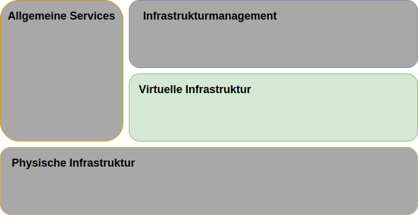
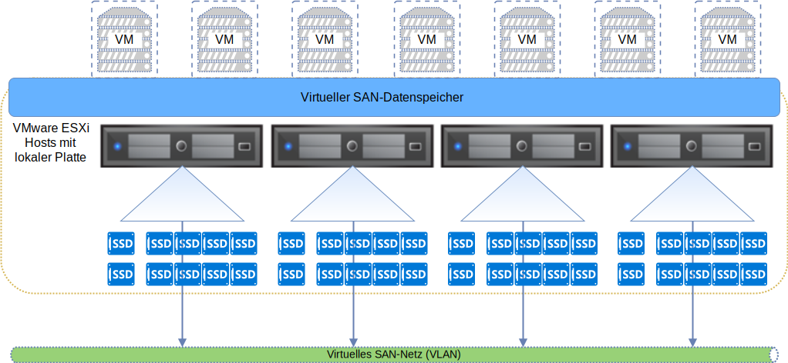
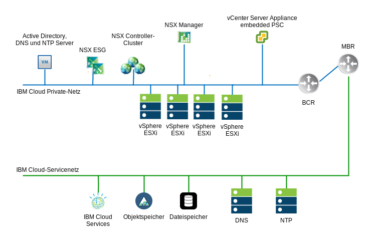
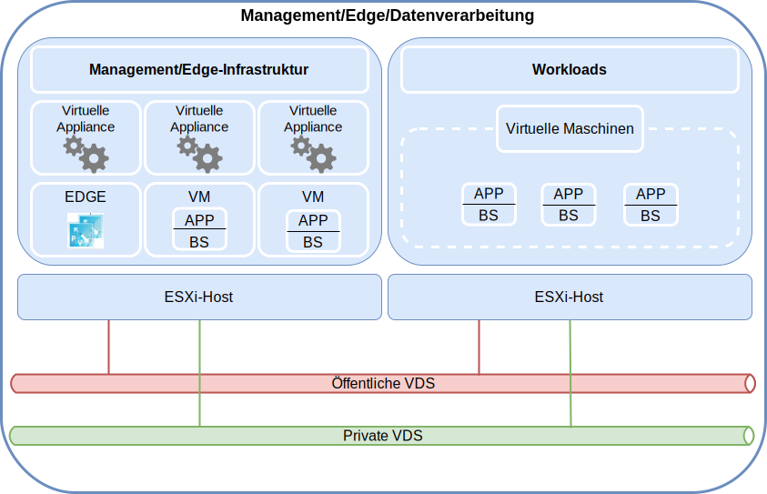

---

copyright:

  years:  2016, 2019

lastupdated: "2019-06-21"

subcollection: vmware-solutions

---

{:tip: .tip}
{:note: .note}
{:important: .important}

# Design der virtuellen Infrastruktur
{: #design_virtualinfrastructure}

Die Schicht der virtuellen Infrastruktur umfasst die VMware-Softwarekomponenten, mit denen die Rechen-, Speicher- und Netzressourcen virtualisiert werden, die in der Schicht der physischen Infrastruktur bereitgestellt werden: VMware vSphere ESXi, VMware NSX-V oder NSX-T und optional VMware vSAN.

## VMware vSphere-Design
{: #design_virtualinfrastructure-vsphere-design}

Die vSphere ESXi-Konfiguration umfasst die folgenden Aspekte:
* Bootkonfiguration
* Zeitsynchronisation
* Hostzugriff
* Benutzerzugriff
* DNS-Konfiguration

In der folgenden Tabelle sind die Spezifikationen für die einzelnen Aspekte aufgeführt. Wenn ESXi konfiguriert und installiert wurde, wird der Host einem VMware vCenter Server hinzugefügt und von dort aus verwaltet.

Mit diesem Design können Sie über Direct Console User Interface (DCUI) und vSphere Web Client auf die virtuellen Hosts zugreifen. Als bewährtes Verfahren werden Secure Shell (SSH) und ESXi Shell nach der Bereitstellung inaktiviert.

Die einzigen Benutzer, die sich standardmäßig direkt anmelden können, sind die Benutzer _root_ und _ibmvmadmin_ für die physische Maschine des Hosts. Der Administrator kann Benutzer aus der Microsoft Active Directory-Domäne (MSAD) hinzufügen, um den Benutzerzugriff auf den Host zu ermöglichen. Alle Hosts im Design der vCenter Server-Lösung werden zur Synchronisation mit einem zentralen NTP-Server konfiguriert.

Tabelle 1. vSphere ESXi-Konfiguration

| Attribut              | Konfigurationsparameter |
|:---------------------- |:----------------------- |
| ESXi-Bootposition     | Verwendet lokale Platten, die in RAID-1 konfiguriert sind. |
| Zeitsynchronisation   | Verwendet {{site.data.keyword.cloud}}-NTP-Server. |
| Hostzugriff            | Unterstützt DCUI. SSH und ESXi Shell werden unterstützt, aber nicht standardmäßig aktiviert. |
| Benutzerzugriff            | Lokale Authentifizierung und MSAD. |
| Auflösung von Domänennamen | Verwendet DNS wie in [Design der allgemeinen Services](/docs/services/vmwaresolutions/archiref/solution?topic=vmware-solutions-design_commonservice) beschrieben. |
| EVC-Modus | Skylake (nur für "Greenfield" vSphere 6.7-Bereitstellungen) |

Der vSphere-Cluster enthält die virtuellen Maschinen (VMs), die die vCenter Server-Instanz und die Rechenressourcen für Benutzerworkloads verwalten.

* Wenn eine vCenter Server-Instanz nur vSAN verwendet, ist die Mindestanzahl von ESXi-Hosts bei der ersten Bereitstellung 4.
* Wenn eine vCenter Server-Instanz den gemeinsam genutzten Speicher auf Dateiebene oder Blockebene verwendet, beträgt die Mindestanzahl von ESXi-Hosts bei der ersten Bereitstellung 3.

Sie können während oder nach der ersten Bereitstellung auf maximal 59 ESXi-Hosts skalieren.

Zur Unterstützung weiterer Benutzerworkloads kann die Umgebung wie folgt skaliert werden:  
* Bereitstellen weiterer Rechenhosts in vorhandenen Clustern
* Bereitstellen weiterer Cluster, die von derselben vCenter Server Appliance verwaltet werden
* Bereitstellen neuer vCenter Server-Instanzen mit eigener vCenter Server Appliance

Weitere Informationen zu Clustern finden Sie im Dokument zur [Architektur der VMware-Clusterlösung in {{site.data.keyword.cloud_notm}}](https://www.ibm.com/cloud/garage/files/IBM-Cloud-for-VMware-Solutions-Multicluster-Architecture.pdf).

## VMware vSAN-Design
{: #design_virtualinfrastructure-vsan-design}

In diesem Design wird VMware vSAN-Speicher in vCenter Server-Instanzen verwendet, um gemeinsam genutzten Speicher für die vSphere-Hosts bereitzustellen.

Wie in der folgenden Abbildung zu sehen ist, fasst vSAN den lokalen Speicher über mehrere ESXi-Hosts in einem vSphere-Cluster hinweg zusammen und verwaltet den zusammengefassten Speicher wie einen einzelnen VM-Datenspeicher. In diesem Design enthalten die Rechenknoten lokale Plattenlaufwerke für das ESXi-Betriebssystem und den vSAN-Datenspeicher. Unabhängig davon, zu welchem Cluster ein Knoten gehört, werden in jeden Knoten zwei Betriebssystemlaufwerke eingeschlossen, um die ESXi-Installation aufzunehmen.

vSAN arbeitet mit den folgenden Komponenten:
* vSAN-Design mit zwei Plattengruppen; jede Plattengruppe besteht aus zwei oder mehr Platten. Eine SSD (Solid State Disk) oder ein NVMe-Laufwerk der kleinsten Größe in der Gruppe dient als Cacheschicht, während die übrigen SSDs als Kapazitätsschicht verwendet werden.
* Der Onboard-RAID-Controller wird für jedes Laufwerk außer den beiden Betriebssystemlaufwerken (BS-Laufwerken) in einem RAID-0-Array konfiguriert.
* Aus allen Speicherressourcen wird ein einzelner vSAN-Datenspeicher erstellt.

Die verfügbaren vSAN-Features hängen von der Lizenzedition ab, die Sie bei der Bestellung der Instanz auswählen. Weitere Informationen finden Sie unter [Vergleich der VMware vSAN-Editionen](/docs/services/vmwaresolutions/archiref/solution?topic=vmware-solutions-solution-appendix#vmware-vsan-edition-comparison).

### Einrichtung des virtuellen Netzes für vSAN
{: #design_virtualinfrastructure-net-setup}

Bei diesem Design fließt der vSAN-Datenverkehr zwischen ESXi-Hosts über ein dediziertes privates VLAN. Die beiden Netzadapter, die mit dem Switch des privaten Netzes verbunden sind, werden in vSphere als vSphere Distributed Switch (vDS) mit beiden Netzadaptern als Uplinks konfiguriert. Eine dedizierte vSAN-Kernelportgruppe, die für das vSAN-VLAN konfiguriert ist, befindet sich in dem vDS. Jumbo-Frames (MTU 9000) werden für den privaten vDS aktiviert.

vSAN führt keinen Lastausgleich für den Datenverkehr zwischen Uplinks aus. Daher ist ein Adapter aktiv, während der andere im Standby-Modus ist, um hohe Verfügbarkeit (HA) zu unterstützen. Die Netzrichtlinie für die Funktionsübernahme (Failover) für vSAN ist als explizites Failover (**Explicit Failover**) zwischen physischen Netzports konfiguriert.

Weitere Informationen zu physischen NIC-Verbindungen finden Sie im Abschnitt [Physische NIC-Hostverbindungen](/docs/services/vmwaresolutions/services?topic=vmware-solutions-design_physicalinfrastructure#design_physicalinfrastructure-host-connect).

### Design der vSAN-Richtlinie
{: #design_virtualinfrastructure-storage-policy}

Wenn vSAN aktiviert und konfiguriert ist, werden Speicherrichtlinien konfiguriert, um die VM-Speichermerkmale zu definieren. Speichermerkmale geben die verschiedenen Service-Level für verschiedene VMs an.

Die Standardspeicherrichtlinie in diesem Design toleriert ein einzelnes Feature. Die Standardrichtlinie wird mit einer Löschcodierung konfiguriert, wobei für die Option **Fehlertoleranzmethode** die Einstellung **RAID-5/6 (Erasure Coding) - Capacity** und **Primary level of failures** auf 1 festgelegt wird. Die RAID 5-Konfiguration erfordert mindestens vier Hosts.

Alternativ können Sie die RAID 6-Konfiguration auswählen und für die Option **Failure tolerance method** die Einstellung **RAID-5/6 (Erasure Coding) - Capacity** und **Primary level of failures** auf 2 festlegen. Die RAID 6-Konfiguration erfordert mindestens sechs Hosts. Die Optionen **Duplication** (Duplizierung) und **compression** (Komprimierung) sind in der Standardspeicherrichtlinie ebenfalls aktiviert.

Eine Instanz verwendet die Standardrichtlinie, sofern nichts anderes über die vSphere-Konsole angegeben wird. Wenn eine angepasste Richtlinie konfiguriert wird, garantiert vSAN diese, sofern dies möglich ist. Wenn die Richtlinie jedoch nicht garantiert werden kann, ist es nicht möglich, eine VM bereitzustellen, die die Richtlinie verwendet, sofern sie nicht zur erzwungenen Bereitstellung eingerichtet ist.

Speicherrichtlinien müssen nach dem Hinzufügen neuer ESXi-Hosts oder nach der Aktualisierung der ESXi-Hosts erneut angewendet werden.

### vSAN-Einstellungen
{: #design_virtualinfrastructure-vsan-sett}

vSAN-Einstellungen werden nach bewährten Verfahren für die Bereitstellung von VMware-Lösungen in {{site.data.keyword.cloud_notm}} konfiguriert. Zu den VSAN-Einstellungen gehören SIOC-Einstellungen, Einstellungen für die Portgruppe für explizites Failover und Plattencacheeinstellungen.
* SSD-Cacherichtlinieneinstellungen: Kein **Read Ahead** (Vorauslesen), **Write Through**, **Direct** (NRWTD)
* Einstellungen der E/A-Netzsteuerung
   * Management - 20 gemeinsam genutzte Ressourcen
   * Virtuelle Maschine - 30 gemeinsam genutzte Ressourcen
   * vMotion - 50 gemeinsam genutzte Ressourcen
   * vSAN - 100 gemeinsam genutzte Ressourcen
* vSAN-Kernel-Ports: **Explicit Failover**

## Über NFS zugeordnete Speichereinheit
{: #design_virtualinfrastructure-nfs-storage}

Bei der Verwendung von über NFS zugeordnetem Speicher schreibt diese Architektur die Verwendung von NFS v3 statt NFS v4.1 vor, da die NFS-Server-LIF-Migrationen bei Verwendung von NFS v4.1 zu einer exzessiven Latenzzeit führen können. Jeder vSphere-Host wird unter Verwendung seines Hostnamens mit dem NFS-Speicher verbunden.

Ein 2-TB-NFS-Datenspeicher wird einem Cluster zugeordnet, der von Verwaltungskomponenten mit einem Leistungstier von 4 IOPS/GB verwendet werden kann. Weitere Datenspeicher können einem Cluster für den Verarbeitungsprozess zugeordnet werden; dabei können verschiedene Größen und Leistungstiers verwendet werden.

Darüber hinaus ist für diese Architektur erforderlich, dass alle Hosts über eine Teilnetzroute verfügen, die für das Teilnetz erstellt wird, in dem sich der NFS-Speicher befindet. Der Zweck dieser Teilnetzroute besteht darin, den gesamten NFS-Datenverkehr so weiterzuleiten, dass die Portgruppe, das Teilnetz und das VLAN verwendet werden, die durch dieses Design für den NFS-Datenverkehr bestimmt sind. Sind mehrere NFS-Datenspeicher angehängt, müssen möglicherweise mehrere Routen konfiguriert werden, da sich diese Datenspeicher in unterschiedlichen fernen Teilnetzen befinden können.

Virtuelle Maschinen für das Management können sich in einem NFS-Datenspeicher befinden. Dies führt zu einem Bootstrapping-Problem, da einige der Managementmaschinen für DNS-Services, die zum Auflösen des NFS-Hostnamens verwendet werden, verantwortlich sein können. Daher gibt diese Architektur an, dass mindestens eine der IP-Adressen für den Managementdatenspeicher auf jedem der Hosts fest in `/etc/hosts` codiert ist.

## Design von VMware NSX-V
{: #design_virtualinfrastructure-nsx-design}

Die Netzvirtualisierung stellt ein Netzoverlay zur Verfügung, das in der virtuellen Schicht vorhanden ist. Die Netzvirtualisierung stattet die Architektur mit Funktionen wie schnelle Einrichtung, Bereitstellung, Rekonfiguration und Löschung von virtuellen On-Demand-Netzen aus. In diesem Design wird der vDS und VMware NSX for vSphere zur Implementierung eines virtuellen Netzes verwendet.

In diesem Design wird der NSX Manager im ersten Cluster bereitgestellt. Dem NSX Manager wird eine VLAN-gestützte IP-Adresse aus dem privaten, portierbaren Adressblock zugeordnet, der für Managementkomponenten vorgesehen ist und der mit den unter [Design der allgemeinen Services](/docs/services/vmwaresolutions/archiref/solution?topic=vmware-solutions-design_commonservice) behandelten DNS- und NTP-Servern konfiguriert wird.

Die folgende Abbildung zeigt die Anordnung des NSX Managers in Relation zu anderen Komponenten in der Architektur.

Nach der Erstbereitstellung stellt die {{site.data.keyword.cloud_notm}}-Automatisierung drei NSX-Controller im ersten Cluster bereit. Jedem der Controller wird eine VLAN-gestützte IP-Adresse aus dem portierbaren Teilnetz **Privat A** zugeordnet, das für Managementkomponenten vorgesehen ist. Ferner werden in dem Design VM-VM-Anti-Affinitätsregeln erstellt, um die Controller unter den Hosts im Cluster zu separieren. Der erste Cluster muss mindestens drei Knoten enthalten, um hohe Verfügbarkeit für die Controller sicherzustellen.

Neben den Controllern bereitet die {{site.data.keyword.cloud_notm}}-Automatisierung die bereitgestellten vSphere-Hosts mit NSX-VIBs vor, um die Verwendung eines virtualisierten Netzes durch VXLAN-Tunnelendpunkte (VTEPs) einzurichten. Den VTEPs wird eine VLAN-gestützte IP-Adresse aus dem portierbaren IP-Adressbereich von **Privat A** zugeordnet, der für VTEPs angegeben ist, wie in [VLANs](/docs/services/vmwaresolutions/services?topic=vmware-solutions-design_physicalinfrastructure#design_physicalinfrastructure-vlans) aufgeführt. Der VXLAN-Datenverkehr befindet sich im nicht mit Tags versehenen VLAN und wird dem privaten vDS zugewiesen.

Anschließend wird ein Segment-ID-Pool zugeordnet und die Hosts in dem Cluster werden der Transportzone hinzugefügt. In der Transportzone wird nur Unicast verwendet, da die IGMP-Netzüberwachung (IGMP - Internet Group Management Protocol) in der {{site.data.keyword.cloud_notm}} nicht konfiguriert ist. Pro Best Practice für VMW werden zwei VTEP-Kernel-Ports in demselben dedizierten VTEP-Subnetz konfiguriert.

Wenn die Instanz über öffentliche Netzschnittstellen verfügt, werden anschließend zwei NSX Edge Services Gateway-Paare bereitgestellt. Ein Gateway-Paar wird für abgehenden Datenverkehr von Automatisierungskomponenten verwendet, die sich im privaten Netz befinden. Es wird ein zweites Gateway, das als kundenverwaltetes Edge-Gateway bezeichnet wird, bereitgestellt und mit einem Uplink zum öffentlichen Netz sowie einer Schnittstelle, die dem privaten Netz zugeordnet ist, konfiguriert. Weitere Informationen zu NSX Edge Services Gateways, die als Teil der Lösung bereitgestellt werden, finden Sie im Dokument zur [NSX Edge Services Gateway-Lösungsarchitektur](/docs/services/vmwaresolutions/services?topic=vmware-solutions-nsx_overview#nsx_overview).

Cloudadministratoren können alle erforderlichen NSX-Komponenten wie Distributed Logical Router (DLR), logische Switches und Firewalls konfigurieren. Die verfügbaren NSX-Features sind von der NSX-Lizenzedition abhängig, die Sie bei der Bestellung der Instanz auswählen. Weitere Informationen finden Sie unter [Vergleich der VMware NSX-Editionen](/docs/services/vmwaresolutions/archiref/solution?topic=vmware-solutions-solution-appendix#vmware-nsx-edition-comparison).

Der NSX Manager wird mit den in der folgenden Tabelle aufgeführten Spezifikationen installiert.

Tabelle 3. NSX Manager-Voraussetzungen

| Attribut       | Spezifikation |
|:--------------- |:------------- |
| NSX Manager     | Virtual Appliance |
| Anzahl vCPUs | 4 |
| Speicher          | 16 GB |
| Plattenspeicher            | 60 GB in der gemeinsam genutzten Management-NFS-Ressource |
| Plattentyp       | Thin-Provisioning |
| Netz         | **Privat A**, portierbar, für Managementkomponenten vorgesehen |

### Design verteilter Switches
{: #design_virtualinfrastructure-distr-switch}

In dem Design wird eine minimale Anzahl von vDS-Switches verwendet. Die Hosts im Cluster werden mit den öffentlichen und privaten Netzen verbunden. Die Hosts werden mit zwei verteilten virtuellen Switches konfiguriert. Die Verwendung von zwei Switches basiert auf der Praxis im {{site.data.keyword.cloud_notm}}-Netz, dass öffentliche und private Netze getrennt werden. Das folgende Diagramm zeigt das vDS-Design.

Wie in der vorherigen Abbildung gezeigt, wird der eine vDS für die öffentliche Netzkonnektivität (SDDC-Dswitch-Public) und der andere vDS für die private Netzkonnektivität (SDDC-Dswitch-Private) konfiguriert. Die Trennung verschiedener Typen von Datenverkehr ist erforderlich, um Konkurrenzsituationen und Latenzzeiten zu verringern und die Sicherheit zu erhöhen.

VLANs werden zur Segmentierung physischer Netzfunktionen verwendet. In diesem Design werden drei VLANs verwendet: zwei für privaten Netzverkehr und eines für öffentlichen Netzverkehr. In der folgenden Tabelle wird die Trennung des Datenverkehrs dargestellt.

Tabelle 4. VLAN-Zuordnung zu Datenverkehrstypen

| VLAN  | Ziel | Datenverkehrstyp |
|:----- |:----------- |:------------ |
| VLAN 1 | Privat A   | ESXi-Management, Management, VXLAN (VTEP) |
| VLAN 2 | Privat B   | vSAN, NFS, vMotion|
| VLAN 3 | Öffentlich      | Für Internetzugriff verfügbar |

Datenverkehr von Workloads fließt über VXLAN­gestützte logische Switches.

Der vSphere-Cluster nutzt zwei vSphere Distributed Switches mit der in den folgenden Tabellen gezeigten Konfiguration.

Tabelle 5. Verteilte Switches konvergierter Cluster

| vSphere Distributed Switchname | Funktion | Netz- E/A-Steuerung | Lastausgleichs- modus | Physische  Ports | MTU |
|:------------- |:------------- |:------------- |:------------- |:------------- |:------------- |
| SDDC-Dswitch-Private | ESXi-Management, vSAN, vSphere vMotion, VXLAN-Tunnelendpunkt, NFS (VTEP) | Aktiviert | Route basierend auf explizitem Failover (vSAN, vMotion) von virtuellem Ursprungsport (alle anderen) | 2 | 9000 (Jumbo-Frames) |
| SDDC-Dswitch-Public | Externer Managementdatenverkehr (Nord-Süd) | Aktiviert | Route basierend auf virtuellem Ursprungsport \* | 2 | 1500 (Standard) |

Namen, Anzahl und Anordnung der Host-NICs können abhängig vom {{site.data.keyword.CloudDataCent_notm}} und Ihrer Auswahl der Host-Hardware variieren.
{:note}

Tabelle 6. Einstellungen für die Portgruppenkonfiguration für verteilte Switches konvergierter Cluster

| Parameter          | Einstellung       |
|:------------------ |:------------- |
| Lastausgleich     | Route auf Basis des virtuellen Ursprungsports \* |
| Failover-Erkennung | Nur Linkstatus |
| Switches benachrichtigen    | Aktiviert |
| Failback           | Nein |
| Failover-Reihenfolge     | Aktive Uplinks: uplink1, uplink2 \* |

\* Die vSAN-Portgruppe verwendet explizites Failover mit Aktiv/Standby-Konfiguration, da sie keinen Lastausgleich für vSAN-Speicherdatenverkehr unterstützt.
{:note}

Tabelle 7. Portgruppen und VLANs für virtuelle Switches konvergierter Cluster, verteilter Switch **SDDC-Dswitch-Private**

Portgruppe|Teaming|Uplinks|VLAN-ID
---|---|---|--
SDDC-DPortGroup-Mgmt|Virtueller Ursprungsport|Aktiv: 0, 1|VLAN 1
SDDC-DPortGroup-vMotion|Virtueller Ursprungsport|Aktiv: 0, 1|VLAN 2
SDDC-DPortGroup-VSAN|Explizites Failover|Aktiv: 0, Standby: 1|VLAN 2
SDDC-DPortGroup-NFS|Virtueller Ursprungsport|Aktiv: 0, 1|VLAN 2
NSX-generiert|Virtueller Ursprungsport|Aktiv: 0, 1|VLAN 1
SDDC-DPortGroup-External|Virtueller Ursprungsport|Aktiv: 0, 1|VLAN 3

Tabelle 8. VM-Kernel-Adapter konvergierter Cluster, verteilter Switch **SDDC-Dswitch-Private**

Zweck|Gruppe verbundener Ports|Aktivierte Services|MTU
--|---|---|---|--
Management|SDDC-DPortGroup-Mgmt|Managementdatenverkehr|1500 (Standardwert)
vMotion|SDDC-DPortGroup-vMotion|vMotion-Datenverkehr|9000
VTEP|NSX-generiert|-|9000
vSAN|SDDC-DPortGroup-VSAN|vSAN|9000
NAS|SDDC-DPortGroup-NFS|NAS|9000

### NSX-Konfiguration
{: #design_virtualinfrastructure-nsx-config}

Dieses Design spezifiziert die Konfiguration von NSX-Komponenten, wendet jedoch keine Konfiguration von Netzoverlay-Komponenten an. Sie können das Netzoverlay Ihren Anforderungen entsprechend gestalten.

Die folgenden Aspekte werden vorkonfiguriert:
* Management-Server und -Controller werden installiert und in die vCenter-Webbenutzerschnittstelle integriert.
* ESXi-Agenten werden installiert und VTEP-IP-Adressen werden für jeden ESXi-Host konfiguriert.
* VTEP-Konfiguration, Controllerkonfiguration und VXLAN-Konfiguration (Transportzone).
* NSX Edge Services Gateway-Appliances zur Verwendung durch Managementkomponenten
* NSX Edge Services Gateway-Appliances zur Verwendung durch den Kunden
* NSX VXLAN-Kundenworkloads, die an einen verteilten lokalen Router (DLR) mit einem Transit-VXLAN zwischen dem DLR und dem Kunden-ESG angeschlossen sind.
* RFC 1918-Adressraum für den privaten und öffentlichen portierbaren VXLAN- und IBM Cloud-IP-Bereich für die Verwendung als egress-Netz auf dem Kunden-ESG.

Die folgenden Aspekte werden nicht konfiguriert:
* Mikrosegmentierung
* Verknüpftes NSX-Management mit anderen VMware-Instanzen

## Öffentliche Netzkonnektivität

Es gibt verschiedene Gründe dafür, warum Sie möglicherweise eine öffentliche Netzverbindung für Ihre Instanz benötigen. Dazu können der Zugriff auf öffentliche Aktualisierungsservices oder andere öffentliche Services für die Workload zählen, zum Beispiel auf Geoortungsdatenbanken oder Wetterdaten. Außerdem kann es auch sein, dass Sie eine öffentliche Verbindung für Ihr Virtualisierungsmanagement und Ihre Add-on-Services benötigen. vCenter kann beispielsweise die zugehörige HCL-Datenbank aktualisieren und Updates für [VMware Update Manager (VUM)](/docs/services/vmwaresolutions/archiref/vum?topic=vmware-solutions-vum-intro) über das öffentliche Netz anfordern. Zerto, Veeam, VMware HCX, F5 BIG-IP und FortiGate-VM verwenden alle öffentlichen Netzverbindungen für bestimmte Bereiche der Produktlizenzierung und Lizenzaktivierung und für Nutzungsberichte. Darüber hinaus können Sie Tunnel über das öffentliche Netz verwenden, um die Verbindung zu Ihrem On-Premises-Rechenzentrum für Replikationszwecke zu nutzen.

In der Regel werden diese Übertragungen selektiv über das Management-Edge-Gateway oder das Kunden-ESG (ESG, Edge Services Gateway) unter Verwendung von NAT an das öffentliche Netz geleitet. Sie können jedoch über mehr Sicherheitsanforderungen verfügen oder einen Proxy verwenden, um den Weg der Kommunikation zu vereinfachen. Wenn Sie Ihre Instanz mit inaktivierten öffentlichen Schnittstellen bereitgestellt haben, können Sie zudem keine ESGs zum Weiterleiten an das öffentliche Netz verwenden.

Diese Architektur ermöglicht die folgenden Optionen für die Weiterleitung (via Proxys) des Datenverkehrs an das öffentliche Netz:

Methode|Beschreibung|Einschränkungen
--|--|--
Virtualisiertes Gateway|Stellen Sie ein virtualisiertes Gateway (z. B. NSX ESG, F5 BIG-IP, FortiGate-VM oder eine virtuelle Appliance Ihrer Wahl) zum Durchqueren des privaten und öffentlichen Netzes bereit. Konfigurieren Sie das Routing auf dem Quellensystem (z. B. vCenter, Zerto, Ihre Workload), um nur den öffentlichen Netzdatenverkehr an das Gateway zu leiten, und konfigurieren Sie das Gateway entsprechend Ihren Anforderungen.|Anwendbar nur auf Instanzen mit aktivierter öffentlicher Schnittstelle. Diese Konfiguration ermöglicht sowohl ausgehende als auch eingehende Datenverkehrsmuster.
Virtualisiertes Gateway mit Proxy|Stellen Sie ein virtualisiertes Gateway wie oben beschrieben bereit. Hinter diesem Gateway [implementieren Sie einen Proxy-Server](/docs/services/vmwaresolutions/archiref/vum?topic=vmware-solutions-vum-init-config#vum-init-config) und konfigurieren Ihre Services und Anwendungen so, dass sie über diesen Proxy mit dem öffentlichen Netz verbunden sind.|Anwendbar nur auf Instanzen mit aktivierter öffentlicher Schnittstelle. Abgehende Datenverkehrsmuster können den Proxy verwenden, aber eingehende Datenverkehrsmuster müssen am Gateway verwaltet werden.
Hardware-Gateway|Implementieren Sie eine [Hardware-Gateway-Appliance](https://cloud.ibm.com/catalog/infrastructure/gateway-appliance) in Ihrem Management-VLAN. Konfigurieren Sie das Gateway für NAT bei ausgehendem Datenverkehr entsprechend Ihren Anforderungen an das öffentliche Netz.|Anwendbar auf alle Instanzen, mit oder ohne aktivierte öffentliche Schnittstellen. Diese Konfiguration ermöglicht sowohl ausgehende als auch eingehende Datenverkehrsmuster.
Hardware-Gateway mit Proxy|Implementieren Sie eine Gateway-Appliance wie oben beschrieben. Hinter diesem Gateway [implementieren Sie einen Proxy-Server](/docs/services/vmwaresolutions/archiref/vum?topic=vmware-solutions-vum-init-config#vum-init-config) und konfigurieren Ihre Services und Anwendungen so, dass sie über diesen Proxy mit dem öffentlichen Netz verbunden sind.|Anwendbar auf alle Instanzen, mit oder ohne aktivierte öffentliche Schnittstellen. Abgehende Datenverkehrsmuster können den Proxy verwenden, aber eingehende Datenverkehrsmuster müssen vom Gateway verwaltet werden.
Lastausgleichsfunktion|IBM Cloud bietet verschiedene [Lastausgleichsservices](https://cloud.ibm.com/catalog/infrastructure/load-balancer-group), mit denen Sie Zugriff auf eingehenden Netzverkehr für Ihre Anwendungen bereitstellen können.|Anwendbar auf alle Instanzen, aber beschränkt auf eingehende Datenverkehrsmuster.

## Zugehörige Links
{: #design_virtualinfrastructure-related}

* [Architektur der VMware-Clusterlösung in {{site.data.keyword.cloud_notm}}](https://www.ibm.com/cloud/garage/files/IBM-Cloud-for-VMware-Solutions-Multicluster-Architecture.pdf)
* [NSX Edge Services Gateway-Lösungsarchitektur](/docs/services/vmwaresolutions/services?topic=vmware-solutions-nsx_overview#nsx_overview)
