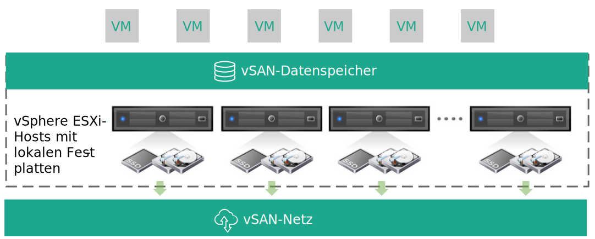
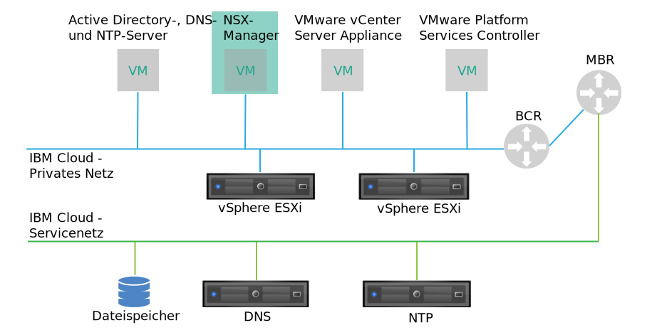
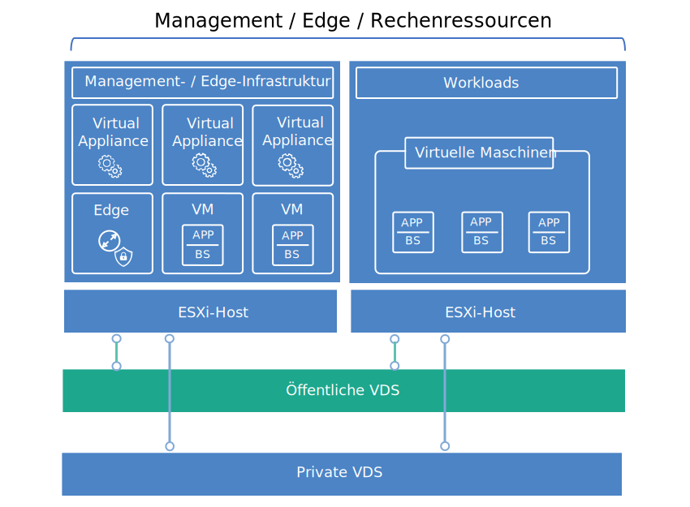

---

copyright:

  years:  2016, 2019

lastupdated: "2019-01-23"

---

{:tip: .tip}
{:note: .note}
{:important: .important}

# Design der virtuellen Infrastruktur

Die Schicht der virtuellen Infrastruktur umfasst die VMware-Softwarekomponenten, mit denen die Rechen-, Speicher- und Netzressourcen virtualisiert werden, die in der Schicht der physischen Infrastruktur bereitgestellt werden: VMware vSphere ESXi, VMware NSX und optional VMware vSAN.

## VMware vSphere-Design

Die vSphere ESXi-Konfiguration umfasst die folgenden Aspekte:
* Bootkonfiguration
* Zeitsynchronisation
* Hostzugriff
* Benutzerzugriff
* DNS-Konfiguration

In Tabelle 1 sind die Spezifikationen für die einzelnen Aspekte aufgeführt. Wenn ESXi konfiguriert und installiert wurde, wird der Host einem VMware vCenter-Server hinzugefügt und von dort aus verwaltet.

Mit diesem Design können Sie über Console User Interface (DCUI), ESXi Shell und Secure Shell (SSH) auf die virtuellen Hosts zugreifen.

Die einzigen Benutzer, die sich standardmäßig direkt anmelden können, sind die Benutzer _root_ und _ibmvmadmin_ für die physische Maschine des Hosts. Der Administrator kann Benutzer aus der Microsoft Active Directory-Domäne (MSAD) hinzufügen, um den Benutzerzugriff auf den Host zu ermöglichen. Alle Hosts im Design der vCenter Server-Lösung werden zur Synchronisation mit einem zentralen NTP-Server konfiguriert.

Tabelle 1. vSphere ESXi-Konfiguration

| Attribut              | Konfigurationsparameter |
|:---------------------- |:----------------------- |
| ESXi-Bootposition     | Verwendet lokale Platten, die in RAID-1 konfiguriert sind. |
| Zeitsynchronisation   | Verwendet {{site.data.keyword.cloud}}-NTP-Server. |
| Hostzugriff            | Unterstützt DCUI, ESXi Shell oder SSH. |
| Benutzerzugriff            | Lokale Authentifizierung und MSAD. |
| Auflösung von Domänennamen | Verwendet DNS wie in [Design der allgemeinen Services](/docs/services/vmwaresolutions/archiref/solution/design_commonservice.html) beschrieben. |

Der vSphere-Cluster enthält die virtuellen Maschinen (VMs), die die zentrale Cloud und die Rechenressourcen für Benutzerworkloads verwalten.

Für Cloud Foundation-Instanzen:
* Eine Instanz enthält vier ESXi-Hosts in der ersten Bereitstellung.
* Sie können nach der Bereitstellung auf maximal 32 ESXi-Hosts skalieren.

Für vCenter-Serverinstanzen:
* Wenn eine Instanz nur NFS verwendet, ist die Mindestanzahl von ESXi-Hosts bei der ersten Bereitstellung 2, für hohe Verfügbarkeit (HA) werden jedoch 3 empfohlen. Sie können während oder nach der ersten Bereitstellung auf maximal 59 ESXi-Hosts skalieren.
* Wenn eine Instanz vSAN verwendet, ist die Mindestanzahl von ESXi-Hosts in der ersten Bereitstellung 4. Sie können während oder nach der ersten Bereitstellung auf maximal 59 ESXi-Hosts skalieren.

Zur Unterstützung weiterer Benutzerworkloads kann die Umgebung wie folgt skaliert werden:  
* Bereitstellen weiterer Rechenhosts von vorhandenen Clustern
* Bereitstellen weiterer Cluster, die von derselben vCenter Server Appliance verwaltet werden
* Bereitstellen neuer vCenter Server- oder Cloud Foundation-Instanzen mit eigener vCenter Server Appliance

Weitere Informationen zu Clustern finden Sie im [Dokument zur Architektur der VMware-Clusterlösung in {{site.data.keyword.cloud_notm}}](https://www.ibm.com/cloud/garage/files/IBM-Cloud-for-VMware-Solutions-Multicluster-Architecture.pdf).

## VMware vSAN-Design

In diesem Design wird VMware vSAN-Speicher in Cloud Foundation-Instanzen und optional in vCenter Server-Instanzen verwendet, um gemeinsam genutzten Speicher für die vSphere-Hosts bereitzustellen.

Wie in Abbildung 1 zu sehen ist, fasst vSAN den lokalen Speicher über mehrere ESXi-Hosts in einem vSphere-Cluster hinweg zusammen und verwaltet den zusammengefassten Speicher wie einen einzelnen VM-Datenspeicher. In diesem Design enthalten die Rechenknoten lokale Plattenlaufwerke für das ESXi-Betriebssystem (BS) und den vSAN-Datenspeicher. Unabhängig davon, zu welchem Cluster ein Knoten gehört, werden in jeden Knoten zwei SATA-Laufwerke mit 1 TB eingeschlossen, um die ESXi-Installation aufzunehmen.

Abbildung 1. vSAN-Konzept

vSAN arbeitet mit den folgenden Komponenten:
* vSAN-Design mit zwei Plattengruppen; jede Plattengruppe besteht aus zwei oder mehr Platten. Eine SSD (Solid State Disk) der kleinsten Größe in der Gruppe dient als Cacheschicht, während die übrigen SSDs als Kapazitätsschicht verwendet werden.
* Der Onboard-RAID-Controller wird für jedes Laufwerk außer den beiden Betriebssystemlaufwerken (BS-Laufwerken) auf der Ebene RAID-0 konfiguriert.
* Aus allen Speicherressourcen wird ein einzelner vSAN-Datenspeicher erstellt.

Die verfügbaren vSAN-Features hängen von der Lizenzedition ab, die Sie bei der Bestellung der Instanz auswählen. Weitere Informationen finden Sie unter [Vergleich der VMware vSAN-Editionen](/docs/services/vmwaresolutions/archiref/solution/appendix.html#vmware-vsan-edition-comparison).

### Einrichtung des virtuellen Netzes für vSAN

Bei diesem Design fließt der vSAN-Datenverkehr zwischen ESXi-Hosts über ein dediziertes privates VLAN. Die beiden Netzadapter, die mit dem Switch des privaten Netzes verbunden sind, werden in vSphere als vSphere Distributed Switch (vDS) mit beiden Netzadaptern als Uplinks konfiguriert. Eine dedizierte vSAN-Kernelportgruppe, die für das vSAN-VLAN konfiguriert ist, befindet sich in dem vDS. Jumbo-Frames (MTU 9000) werden für den privaten vDS aktiviert.

vSAN führt keinen Lastausgleich für den Datenverkehr zwischen Uplinks aus. Daher ist ein Adapter aktiv, während der andere im Standby-Modus ist, um hohe Verfügbarkeit (HA) zu unterstützen. Die Netzrichtlinie für die Funktionsübernahme (Failover) für vSAN ist als explizites Failover (**Explicit Failover**) zwischen physischen Netzports konfiguriert.

Weitere Informationen zu physischen NIC-Verbindungen enthält Abbildung 2, "Physische NIC-Hostverbindungen im Abschnitt [Design der physischen Infrastruktur](/docs/services/vmwaresolutions/archiref/solution/design_physicalinfrastructure.html)".

### Design von Speicherrichtlinien

Wenn vSAN aktiviert und konfiguriert ist, werden Speicherrichtlinien konfiguriert, um die VM-Speichermerkmale zu definieren. Speichermerkmale geben die verschiedenen Service-Level für verschiedene VMs an.

Die Standardspeicherrichtlinie in diesem Design toleriert ein einzelnes Feature. Die Standardrichtlinie ist mit RAID 5-Löschcodierung (Erasure Coding), mit dem Wert **RAID-5/6 (Erasure Coding) - Capacity** für die Option **Failure tolerance method** (Fehlertoleranzmethode) und mit dem Wert 1 für die Option **Primary level of failures** (Primäre Fehlerebene) konfiguriert.

Die RAID 5-Konfiguration erfordert mindestens vier Hosts. Alternativ können Sie die RAID 6-Konfiguration mit dem Wert **RAID-5/6 (Erasure Coding) - Capacity** für die Option **Failure tolerance method** (Fehlertoleranzmethode) und dem Wert 2 für die Option **Primary level of failures** (Primäre Fehlerebene) auswählen.

Die RAID 6-Konfiguration erfordert mindestens sechs Hosts. Die Optionen **Duplication** (Duplizierung) und **compression** (Komprimierung) sind in der Standardspeicherrichtlinie ebenfalls aktiviert.

Eine Instanz verwendet die Standardrichtlinie, sofern nichts anderes über die vSphere-Konsole angegeben wird. Wenn eine angepasste Richtlinie konfiguriert wird, garantiert vSAN diese, sofern dies möglich ist. Wenn die Richtlinie jedoch nicht garantiert werden kann, ist es nicht möglich, eine VM bereitzustellen, die die Richtlinie verwendet, sofern sie nicht zur erzwungenen Bereitstellung eingerichtet ist.

Speicherrichtlinien müssen nach dem Hinzufügen neuer ESXi-Hosts oder nach der Aktualisierung der ESXi-Hosts erneut angewendet werden.

### vSAN-Einstellungen

vSAN-Einstellungen werden nach bewährten Verfahren für die Bereitstellung von VMware-Lösungen in {{site.data.keyword.cloud_notm}} festgelegt. Zu den VSAN-Einstellungen gehören SIOC-Einstellungen, Einstellungen für die Portgruppe für explizites Failover und Plattencacheeinstellungen.
* SSD-Cacherichtlinieneinstellungen: Kein **Read Ahead** (Vorauslesen), **Write Through**, **Direct** (NRWTD)
* Einstellungen der E/A-Netzsteuerung
   * Management - 20 gemeinsam genutzte Ressourcen
   * Virtuelle Maschine - 30 gemeinsam genutzte Ressourcen
   * vMotion - 50 gemeinsam genutzte Ressourcen
   * vSAN - 100 gemeinsam genutzte Ressourcen
* vSAN-Kernel-Ports: **Explicit Failover**

## VMware NSX-Design

Die Netzvirtualisierung stellt ein Netzoverlay zur Verfügung, das in der virtuellen Schicht vorhanden ist. Die Netzvirtualisierung stattet die Architektur mit Funktionen wie schnelle Einrichtung, Bereitstellung, Rekonfiguration und Löschung von virtuellen On-Demand-Netzen aus. In diesem Design wird der vDS und VMware NSX for vSphere zur Implementierung eines virtuellen Netzes verwendet.

In diesem Design wird der NSX-Manager im ersten Cluster bereitgestellt. Dem NSX-Manager wird eine VLAN-gestützte IP-Adresse aus dem privaten, portierbaren Adressblock zugeordnet, der für Managementkomponenten vorgesehen ist und der mit den unter [Design der allgemeinen Services](/docs/services/vmwaresolutions/archiref/solution/design_commonservice.html) behandelten DNS- und NTP-Servern konfiguriert wird. Der NSX-Manager wird mit den in Tabelle 2 aufgeführten Spezifikationen installiert.

Tabelle 2. NSX-Manager-Attribute

| Attribut       | Spezifikation |
|:--------------- |:------------- |
| NSX-Manager     | Virtual Appliance |
| Anzahl vCPUs | 4 |
| Speicher          | 16 GB |
| Plattenspeicher            | 60 GB in der gemeinsam genutzten Management-NFS-Ressource |
| Plattentyp       | Thin-Provisioning |
| Netz         | **Privat A**, portierbar, für Managementkomponenten vorgesehen |

Die folgende Abbildung zeigt die Anordnung des NSX-Managers in Relation zu anderen Komponenten in der Architektur.

Abbildung 2. Netzübersicht für NSX-Manager

Nach der Erstbereitstellung stellt die {{site.data.keyword.cloud_notm}}-Automatisierung drei NSX-Controller im ersten Cluster bereit. Jedem der Controller wird eine VLAN-gestützte IP-Adresse aus dem portierbaren Teilnetz **Privat A** zugeordnet, das für Managementkomponenten vorgesehen ist. Ferner werden in dem Design VM-VM-Anti-Affinitätsregeln erstellt, um die Controller unter den Hosts im Cluster zu separieren. Der erste Cluster muss mindestens drei Knoten enthalten, um hohe Verfügbarkeit für die Controller sicherzustellen.

Neben den Controllern bereitet die {{site.data.keyword.cloud_notm}}-Automatisierung die bereitgestellten vSphere-Hosts mit NSX-VIBs vor, um die Verwendung eines virtualisierten Netzes durch VXLAN-Tunnelendpunkte (VTEPs) einzurichten. Den VTEPs wird eine VLAN-gestützte IP-Adresse aus dem portierbaren IP-Adressbereich von **Privat A** zugeordnet, der für VTEPs angegeben ist, wie in *Tabelle 1. VLAN- und Teilnetzzusammenfassung* für das [Design der physischen Infrastruktur](/docs/services/vmwaresolutions/archiref/solution/design_physicalinfrastructure.html) aufgeführt. Der VXLAN-Datenverkehr befindet sich im nicht mit Tags versehenen VLAN und wird dem privaten vDS zugewiesen.

Anschließend wird ein Segment-ID-Pool zugeordnet und die Hosts in dem Cluster werden der Transportzone hinzugefügt. In der Transportzone wird nur Unicast verwendet, da die IGMP-Netzüberwachung (IGMP - Internet Group Management Protocol) in der {{site.data.keyword.cloud_notm}} nicht konfiguriert ist.

Als Nächstes werden die NSX Edge Services Gateway-Paare bereitgestellt. In allen Fällen wird ein Gateway-Paar für den abgehenden Datenverkehr aus Automatisierungskomponenten verwendet, die sich im privaten Netz befinden. Für vCenter Server wird ein zweites Gateway, das als kundenverwaltetes Edge-Gateway bezeichnet wird, bereitgestellt und mit einem Uplink zum öffentlichen Netz sowie einer Schnittstelle, die dem privaten Netz zugeordnet ist, konfiguriert. Weitere Informationen zu NSX Edge Services Gateways, die als Teil der Lösung bereitgestellt werden, finden Sie im Dokument zur [Architektur der NSX Edge-Lösung in {{site.data.keyword.cloud_notm}}](https://www.ibm.com/cloud/garage/files/IBM_Cloud_for_VMware_Solutions_NSX_Edge_Services_Gateway.pdf).

Cloudadministratoren können alle erforderlichen NSX-Komponenten wie Distributed Logical Router (DLR), logische Switches und Firewalls konfigurieren. Die verfügbaren NSX-Features sind von der NSX-Lizenzedition abhängig, die Sie bei der Bestellung der Instanz auswählen. Weitere Informationen finden Sie unter [Vergleich der VMware NSX-Editionen](/docs/services/vmwaresolutions/archiref/solution/appendix.html#vmware-nsx-edition-comparison). Für vCenter Server-Instanzen fügt die {{site.data.keyword.cloud_notm}}-Automatisierung die vCenter Server Appliance und PSC (Platform Services Controller) in der Ausschlussliste des NSX-Managers für verteilte Firewalls hinzu.

### Design verteilter Switches

In dem Design wird eine minimale Anzahl von vDS-Switches verwendet. Die Hosts im Cluster werden mit den öffentlichen und privaten Netzen verbunden. Die Hosts werden mit zwei verteilten virtuellen Switches konfiguriert. Die Verwendung von zwei Switches basiert auf der Praxis im {{site.data.keyword.cloud_notm}}-Netz, dass öffentliche und private Netze getrennt werden. Das folgende Diagramm zeigt das vDS-Design.

Abbildung 3. Design verteilter Switches

Wie in der Abbildung gezeigt, wird der eine vDS für die öffentliche Netzkonnektivität (SDDC-Dswitch-Public) und der andere vDS für die private Netzkonnektivität (SDDC-Dswitch-Private) konfiguriert.

Die Trennung verschiedener Typen von Datenverkehr ist erforderlich, um Konkurrenzsituationen und Latenzzeiten zu verringern und die Sicherheit zu erhöhen. VLANs werden zur Segmentierung physischer Netzfunktionen verwendet.

In diesem Design werden drei VLANs verwendet: zwei für privaten Netzverkehr und eines für öffentlichen Netzverkehr. In der folgenden Tabelle wird die Trennung des Datenverkehrs dargestellt.

Tabelle 3. VLAN-Zuordnung zu Datenverkehrstypen

| VLAN  | Ziel | Datenverkehrstyp |
|:----- |:----------- |:------------ |
| VLAN1 | Öffentlich      | Für Internetzugriff verfügbar |
| VLAN2 | Privat A   | ESXi-Management, Management, VXLAN (VTEP) |
| VLAN3 | Privat B   | vSAN, NFS, vMotion |

Datenverkehr von Workloads fließt über VXLAN­gestützte logische Switches.

Der vSphere-Cluster nutzt zwei vSphere Distributed Switches mit der in den folgenden Tabellen gezeigten Konfiguration.

Tabelle 4. Verteilte Switches konvergierter Cluster

| vSphere Distributed Switchname | Funktion | Netz- E/A-Steuerung | Lastausgleichs- modus | Physische  Ports | MTU |
|:------------- |:------------- |:------------- |:------------- |:------------- |:------------- |
| SDDC-Dswitch-Private | ESXi-Management, vSAN, vSphere vMotion, VXLAN-Tunnelendpunkt, NFS (VTEP) | Aktiviert | Route basierend auf explizitem Failover (vSAN, vMotion) von virtuellem Ursprungsport (alle anderen) | 2 | 9000 (Jumbo-Frames) |
| SDDC-Dswitch-Public | Externer Managementdatenverkehr (Nord-Süd) | Aktiviert | Route basierend auf virtuellem Ursprungsport \* | 2 | 1500 (Standard) |

Namen, Anzahl und Anordnung der Host-NICs können abhängig vom {{site.data.keyword.CloudDataCent_notm}} und Ihrer Auswahl der Host-Hardware variieren.
{:note}

Tabelle 5. Einstellungen für die Portgruppenkonfiguration für verteilte Switches konvergierter Cluster

| Parameter          | Einstellung       |
|:------------------ |:------------- |
| Lastausgleich     | Route auf Basis des virtuellen Ursprungsports \* |
| Failover-Erkennung | Nur Linkstatus |
| Switches benachrichtigen    | Aktiviert |
| Failback           | Nein |
| Failover-Reihenfolge     | Aktive Uplinks: uplink1, uplink2 \* |

\* Die vSAN-Portgruppe verwendet explizites Failover mit Aktiv/Standby-Konfiguration, da sie keinen Lastausgleich für vSAN-Speicherdatenverkehr unterstützt.
{:note}

Tabelle 6. Portgruppen und VLANs für virtuelle Switches konvergierter Cluster

| vSphere Distributed Switch | Portgruppenname | Teaming | Uplinks | VLAN-ID |
|:------------- |:------------- |:------------- |:------------- |:---------- |
| SDDC-Dswitch-Private | SDDC-DPortGroup-Mgmt | Virtueller Ursprungsport | Aktiv: 0, 1 | VLAN1 |
| SDDC-Dswitch-Private | SDDC-DPortGroup-vMotion | Virtueller Ursprungsport | Aktiv: 0, 1 | VLAN2 |
| SDDC-Dswitch-Private | SDDC-DPortGroup-VSAN | Explizites Failover | Aktiv: 0 Standby: 1 | VLAN2 |
| SDDC-Dswitch-Private | SDDC-DPortGroup-NFS | Virtueller Ursprungsport | Aktiv: 0, 1 | VLAN2 |
| SDDC-Dswitch-Private | Von NSX automatisch generiert | Virtueller Ursprungsport | Aktiv: 0, 1 | VLAN1 |
| SDDC-Dswitch-Public | SDDC-DPortGroup-External | Virtueller Ursprungsport | Aktiv: 0, 1 | VLAN3 |

Tabelle 7. VM-Kerneladapter für konvergierte Cluster

| vSphere Distributed Switch | Zweck | Gruppe verbundener Ports | Aktivierte Services | MTU |
|:-------------------------- |:------- |:-------------------- |:---------------- |:--- |
| SDDC-Dswitch-Private | Management | SDDC-DPortGroup-Mgmt | Managementdatenverkehr | 1500 (Standard) |
| SDDC-Dswitch-Private | vMotion | SDDC-DPortGroup-vMotion | vMotion-Datenverkehr | 9000 |
| SDDC-Dswitch-Private | VTEP | *Von NSX automatisch generiert* | \- | 9000 |
| SDDC-Dswitch-Private | VSAN | SDDC-DPortGroup-VSAN | vSAN | 9000 |
| SDDC-Dswitch-Private | NAS | SDDC-DPortGroup-NFS | \-  | 9000 |

### NSX-Konfiguration

Dieses Design spezifiziert die Konfiguration von NSX-Komponenten, wendet jedoch keine Konfiguration von Netzoverlay-Komponenten an. Sie können das Netzoverlay Ihren Anforderungen entsprechend gestalten. Die folgenden Aspekte werden vorkonfiguriert:

* Management-Server und -Controller werden installiert und in die vCenter-Webbenutzerschnittstelle integriert.
* ESXi-Agenten werden installiert und VTEP-IP-Adressen werden für jeden ESXi-Host konfiguriert.
* VTEP-Konfiguration, Controllerkonfiguration und VXLAN-Konfiguration (Transportzone).
* NSX Edge Services Gateway-Appliances zur Verwendung durch Managementkomponenten
* Nur für vCenter Server-Instanzen: NSX Edge Services Gateway-Appliances für die Verwendung durch Kunden

Die folgenden Aspekte werden nicht konfiguriert:
* Virtuelle verteilte Router
* Mikrosegmentierung
* VXLANs
* Verknüpftes NSX-Management mit anderen VMware-Instanzen

### Zugehörige Links

* [Architektur der VMware-Clusterlösung in {{site.data.keyword.cloud_notm}}](https://www.ibm.com/cloud/garage/files/IBM-Cloud-for-VMware-Solutions-Multicluster-Architecture.pdf)
* [Architektur der NSX Edge-Lösung in {{site.data.keyword.cloud_notm}}](https://www.ibm.com/cloud/garage/files/IBM_Cloud_for_VMware_Solutions_NSX_Edge_Services_Gateway.pdf)
