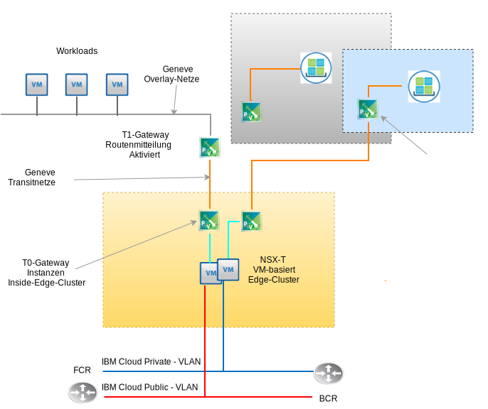

---

copyright:

  years:  2016, 2019

lastupdated: "2019-05-13"

subcollection: vmware-solutions

---

# VMware NSX-T-Design
{: #nsx-t-design}

Im Gegensatz zu NSX-V (NSX on vSphere) wurde VMware NSX-T für Anwendungsframeworks und Architekturen entwickelt, die heterogene Endpunkte und Technologie-Stacks aufweisen. Neben vSphere können diese Umgebungen weitere Hypervisoren, KVM, Container und Bare-Metal-Instanzen enthalten. NSX ist so konzipiert, dass es eine softwaredefinierte Netz- und Sicherheitsinfrastruktur über andere Plattformen als nur vSphere hinweg umfasst. Obwohl es möglich ist, NSA-T-Komponenten ohne vSphere zu implementieren, konzentriert sich dieses Design auf NSX-T und seine Integration in erster Linie innerhalb einer automatisierten vCenter Server vSphere-Bereitstellung.

Innerhalb von NSX-T gibt es viele erweiterte Funktionen, wie z. B. Firewallrichtlinien, die Einbindung von Gast-Introspektionen in Firewallrichtlinien und das erweiterte Netzflusstracking. Das Beschreiben dieser Funktionen liegt außerhalb des Geltungsbereichs dieses Dokuments. Weitere Informationen finden Sie in der VMware-Dokumentation für NSX-T. In diesem Design wird die NSX-T-Managementinfrastruktur während der erstmaligen vCenter Server-Cluster-Bereitstellung anstelle von NSX-V bereitgestellt.

## NSX-T und NSX-V im Vergleich
{: #nsx-t-design-nsx-t-nsx-v}

Überprüfen Sie für natives vSphere NSX (NSX-V) die folgenden gängigeren NSX-T-Objekte mit ähnlicher Funktion wie ihre NSX-V-Entsprechungen. Einschränkungen und Unterschiede innerhalb einer vSphere-Umgebung werden ebenfalls diskutiert. Hier ist eine Tabelle der typischerweise verwendeten Funktionen zwischen T und V, die sich entsprechen.

Tabelle 1. Terminologie von NSX-V vs. NSX-T

NSX-V oder natives vSphere | NSX-T
--|:---|:--
**Virtueller verteilter Switch (VDS)** | Virtueller verteilter Netz-Switch (N-VDS)
**NSX-Transportzone** | Transportzone (Overlay oder VLAN-gestützt)
**Portgruppe (vDS)** | Logischer Switch
**VXLAN (L2-Kapselung)** | GENEVE (L2-Kapselung)
**Edge-Gateway** | T0-Gateway (geändert ab Version 2.4)
**Distributed Logical Router (DLR)** | T1-Gateway (geändert ab Version 2.4)
**ESXi-Server (vTEP)** | Transportknoten (ESXi, KVM, Bare-Metal-T0-Gateway)

Es gibt wichtige NSX-T-Konzepte, die nicht der Funktion NSX-V entsprechen, die für die Umsetzung des NSX-T-Designs verstanden werden müssen.

Es gilt:
- Ein Edge-Cluster besteht aus einer oder mehreren VMs oder physischen Maschinen, die an einer virtuellen NSX-T-Struktur beteiligt sind. Sie sind Endpunkte für die Overlay-Netztransportzonen und VLAN-gestützten Transportzonen. Ein Edge-Cluster kann mehrere T-0-Gateway-Instanzen unterstützen.
- Ein T-0-Gateway ist eine virtuelle Router-Instanz, jedoch keine VM. Mehrere T-0-Gateway-Instanzen können in einem Edge-Cluster mit jeweils einer eigenen Routing-Tabelle und Funktionen ausgeführt werden. Dies bedeutet, dass ein Edge-Cluster vorhanden sein muss, bevor Sie eine T-0-Router-Instanz erstellen können.
- Eine Transportzone kann Endpunkte über verschiedene Plattformen hinweg und mehrere vSphere vCenter-Instanzen umfassen. Es ist kein vCenter-vernetzter NSX erforderlich. Transportzonen können von bestimmten Endpunkten ausgeschlossen werden. Ein N-VDS wird direkt mit einer Transportzone verknüpft und wird erstellt, wenn die Transportzone erstellt wird.
- Die Uplink-Failover-Reihenfolge wird unabhängig von einem bestimmten logischen Switch erstellt, da sie in Profilen als "Uplink Profiles" erstellt und auf einen bestimmten logischen Switch angewendet werden, der auf VLAN basiert. Da für dasselbe VLAN eine unterschiedliche Failover-Reihenfolge oder Lastverteilung für physische Uplinks erforderlich ist, kann das Uplink-Profil für ein bestimmtes VLAN mehrere Einträge für "Teaming" mit einer unterschiedlichen Failover-Reihenfolge und Lastverteilung enthalten. Wenn Sie das Uplink-Profil einem logischen Switch zuordnen, wird das bestimmte Teaming-Profil ausgewählt.

- Ab NSX-T 2.4 werden die Manager-VM- und die Controller-VM-Funktion kombiniert. Dies führt dazu, dass drei Controller-Manager-VMs bereitgestellt werden. Wenn sie im selben Teilnetz verwendet werden, verwenden sie die interne Netzlastausgleichsfunktion. Wenn in verschiedenen Teilnetzen verwendet werden, ist eine externe Lastausgleichsfunktion erforderlich.

## Ressourcenbedarf
{: #nsx-t-design-resource-req}

In diesem Design werden die NSX-T Manager-Controller-VMs im ursprünglichen Cluster bereitgestellt. Dem Controller-Manager wird eine VLAN-gestützte IP-Adresse aus dem privaten, portierbaren Adressblock zugeordnet, der für Managementkomponenten vorgesehen ist und der mit den DNS- und NTP-Servern (in Abschnitt 0 beschrieben) konfiguriert wird. Eine Zusammenfassung der NSX Manager-Installation wird in der folgenden Tabelle gezeigt.

Tabelle 2. NSX-T Manager - Controller-Spezifikationen

Attribut | Spezifikation
--|--
**NSX Manager / Controller** | 3 Virtuelle Appliances
**Anzahl vCPUs** | 4
**Speicher** |  16 GB
**Platte** | 60 GB
**Plattentyp** | Thin Provisioning-Platte
**NetworkPrivate A** | Privat A

Die folgende Abbildung zeigt die Anordnung der NSX Manager-Controller in Relation zu anderen Komponenten in der Architektur.

## Bereitstellungsaspekte
{: #nsx-t-design-deployment}

Bei NSX-T on vSphere muss dem N-VDS die physischen Adapter innerhalb der Hosts zugeordnet werden. Da ein N-VDS nur in NSX-T Manager konfiguriert werden kann, bedeutet dies, dass keine physischen Adapter für die native lokale Switch- oder vDS-Zuordnung in einem Cluster verfügbar sind, in dem sowohl die NSX-T-Komponenten als auch die zugehörigen Overlay-Netzkomponenten enthalten sind, wenn Redundanz beibehalten werden soll.

Aus diesem Grund muss während der Installation von NSX-T und seiner Konfiguration ein physischer NIC-Port an einem Adapter einem lokalen vSphere vSwitch oder einem virtuellen verteilten Switch (VDS) zugewiesen bleiben. Nach der NSX-T-Bereitstellung müssen alle ESX-Kernel-Ports auf einen N-VDS migriert und alle lokalen vSwitches oder VDS ausgelagert werden. Nachdem die Kernel-Ports entfernt wurden, können die verbleibenden physischen NIC-Ports als N-VDS-Uplink zugeordnet werden, wodurch Redundanz des N-VDS erreicht wird.

Nach der Erstbereitstellung stellt die {{site.data.keyword.cloud_notm}}-Automatisierung drei virtuelle NSX-T Manager/Controller Appliances im ersten Cluster bereit. Jedem der Controller wird eine VLAN-gestützte IP-Adresse aus dem portierbaren Teilnetz "Privat A" zugeordnet, das für Managementkomponenten vorgesehen ist. Außerdem werden VM-VM-Anti-Affinitätsregeln erstellt, damit die Controller unter den Hosts im Cluster separiert werden.

Sie müssen den ersten Cluster mit mindestens drei Knoten bereitstellen, um eine hohe Verfügbarkeit für die Manager/Controller zu gewährleisten. Zusätzlich zu den Managern/Controllern bereitet die {{site.data.keyword.cloud_notm}}-Automatisierung die bereitgestellten vSphere-Hosts als NSX-T-Transportknoten vor. Den ESXi-Transportknoten wird eine VLAN-gestützte IP-Adresse aus dem portierbaren Teilnetz "Privat A" zugeordnet, die von einem NSX-IP-Pool angegeben wird, der von der VLAN- und Teilnetzzusammenfassung abgeleitet wurde. Der Transportknoten-Datenverkehr befindet sich im nicht mit Tags versehenen VLAN und wird dem privaten virtuellen verteilten NSX-T-Switch (N-VDS) zugewiesen.

Abhängig von dem Kunden, der die NSX-T-Topologie für die Bereitstellung ausgewählt hat, wird ein NSX-T-Edge-Cluster entweder als VM-Paar oder als Software auf Bare-Metal-Cluster-Knoten bereitgestellt. Unabhängig davon, ob es sich bei dem Cluster-Paar um virtuelle oder physische Cluster-Paare handelt, werden Uplinks sowohl für öffentliche als auch für private {{site.data.keyword.cloud_notm}}-Netze auf N-VDS-Switches konfiguriert.

In der folgenden Tabelle sind die Anforderungen für eine Umgebung mit mittlerer Größe zusammengefasst.

Tabelle 3. Spezifikationen für NSX-T-Komponenten

 Ressourcen | Manager-Controller x3 | Edge-Cluster x2 | Bare Metal Edge
-----------|:---------|:-------|:---------
**Mittlere Größe** | Virtual Appliance | Virtual Appliance | Physischer Server
**Anzahl vCPUs** | 4 | 4 | 8
**Speicher** | 16 GB | 8 GB | 32 GB
**Platte** | 120 GB VSAN/Management-NFS | 120 GB VSAN/Management-NFS | 200 GB
**Plattentyp** | Thin Provisioning-Platte | Thin Provisioning-Platte | Physisch
**Netz** | Privat A | Privat A | Privat A

## Transportzonen und N-VDS
{: #nsx-t-design-transport-zones}

Transportzonen bestimmen, welche Hosts und welche VMs an der Verwendung eines bestimmten Netzes teilnehmen können. Eine Transportzone beschränkt dies auf die Hosts, die einen logischen Switch "sehen" können, und damit, welche VMs an den logischen Switch angeschlossen werden können. Eine Transportzone kann sich über einen oder mehrere Host-Cluster erstrecken. Für dieses Design müssen Transportzonen wie folgt erstellt werden:

Tabelle 4. NSX-T-Transportzonen und N-VDS

Name der Transportzone | VLAN/VXLAN | N-VDS-Name | Uplink-Teaming-Richtlinie
--|:-------|:------|:-----
**Private-Overlay** | VXLAN | SDDC-Overlay | Standard
**Public-VLAN** | VLAN | SDDC-Public | Standard
**Private-VLAN** | VLAN | SDDC-Private | NFS, vSAN, iSCSI-A&B Standard

## Transportknoten
{: #nsx-t-design-transport-nodes}

Transportknoten definieren die physischen Serverobjekte oder VMs, die an der virtuellen Netzstruktur beteiligt sind. Sehen Sie sich die folgende Tabelle an, um das Design zu verstehen.

Tabelle 5. NSX-T-Transportknoten

Typ des Transportknotens | N-VDS | Uplinkprofil | IP-Zuweisung | Physische NICs
--|:--------|:--------|:---
**ESXi** | SDDC-Private | SDDC-Private-uplink | IP-Pool | vmnic0, vmnic2
**Edge-Cluster** | SDDC-Overlay | SDDC-Overlay-uplink | IP-Pool | Nicht verfügbar.
**Physischer Edge** | SDDC-Private | SDDC-Private-uplink | IP-Pool | eth0, eth2

## Uplink-Profile
{: #nsx-t-design-uplink-profiles}

Ein Uplink-Profil definiert Richtlinien für die Links von Hypervisor-Hosts zu logischen NSX-T-Switches oder von NSX-Edge-Knoten zu Top-of-Rack-Switches.

Tabelle 6. NSX-T-Uplink-Profile

Uplink-Profilname | VLAN | Einbezogene Teamings | MTU
--|:-----|:---|:---
**SDDC-Private-Uplink** | Standard | Standard, Management | 9000
**SDDC-Public-Uplink** | Standard| Standard | 1500
**SDDC-Storage-Uplink** | Speicher-VLAN | vSAN, iSCSI-A&B, NFS | 9000

## Teaming
{: #nsx-t-design-teaming}

Tabelle 7. Teaming-Spezifikation für NSX-T-NIC-Ports

Teaming-Name | Failover oder Lastausgleich | Aktiver NIC | Standby-NIC
--|:----|:---|:---
**Standard** | Lastausgleichsquelle | Uplink 1, 2 | Nicht verfügbar.
**Management** | Failover| Uplink 1 | Uplink 2
**TEP** | Failover| Uplink 1 | Uplink 1
**vSAN** | Failover| Uplink 2 | Uplink 1
**iSCSI-A** | Failover| Uplink 1 | Nicht verfügbar.
**iSCSI-B** | Failover| Uplink 2 | Nicht verfügbar.
**NFS** | Lastausgleichsquelle | Uplink 1, 2 | Uplink 1
**vMotion** | Failover| Uplink 2 | Uplink 1

## VNI-Pools
{: #nsx-t-design-vni-pools}

Virtuelle Netz-IDs (VNIs) ähneln VLANs in einem physischen Netz. Sie werden automatisch erstellt, wenn ein logischer Switch aus einem Pool oder einem Bereich von IDs erstellt wird. In diesem Design wird der standardmäßige VNI-Pool verwendet, der mit NSX-T bereitgestellt wird.

## Logische Switches
{: #nsx-t-design-logical-switches}

Ein logischer NSX-T-Switch erzeugt in einer virtuellen Umgebung, die von der zugrunde liegenden Hardware vollständig entkoppelt ist, Schaltfunktionen, Broadcast-, unbekanntem Unicast- und Multicast-Datenverkehr (BUM).

Tabelle 8. Logische NSX-T-Switches

Name des logischen Switches | VLAN |Transportzone | Uplink-Teaming-Richtlinie
--|:---|:----|:---
**SDDC-LS-Mgmt** | Standard | Private-VLAN | Management
**SDDC-LS-NFS** | Standard | Private-VLAN | NFS
**SDDC-LS-vMotion** | Standard | Private-VLAN | vMotion
**SDDC-LS-VSAN** | Speicher-VLAN mit Tags | Private-VLAN | vSAN
**SDDC-LS-iSCSI-A** | Speicher-VLAN mit Tags | Private-VLAN| iSCSI-A
**SDDC-LS-iSCSi-B** | Speicher-VLAN mit Tags | Private-VLAN| iSCSi-B
**SDDC-LS-TEP** | Standard | Private-VLAN| TEP
**SDDC-LS-External** | Standard | Public-VLAN | Standard

### Edge-Cluster
{: #nsx-t-design-edge-cluster}

Im Rahmen dieses Designs wird ein einzelner virtueller Edge-Cluster für die Verwendung durch Management- und Kundenworkloads bereitgestellt. Der virtuelle Edge-Cluster kann mehrere Instanzen von T0-Gateways aufnehmen. Wie zuvor beschrieben, können mehrere T0-Edge-Gateway-Instanzen in einem einzelnen Edge-Cluster mit jeweils eigenen Routing-Tabellen instanziiert werden. Sehen Sie sich die folgende Abbildung an, in der die funktionalen Komponenten eines NSX-T-Edge-Clusters beschrieben sind.

#### Logisches Tier-0-Gateway
{: #nsx-t-design-tier-0}

Ein logischer Tier-0-NSX-T-Router stellt einen On- und Off-Gateway-Service zwischen dem logischen und dem physischen Netz bereit. Für dieses Design werden mehrere T-0-Gateways für die Anforderungen der Verwaltung, für die Add-on-Produkte und optional für die vom Kunden ausgewählte Topologien bereitgestellt.

#### Logisches Tier-1-Gateway
{: #nsx-t-design-tier-1}

Ein logisches Tier-1-NSX-T-Gateway verfügt über Downlink-Ports, um logische NSX-T-Data-Center-Switches und Uplink-Ports zu verbinden und um nur die logischen NSX-T-Data-Center-Tier-1-Router zu verbinden. Sie werden im Kernel-Level des Hypervisors ausgeführt, für den sie konfiguriert sind, und nicht als virtuelle oder physische Maschine. Für dieses Design werden eine oder mehrere logische T-1-Gateways für die Anforderungen der vom Kunden ausgewählten Topologien erstellt.

#### Routenmitteilung von Tier 1 bis Tier 0
{: #nsx-t-design-tier-1-tier-0}

Um Layer-3-Konnektivität zwischen VMs bereitzustellen, die mit logischen Switches verbunden sind, die an verschiedene logische Tier-1-Gateways angeschlossen sind, muss die Tier-1-Routenmitteilung zu Tier 0 aktiviert werden. Es ist nicht erforderlich, ein Routing-Protokoll oder statische Routen zwischen den logischen Tier-1- und Tier-0-Routen zu konfigurieren. NSX-T erstellt statische Routen automatisch, wenn Sie die Routenmitteilung aktivieren. Für dieses Design ist die Routenmitteilung für jede IC4V-Automatisierung, die T-1-Gateways erstellt, immer aktiviert.

### Vorkonfigurierte Topologien
{: #nsx-t-design-preconfig-topo}

Workload von T1- bis T0-Gateway - virtueller Edge-Cluster

Die mit IC4V bereitgestellte Topologie 1 ist im Wesentlichen die gleiche Topologie, die mit den NSX-V-DLR- und Edge-Gateways bereitgestellt wird. Bei NSX-T ist keine dynamische Routing-Protokollkonfiguration zwischen T1 und T0 vorhanden. RFC-1891 Der IP-Adressraum wird für das Workload-Overlay-Netzwerk und das Transit-Overlay-Netzwerk verwendet. Dem Kunden wird ein privater und öffentlicher portabler IP-Bereich zugeordnet, der für den Kunden verwendet wird. Ein vom Kunden als bezeichneter privater und öffentlicher portierbarer {{site.data.keyword.cloud_notm}}-IP-Bereich wird dem T0 zur Verwendung durch den Kunden zugewiesen.

Ab diesem Design haben Sie die Möglichkeit, diese IP-Bereiche nicht zu löschen, wenn die vCenter Server-Instanz stillgelegt und gelöscht wird.

Workload von T1- bis T0-Gateway - physischer Edge-Cluster

Die bereitgestellte Topologie 2 ähnelt der Ausnahme, die den VM-basierten Edge-Cluster durch ein Bare-Metal-Serverpaar ersetzt, auf denen Red Hat Server ausgeführt wird. Ein vom Kunden als bezeichneter privater und öffentlicher portierbarer {{site.data.keyword.cloud_notm}}-IP-Bereich wird dem T0 zur Verwendung durch den Kunden zugewiesen. Ab diesem Design haben Sie die Möglichkeit, diese IP-Bereiche nicht zu löschen, wenn die vCenter Server-Instanz stillgelegt und gelöscht wird.

In einem separaten Dokument oder Link finden Sie eine Stückliste zu den Hardware- und Betriebssystemspezifikationen.

Workload von ICP- bis T0-Gateway - virtueller Edge-Cluster

Die bereitgestellte Topologie 3 enthält die Topologie 1 mit der Zusatz einer ICP-Bereitstellung, die die NSX-T-Integration anstelle von Calico enthält, dem Standardnetzwerkstapel innerhalb einer ICP-Bereitstellung. Der Kunde kann zusätzliche Containernamensbereiche in ICP bereitstellen, wodurch die Erstellung von logischen Switches, IP-Teilnetzadressierung und T1-Gateway-Instanzen für jeden Namensbereich automatisiert wird.

Ein umfassendes Verständnis der Funktionsweise von ICP auf vCenter Server finden Sie in der Dokumentation zu ICP in der vCenter Server-Architektur. Ein vom Kunden als bezeichneter privater und öffentlicher portierbarer {{site.data.keyword.cloud_notm}}-IP-Bereich wird dem T0 zur Verwendung durch den Kunden zugewiesen.

Ab diesem Design haben Sie die Möglichkeit, diese IP-Bereiche nicht zu löschen, wenn die vCenter Server-Instanz stillgelegt und gelöscht wird.

## Zugehörige Links
{: #nsx-t-design-related}

* [Übersicht über vCenter Server on {{site.data.keyword.cloud_notm}} with Hybridity Bundle](/docs/services/vmwaresolutions/archiref/vcs?topic=vmware-solutions-vcs-hybridity-intro)
