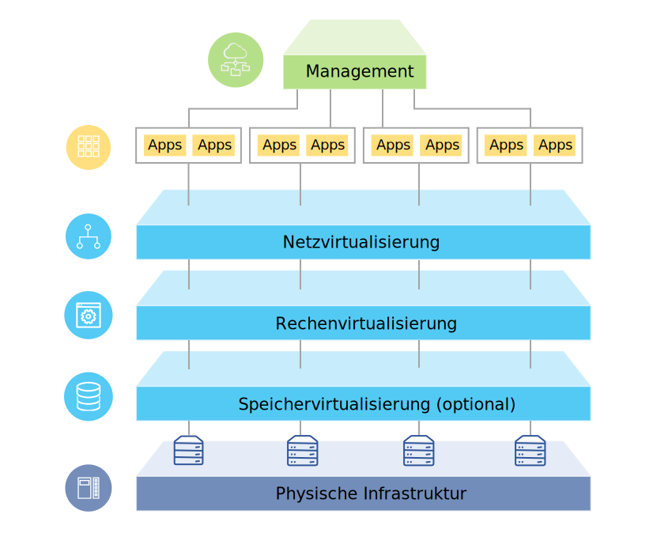

---

copyright:

  years:  2016, 2018

lastupdated: "2018-08-14"

---

# Lösungsübersicht

Mit den Angeboten von {{site.data.keyword.vmwaresolutions_full}} können Sie Ihr bestehendes virtualisiertes VMware-Rechenzentrum auf {{site.data.keyword.cloud_notm}} ausweiten oder native Cloud-Anwendungen aufnehmen.

Die Lösung unterstützt Anwendungsfälle wie Kapazitätserweiterung in der Cloud (und Kapazitätsverringerung, wenn kein Bedarf besteht), Migration auf die Cloud, Disaster-Recovery in der Cloud und Sicherung in der Cloud. Mit der Lösung können Sie eine dedizierte Cloudumgebung für Entwicklungs-, Test-, Schulungs-, Labor- oder Produktionszwecke erstellen.

Prüfen Sie diese Informationen zum Design der {{site.data.keyword.vmwaresolutions_short}}-Angebote, die VMware Cloud Foundation und VMware vCenter Server umfassen, deren Zielworkloads hohe Anforderungen an die Verfügbarkeit und Skalierbarkeit stellen.

Dieses Design dient als Basisarchitektur, die die Grundlage für andere interne oder anbieterspezifische Komponenten bereitstellt, die für bestimmte Anwendungsfälle hinzugefügt werden sollen.

## Übersicht über VMware on IBM Cloud

Abbildung 1. Übersicht über VMware on {{site.data.keyword.cloud_notm}}

## Hauptvorteile

VMware Cloud Foundation und vCenter Server on {{site.data.keyword.cloud_notm}} stellen die Grundbausteine bereit, zu denen VMware vSphere, vCenter Server, NSX und Optionen für gemeinsam genutzten Speicher wie vSAN gehören. Diese Komponenten sind erforderlich, um eine flexible Architektur für eine durch die VMware-Software definierte Lösung für das Rechenzentrum aufzubauen, die sich am besten für Ihre Workloads eignet. 

Durch die erweiterte Automatisierung und die Bare-Metal-Infrastruktur für einzelne Tenants können Sie zügig innerhalb weniger Stunden die gesamte VMware-Umgebung in der {{site.data.keyword.cloud_notm}} bereitstellen. Anschließend können Sie auf die von IBM gehostete Umgebung über native VMware-Clients, Befehlszeilenschnittstellen (Command Line Interface, CLI), vorhandene Scripts oder durch andere vertraute und mit der vSphere-API kompatible Tools zugreifen und Managementoperationen ausführen.

Nach der Bereitstellung können Sie ESXi-Hostknoten hinzufügen und die Sicherung und Aktualisierung für einige Managementkomponenten verwalten. {{site.data.keyword.cloud_notm}} Professional Services und Managed Services sind ebenfalls verfügbar, um Ihren Einstieg in die Cloud mit Angeboten wie Migration, Implementierung und Onboarding-Services zu beschleunigen.

Die VMware on {{site.data.keyword.cloud_notm}}-Angebote bieten die folgenden Vorteile:

* **Beschleunigte Lieferung** von IT-Projekten für Entwickler und Geschäftsbereiche durch Verringerung des Zeitaufwands für Beschaffung, Architektur, Implementierung und Bereitstellung von Ressourcen von Wochen oder Monaten auf Stunden.
* **Verbesserte Sicherheit** mit dedizierten Bare-Metal-Servers in einer gehosteten privaten Cloud, einschließlich Verschlüsselung ruhender Daten.
* **Konsistente Management- und Governancefunktionalität** der bereitgestellten Hybrid-Cloud durch Bereitstellung eines vollständigen Verwaltungszugriffs auf das Virtualisierungsmanagement, sodass vorhandene VMware-Tools, Scripts und Investitionen in Schulungen ihren Wert behalten.
* **Globale Nutzung von VMware-Know-how** mit IBM Professional Services und IBM Managed Services, die weltweit mehr als 30 {{site.data.keyword.CloudDataCents_notm}} umfassen.

### Zugehörige Links

* [Übersicht über das Design](design_overview.html)
* [Skalierungskapazität](solution_scaling.html)
* [Komponenten sichern](solution_backingup.html)
