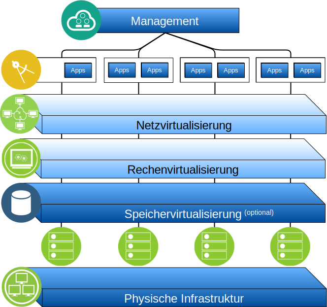

---

copyright:

  years:  2016, 2019

lastupdated: "2019-03-15"

subcollection: vmware-solutions

---

# IBM Cloud for VMware Solutions - Übersicht
{: #solution_overview}

Mit den Angeboten von {{site.data.keyword.vmwaresolutions_full}} können Sie Ihr bestehendes virtualisiertes VMware-Rechenzentrum auf {{site.data.keyword.cloud_notm}} ausweiten oder native Cloudanwendungen aufnehmen.

Die Lösung unterstützt Anwendungsfälle wie Kapazitätserweiterung in der Cloud (und Kapazitätsverringerung, wenn kein Bedarf besteht), Migration auf die Cloud, Disaster-Recovery in der Cloud und Sicherung in der Cloud. Mit der Lösung können Sie eine dedizierte Cloudumgebung für Entwicklungs-, Test-, Schulungs-, Labor- oder Produktionszwecke erstellen.

Prüfen Sie diese Informationen zum Design von {{site.data.keyword.vmwaresolutions_short}} vCenter Server, dessen Zielworkloads hohe Anforderungen an die Verfügbarkeit und Skalierbarkeit stellen.

Dieses Design dient als Basisarchitektur, die die Grundlage für andere interne oder anbieterspezifische Komponenten bereitstellt, die für bestimmte Anwendungsfälle hinzugefügt werden sollen.

Abbildung 1. Übersicht über VMware on {{site.data.keyword.cloud_notm}}

## Hauptvorteile von IBM Cloud for VMware Solutions
{: #solution_overview-benefits}

VMware vCenter Server on {{site.data.keyword.cloud_notm}} stellt die Grundbausteine bereit, zu denen VMware vSphere, vCenter Server, NSX und Optionen für gemeinsam genutzten Speicher wie vSAN gehören. Diese Komponenten sind erforderlich, um eine flexible Architektur für eine durch die VMware-Software definierte Lösung für das Rechenzentrum aufzubauen, die sich am besten für Ihre Workloads eignet.

Durch die erweiterte Automatisierung und die Bare-Metal-Infrastruktur für einzelne Tenants können Sie zügig innerhalb weniger Stunden die gesamte VMware-Umgebung in der {{site.data.keyword.cloud_notm}} bereitstellen. Anschließend können Sie auf die von IBM gehostete Umgebung über native VMware-Clients, Befehlszeilenschnittstellen (Command Line Interface, CLI), vorhandene Scripts oder durch andere vertraute und mit der vSphere-API kompatible Tools zugreifen und Managementoperationen ausführen.

Nach der Bereitstellung können Sie ESXi-Server für eine Instanz hinzufügen (und entfernen), Cluster hinzufügen und entfernen, zusätzliche vCenter Server-Instanzen mit einer vorhandenen Instanz verknüpfen und mithilfe der {{site.data.keyword.vmwaresolutions_short}}-Konsole Produkte und Services hinzufügen. Es liegt in Ihrer Verantwortung, die vCenter Server-Instanzen zu überwachen und zu verwalten.

Zu Ihrer Verantwortung gehören Backups, Patches, Konfiguration und Überwachung der VMware-Software und der zugrunde liegenden Hypervisor-Hardware. {{site.data.keyword.vmwaresolutions_short}} bietet automatisierte Lösungen für die laufende Verwaltung und Überwachung der vCenter Server-Instanz.

Darüber hinaus stehen Ihnen {{site.data.keyword.cloud_notm}} Professional Services und Managed Services zur Verfügung, mit denen Sie Ihren Einstieg in die Cloud mit Angeboten wie Migrations-, Implementierungs- und Onboarding-Services beschleunigen können..

Im Gegensatz zu einem Managed Service-Angebot bietet vCenter Server Ihnen vollständigen und umfassenden Zugriff auf alle Komponenten, die eine größere Flexibilität als ein verwalteter Service bieten. Es gibt jedoch bestimmte Einschränkungen, damit die Automatisierung von IBM Cloud for VMware Solutions nach der Bereitstellung von vCenter Server funktioniert.

Die VMware on {{site.data.keyword.cloud_notm}}-Angebote bieten die folgenden Vorteile:

* **Beschleunigte Lieferung** von IT-Projekten für Entwickler und Geschäftsbereiche durch Verringerung des Zeitaufwands für Beschaffung, Architektur, Implementierung und Bereitstellung von Ressourcen von Wochen oder Monaten auf Stunden.
* **Verbesserte Sicherheit** mit dedizierten Bare Metal Servern in einer gehosteten privaten Cloud, einschließlich Verschlüsselung ruhender Daten. Für den vSAN-Speicher ist die Verschlüsselung von ruhenden Daten entweder mit der vSAN- oder vSphere-Verschlüsselung optional. Für gemeinsam genutzte Speicher auf Dateiebene oder Blockebene ist die von Service-Providern verwaltete Verschlüsselung von ruhenden Daten standardmäßig in ausgewählten Rechenzentren verfügbar oder mit vSphere-Verschlüsselung optional. Sie müssen die erforderlichen Verschlüsselungsschlüssel verwalten.
* **Konsistente Management- und Governance-Funktionalität** der bereitgestellten Hybrid-Cloud durch Bereitstellung eines vollständigen Verwaltungszugriffs auf das Virtualisierungsmanagement, sodass vorhandene VMware-Tools, Scripts und Investitionen in Schulungen ihren Wert behalten.
* **Globale Nutzung von VMware-Know-how** mit IBM Professional Services und IBM Managed Services, die weltweit mehr als 30 {{site.data.keyword.CloudDataCents_notm}} umfassen.

## Zugehörige Links
{: #solution_overview-related}

* [Übersicht über das Design](/docs/services/vmwaresolutions/archiref/solution?topic=vmware-solutions-design_overview)
* [Skalierungskapazität](/docs/services/vmwaresolutions/archiref/solution?topic=vmware-solutions-solution_scaling)
* [Komponenten sichern](/docs/services/vmwaresolutions/archiref/solution?topic=vmware-solutions-solution_backingup)
