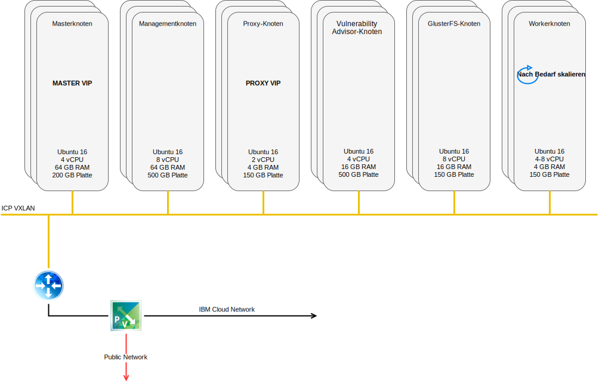

---

copyright:

  years:  2016, 2019

lastupdated: "2019-02-15"

---

# IBM Cloud-Netzbetrieb und -Infrastruktur
{: #vcscar-arch-overview-infrastructure}

## Virtual Routing and Forwarding
{: #vcscar-arch-overview-infrastructure-vrf}

{{site.data.keyword.cloud}}-Konten können auch als Konto mit Virtual Routing and Forwarding (VRF) konfiguriert werden. Ein VRF-Konto bietet eine ähnliche Funktionalität wie das VLAN-Spanning, sodass ein automatisches Routing zwischen IP-Teilnetzblöcken möglich wird. Alle Konten mit direkten Verbindungen (Direct-Link) müssen in VRF-Konten konvertiert oder als solche erstellt werden.

## Direct Link
{: #vcscar-arch-overview-infrastructure-direct-link}

{{site.data.keyword.cloud_notm}} Direct Link Connect bietet privaten Zugriff auf Ihre {{site.data.keyword.cloud_notm}}-Infrastruktur und auf alle anderen Clouds, die mit Ihrem Netzserviceanbieter über Ihr lokales {{site.data.keyword.CloudDataCent_notm}} verbunden sind. Diese Option ist optimal für die Konnektivität zu mehreren Clouds in einer einzelnen Umgebung geeignet.

Wir verbinden Kunden mithilfe einer gemeinsamen Bandbreitentopologie mit dem privaten {{site.data.keyword.cloud_notm}}-Netz. Wie bei allen Direct Link-Produkten können Sie globales Routing hinzufügen, das privaten Netzverkehr zu allen {{site.data.keyword.cloud_notm}}-Standorten ermöglicht.

## Virtuelle private Netze
{: #vcscar-arch-overview-infrastructure-virt-private-net}

### strongSwan-VPN
{: #vcscar-arch-overview-infrastructure-strongswan}

Der strongSwan-IPSec-VPN-Service stellt einen sicheren End-to-End-Kommunikationskanal über das Internet bereit, der auf der standardisierten IPSec-Protokollsuite (IPSec - Internet Protocol Security) basiert.

### Hybridität (HCX)
{: #vcscar-arch-overview-infrastructure-hcx}

Der Service "VMware vCenter Server on {{site.data.keyword.cloud_notm}} Hybridity Bundle" kann die Netze von lokalen Rechenzentren nahtlos in die {{site.data.keyword.cloud_notm}} erweitern. Dies ermöglicht die Migration von virtuellen Maschinen in die und aus der {{site.data.keyword.cloud_notm}}, ohne dass hierzu eine Konvertierung oder Änderung erforderlich ist.

## Physische Struktur
{: #vcscar-arch-overview-infrastructure-phys-structure}

Die physische Infrastruktur, die zur Bereitstellung einer {{site.data.keyword.icpfull_notm}}-Produktionsinstanz für einen VMware vCenter Server (VCS) on {{site.data.keyword.cloud_notm}}-Cluster erforderlich ist, setzt folgende Mindestspezifikationen voraus.

Tabelle 1. vCenter Server-Spezifikation für {{site.data.keyword.icpfull_notm}}

| NFS-Bereitstellung | vSAN-Bereitstellung |
:--|:----:|:----:
Anzahl Server | 3 | 4
CPU | 28 Kerne 2,2 GHz | 28 Kerne 2,2 GHz
RAM | 384 GB | 384 GB
Speicher | 2000 GB 2IOPS/GB Management, 2000 GB 4 IOPS/GB Workload, 4000 GB 4 IOPS/GB {{site.data.keyword.icpfull_notm}} | Mindest-SSD 960 GB x 2

Zusätzlich zu der Hardware, die für {{site.data.keyword.cloud_notm}} Private vorausgesetzt wird, müssen Sie persistente Datenträger in der {{site.data.keyword.cloud_notm}}-Umgebung erstellen, um die CAM-Datenbank- und -Protokolldaten (CAM = Cloud Automation Manager) zu speichern. CAM unterstützt zwar alle persistenten Datenträgertypen, die von {{site.data.keyword.cloud_notm}} unterstützt werden, für CAM empfohlen werden aber die Speicherkonfigurationen NFS und GlusterFS.

## Virtuelle Struktur
{: #vcscar-arch-overview-infrastructure-virt-structure}

Abbildung 1. Struktur der vCenter Server- und {{site.data.keyword.icpfull_notm}}-Bereitstellung

In der vCenter Server-Instanz wird die {{site.data.keyword.icpfull_notm}}-Instanz mit einem dedizierten NSX Edge Services Gateway (ESG) und dem Distributed Logical Router (DLR) bereitgestellt.
Die {{site.data.keyword.icpfull_notm}}-Installation wird in das VXLAN-Teilnetz geladen, das in den vorgenannten Komponenten definiert ist.

Das ESG ist mit einer Quellen-NAT-Regel (SNAT) konfiguriert, um abgehenden Datenverkehr zu ermöglichen, wodurch die Internetverbindung zum Download der {{site.data.keyword.icpfull_notm}} -Voraussetzungen und zur Konnektivität mit GitHub und Docker befähigt wird. Alternativ können Sie einen Web-Proxy für die Internetkonnektivität verwenden. Das ESG ist auch für den Zugriff auf DNS- und NTP-Services konfiguriert.

Das ESG ist zudem mit einer Ziel-NAT-Regel (DNAT) für die virtuellen {{site.data.keyword.icpfull_notm}}-Master-/Proxy-IP-Adressen vom {{site.data.keyword.cloud_notm}} 10.x-Netz bis zur VXLAN-Umgebung konfiguriert.

## Zugehörige Links
{: #vcscar-arch-overview-infrastructure-related}

* [Übersicht über vCenter Server on {{site.data.keyword.cloud_notm}} with Hybridity Bundle](/docs/services/vmwaresolutions/archiref/vcs?topic=vmware-solutions-vcs-hybridity-intro)
