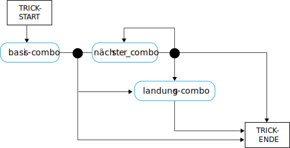

---

copyright:

  years:  2016, 2019

lastupdated: "2019-08-05"

subcollection: vmware-solutions


---

# Konzepte der Skater-Sprache
{: #vcscar-concepts}

## Skater-Sprache
{: #vcscar-concepts-skater}

Ein wichtiger Aspekt von Skate Advisor sind die über den mit Watson gesteuerten Chatbot ermöglichten Dialoge. Der folgende Abschnitt enthält detaillierte Informationen zu den Dialogregeln, die eine Benutzerinteraktion mit dem Chatbot von Skate Advisor definieren.

Die Skater-Sprache ist der zentrale Teil des Systems und wird folgendermaßen eingesetzt:
* Erkennung von Tricks: Hiermit nimmt Watson Discovery Material aus Online-Quellen auf, sodass vorhandene Tricks erkannt werden und dem Quellenmaterial zugeordnet werden können.
* Skater-Dialoge: Hiermit erzeugt der Chatbot aussagekräftige Dialoge mit dem Systembenutzer.
* Klassifizierung von Tricks: Hiermit wird ein Trick auf Grundlage der Textbeschreibung des Tricks gespeichert und klassifiziert. Metadaten wie Standort- und Videoverweise können klassifizierten Tricks zugeordnet werden.

## Sprachelemente
{: #vcscar-concepts-lang-elem}

### Basiselemente
{: #vcscar-concepts-core-elem}

Zur Erstellung eines Tricks werden die folgenden Basissprachelemente verwendet.

Tabelle 1. Basissprachelemente

Elementtyp | Sprachtext
---|---|---
Richtung | Fakie<br>Nollie<br>Switch
Drehung | Halfcab<br>Cab<br>180<br>360<br>540
Basis | Kickflip<br>Heelflip<br>Hardflip<br>Bigspin<br>Shuvit<br>Impossible
Landung | Manual (Hinterachse)<br>Nose Manual (Vorderachse)<br>5-0 (Grind)<br>Nosegrind<br>Tailslide<br>Noseslide<br>Crooked Grind<br>Smithgrind<br>Boardslide<br>Lipslide<br>

### Elementmodifikatoren
{: #vcscar-concepts-elem-modifiers}

Elementmodifikatoren sind spezielle Sprachelemente, die Kontext zu bestimmten Aspekten der Sprache geben.

Tabelle 2. Sprachmodifikatoren

Elementtyp | Sprachtext |Hinweise
---|---|---
Drehungspräfix | FS (Frontside)<br>BS (Backside) | Das Drehungspräfix bezieht sich auf die Richtung einer Drehung.
Varial | Inward<br>Outward |

## Sprachregeln
{: #vcscar-concepts-lang-rules}

Die Sprache wird mit dem folgenden Regelsatz konstruiert. Tricks werden in eine oder mehrere Kombination von Elementen unterteilt, die als "Combo" bezeichnet werden. Zwischen dem ersten Combo und den nachfolgenden Combos besteht dahingehend ein Unterschied, dass die Richtung derjenigen des Basis-Combos entspricht, sofern nichts anderes angegeben ist.

Als Referenzinformationen zu den folgenden Regeln gelten die Angaben für die Kernelemente und die Elementmodifikatoren, da diese zum Aufbau der Sprache verwendet werden.

### Regelsatz für Tricks
{: #vcscar-concepts-trick-ruleset}

```
basis-combo = 'richtung \+ \[varial | drehungspräfix\] \+ \[drehung\] \+ \[basistrick\]'
nächster_combo = ''\[varial | drehungspräfix\] \+ \[drehung\] \+ \[basistrick\]'
landungs-combo = ''\[varial | drehungspräfix\] \+ landung'
trick = 'combo \+ \[“to” + combo\] \+ \[“to” \+ landungs-combo\]'
```

### Regelengine für Tricks
{: #vcscar-concepts-trick-rule-engine}

Das folgende Diagramm gibt einen visuellen Überblick über die Regelengine.



## Sprachbeispiele für Tricks
{: #vcscar-concepts-sample-trick}

Die folgende Liste enthält Beispiele für Tricks:

```
fakie-kickflip
fakie-kickflip to fakie-5-0 to fronside-halfcab (out)
fakie-heeflip
fakie-heeflip to fakie-maual to fakie-hardflip
fakie-inward (varial) heeflip to fakie-backside tailslide to fakie
switch-heeflip to fakie-maual to fakie-hardflip
switch-hardflip to fakie-manual
fakie-hardflp to fakie-nosegrind
nollie-hardflip-to-tailslide
nollie-inward-heelflip to frontside noseslide
kickflip-frontside to crooked grind
halfcab-heelflip to crooked grind
frontside-shuvit to nosegrind to nollie-flip (out)
kickflip to nosegrind to nollie-impossilbe (out)
nollie-kickflip to noseslide to nollieflip
nollie-kickflip to frontside-lipslide
nollie-impossible to manual
nollie-impossible to 5-0
nollie-kickflip to crooked grind
nollie-kickflip to crooked grind to nollie-halfcab-kickflip (out)
frontside-nollie-halfcab-heelflip to fakie-nosegrind
backside-nollie-halfcab-kickflip to backside-tailslide to backside-180-out
frontside-nollie-cab-kicflip halfcab to backside-smithgrind
halfcab to backside-smithgrind to backside-180-bigspin (out)
kickflip-backside-tailslide to backside-180-kickflip
kickflip-backside-tailslide to backside-backside-bigspin
360-kicflip to nosemanual to nollie-360-kickflip
360-kicflip to frontside-lipslide
harflip to backside-lipslide
kicflip to frontside-boardslidev
nollie-heelflip to frontside-boardslide
```

## Relevanz
{: #vcscar-concepts-relevance}

Die Sprache für Tricks ist das Schlüsselkonstrukt, mit dem Watson für die Erkennung und Aufnahme von Dokumenten und Medien über das Skateboarding trainiert wird, und bildet außerdem die Grundlage für Dialoge mit dem Benutzer.
