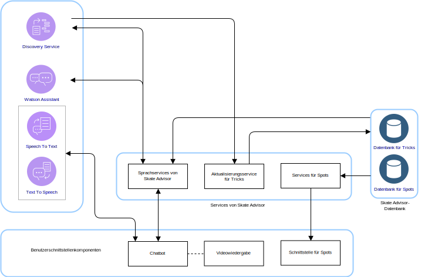
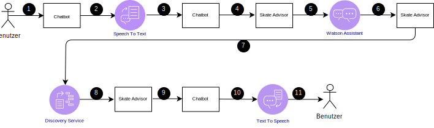
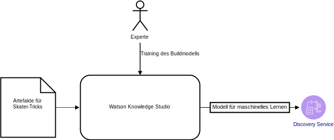

---

copyright:

  years:  2016, 2019

lastupdated: "2019-03-19"

subcollection: vmware-solutions

---

# Logisches Design von Skate Advisor
{: #vcscar-logical}

Dieser Abschnitt enthält detaillierte Informationen zu den Anwendungselementen, die das logische Design des Systems bilden.

## Systemkomponenten
{: #vcscar-logical-sys-comp}

Abbildung 1. Komponenten von Skate Advisor

Skate Advisor besteht in erster Linie aus einem Chatbot, der entweder Text- oder Spracherkennung akzeptieren kann, um auf strukturierte Weise mit dem System zu interagieren.

## Tricks
{: #vcscar-logical-tricks}

Das zentrale Datenelement von Skate Advisor ist der Trick. Ein Trick wird in der Sprache für Tricks eindeutig definiert. Diese Sprache ermöglicht die folgenden Tasks:
- Dialoge über Tricks mit dem Chatbot
- Suche nach Tricks mittels Watson Discovery
- Erkennung und Klassifizierung von Tricks beim Training von Watson Discovery mittels Quellenartikeln
- Ermittlung eines Tricks für Spots und Medienwiedergabe

### Trickdefinition
{: #vcscar-logical-trick-def}

Ein Trick wird durch das Sprachkonstrukt, das ihn beschreibt, eindeutig definiert. Eine vollständige Definition können Sie der Regelengine für Tricks entnehmen.

### Liste der Tricks
{: #vcscar-logical-list-tricks}

Durch eine Abfrage des Basistricks oder der Landung, die in Sprachelementen definiert sind, wird eine Liste von Tricks zurückgegeben.

### Trickdaten
{: #vcscar-logical-trick-data}

Nach der Rückgabe können Tricks die folgenden Informationen enthalten:
- Beschreibung des Tricks
- Eines oder mehrere Medienartefakte
- Informationen zu Spots

## Dialogdatenströme
{: #vcscar-logical-conv-streams}

Der Chatbot verfügt über eine vordefinierte und begrenzte Anzahl von möglichen Dialogen. Die Dialoge werden durch die folgenden Informationen definiert:
- Tricksuche: Hierbei wird anhand eines Parameters, der entweder den Basistrick oder die Landung darstellt, nach einer Gruppe von gültigen Tricks gesucht.
- Spotsuche: Hierbei wird ein nahegelegener Ort - ein sogenannter "Spot" - für einen Trick gesucht.
- Medienwiedergabe: Hiermit wird ein Medienelement wie beispielsweise ein Online-Video angezeigt, in dem ein Trick gefunden und anschließend klassifiziert wurde.

Tabelle 1. Dialog

Dialog | Struktur | Ergebnis
---|---|---
Tricksuche | Beschreibung eines Tricks |Liste mit Tricks
Spotsuche | Spot, an dem ein bestimmter Trick ausgeführt werden könnte | Liste von Spots für einen bestimmten Trick
Medienwiedergabe | Anzeige eines Videos für einen Trick |Liste mit Medienergebnissen

## Benutzerschnittstellenkomponenten
{: #vcscar-logical-ui-comp}

### Chatbot
{: #vcscar-logical-chatbot}

Der Chatbot ist eine Webkomponente, die mit dem Benutzer kommuniziert. Der Chatbot kann als Eingabe entweder Text oder Sprache akzeptieren. Ergebnisse wie beispielsweise Listen werden als Text dargestellt und unter Umständen von einer Sprachausgabe der Ergebnisse begleitet.

Chatbots interagieren auf die folgende Weise mit dem System:

Abbildung 2. Typische Chatbot-Abfrage
 

Tabelle 2. Chatbot-Interaktionen

Schritt | Beschreibung
---|---
1 | Es wird ein gültiger Dialog aufgebaut (siehe Abschnitt "Dialogdatenströme").
2 | Der Chatbot sendet Sprache an den Service "Speech to Text".
3 | Der Service "Speech to Text" sendet Text an den Chatbot.
4 | Der Chatbot sendet eine Textabfrage an Skate Advisor.
5 | Skate Advisor wertet die Anforderung aus und sendet sie an Watson Assistant.
6 | Watson Assistant klassifiziert die Anforderung und antwortet an Skate Advisor mit der auszuführenden Aktion.
7 | Skate Advisor fordert einen Datensatz vom Discovery-Service an.
8 | Der Discovery-Service wertet die Abfrage aus und sendet die Antwort.
9 |Skate Advisor bildet eine Antwort und sendet sie in Textform an den Chatbot.
10 | Der Chatbot sendet die Textantwort an den Service "Text To Speech".
11 | Das Ergebnis wird über den Chatbot an den Benutzer gesendet.

### Videowiedergabe
{: #vcscar-logical-video-render}

Die Komponente für die Videowiedergabe spielt ein Video ab und zeigt ein Dokument an. Diese Artefakte stellen das Quellenartefakt dar, aus dem der Trick erkannt wurde.

Die Komponente für die Videowiedergabe ist ein eingebettetes Widget in der Webschnittstelle, das ein Video anzeigt. Die Videos werden im Chatbot infolge einer Abfrage vom Systembenutzer angezeigt. Nach Auswahl des resultierenden Links zum Video wird die Videowiedergabe ausgelöst.

### Schnittstelle für Ort
{: #vcscar-logical-location-interface}

Skate Advisor enthält eine Schnittstelle für Systembenutzer, um einen Spot für einen bestimmten Trick aufzuzeichnen. Die Webschnittstellenkomponente umfasst zwei Hauptelemente:
1. Sie akzeptiert einen vom Systembenutzer angegebenen Spot als besten Ort für die Ausführung eines bestimmten Tricks.
2. Sie zeigt einen oder mehrere empfohlene Spots für einen bestimmten Trick an.

## Watson-Komponenten
{: #vcscar-logical-watson-comp}

Diese Architektur beinhaltet die folgenden Watson-Komponenten:
* Knowledge Studio - Watson Studio ist ein Tool, mit dem die Skater-Sprache für das System entworfen und zum Erkennen von Dokumenten aus dem Web verwendet werden kann, die die Skater-Sprache implementieren. Knowledge Studio stellt ein Modell für die Verwendung von Watson Discovery bereit.
* Speech to Text - Wandelt Sprache in Text um. Diese Komponente akzeptiert Eingaben in Audioform von einem Gerät, auf dem der Chatbot ausgeführt wird, und konvertiert sie zur Verarbeitung durch Watson in Text.
* Text to Speech - Erstellt synthetische Sprache aus Text. Diese Komponente akzeptiert Text aus der Anwendung "Skate Advisor" und konvertiert sie in eine Sprachausgabe für das Gerät, auf dem der Chatbot ausgeführt wird.
* Discovery-Service - Mithilfe des Watson Discovery-Service ruft das System Skater-relevanten Inhalt ab, der den angeforderten Parametern entspricht. Ein Beispiel wäre die Anforderung nach dem Auflisten aller Datensätze für den Trick "Casper". Watson Discovery nutzt intelligente Techniken des maschinellen Lernens, um die relevantesten Passagen aus dem aufgenommenen Inhalt zu extrahieren.
* Watson Assistant - Watson Assistant ist ein Tool, mit dem die Interaktionen zwischen Benutzern und der Maschine (Chatbot) gestaltet werden können. Es muss mit einer fachspezifischen Sprache (z. B. über das Skateboarding) in Form einer Serie von Grammatiken trainiert werden, für die Watson Assistant die entsprechenden Antworten erkennt und erstellt.

## Services von Skate Advisor
{: #vcscar-logical-skate-advisor-services}

Der Service "Skate Advisor" ist eine Anwendungskomponente, die eine Reihe von API-Services für die Ausgabe von Anforderungen bereitstellt. Die verfügbaren Services besitzen eine direkte Korrelation mit den oben beschriebenen Dialogdatenströmen. Die verfügbaren APIs umfassen die folgenden allgemeinen Kategorien:
* get_tricks - Gibt aufgrund einer Abfrage in natürlicher Sprache (<query\>) eine Liste mit Tricks zurück, die für den Discovery-Service bereitgestellt wird.
* show_tricks - Gibt eine Liste mit Medien für einen bestimmten Trick zurück.
* find_trick - Gibt einen bestimmten Trick zurück.
* accept_command - Akzeptiert einen Textbefehl aus dem Chatbot und bedient die Anforderung.

## Training für Discovery-Service
{: #vcscar-logical-disc-service-training}

Watson Discovery muss über ein Modell für maschinelles Lernen trainiert werden, das von einem Experten mithilfe von Watson Knowledge Studio iterativ erstellt wird.

Abbildung 3. Training für Discovery-Service
 

Bei Skate Advisor besteht das Modell aus der Beziehung zwischen Entitätstypen; es ist eine Kombination aus regelbasiertem Training und wörterverzeichnisbasiertem Training für die Erstellung eines Modells. Mithilfe dieses Modells kann der Discovery-Service Tricks erkennen und klassifizieren, die aus den als Trainingsset verwendeten Artikeln und Videobeschreibungen aufgenommen wurden.

Nach dem Training kann der Discovery-Service Abfragen wie beispielsweise Folgende beantworten:
- Alle Tricks mit dem Basistrick "Heelflip" anzeigen
- Alle Tricks anzeigen
- Alle Tricks mit mehreren Combos anzeigen

## Zugehörige Links
{: #vcscar-logical-related}

* [Übersicht über vCenter Server on {{site.data.keyword.cloud}} with Hybridity Bundle](/docs/services/vmwaresolutions/archiref/vcs?topic=vmware-solutions-vcs-hybridity-intro)
