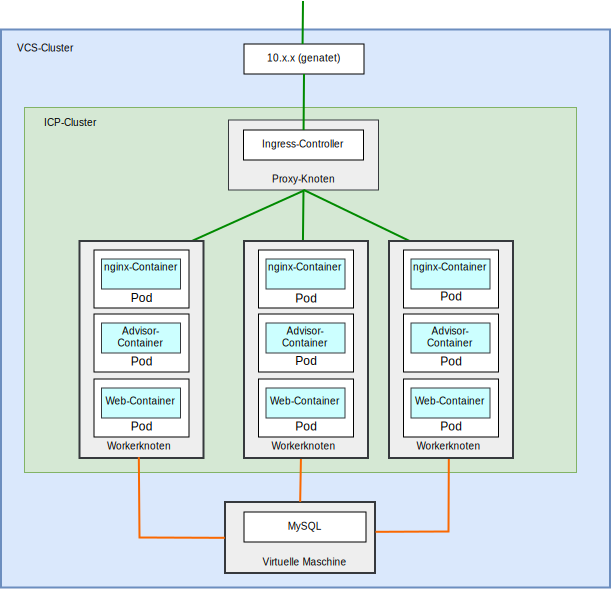
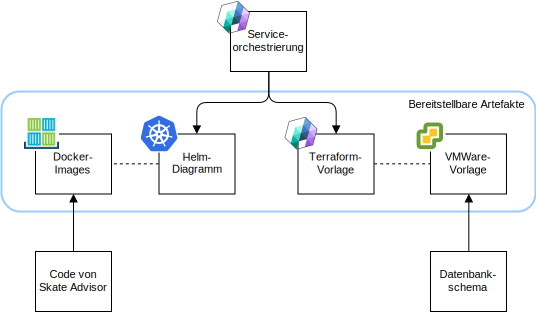
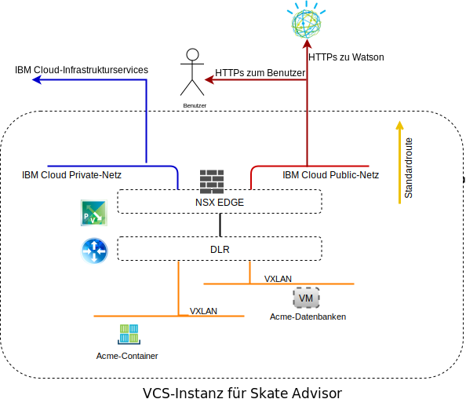
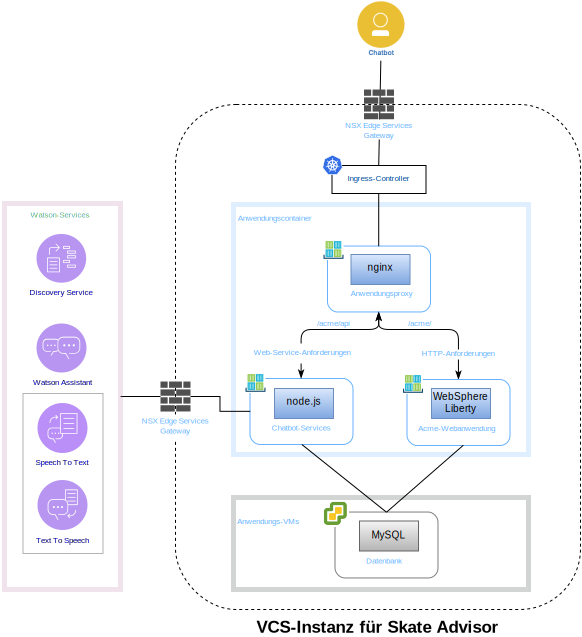
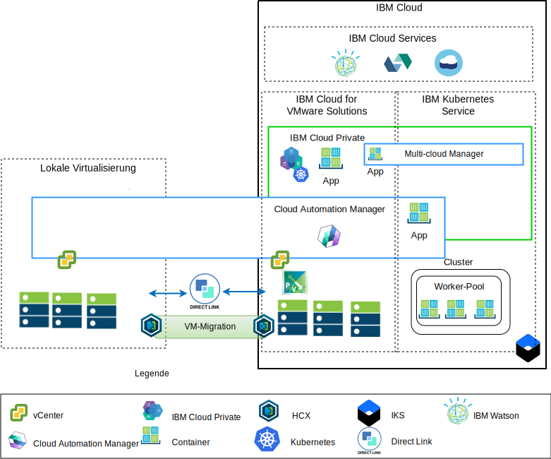

---

copyright:

  years:  2016, 2019

lastupdated: "2019-06-26"

subcollection: vmware-solutions

---

# Komponenten von "Skate Advisor"
{: #vcscar-physical}

{{site.data.keyword.vmwaresolutions_full}} stellt eine Automatisierung zur weltweiten Bereitstellung von VMware-Technologiekomponenten in {{site.data.keyword.CloudDataCents_notm}} bereit. Die Architektur besteht aus einer einzelnen Cloudregion und unterstützt die Erweiterung in weitere Cloudregionen, für deren Standort die folgenden Optionen bestehen:

1. Andere Geografie
2. Anderer {{site.data.keyword.cloud_notm}}-Pod im gleichen Rechenzentrum
3. Andere Geografie und anderer {{site.data.keyword.cloud_notm}}-Pod im gleichen Rechenzentrum

Die Produkte {{site.data.keyword.icpfull_notm}} und Cloud Automation Manager (CAM) können manuell auf Ihrer lokalen Virtualisierungsplattform bereitgestellt werden und ermöglichen so das Cloud-Management am lokalen Standort. Alternativ werden {{site.data.keyword.icpfull_notm}} und CAM als Serviceerweiterungen für eine vorhandene oder neue VMware vCenter Server on {{site.data.keyword.cloud_notm}}-Bereitstellung per Automation angeboten, wodurch das Cloud-Management über die {{site.data.keyword.cloud_notm}} ermöglicht wird.

{{site.data.keyword.icpfull_notm}} ist eine Anwendungsplattform für die Entwicklung und Verwaltung von lokalen, containerisierten Anwendungen. Es handelt sich um eine integrierte Umgebung für die Verwaltung von Containern, die Kubernetes als Container-Orchestrator, ein privates Image-Repository, eine Managementkonsole und Überwachungsframeworks enthält.

IBM Multi-Cluster Manager (MCM) bietet Benutzertransparenz, anwendungsorientiertes Management (Richtlinien, Bereitstellungen, Vitalität, Betrieb) und die richtlinienbasierte Konformität über Clouds und Cluster hinweg. Mit IBM Multi-Cluster Manager erhalten Sie die Kontrolle über Ihre Kubernetes-Cluster. Sie können sicherstellen, dass Ihre Cluster sicher sind, effizient arbeiten und das von Anwendungen erwartete Service-Level zur Verfügung stellen.

{{site.data.keyword.cloud_notm}} Automation Manager (CAM) ist eine Self-Service-Managementplattform für mehrere Clouds, die unter {{site.data.keyword.cloud_notm}} Private ausgeführt wird und es Entwicklern und Administratoren ermöglicht, die Anforderungen des Unternehmens zu erfüllen. Mit dem Service Composer von Cloud Automation Manager können Sie Hybrid-Cloud-Services im {{site.data.keyword.icpfull_notm}}-Katalog zugänglich machen.

## Physische Komponenten von "Skate Advisor"
{: #vcscar-physical-skate-comp}

Das folgende Diagramm beschreibt die Referenzimplementierung der Anwendung "Acme Skate Advisor" in einer Implementierung der Anwendungsmodernisierungsinfrastruktur.

Die Anwendung "Skate Advisor" erweitert die vorhandene Acme-Webanwendung durch eine auf Mikroservices basierende Komponente, die mit Watson und einem nginx-Container interagiert, um Anforderungen an den Web- und Mikroservices-Container weiterzuleiten.

Die Anwendung "Skate Advisor" nutzt die Anwendungsmodernisierungsplattform, die die erforderliche Hosting-Infrastruktur bereitstellt.

### Anwendungspaketierung und -bereitstellung
{: #vcscar-physical-app-pack-depl}

Die Anwendung wird als CAM-Orchestrierung bereitgestellt, die die folgenden Elemente enthält:
* Serviceorchestrierung - Eine CAM-Serviceorchestrierung ist eine Workflowressource, von der die Terraform-Vorlagen und Helm-Diagramme beschrieben werden, die als Facette eines Service bereitgestellt werden sollen. Ein Service kann veröffentlicht werden und stellt das steuernde Artefakt dar, aus dem die gesamte Bereitstellung orchestriert wird.
* Helm-Diagramm - Das Helm-Diagramm befindet sich im lokalen {{site.data.keyword.icpfull_notm}}-Repository; es stellt Container und andere Ressourcen für {{site.data.keyword.icpfull_notm}} bereit. Ein Helm-Diagramm ist eine Beschreibung der Kubernetes-Ressourcen, zu denen Folgende gehören:
  - Containerbereitstellungen
  - Services
  - Ingress
  - Regeln
  - Endpunkte

* Docker-Images - Docker-Images enthalten den Code für das Betriebssystem (ubuntu), die Middleware (WebSphere Liberty, nginx) sowie Skate Advisor und Skate Store. Docker-Images sind statische Objekte, die in aktiven Containern bereitgestellt werden.
* Terraform-Vorlage - Eine Terraform-Vorlage ist eine Datei, von der die Cloudressourcen beschrieben werden, die bereitgestellt werden sollen. Bei Skate Advisor handelt es sich hierbei um eine Ubuntu-Vorlage, die mit mysql vorinstalliert wird und das Datenbankschema beschreibt.
* VMware-Vorlage - Die VMware-Vorlage ist eine Ubuntu-Vorlage mit vorinstalliertem mysql und Datenbankschema.

### Lastausgleich und Weiterleitung
{: #vcscar-physical-load-balance-proxy}

Lastausgleich und Weiterleitung werden über die {{site.data.keyword.icpfull_notm}}-Komponente für den Ingress-Controller implementiert. Diese Komponente wickelt die Containerskalierung und das Failover reibungslos ab.

Die Anwendungsweiterleitung wird durch den nginx-Container zur Verfügung gestellt, der die Last folgendermaßen verteilt.

Tabelle 1. Reverse-Proxy-Regeln für Skate Advisor

URL	|Endpunkt
---|---
/acme	|Service für Acme-Web-Container
/acme/api	|Service für Skate Advisor
/acme/api/explorer	|Service für Skate Advisor

Container besitzen nicht vorhersagbare IP-Adressen, die je nach den Systemanforderungen herauf- oder herabskaliert werden können. Zur Überwindung dieses Problems wird innerhalb des Systems eine echtzeitorientierte IP-Adressauflösung mithilfe der {{site.data.keyword.icpfull_notm}}-Services durchgeführt.

### Webanwendung "Acme Skate"
{: #vcscar-physical-acme-skate-web-app}

Die Webanwendung "Acme Skate" ist eine Anwendung für Java Platform, Enterprise Edition (Java Platform, Enterprise Edition), die auf dem Spring-Framework basiert. Die Anwendung wird in einem WebSphere Liberty-Container bereitgestellt.

### Anwendung "Acme Skate Advisor"
{: #vcscar-physical-acme-skate-advisor-app}

Die Anwendung "Acme Skate Advisor" ist eine auf Mikroservices basierende Anwendung und wird in einem WebSphere Liberty-Container bereitgestellt. Ein Front-End für die Mikroservices wird durch einen nginx-Web-Server bereitgestellt.

### Datenbank "Acme Skate"
{: #vcscar-physical-acme-skate-db}

Die Datenbank "Acme Skate" ist eine MySQL-Datenbank, die auf einer mit vSphere verwalteten virtuellen Maschine bereitgestellt wird.

### Kommunikationsübersicht
{: #vcscar-physical-comm-overview}

Skate Advisor macht die folgende Kommunikation erforderlich:
-	Kommunikation des Web-Containers mit dem Systembenutzer
-	Kommunikation von Skate Advisor und Web-Container mit Watson-Services
-	Kommunikation zwischen dem Container und den VM-Bestandteilen der Implementierung

Zur Umsetzung dieses Ziels ist die Anwendungsmodernisierungsplattform mit den folgenden Komponenten ausgestattet.

{{site.data.keyword.cloud_notm}} verfügt über zwei Netze. Über das öffentliche Netz können Server aus dem Internet erreicht werden. Das private Netz ermöglicht Servern über einen Hochgeschwindigkeitsbackbone in allen {{site.data.keyword.CloudDataCents_notm}} die Kommunikation miteinander.

Mit Virtual Routing Appliance (VRA) können Kunden privaten und öffentlichen Netzverkehr weiterleiten, indem sie die VLANs der Appliance zuordnen.
Die Infrastrukturen von vCenter Server NSX Edge und {{site.data.keyword.containerlong_notm}} sind beide mit einer Standardroute zum öffentlichen Netz und einer 10.0.0.0/8-Standardroute zum privaten Netz konfiguriert.

Für alle definierten NSX-VXLANs ist in der {{site.data.keyword.containerlong_notm}}-Infrastruktur eine statische Route zur VRA-Appliance erforderlich. Von NSX Edge aus ist ein BGP-Peering mit VRA über das private Netz konfiguriert, was die Routenmitteilung und -einbeziehung der NSX-VXLANs ermöglicht. Dieses Peering ermöglicht dem NSX-VXLAN-Overlay-Netz die Kommunikation mit dem {{site.data.keyword.cloud_notm}}-Backbone und umgekehrt.

### Softwarekomponentenzuordnung
{: #vcscar-physical-soft-comp-mapping}

Die Anwendung "Skate Advisor" verwendet die folgenden Softwarekomponenten.

Die folgenden Softwarekomponenten werden verwendet:

* nginx	- Stellt Reverse-Proxy-Services für die Anwendung bereit.
Mikroservices und Anwendungsanforderungen werden an die richtigen Endpunkte verteilt.
* WebSphere Liberty - Hostet die Acme-Anwendung, die eine Anwendung für Java Platform, Enterprise Edition auf Spring-Basis ist.
* Node.js - Stellt das Mikroservice-Framework für den Chatbot zur Verfügung. Diese Anwendung verwendet Services von Watson.
* mysql - Die von Oracle Mysql bereitgestellte Anwendungsdatenbank.
* JavaScript - Der Chatbot ist eine auf JavaScripts basierende Anwendung, die im Client-Browser gehostet wird. Der Chatbot kommuniziert mit Watson über die auf Node.js basierenden Mikroservices.

## Übersicht über das Management
{: #vcscar-physical-mgmt-ovw}

Die Anwendung "Acme Skate Advisor" befindet sich in der {{site.data.keyword.cloud_notm}} und ist insofern ein kritischer Aspekt der Architektur. Die {{site.data.keyword.cloud_notm}} besitzt die folgende Architektur.

Das obige Diagramm zeigt {{site.data.keyword.icpfull_notm}} und CAM in einer Bereitstellung auf einer vCenter Server-Instanz mit Verbindungen zum lokalen vCenter und dem {{site.data.keyword.containerlong_notm}}-Service. Mithilfe von CAM können Systemadministratoren und Anwendungsentwickler virtuelle Maschinen lokal oder in der vCenter Server-Instanz und in Containern für die {{site.data.keyword.icpfull_notm}}- und {{site.data.keyword.containerlong_notm}}-Cluster bereitstellen.

Im Diagramm erstellt CAM logische Cloudverbindungen zu den vCenter-Instanzen, Cloud-Providern sowie den {{site.data.keyword.icpfull_notm}}- und {{site.data.keyword.containerlong_notm}}-Umgebungen. {{site.data.keyword.icpfull_notm}}-Cluster werden in jeder Rechenzentrums- oder Cloudumgebung bereitgestellt. MCM stellt den Mechanismus zur Verfügung, mit dem die {{site.data.keyword.icpfull_notm}}-Cluster in einer Managementansicht verbunden werden können.

## Zugehörige Links
{: #vcscar-physical-related}

* [Übersicht über vCenter Server on {{site.data.keyword.cloud_notm}} with Hybridity Bundle](/docs/services/vmwaresolutions/archiref/vcs?topic=vmware-solutions-vcs-hybridity-intro)
