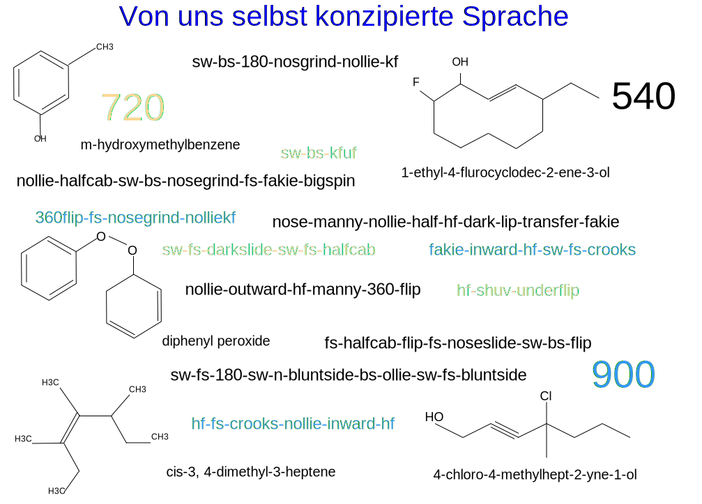

---

copyright:

  years:  2016, 2019

lastupdated: "2019-02-15"

---

# Vorwort
{: #vcscar-preface}

Abbildung 1. Von uns selbst konzipierte Sprache

## Einführung in die Skater-Sprache
{: #vcscar-preface-intro}

Die Kombination, in der Skater Bewegungen und Teilbewegungen in Tricks zusammenführen, bringt eine Art Grammatik oder Syntax hervor, die auf den stattfindenden Bewegungsabläufen basiert (vergleichbar mit der aus ähnlichen Gründen entwickelten chemischen Nomenklatur). Heutzutage kann ein Skater auf der einen Seite der Erde eine SMS mit dem Namen eines Tricks an einen anderen Skater auf der entgegengesetzten Seite des Planeten schicken und sicher sein, dass seine komplexen Bewegungsabläufe verstanden werden.

Der Reichtum der Sprache entsteht durch die Komplexität des Skateboardings selbst. Die Bewegungen des Skateboards (auch "Deck" genannt) sind kompliziert und lassen Dutzende von Basistricks zu, die auf unterschiedliche Weise ausgeführt sowie in zahlreichen Varianten wiederholt werden können und so eine riesige Zahl von Kombinationen ermöglichen. Eine Struktur im Format "Präfix-Stammelement-Suffix" für jede Komponente legt fest, wie die einzelnen Elemente bzw. Bewegungen verkettet werden; sie entspricht somit den realen Bewegungsabläufen von Deck und Skater gleichermaßen. Die physische Richtung und Mechanik der Kräfte bestimmt, welche Elemente zusammenpassen und welche nicht (was also diese Syntax hervorbringt).

Tricks können vom Heck (dem so genannten "Tail") oder vom Bug (der so genannten "Nose") des Decks ausgehen (z. B. *Ollie* oder *Nollie*), was dem vorderen oder dem hinteren Fuß des Skaters entspricht. Das Deck kippt, rollt und überschlägt sich in Kombinationen, die über drei Achsen in beiden Richtungen (im Uhrzeigersinn und gegen den Uhrzeigersinn) wiederholt werden. Der Skater kombiniert dann die Bewegungen des Decks mit seinen eigenen Bewegungen, was die Wiederholungen aufgrund von Richtung, Drehung und Grundhaltung durch mehrere Dimensionen ergänzt, die zusätzlich darauf basieren können, ob die Drehung in oder entgegen der Kipprichtung des Decks erfolgt.

Diese letzten beiden Varianten verdienen eine genauere Erläuterung. Zunächst einmal wird *Grundhaltung* leicht mit der linearen Richtung verwechselt. Alle Skater besitzen eine eigene Grundhaltung (entweder steht der linke oder der rechte Fuß vorne); die Ausführung eines *Switch*-Tricks (Wechsel der Grundhaltung) entspricht somit einem Spiegelbild des Tricks, ähnlich wie ein beidhändiger Schlagmann beim Baseball. Die Rückwärtsrichtung ist nebensächlich; primär wird nach "Händigkeit" oder "Füßigkeit" unterschieden.  Jeder Trick mit einem *Switch* verdient daher weitaus mehr Anerkennung und zwar nicht, weil er rückwärts ausgeführt wird, sondern weil alle Antriebsfunktionen auf die schwächere Seite, nämlich den "falschen" Fuß verlagert werden. Um einen Trick einfach rückwärts auszuführen (einen "Fakie"), werden einfach ein Minuszeichen vor die Richtung gesetzt und dieselben Antriebsfunktionen einbezogen, die nur unwesentlich schwieriger sind.

Die zweite, für fortgeschrittenere Skater wichtige Raffinesse hängt damit zusammen, ob der Flip *einwärts* oder *auswärts* erfolgt, abhängig davon, wie das (zweiachsige) Deck in Bezug auf den Körper kippt und dreht. Flip-Tricks können an beiden Enden des Decks auf jeder Seite des Fußes beginnen: *Kickflips* können im Uhrzeigersinn an den Zehenspitzen beginnen, während *Heelflips* genau entgegengesetzt ablaufen, wobei der Flip entweder mit dem oder gegen den natürlichen Bewegungsablauf erfolgt. Ein einwärts ausgeführter Flip ("Inward Flip") ist so unnatürlich, dass es dafür einen eigenen Begriff gibt, den so genannten *Hardflip*. Ein *Nollie Inward Kickflip* ist daher mit einem *Nollie Hardflip* identisch; beide erfordern eine größere Präzision, weil sie "gegen den Strich" ausgeführt werden.

Jede Komponente dieser Präfix-Basiselement-Suffix-Struktur kann somit in drei eher binäre Elemente aus Drehung, Richtung und Grundhaltung untergliedert werden; bei einigen Tricks muss angegeben werden, ob das Kippen ein- oder auswärts erfolgt. Das Skateboarding wäre ein Kinderspiel, wenn es nicht die Möglichkeit gäbe, Tricks zu kombinieren, was die Anzahl der Iterationen wie bei einem Schneeballsystem vergrößert. Mehrere Basistricks können in einzelnen Clustern aufgereiht werden, die aus Zweier-, Dreier- oder bei absoluten Profis selbst aus Fünfer- und sogar Sechsergruppen bestehen.

Die Anzahl der praktischen Iterationen geht bislang in die Hunderte, was aber lediglich eine Art Grundgerüst schafft; die echte Komplexität ist beim *Streetskating* zu erkennen, wo die Anzahl der Kombinationen quasi explodiert und in die Tausende geht.

In den frühen Neunzigerjahren haben Skater schnell damit begonnen, ihre zur ebenen Erde ausgeführten Tricks in ihre "organische" Umgebung auszudehnen (also auf Treppen, Simse, Geländer, Bänke, Grate, Schienen, Picknicktische, Pflanztröge), was die Dimensionalität der definierenden Elemente vergrößerte. Jahrzehntelang wurden Skater nicht müde, sich mit den endlosen Kombinationsmöglichkeiten von Tricks und Gelände zu beschäftigen. Dies gilt auch für das *Vertskaten* auf Rampen und in Pools, als Vertreter sei beispielsweise Tony Hawk genannt.

Während sich die meisten Basistricks im Lauf der Jahre etabliert haben, werden die persönlichen Fähigkeiten der Profis häufig durch die Möglichkeiten für Kombination und Anpassung in den Schatten gestellt. Unter anderem auch aus diesem Grund ist das Skaten viel eher Kunst als Sport. Der individuelle Ausdruck hat immer Vorrang vor der reinen Leistung. Und er ist außerdem der antreibende Motor für die Künstler, die als Activision-Franchise das unglaublich erfolgreiche Videospiel *Tony Hawk Pro Skater* geschaffen haben, das fast ein Jahrzehnt lang fortgesetzt wurde und auch Konkurrenzprodukte von *Electronic Arts* ausgelöst hat.

Durch das Training von Watson Assistant für die Nachahmung der Denkvorgänge von Topprofis konnte ein leistungsstarkes Tool zur Verfügung gestellt werden, das die Kreativität jedes Skaters weiterentwickeln kann, insbesondere im Spitzenbereich. Auch wenn die übrigen Board-Sportarten weit weniger komplex sind, sind sie doch insofern ein Beleg für den ungeheuren Einfluss des Skateboardings, als sie diese Konventionen ebenfalls übernehmen. Watson Assistant besitzt somit das Potenzial, den kreativen Ausdruck dieser jüngst zur olympischen Disziplin aufgestiegenen Sportart nicht nur zu fördern (oder sogar zu verwandeln), sondern auch andere künstlerische Vorhaben zu beeinflussen.

## Kodifizierung der Sprache
{: #vcscar-preface-codification}

Wie bei jeder Sprache fand auch im vorliegenden Fall die Entwicklung nach und nach statt, wobei sich unterwegs gelegentlich Redundanzen und Ausnahmen ergaben. Dennoch ist diese Nomenklatur bemerkenswert konsistent, beständig und spezifisch. Diese denotative Exaktheit und Konsistenz ändert das scheinbar unlösbare Problem, Fußbewegungen durch maschinelles Lernen in Text umzusetzen. Für Skater ist jede Nuance der komplexen Bewegung in die Nomenklatur selbst integriert. Faktisch ist diese Sprache so leistungsfähig, dass sie nicht nur von Snowboardern, sondern auch von Surfern übernommen wurde.

Trotz dieser Komplexität und dieses Leistungsvermögens ist die Kodifizierung der Sprache unkompliziert und präzise. Jeder *Basistrick* beinhaltet je eine Komponente für die *Richtung* und für die *Drehung* sowie eine weitere für die *Landung*, die bestimmt, ob und wie zur Bildung von Kombinationen eine Verkettung mit dem nächsten Basistrick erfolgen kann. Dies sind die vier *Basiselemente*. Ergänzt werden sie durch zwei weitere *Modifikatoren*, einem *Drehungspräfix*, das sich auf die Drehung des Skaters bezieht (im oder gegen den Uhrzeigersinn), sowie einem *Varial*, das angibt, wie sich das Deck bezogen auf den Körper dreht (einwärts oder auswärts). Mithilfe dieser Kodifizierung kann ein präziser Regelsatz rekursiv angewendet werden, der Kombinationen in beliebiger Länge ermöglicht.

## Zusätzliche Variablen für die Umgebung
{: #vcscar-preface-env-var}

Heutzutage verbringen Profis häufig ebenso viel Zeit mit dem Suchen nach Spots wie mit dem Üben der Tricks. Tatsächlich zeichnet sich jeder Skater unter anderem durch seine kreative Fähigkeit aus, Tricks auf neue und phantasievolle Weise anzupassen, die ihn oft weltweit bekannt macht. Es gibt zwar Anwendungen für Skater, die von der Community beigesteuerte Spots katalogisieren, aber es gab bislang weder die Idee noch die Technologie zur Erstellung einer Anwendung, die in der Lage ist, jeden Skater und insbesondere Profis bei diesem kreativen Prozess zu unterstützen.

Diese Referenzarchitektur veranschaulicht, wie Watson und die Cloud die enorme Online-Präsenz von Skatern auf YouTube, bei Google Images, in Online-Magazinen (Thrasher, Transworld), in Skater- und Videospielforen und vor allem die endlose Flut der neuesten Tricks aus der ganzen Welt nutzen, die sich täglich in den entsprechenden sozialen Medien zeigt, insbesondere auf Instagram. Darüber hinaus gibt es keine Übersetzungsprobleme, denn ähnlich wie eine Maschinensprache oder die Mathematik ist dies eine internationale Sprache, bei der weltweit dieselben Namen und Konventionen ohne Reibungsverluste verwendet werden.

Watson Knowledge Studio aktualisiert basierend auf der Abfrage eines bestimmten Skaters den Discovery-Service mit Trickbeschreibungen, Medienartefakten, Informationen zu Spots und weiteren Angaben. Der Chatbot ist mit einer begrenzten Zahl von Dialogen ausgestattet, deren Ausgangspunkt jeweils ein Trick bildet und die gleichermaßen auf den kreativen und auf den pragmatischen Gedankengängen von routinierten Profiskatern basieren. Watson Assistant kann so mit dem nächstgelegenen oder besten Spot für die Ausführung eines bestimmten Tricks oder mit einer breiteren Palette von Geländen antworten, die nicht nur für diesen Trick, sondern auch für andere Tricks geeignet sind, die von demselben Basiselement ausgehen (also Variationen darstellen).

Ein Skater kann Watson Assistant beispielsweise nach einer Liste aller möglichen Variationen für einen *hardflip-to-backside-5-0* fragen. Diese Anforderung wird zur Eingabe für den Discovery-Service von Sprache in Text konvertiert, woraufhin der Service nicht nur mit Variationen des Typs *hardflip-to-grind*, sondern auch mit einer Liste der unterschiedlichen Geländeformen antwortet, die in den Variationen erfasst sind und wiederum weitere Variationen hervorbringen können, wozu beispielsweise eine Liste von nach Postleitzahl, Größe oder sogar Verfügbarkeit (Schulhof oder Betriebsgelände) gruppierten Geländern gehören kann. In den vorhandenen Anwendungsdaten gibt es Systeme zur Bewertung des Risikos, bei unerlaubtem Betreten erwischt zu werden. Eine solche Unterstützung hat einen enormen Einfluss auf die lawinenartigen Folgen von Variablen wie beispielsweise jene, die Profiskatern in ihrem kreativen Alltag helfen.

## Cloudplattform
{: #vcscar-preface-cloud-platform}

Die kreative Ebene von IT-Systemen für die Generierung neuer Kombinationen spricht den Kernpunkt des Skateboardings an. Sie ist in der Lage, sich allmählich im Leben von Kreativen auszubreiten und sie überall auf der  ganzen Welt zu Innovationen zu inspirieren.
All dies wäre ohne die {{site.data.keyword.cloud}} nicht möglich.

## Zugehörige Links
{: #vcscar-preface-related}

* [Übersicht über vCenter Server on {{site.data.keyword.cloud_notm}} with Hybridity Bundle](/docs/services/vmwaresolutions/archiref/vcs?topic=vmware-solutions-vcs-hybridity-intro)
