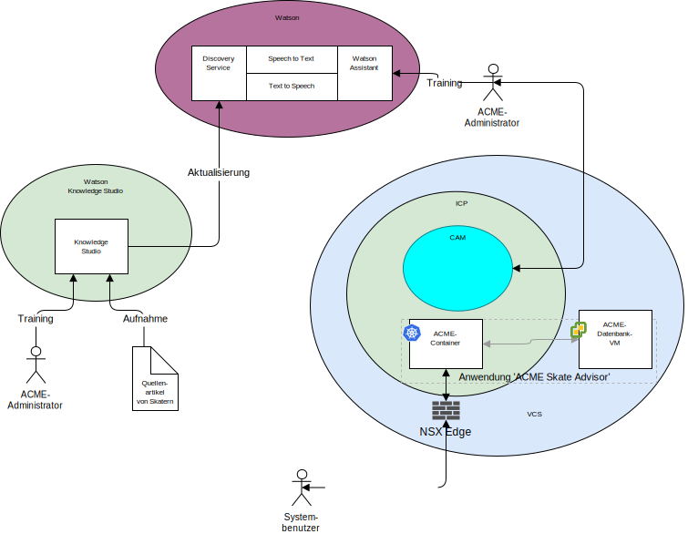

---

copyright:

  years:  2016, 2019

lastupdated: "2019-06-26"

subcollection: vmware-solutions

---

# Systemkontext
{: #vcscar-syscontext}

Das folgende Diagramm zeigt den Systemkontext für diese Referenzarchitektur. Ein Systemkontextdiagramm definiert die Schlüsselelemente eines Systems, die Grenzen des Systems sowie die Entitäten, die mit ihm interagieren, zusammen mit der Interaktion. Dieses übergeordnete Diagramm vermittelt dem Leser eine erste Sicht auf ein System.

Die Kernkomponenten des Systemkontextes sind Folgende:
- vCenter Server - VMware vCenter Server on {{site.data.keyword.cloud_notm}} ist eine {{site.data.keyword.cloud_notm}} for VMware Services-Instanz, die das Ziel für migrierte virtuelle Maschinen (VMs) aus der lokalen Umgebung darstellt. Zusammen mit der lokalen Virtualisierung bildet sie eine Hybridumgebung und ermöglicht virtuellen Maschinen den Wechsel aus einer Umgebung in die andere Umgebung.
- {{site.data.keyword.icpfull_notm}} - {{site.data.keyword.icpfull_notm}} ist eine Anwendungsplattform zur Entwicklung und Verwaltung von containerisierten Anwendungen. Bei der {{site.data.keyword.icpfull_notm}}-Umgebung handelt es sich um eine integrierte Umgebung, die Kubernetes als Container-Orchestrator, ein privates Image-Repository, eine Managementkonsole, Überwachungsframeworks und eine grafische Benutzerschnittstelle enthält, von der aus Sie Anwendungen zentral bereitstellen, verwalten, überwachen und skalieren können.
- {{site.data.keyword.cloud_notm}} Automation Manager - CAM ist eine auf Unternehmen abgestimmte IaC-Plattform (IaC = Infrastructure as Code), die eine zentrale Bereitstellung von VMware-basierten Workloads neben Kubernetes-basierten Workloads sowie die Automatisierung der Workloadbereitstellung unabhängig davon bietet, ob virtuelle Maschinen oder Container verwendet werden und wie deren Infrastrukturanforderungen beschaffen sind.
- Watson - Watson ist die IBM Plattform für künstliche Intelligenz und kognitive Lösungen.
- Watson Knowledge Studio - Watson Knowledge Studio stellt ein Modell für die Verwendung von Watson Discovery bereit.

## Akteure
{: #vcscar-syscontext-actors}

Im Systemkontextdiagramm sind die folgenden Akteure angegeben:
* Acme-Administrator - Der Administrator ist für die kontinuierliche Bereitstellung und Wartung der Anwendung zuständig, was unter anderem die folgenden laufenden Tasks beinhaltet:
  - Training des Chatbots
  - Training des Discovery-Service
* Systembenutzer - Der Systembenutzer ist der Benutzer des Systems. Der Benutzer kommuniziert mit dem System mittels eines Browsers auf einem browserfähigen Gerät.

## Systeme
{: #vcscar-syscontext-systems}

Im Systemkontextdiagramm sind die folgenden Systeme angegeben:
* Knowledge Studio - Watson Studio ist ein Tool, mit dem die Skater-Sprache für das System entworfen und zum Erkennen von Dokumenten aus dem Web verwendet werden kann, die die Skater-Sprache implementieren.
* Speech to Text - Wandelt Sprache in Text um. Diese Komponente akzeptiert Eingaben in Audioform von einem Gerät, auf dem der Chatbot ausgeführt wird, und konvertiert sie zur Verarbeitung durch Watson in Text.
* Text to Speech - Erstellt synthetische Sprache aus Text. Diese Komponente akzeptiert Text aus der Anwendung "Skate Advisor" und konvertiert sie in eine Sprachausgabe für das Gerät, auf dem der Chatbot ausgeführt wird.
* Discovery-Service - Mithilfe des Watson Discovery-Service ruft das System Datensätze für das Skateboarding ab, die den angeforderten Parametern entsprechen. Ein Beispiel wäre `Alle Datensätze für den Trick "Casper" auflisten`. 
* Watson Assistant - Mithilfe des Watson Discovery-Service ruft das System Skater-relevanten Inhalt ab, der den angeforderten Parametern entspricht. Ein Beispiel wäre `Alle Datensätze für den Trick "Casper" auflisten`. Watson Discovery nutzt intelligente Techniken des maschinellen Lernens, um die relevantesten Passagen aus dem aufgenommenen Inhalt zu extrahieren.
* Datenbank - Die Datenbank für die Anwendung "Acme Skate Advisor" befindet sich auf einer virtuellen Maschine, die durch vCenter Server verwaltet wird.
* Anwendungscontainer - Dies sind die Anwendungen, die den Anwendungsmodernisierungsprozess durchlaufen haben und jetzt als Container ausgeführt werden. Bei dieser Referenzarchitektur und in diesem Beispiel für Acme Skateboards ist eine der containerisierten Anwendungen ein Web-Server, der Teil der Workload für die Onlinepräsenz ist. Die Acme-Container dienen als Hosts für die Acme-Webanwendung und die Anwendung "Acme Skate Advisor".
* NSX Edge - NSX Edge-Instanzen sind virtuelle Appliances, die den ein- und ausgehenden Nord-Süd-Datenverkehr der vCenter Server-Instanz verwalten.

## Zugehörige Links
{: #vcscar-syscontext-related}

* [Übersicht über vCenter Server on {{site.data.keyword.cloud_notm}} with Hybridity Bundle](/docs/services/vmwaresolutions/archiref/vcs?topic=vmware-solutions-vcs-hybridity-intro)
