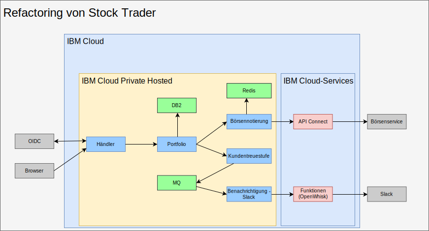
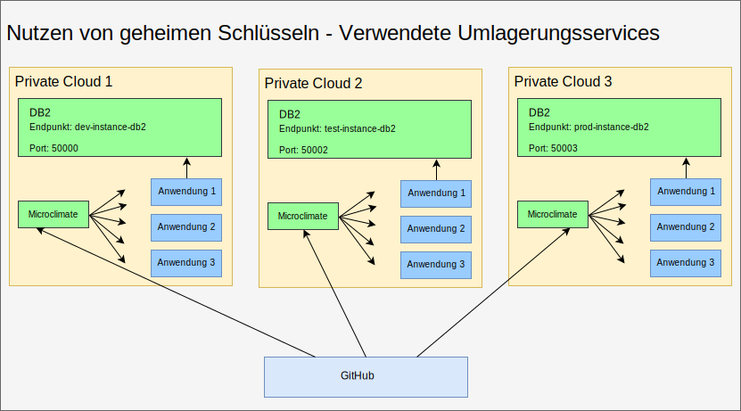
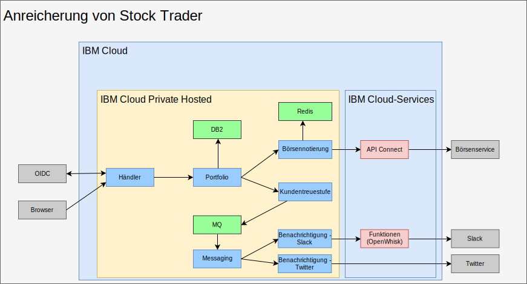

---

copyright:

  years:  2016, 2019

lastupdated: "2019-02-15"

---

# Refactoring ausführen und Middleware in IBM Cloud Private hinzufügen
{: #vcscontent-addmidware}

Da Stock Trader in einem Container ausgeführt wird und Jane mit den aktuellen Mikroservices zufrieden ist, arbeitet sie mit Todd jetzt daran, wie die Anwendung durch zusätzliche Funktionalität erweitert werden kann. Beim Refactoring der Mikroservices für Stock Trader zur Abwicklung einer gestiegenen Aktivität und Skalierbarkeit stellen beide fest, dass Middleware in {{site.data.keyword.cloud}} Private hinzugefügt werden muss. Ein Teil der Middleware ist bereits im Rechenzentrum vorhanden, so dass es sich bei diesem Vorgang eher um eine Erneuerung der Plattform handelt, bei der einige Middleware hinzugefügt wird.

Abbildung 1. Refactoring von Stock Trader

Dieses Refactoring der Lösung ergibt eine gemeinsame Plattform für die Ausführung der Anwendung und der erforderlichen Services und auf diese Weise eine einfachere Managementebene.

## Inhaltsoptionen
{: #vcscontent-addmidware-content-choices}

{{site.data.keyword.cloud_notm}} Private verfügt über eine große Auswahl an Inhalten; sowohl Todd als auch Jane müssen entscheiden, was ihre Anforderungen am besten erfüllt. Beim Blick in den {{site.data.keyword.cloud_notm}} Private-Katalog stellt Todd fest, dass ein Großteil des Inhaltes zum Ausprobieren verfügbar ist, jedoch einiger Inhalt gekauft und bei Passport Advantage heruntergeladen werden muss.

* Toolchain und Laufzeitumgebungen
  - UrbanCode Deploy
  - Microclimate
  - Jenkins (Open Source)
  - IBM WebSphere Liberty (MicroProfile, Web Profile, Java Platform, Enterprise Edition Profile)
  - Open Liberty (Open Source)
  - Node.js-Laufzeit (Open Source)
  - Swift-Laufzeit (Open Source)
  - nginx (Open Source)
  - IBM WebSphere Application Server for {{site.data.keyword.cloud_notm}} Private VM Quickstarter Community Edition

* Integration
  -	IBM Integration Bus
  -	IBM Integration Bus for Developers
  -	IBM DataPower Gateway Virtual Edition
  -	IBM DataPower Gateway for Developers
  -	IBM API Connect Professional
  -	IBM API Connect Enterprise
  -	IBM App Connect Enterprise Developer Edition
  -	IBM App Connect Enterprise 11.0.0

* Data Science und Geschäftsanalyse
  -	IBM Data Science Experience Local
  -	IBM Data Science Experience Developer Edition
  -	IBM Watson Explorer Deep Analytics Edition
  -	IBM PowerAI (mit ILAN-Lizenz, Unterstützungsangebot verfügbar)
  - IBM PowerAI Vision

* Datengovernance und Integration
  -	IBM InfoSphere Information Server for Evaluation Mobile
  -	IBM Mobile Foundation

* Konnektivität
  -	IBM Voice Gateway Developer (Testversion)

* Anwendungsmodernisierungstools
  -	IBM Transformation Advisor

* Messaging
  -	IBM MQ Advanced
  -	IBM MQ Advanced for Developers
  -	Rabbit MQ (Open Source)
  -	IBM Event Streams Tech Preview (basiert auf Apache Kafka)

* Digitale Geschäftsautomatisierung
  -	IBM Operational Decision Manager
  -	IBM Operational Decision Manager for Developers
  -	IBM FileNet Content Manager 5.5
  -	IBM Content Foundation 5.5

* Datenservices
  -	IBM Db2 Direct Advanced Edition / AESE mit Data Server Manager
  -	IBM Db2 Dev-C
  -	IBM Data Server Manager (für Db2 Dev-C)
  -	IBM Db2 Warehouse Enterprise
  - IBM Db2 Warehouse Dev-C
  -	IBM Cloudant Developer Edition
  -	MongoDB (Open Source)
  -	PostgreSQL (Open Source)
  -	MariaDB (Open Source)
  -	Galera-Clustering mit MariaDB (Open Source)
  -	Redis (Open Source)

* HPC / HPDA
  -	IBM Spectrum LSF Community Edition
  -	IBM Spectrum Symphony Community Edition
  -	IBM Spectrum Conductor Technical Preview

* Multi-Cloud-Management
  -	{{site.data.keyword.cloud_notm}} Automation Manager

* Watson
  -	IBM Watson Compare & Comply: Elementklassifizierung
  -	Compliance Assist

* Management
  -	IBM Netcool - Integration (Testmonitor für {{site.data.keyword.icpfull_notm}} Services – Ereignisprotokollierung und Alertüberwachung)
  - {{site.data.keyword.cloud_notm}} App Management 2018.2.0
  -	IBM Netcool - Integration (Testmonitor zur Verwaltung von {{site.data.keyword.icpfull_notm}}-Ereignissen. Enthalten in IBM
Netcool Insights-Produkt)
  - {{site.data.keyword.cloud_notm}} Event Management for IBM Cloud Private (mit ILAN-Lizenz für Erkennung und Test aus dem Katalog)
  - IBM Operations Analytics Predictive Insights Mediation Pack (Verwaltung von
{{site.data.keyword.icpfull_notm}}-Übewachungsmetriken. Mit ILAN-Lizenz für Erkennung und Test aus Katalog) -	IBM Operations Analytics Predictive Insights Mediation Pack (wird mit Produkt "Predictive Insights" verkauft)

* Netzbetrieb
  -	F5 BIGIP Controller (Open Source)
  -	Calico BGP-Peer (Open Source)
  -	strongSwan IPSec VPN (Open Source)

* Speicher
  -	IBM PowerVC FlexVolume Driver (Open Source und von PowerVC unterstützt)
  - GlusterFS-Speichercluster mit Heketi-Lebenszyklusmanagement (Open Source)
  -	Beispiel-NFS für Container Storage Interface (CSI)
  -	Treiber (Open Source)
  -	Rook Ceph Cluster (Open Source)

* Tools
  -	Web Terminal (Open Source)
  -	Skydive - Netzanalyseprogramm (Open Source)

Basierend auf der von Jane entwickelten Lösungsarchitektur verwendet Todd für Stock Trader anfänglich [Db2](https://console.cloud.ibm.com/catalog/services/db2-hosted), [MQ](https://console.cloud.ibm.com/catalog/services/mq) und [Redis](https://console.cloud.ibm.com/catalog/services/databases-for-redis).

## Middleware hinzufügen
{: #vcscontent-addmidware-add-middleware}

Um Middleware in {{site.data.keyword.cloud_notm}} Private hinzuzufügen, suchen Sie im Katalog nach dem [Helm-Diagramm](https://github.com/IBM/charts/blob/master/stable/ibm-microclimate/README.md), lesen Sie die Readme-Datei und fahren Sie dann mit der Installation fort.

Für Stock Trader beschließt Todd, die gesamte Middleware hinzuzufügen. In den folgenden Abschnitten ist zusammengefasst, was Todd für jede Middleware ausführen muss, die Jane verwenden soll.

### Db2
{: #vcscontent-addmidware-db2}

Todd beginnt mit Db2, weil Db2 bereits verwendet wird und für jede Lösung eine containerbasierte Db2-Instanz dediziert werden kann.

Da Todd {{site.data.keyword.icpfull_notm}} vorbereitet hat, hat er bereits seine Podsicherheitsrichtlinie definiert. Er kann sich nun auf die Erstellung eines geheimen Schlüssels für Docker-Images konzentrieren:

`kubectl create secret docker-registry db2dockerregistry
--docker-username=dockeruser
--docker-password=XXXXXXXX-XXXX-XXXX-XXXX-XXXXXXXXX
--docker-email=dockeruser@email.com --namespace=default`

Da sich Todd für die Verwendung von NFS entschieden hat, hat er gemäß den Anforderungen in der Readme-Datei NFS-Datenträger erstellt:

Wechseln Sie in das {{site.data.keyword.icpfull_notm}}-Dashboard und erstellen Sie persistente Datenträger. Die erforderliche Größe können Sie der Readme-Datei entnehmen:

`capacity=20Gi
RWO
type=NFS
server = nfs.server.ip.address
path = /shared/db2trader1`

Suchen Sie in der Katalogbenutzerschnittstelle nach "Db2" und klicken Sie auf "ibm-db2oldp-dev". Lesen Sie die Readme-Datei und klicken Sie dann auf "Konfigurieren".

Unter "Konfigurieren" gibt es einen Abschnitt "Schnelleinstieg" und einen Abschnitt "Alle Parameter". Todd öffnet den Abschnitt "Alle Parameter", weil er weitere Konfigurationsdaten eingeben muss:

*	Releasename = db2trader1
*	Namensbereich = default
*	Zustimmung zur Lizenzvereinbarung
*	Datenbankname = trader
*	Name des geheimen Schlüssels = db2dockerregistry
*	Servicename = db2trader1-ibm-db2oltp-dev
*	Servicetyp = NodePort
*	Port = 50000
*	Db2-Instanzname = db2inst1
*	Kennwort für Db2-Instanznamen = xxxxxx
*	Auswahl von "Persistenz für diese Bereitstellung aktivieren"

Nachdem Db2 aktiviert wurde, muss Todd oder Jane die Tabellen erstellen, die von der Lösung "Stock Trader" verwendet werden.

### MQ
{: #vcscontent-addmidware-mq}

Todd und Jane benötigen eine Messaging-Software, und da sie bereits MQ verwenden, ist dies eine sehr gute Möglichkeit. Darüber hinaus ist die Ausführung mit einem geringen Speicherbedarf möglich und für jeden Anwendungsentwickler kann die Entwicklerversion genutzt werden, was kostspieligen Produktionsdatenverkehr einspart. Die Installation von MQ ist relativ einfach. Todd erstellt den Speicher wie zuvor bei Db2 und installiert anschließend das Helm-Diagramm:

{{site.data.keyword.icpfull_notm}}-Dashboard > Katalog > Eingabe mit MQ beginnen > Auswahl von "ibm-mqadvanced-server-dev". Anschließend muss die Readme-Datei gelesen und auf "Konfigurieren" geklickt werden, danach werden die folgenden Eingabewerte zur Verfügung gestellt bzw. geprüft:

`Releasename = mqtrader1
Zielnamensbereich = stock-trader
Zustimmung zur Lizenzvereinbarung
Aktivierung der Persistenz
PVC-Datengröße = 2Gi
Servicetyp = NodePort
Warteschlangenmanagername = stocktrader
Administratorkennwort = mq1pw
Anwendungskennwort = KEINE ANGABE`

Zunächst wählt Todd "NodePort" aus, um die Middleware von der Benutzerschnittstelle aus abzurufen. Später kann Todd dann die Cluster-IP verwenden, damit nur Pods innerhalb des Clusters die Middleware abrufen können.

Zum Konfigurieren von MQ für die Verwendung von Stock Trader öffnet Todd die Benutzerschnittstelle für das MQ-Management, die genau mit der Version für virtuelle Maschinen identisch ist.

### Redis
{: #vcscontent-addmidware-redis}

Obwohl Stock Trader in {{site.data.keyword.cloud_notm}} Private Hosted ausgeführt wird, ist die Latenzzeit des Börsennotierungsservice weiterhin ein wichtiger Aspekt, denn für einen Großteil der Nutzer ist vor allem das Vortagsende der Börse von vorrangigem Interesse. Um die Leistung zu verbessern, fügen sie einen Redis-Cache hinzu.

Diese Bereitstellung verwendet das Diagramm "ibm-redis-ha-dev" aus "ibm-charts".

Mit diesem Diagramm werden standardmäßig sechs Pods installiert, nämlich ein Master, zwei Slaves und drei Sentinels. Dies ist ein hervorragendes Beispiel für die Ausfallsicherheit in Kubernetes, wo mehrere Pods über viele Workerknoten hinweg sogar dann zusammenarbeiten, wenn sich die Workerknoten in mehreren Teilnetzen befinden.

Die Konfiguration ist einfach; Todd gibt daher den Namensbereich ein, in dem sie installiert werden soll, und beginnt mit der Installation.

## Refactoring von Stock Trader ausführen
{: #vcscontent-addmidware-refactor-stock-trader}

Das Refactoring von Stock Trader ist ein wichtiger Schritt für Jane. Während Todd damit beschäftigt war, die Middleware in {{site.data.keyword.cloud_notm}} Private hinzuzufügen, hat Jane ein Refactoring für ihre Lösung ausgeführt, um sie für Kubernetes und das Cloudverhalten zu optimieren.

Bei der Umwandlung von Stock Trader hat Jane beispielsweise jede einzelne Datei ".war" in einem Liberty-Container hinzugefügt, aber die Konfiguration von WebSphere Application Server Network Deployment verwendet, um auf die Datenquelle zu verweisen. Dies war ein guter Anfang; Janes Anwendung wird durch die Planung und Orchestrierung von Kubernetes sofort aufgewertet.

Die Optimierung, die Jane bei ihren Mikroservices (durch Änderung und Build des Programmcodes) für die Kubernetes-Welt vornimmt, bringt viele weitere Vorteile mit sich.

Zur Optimierung hat Jane die folgenden Schritte ausgeführt:
-	Sie hat den Code in ihrem Code-Repository aktualisiert (Jane nutzt GitHub Enterprise).
-	Sie hat eine Pipeline hinzufügt (hierzu verwendet sie Jenkins).
-	Sie hat den Build mit Maven erstellt.

Das folgende Beispiel zeigt Janes [Code-Repository](https://github.com/IBMStockTrader/) zusammen mit der Jenkins-Datei "server.xml" und anderem. Auf dieser bestehenden Grundlage kann Jane nach Belieben zusätzliche Funktionalität über geheime Schlüssel für den Zugriff auf Services wie ODM und Watson sowie weitere Mikroservices als einzelne Repositorys in GitHub codieren.

### Geheime Schlüssel hinzufügen
{: #vcscontent-addmidware-add-secrets}

Nachdem Jane das Refactoring der Mikroservices für Stock Trader abgeschlossen hat, benötigt sie jetzt ein Verfahren, mit dem die Servicenamen, Benutzer-IDs und Kennwörter abstrahiert werden können, damit die Anwendung nach der Bereitstellung eindeutige Details über den Service abrufen kann, ohne dass bestimmte Namen fest codiert werden müssen und ein erneuter Build der Anwendung erforderlich ist.

Mit geheimen Kubernetes-Schlüsseln konfiguriert Jane einen klar strukturierten Namen des geheimen Schlüssels und Parameter innerhalb jedes geheimen Schlüssels, um sicherzustellen, dass der Mikroservice nach seiner Bereitstellung die eindeutigen Werte für Hostname, Benutzer-ID, Kennwort oder andere sensible Berechtigungsnachweise abruft, wodurch ihre Anwendung portierbar wird.

Obwohl Stock Trader möglicherweise in mehr als einer Cloud ausgeführt wird, strebt Jane eine vereinheitlichte Codebasis an. Der geheime Db2-Schlüssel in der folgenden Abbildung besitzt andere Routing-Details, jedoch in identischem Format. Nachdem der Portfolio-Mikroservice von Jane bereitgestellt wurde, sucht er nach dem Endpunktparameter des geheimen Db2-Schlüssels, um eine Verbindung zur entsprechenden Db2-Instanz herzustellen. Für die Anwendung "Stock Trader" ist es unerheblich, ob sie in einer virtuellen VMware-Maschine, einem containerisierten Service oder einem
von der Cloud verwalteten Service ausgeführt wird.

Abbildung 2. Stock Trader - Services umlagern

## Ergebnis
{: #vcscontent-addmidware-result}

Da Jane das Refactoring ihrer Lösung "Stock Trader" festgeschrieben hat und Todd Middleware in {{site.data.keyword.cloud_notm}} Private Hosted installiert hat, wird die Lösung "Stock Trader" vollständig in einer privaten Cloud ausgeführt. Jane fügt jetzt weitere Mikroservices wie beispielsweise einen Benachrichtigungsservice für Twitter hinzu. Istio-Routing-Regeln ermöglichen das dynamische Messaging nach Kundentreuestufen über einen internen Slack-Kanal oder einen öffentlichen Twitter-Kanal.

Abbildung 3. Anreicherung von Stock Trader

## Zugehörige Links
{: #vcscontent-addmidware-related}

* [Übersicht über vCenter Server on {{site.data.keyword.cloud_notm}} with Hybridity Bundle](/docs/services/vmwaresolutions/archiref/vcs?topic=vmware-solutions-vcs-hybridity-intro)
