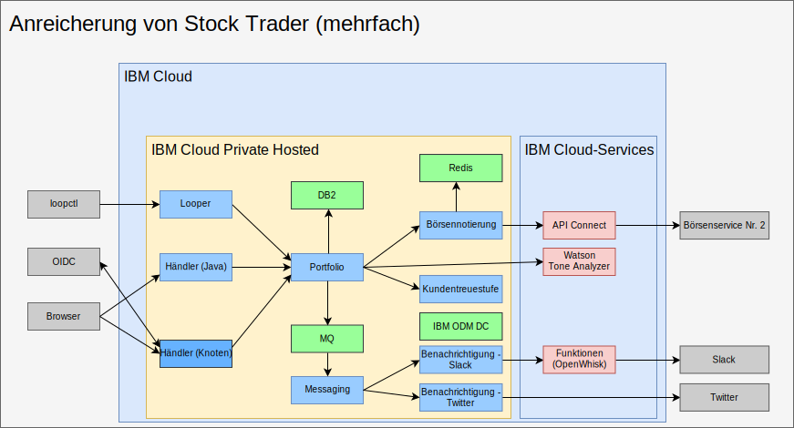

---

copyright:

  years:  2016, 2019

lastupdated: "2019-05-08"

subcollection: vmware-solutions

---

# Mit AI, Analytics und weiteren öffentlichen Cloud-Services anreichern
{: #vcscontent-aianalytics}

Die Anreicherung von Stock Trader ist kein einmaliger Schritt, sondern für Todd und Jane ein iterativer Prozess. Aus der folgenden Abbildung geht hervor, dass Jane den Watson Tone Analyzer-Service und mithilfe von ODM Decision Center eine Regel für Kundentreuestufen hinzugefügt hat. Die folgenden Angaben zeigen, wie Stock Trader angereichert wurde.

## AI - Watson Tone Analyzer
{: #vcscontent-aianalytics-ai-watson}

Das folgende Beispiel zeigt ein einfaches, aber nur vermeintlich leistungsfähiges Verfahren für die Anreicherung einer Anwendung. Jane durchsucht den [{{site.data.keyword.cloud}}-Katalog](https://cloud.ibm.com/catalog/) nach den Services [AI](https://cloud.ibm.com/catalog/?category=ai) und [Analytics](https://cloud.ibm.com/catalog/?category=analytics) und stellt fest, dass der Katalog reichhaltigen Inhalt aufweist.

Jane wählt [Tone Analyzer](https://cloud.ibm.com/catalog/services/tone-analyzer) aus, entscheidet sich für den Standardplan und erhält anschließend die Berechtigungsnachweise für den Aufruf.
Jane hat das Refactoring von Stock Trader ausgeführt und erstellt lediglich einen geheimen Kubernetes-Schlüssel für Tone Analyzer. Selbst wenn Jane Pläne oder Regionen ändert, muss sie daher keinen erneuten Build für den Code durchführen.

Dank des Refactorings konnte Jane mit verschiedenen Benutzerschnittstellenframeworks experimentieren, ohne hierdurch die Funktionalität für den Benutzer zu unterbrechen. Als Folge steht eine neue Benutzerschnittstelle zur Verfügung, mit deren Hilfe der Tonfall des Benutzerfeedbacks verstanden werden kann.

In der Zukunft kann Jane auf der Grundlage einer Vielzahl von Analyseservices, die zur Ausführung in der privaten Cloudinstanz, also in {{site.data.keyword.cloud_notm}} Private, verfügbar sind, Börsenempfehlungsvorhersagen bereitstellen.

## Geschäftsregel für Kundentreuestufen
{: #vcscontent-aianalytics-loyalty-rule}

Ursprünglich verwendete Jane in ihrem Code Logik, mit der ermittelt wurde, welcher Geldbetrag wahrscheinlich zu einer Änderung der Kundentreue führt. Nachdem die Marketingleiterin für Stock Trader wiederholt eine Änderung des Bereichs angefordert hatte, hat Jane jedoch beschlossen, diese Entscheidung in eine Geschäftsregel auszulagern, die die Marketingleiterin ohne Beteiligung von Jane ändern kann.

Jane hat dies mit Todd besprochen, der den [Service](https://cloud.ibm.com/catalog/services/decision-optimization) hinzugefügt hat, und anschließend die Entscheidung erstellt.

Jetzt kann sich die Marketingleiterin Margret bei jeder laufenden Werbekampagne anmelden und die Bereiche für die Kundentreuestufen ändern, ohne dass eine Codeänderung erfolgen muss.

## Neuer Börsenservice
{: #vcscontent-aianalytics-new-stock-service}

Sie haben vielleicht bereits bemerkt, dass der Börsenservice geändert wurde.
Dies kann der Fall sein, wenn sich der Eigentümer oder die API-Struktur eines öffentlichen Service ändert. Glücklicherweise hat Jane [API Connect](https://cloud.ibm.com/catalog/services/api-connect) verwendet.
Zunächst setzte sie API Connect ein, um die Antwort vom ursprünglichen Börsenservice zu vereinfachen, weil Empfang und Formatierung der gewünschten Daten aus der erhaltenen unaufbereiteten API etwas umständlich war.

Dies hat für Jane jetzt den erfreulichen Effekt, dass sie zur Änderung des Börsenservice lediglich seine Zuordnung zu der von ihr erstellten vereinfachten API ändern und ihren Code noch nicht einmal erneut starten musste. Die Lösung "Stock Trader" forderte einfach die Daten weiterhin von derselben API an, als ob sich nichts geändert hätte. Alle API-Änderungen fanden sozusagen hinter den Kulissen statt.

Durch die Überwachung und Messung in API Connect kann Jane darüber hinaus verfolgen, wer ihre vereinfachte API nutzt.

## Zugehörige Links
{: #vcscontent-aianalytics-related}

* [Übersicht über vCenter Server on {{site.data.keyword.cloud_notm}} with Hybridity Bundle](/docs/services/vmwaresolutions/archiref/vcs?topic=vmware-solutions-vcs-hybridity-intro)
