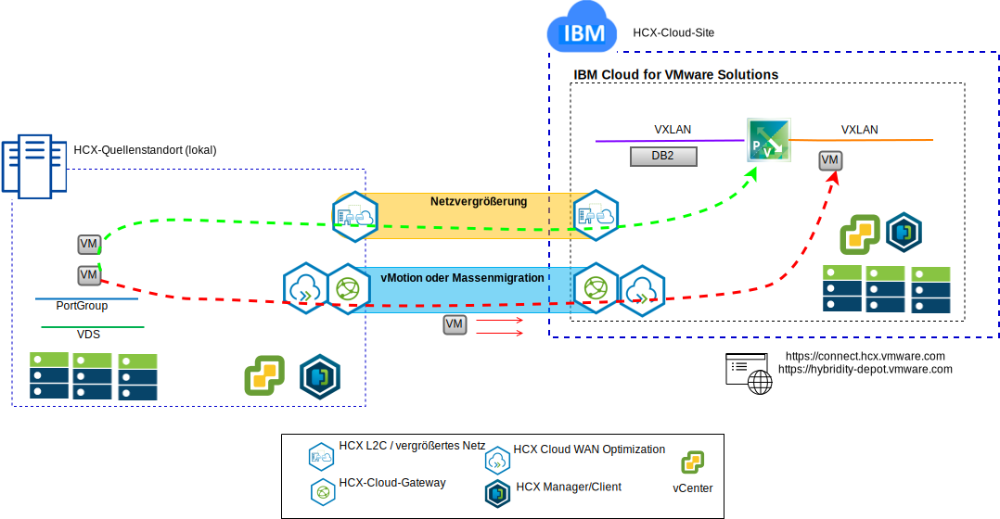

---

copyright:

  years:  2016, 2019

lastupdated: "2019-02-15"

---

# Lift-and-shift für virtuelle Maschinen von Stock Trader in IBM Cloud durchführen
{: #vcscontent-hcx}

Als ersten Schritt im Modernisierungsprozess möchte Todd die lokale VMware SDDC-Instanz nahtlos in VMware vCenter Server on {{site.data.keyword.cloud}} erweitern. Die Geschäftsvorgänge müssen betriebsbereit bleiben und die Ausfallzeit muss auf ein Minimum beschränkt werden.

VMware vCenter Server on {{site.data.keyword.cloud_notm}} with Hybridity Bundle ermöglicht die Erstellung einer nahtlosen Verbindung zwischen vCenter Server-Instanzen und einem lokalen virtuellen VMware-Rechenzentrum.

Die Komponenten von vCenter Server with Hybridity Bundle, die als virtuelle Maschinen am {{site.data.keyword.cloud_notm}} VMware-Zielstandort bereitgestellt werden, ermöglichen den Aufbau einer Verbindung mit den HCX-Komponenten, die am lokalen Peerquellenstandort installiert sind.

Abbildung 1. vCenter Server with Hybridity Bundle

Hybridity Bundle erstellt eine flexible gegenseitige Verbindung zwischen dem lokalen Standort und {{site.data.keyword.cloud_notm}} und aktiviert die folgende Funktionalität:

* Einfache Interkonnektivität - Logische Netzverbindungen können ohne großen Aufwand über eine beliebige physische Verbindung hergestellt werden, z. B. über das öffentliche Internet, ein privates VPN oder über eine direkte Verbindung.
* Layer-2-Erweiterung - Lokale Netze werden in die Cloud erweitert, einschließlich lokaler Teilnetze und IP-Adressierung.
* Verschlüsselung - Der Datenaustausch im Netz wird zwischen den beiden Standorten sicher verschlüsselt.
* Netzoptimierung - Wählt die beste Verbindung aus und nutzt die Verbindung effizient aus, sodass der Datenaustausch im Netz mit maximaler Geschwindigkeit erfolgt.
* Datendeduplizierung - Eine Reduzierung von bis zu 50% des Netzverkehrs ist möglich.
* Intelligentes Routing - Wenn eine Workload verlagert wird, kann das "Proximity Routing" das Netzgateway ändern, sodass der Datenaustausch im Netz das Gateway des Zielstandorts verwendet (anstelle des ursprünglichen Standorts).
* Migration ohne Ausfallzeit - Ein aktives System kann mit vMotion in die Cloud verlagert werden (oder umgekehrt).
* Geplante Migration - Eine beliebige Anzahl virtueller Maschinen kann an den Zielstandort repliziert und dann zu einem bestimmten Zeitpunkt an diesem Standort aktiviert werden und die Systeme ersetzen, die am ursprünglichen Standort ausgeführt werden.
* Migration von Sicherheitsrichtlinien - Wenn NSX lokal verwendet wird, werden alle Sicherheitsrichtlinien, Firewalls und anderen Sicherheitseinrichtungen zusammen mit der Workload verlagert.

Todd kann Stock Trader aus der lokalen VMware-Umgebung in die {{site.data.keyword.cloud_notm}}-Umgebung migrieren und hierbei die Anforderungen nach minimaler (bis hin zu keiner) Ausfallzeit und einer nicht erforderlichen Anwendungsrekonfiguration erfüllen.

## Zugehörige Links
{: #vcscontent-hcx-related}

* [Übersicht über vCenter Server on {{site.data.keyword.cloud_notm}} with Hybridity Bundle](/docs/services/vmwaresolutions/archiref/vcs?topic=vmware-solutions-vcs-hybridity-intro)
