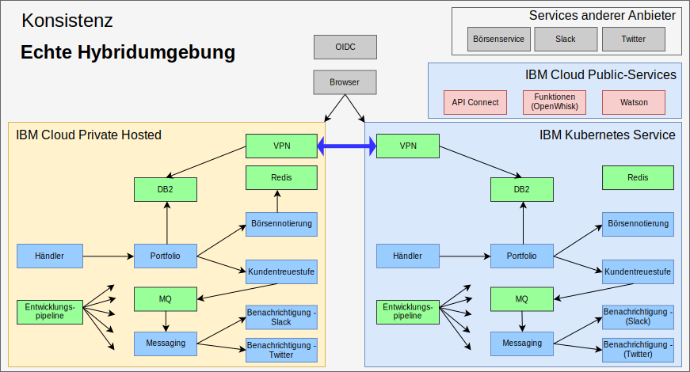

---

copyright:

  years:  2016, 2019

lastupdated: "2019-02-15"

---

# Echte Hybridität mit IBM Cloud Kubernetes-Service
{: #vcscontent-iks}

Aufgrund der ständigen Vergrößerung ihres Testteams möchte Jane eine Testumgebung bereitstellen, die große Teile ihrer Anwendung ausführt und weiter die in der Umgebung verfügbaren Daten verwendet. Jane möchte, dass sich das Testteam auf die Anwendungstests konzentrieren kann und sich nicht um die Verwaltung des Kubernetes-Clusters kümmern muss. Jane und Todd beschließen, eine Instanz des [{{site.data.keyword.cloud}} Kubernetes-Service](https://www.ibm.com/cloud/container-service) einzurichten, und Jane stellt in dieser Instanz Stock Trader ohne Codeänderungen bereit.

Todd fügt dann das strongSwan-VPN hinzu, um die Verbindung zwischen den privaten Netzen der einzelnen Cluster herzustellen.

Abbildung 1. Stock Trader als echte Hybridanwendung

## Zugehörige Links
{: #vcscontent-iks-related}

* [Übersicht über vCenter Server on {{site.data.keyword.cloud_notm}} with Hybridity Bundle](/docs/services/vmwaresolutions/archiref/vcs?topic=vmware-solutions-vcs-hybridity-intro)
