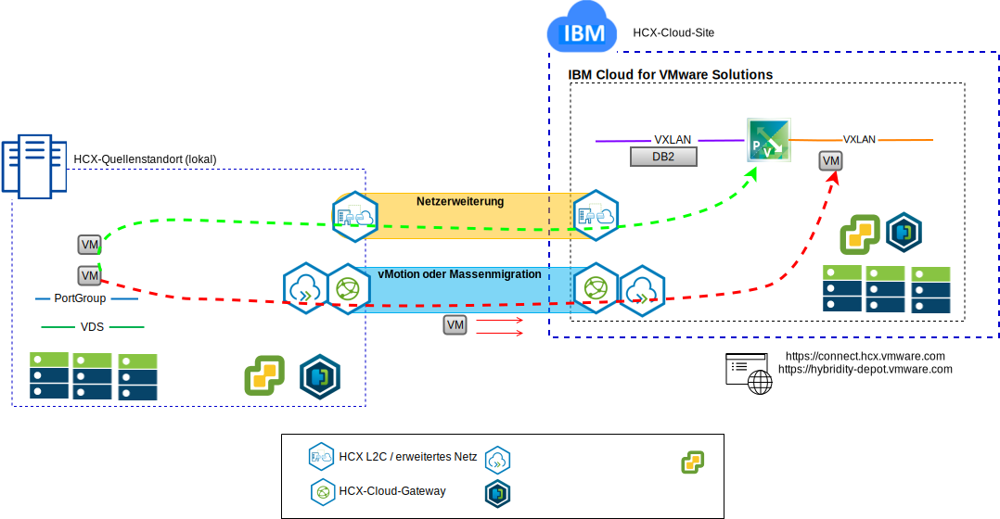

---

copyright:

  years:  2016, 2019

lastupdated: "2019-03-06"

---

# VMware Hybrid Cloud Services - Einführung
{: #vcshcx-intro}

VMware Hybrid Cloud Services (HCX) ermöglicht unterschiedlichen Instanzen von vSphere-Software-definierten Rechenzentren (SDDC) die Zusammenarbeit über verschiedene Netztypen hinweg. Dazu gehören LAN oder WAN, unabhängig davon, ob sie für das öffentliche Internet sicher sind oder nicht. HCX ist für die Sicherheit, Kompatibilität, Komplexität und Performance ausgelegt, die notwendig sind, um eine standortübergreifende Mehrinstanzen-Bereitstellung von vSphere über mehrere lokale und Cloud-Provider-Grenzen hinweg zu schaffen.

Abbildung 1. VMware Hybrid Cloud Services

HCX ist die bevorzugte Methode für die Zusammenarbeit zwischen den vollständig automatisierten vSphere-Angeboten in {{site.data.keyword.cloud}} und allen anderen bereitgestellten vSphere-Instanzen. HCX ist jetzt ein voll integriertes Angebot innerhalb von {{site.data.keyword.vmwaresolutions_short}}.

Dieser Leitfaden bezieht sich auf die Bereitstellung und Inbetriebnahme von HCX und umfasst die derzeit bekannten und anerkannten Best Practices und Methoden zur Fehlerbehebung. Da HCX mit der Methodik der agilen Entwicklung entwickelt wurde, ist dieses Handbuch nicht als de-facto-Quelle für unterstützte Versionen oder Plattformen anzusehen.

## Zugehörige Links
{: #vcshcx-intro-related}

* [Übersicht über vCenter Server on {{site.data.keyword.cloud_notm}} with Hybridity Bundle](/docs/services/vmwaresolutions/archiref/vcs?topic=vmware-solutions-vcs-hybridity-intro)   
