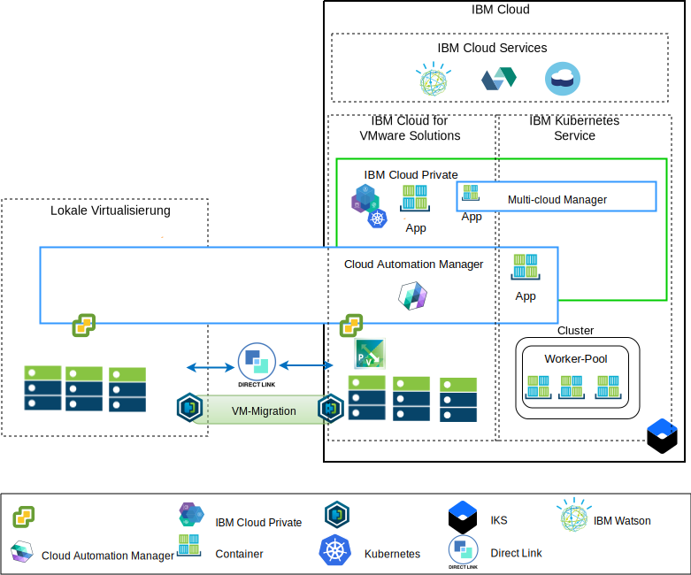

---

copyright:

  years:  2016, 2019

lastupdated: "2019-02-21"

---

# Übersicht über die Anwendungsmodernisierung
{: #vcsicp-appmod}

Das folgende Diagramm zeigt die in Acme Skateboards bereitgestellte Referenzarchitektur für die Anwendungsmodernisierung. Die Architektur ist in dieser Dokumentserie detailliert beschrieben.

Abbildung 1. Diagramm mit Architekturübersicht

Diese Hybridarchitektur ermöglicht Acme Skateboards die Realisierung der folgenden Ziele:
- Migration von virtuellen VMware-Maschinen aus der lokalen Umgebung auf {{site.data.keyword.cloud}} mit geringer oder ganz ohne Ausfallzeit und ohne erneute Anwendungskonfiguration.
- Möglichkeit zum Starten des Anwendungsmodernisierungsprozesses, indem der Fokus darauf gelegt wird, die einfacheren Webschnittstellen und Middleware zu containerisieren, während komplexere Datenbanken als VMs erhalten bleiben.
- Nutzung von {{site.data.keyword.cloud_notm}} Automation Manager (CAM) zum Scripten von "Infrastructure as Code" (IaC), um Services zusammenzustellen und zu orchestrieren, die aus VMs und Containern bestehen, damit Integration mit den vorhandenen DevOps-Toolchains und der ITSM-Lösung ermöglicht wird.

Die Referenzarchitektur setzt sich aus den folgenden Schlüsselkomponenten zusammen:
- **Lokale Virtualisierung** - Dies ist ein VMware-Cluster, der momentan die VMs von Acme Skateboards hostet. Diese VMs hosten gegenwärtig die zu modernisierenden Anwendungen. Dieser Cluster ist erforderlich, um die Voraussetzungen der Architektur von [VMware HCX on {{site.data.keyword.cloud_notm}} Solution Architecture](https://www.ibm.com/cloud/garage/files/HCX_Architecture_Design.pdf) zu erfüllen, damit HCX ausgeführt werden kann. HCX erweitert die lokalen Netze in die {{site.data.keyword.cloud_notm}}. Das ermöglicht es den Kunden, VMs in die VMware vCenter Server on {{site.data.keyword.cloud_notm}}-Instanz zu migrieren, die auf {{site.data.keyword.cloud_notm}} ausgeführt wird (eine Migration zurück ist bei Bedarf ebenfalls möglich).

- **{{site.data.keyword.vmwaresolutions_short}}** - Die vCenter Server-Instanz stellt die grundlegenden VMware-Bausteine bereit, wie z. B. vSphere, vCenter Server, NSX-V und Speicheroptionen, einschließlich vSAN oder {{site.data.keyword.cloud_notm}} Endurance-Speicher, die für die automatische Bereitstellung einer VMware Software Defined Data Center-Lösung (SDDC) erforderlich sind. Der VMware-Cluster ist das Ziel für die migrierten VMs und einige der modernisierten Anwendungen in Containern, die in {{site.data.keyword.icpfull_notm}} gehostet werden. Die Schlüsselkomponenten von vCenter Server sind Folgende:
    - **NSX-V** - NSX-V stellt die Schicht zur Netzvirtualisierung in VCS bereit, die ein Netzoverlay für die VMs von Acme Skateboards bietet. NSX-V aktiviert BYOIP und isoliert die Workloadnetze von den IBM Cloud-Netzen. NSX-V wird von HCX programmiert, um die Netze zu erstellen, die bei Acme Skateboards aus der lokalen Umgebung erweitert werden.

    - **NSX-T** - NSX-T bietet eine gemeinsame Gruppe von Tools für das Netz- und Sicherheitsmanagement bei Containern und VMs. NSX-T ist voll kompatibel mit Kubernetes Container Networking Interface (CNI) und wird in CNI integriert, um die Containervernetzung zu ermöglichen. NSX-T stellt das Overlay-Netz zur Verfügung, das von den modernisierten Anwendungen genutzt wird, und ersetzt Calico, das nativ von {{site.data.keyword.icpfull_notm}} und {{site.data.keyword.containerlong_notm}} verwendet wird.

- **{{site.data.keyword.icpfull_notm}}** - {{site.data.keyword.icpfull_notm}} ist eine Anwendungsplattform zur Entwicklung und Verwaltung von containerisierten Anwendungen. {{site.data.keyword.icpfull_notm}} ist eine integrierte Umgebung, die Kubernetes als Container-Orchestrator, ein privates Image-Repository, eine Managementkonsole, Überwachungsframeworks und eine grafische Benutzerschnittstelle enthält, von der aus Acme Skateboards Anwendungen zentral bereitstellen, verwalten, überwachen und skalieren kann. Die vCenter Server-Instanz hostet die {{site.data.keyword.icpfull_notm}}-Komponenten, die Masterknoten, die Workerknoten und führt sie als VMs aus. {{site.data.keyword.icpfull_notm}} hostet Folgendes:
    - **{{site.data.keyword.cloud_notm}} Automation Manager** - CAM ist eine auf Unternehmen abgestimmte IaC-Plattform (IaC = Infrastructure as Code), die eine zentrale Bereitstellung von VM-Workloads (lokal oder auf VCS) neben Kubernetes-Workloads (in {{site.data.keyword.icpfull_notm}} oder {{site.data.keyword.containerlong_notm}}) bietet und bei der Sie Vorlagen verwenden können. CAM ist eine für Docker vorbereitete Anwendung, die über einer {{site.data.keyword.icpfull_notm}}-Installation ausgeführt wird und nahtlos für die Autorisierung, rollenbasierte Zugriffssteuerung (RBAC) und andere Funktionen integriert ist.
    - Die containerisierten Anwendungen von Acme Skateboards, die Kunden in dieser Umgebung bereitgestellt wollen.

- **{{site.data.keyword.containerlong_notm}}** – {{site.data.keyword.containerlong_notm}} gibt Acme Skateboards die Möglichkeit, die vorhandenen modernisierten Anwendungen in Docker-Containern zu bereitzustellen, die in Kubernetes-Clustern ausgeführt werden. Die Masterknoten werden von IBM vollständig verwaltet, während die Workerknoten im Worker-Pool in demselben {{site.data.keyword.cloud_notm}}-Konto wie die vCenter Server-Instanz bereitgestellt werden. Workerknoten können Bare Metal Server, öffentliche oder dedizierte virtuelle Serverinstanzen sein. Calico wird automatisch in {{site.data.keyword.containerlong_notm}} installiert und konfiguriert. Calico bietet sichere Netzkonnektivität für Container und ist so in {{site.data.keyword.containerlong_notm}} konfiguriert, dass es die IP-in-IP-Kapselung für Pakete verwendet, die die Teilnetze durchqueren, und dass es NAT für abgehende Verbindungen von den Containern verwendet.

- **Direct Link** - {{site.data.keyword.cloud_notm}} Direct Link verwendet den WAN-Provider von Acme Skateboard, um das Rechenzentren des Unternehmens mit {{site.data.keyword.cloud_notm}} zu verbinden, sodass eine zuverlässige und sichere Netzverbindung mit geringer Latenzzeit bereitgestellt wird. Diese Verbindung bietet folgende Möglichkeiten:
    - Zugriff Ihrer Unternehmensbenutzer auf die von der Cloud gehosteten Anwendungen
    - Datenverkehr zwischen lokalen VMs und Cloud-VMs
    - Datenverkehr zwischen traditionellen Systemen im lokalen Rechenzentrum und Cloud-VMs

## Wichtige Vorteile für Acme Skateboards
{: #vcsicp-appmod-benefits}

vCenter Server stellt die grundlegenden Bausteine zur Verfügung, wie z. B. VMware vSphere, vCenter Server, NSX und gemeinsame Speicheroptionen, darunter vSAN, die erforderlich sind, um eine VMware SDDC-Lösung (Software Defined Data Center) zu konzipieren, die Ihren Workloads möglichst optimal entspricht.

Zusammengefasst bieten die {{site.data.keyword.vmwaresolutions_short}}-Angebote folgende Vorteile:

* Beschleunigte Lieferung von IT-Projekten für Entwickler und Geschäftsbereiche durch Verringerung des Zeitaufwands für Beschaffung, Architektur, Implementierung und Bereitstellung von Ressourcen von Wochen oder Monaten auf Stunden.
* Verbesserte Sicherheit mit dedizierten Bare-Metal-Servern in einer gehosteten privaten Cloud, einschließlich Bereitstellung eines privaten Netzserviceendpunkts für {{site.data.keyword.cloud_notm}}-Services (z. B. {{site.data.keyword.containerlong_notm}} und KMIP). 
* Konsistente Management- und Governance-Funktionalität der bereitgestellten Hybrid-Cloud durch Bereitstellung eines vollständigen Verwaltungszugriffs auf das Virtualisierungsmanagement, sodass vorhandene VMware-Tools, Scripts und Investitionen in Schulungen ihren Wert behalten.
* Globale Nutzung von VMware-Know-how mit IBM Professional Services und IBM Managed Services, die weltweit mehr als 30 {{site.data.keyword.CloudDataCents_notm}} umfassen.

Kunden, die sich für cloudnative Anwendungsplattformen wie {{site.data.keyword.icpfull_notm}} und {{site.data.keyword.containerlong_notm}} interessieren, legen besonderen Wert auf Geschwindigkeit und Innovation und berücksichtigen weniger die Aspekte der Sicherheit und des Netzbetriebs. Die Anwendungszeit bis zum Wert sinkt, wenn gewartet werden muss, bis Netz- oder Sicherheitsteams Services wie Lastverteilungsfunktionen, Firewalls, Switches und Router bestellen können.

Diese Referenzarchitektur zeigt, wie VCS, {{site.data.keyword.icpfull_notm}} und {{site.data.keyword.containerlong_notm}} das Unternehmen Acme Skateboards zuverlässig beim Prozess der Anwendungsmodernisierung unterstützen.

## Zugehörige Links
{: #vcsicp-appmod-related}

* [Übersicht über vCenter Server on {{site.data.keyword.cloud_notm}} with Hybridity Bundle](/docs/services/vmwaresolutions/archiref/vcs?topic=vmware-solutions-vcs-hybridity-intro)
