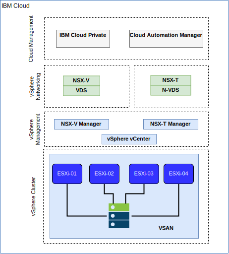

---

copyright:

  years:  2016, 2018

lastupdated: "2018-11-15"

---

# IBM Cloud-Netzbetrieb und -Infrastruktur

## Virtual Routing and Forwarding (VRF)

Sie können {{site.data.keyword.cloud}}-Konten auch als VRF-Konto konfigurieren, um eine ähnliche Funktionalität wie das VLAN-Spanning zur  Verfügung zu stellen, sodass ein automatisches Routing zwischen IP-Teilnetzblöcken möglich wird. Alle Konten mit direkten Verbindungen (Direct-Link) müssen in VRF-Konten konvertiert oder als solche erstellt werden.

## Direct Link

{{site.data.keyword.cloud_notm}} Direct Link Connect bietet privaten Zugriff auf Ihre {{site.data.keyword.cloud_notm}}-Infrastruktur und auf alle anderen Clouds, die mit Ihrem Netzserviceanbieter über Ihr lokales IBM Cloud-Rechenzentrum verbunden sind. Diese Option ist optimal für die Konnektivität zu mehreren Clouds in einer einzelnen Umgebung geeignet. Kunden werden mittels einer gemeinsam genutzten Bandbreitentopologie mit dem Netz von {{site.data.keyword.cloud_notm}} Private (ICP) verbunden. Wie bei allen Direct Link-Produkten können Sie globales Routing hinzufügen, das privaten Netzverkehr zu allen {{site.data.keyword.cloud_notm}}-Standorten ermöglicht.

## Virtuelle private Netze

### strongSwan-VPN

Der strongSwan-IPSec-VPN-Service stellt einen sicheren End-to-End-Kommunikationskanal über das Internet bereit, der auf der standardisierten IPSec-Protokollsuite (IPSec - Internet Protocol Security) basiert.

### Hybridität (HCX)

vCenter Server on {{site.data.keyword.cloud_notm}} with Hybridity Bundle erweitert die Netze von lokalen Rechenzentren nahtlos in die {{site.data.keyword.cloud_notm}}. Dies ermöglicht die Migration von virtuellen Maschinen in die und aus der {{site.data.keyword.cloud_notm}}, ohne dass hierzu eine Konvertierung oder Änderung erforderlich ist.

## Physische Struktur

Die physische Infrastruktur, die zur Bereitstellung einer ICP-Produktionsinstanz für einen VMware vCenter Server (VCS) on {{site.data.keyword.cloud_notm}}-Cluster erforderlich ist, setzt folgende Mindestspezifikationen voraus.

Tabelle 1. vCenter Server-Spezifikation für ICP

| NFS-Bereitstellung |  vSAN-Bereitstellung |
:--|:----:|:----:
Anzahl Server | 3 |  4
CPU | 28 Kerne 2,2 GHz | 28 Kerne 2,2 GHz
RAM | 384 GB | 384 GB
Speicher | 2000 GB 2IOPS/GB Management, 2000 4IOPS/GB Workload, 4000 GB 4IOPS/GB ICP | Min. 960-GB SSD x 2

Zusätzlich zu der Hardware, die für ICP vorausgesetzt wird, müssen Sie persistente Datenträger in der ICP-Umgebung erstellen, um die CAM-Datenbank- und -Protokolldaten (CAM = Cloud Automation Manager) zu speichern. CAM unterstützt zwar alle persistenten Typen, die von ICP unterstützt werden, für CAM empfohlen werden aber die Speicherkonfigurationen NFS und GlusterFS.

## Virtuelle Struktur

Abbildung 1. Physische Struktur der vCenter Server- und ICP-Bereitstellung

In der vCenter Server-Instanz wird die ICP-Instanz mit einem dedizierten NSX Edge Services Gateway (ESG) und dem Distributed Logical Router (DLR) bereitgestellt. Die ICP-Installation wird in das VXLAN-Teilnetz geladen, das in den vorgenannten Komponenten definiert ist.

Das ESG ist mit einer Quellen-NAT-Regel (SNAT) konfiguriert, um abgehenden Datenverkehr zu ermöglichen, wodurch die Internetverbindung zum Download der ICP-Voraussetzungen ermöglicht wird. Die Konnektivität zu GitHub und Docker oder einem Web-Proxy kann verwendet werden, um die Internetverbindung bereitzustellen. Das ESG ist auch für den Zugriff auf DNS- und NTP-Services konfiguriert.

Das ESG ist zudem mit einer Ziel-NAT-Regel (DNAT) für die virtuellen ICP-Master-/Proxy-IP-Adressen vom {{site.data.keyword.cloud_notm}} 10.x-Netz bis zur VXLAN-Umgebung konfiguriert.

### Zugehörige Links

* [Übersicht über vCenter Server on {{site.data.keyword.cloud_notm}} with Hybridity Bundle](../vcs/vcs-hybridity-intro.html)
