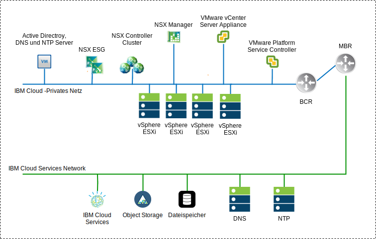
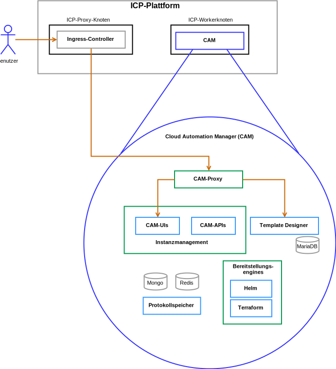

---

copyright:

  years:  2016, 2019

lastupdated: "2019-03-19"

subcollection: vmware-solutions

---

# Lösungskomponenten
{: #vcsicp-arch-overview-solution}

## Komponenten von VMware vCenter Server on IBM Cloud
{: #vcsicp-arch-overview-solution-vcs-comp}

Abbildung 1. Diagramm der vCenter Server-Umgebung

### Platform Service Controller
{: #vcsicp-arch-overview-solution-psc}

Die vCenter Server-Bereitstellung verwendet einen einzelnen externen Platform Services Controller, der in einem portierbaren Teilnetz im privaten VLAN installiert ist, das Management-VMs zugeordnet ist. Das zugehörige Standardgateway wird auf den Back-End-Kundenrouter (BCR - Back-end Customer Router) eingestellt.

### vCenter Server
{: #vcsicp-arch-overview-solution-vcs}

Wie der Platform Services Controller wird der vCenter Server als Appliance bereitgestellt. Darüber hinaus wird der vCenter Server in einem portierbaren Teilnetz im privaten VLAN installiert, das den Management-VMs zugeordnet ist. Das zugehörige Standardgateway wird auf die IP-Adresse eingestellt, die auf dem Back-End-Kundenrouter (BCR) für dieses bestimmte Teilnetz zugeordnet wurde.

### NSX Manager
{: #vcsicp-arch-overview-solution-nsx-manager}

Der NSX Manager wird im ursprünglichen Cluster bereitgestellt. Dem NSX Manager wird eine VLAN-gestützte IP-Adresse aus dem privaten, portierbaren Adressblock zugeordnet, der für Managementkomponenten vorgesehen ist und der mit den DNS- und NTP-Servern konfiguriert wird.

### NSX Controller
{: #vcsicp-arch-overview-solution-nsx-controllers}

Die {{site.data.keyword.cloud}}-Automatisierung stellt drei NSX-Controller im ursprünglichen Cluster bereit. Jedem der Controller wird eine VLAN-gestützte IP-Adresse aus dem privaten portierbaren Teilnetz zugeordnet, das für Managementkomponenten vorgesehen ist.

### NSX Edge/DLR
{: #vcsicp-arch-overview-solution-nsx-edge}

NSX Edge Services Gateway-Paare werden bereitgestellt. In allen Fällen wird ein Gateway-Paar für den abgehenden Datenverkehr aus Automatisierungskomponenten verwendet, die sich im privaten Netz befinden. Für vCenter Server und {{site.data.keyword.icpfull_notm}} wird ein zweites Gateway, das als ICP-verwaltete Edge bezeichnet wird, bereitgestellt und mit einem Uplink zum öffentlichen Netz sowie einer Schnittstelle, die dem privaten Netz zugeordnet ist, konfiguriert. Alle erforderlichen NSX-Komponenten, wie z. B. Distributed Logical Router (DLR), logische Switches und Firewalls, können vom Administrator konfiguriert werden. Im [Leitfaden für den vCenter Server-Netzbetrieb](/docs/services/vmwaresolutions/archiref/vcsnsxt?topic=vmware-solutions-vcsnsxt-intro) finden Sie weitere Details zum Netzdesign.

In der folgenden Tabelle sind die {{site.data.keyword.icpfull_notm}} ESG- und DLR-Spezifikationen zusammengefasst.

Tabelle 1. {{site.data.keyword.icpfull_notm}} ESG-Spezifikationen

Attribut  |  Spezifikation
--|--
Edge Service Gateway  |  Virtual Appliance
Edge-Größe "Large" |   Anzahl vCPUs	2
Speicher	| 1-GB-Platte	| 1000 GB auf lokalem Datenspeicher

Tabelle 2. {{site.data.keyword.icpfull_notm}} DLR-Spezifikationen

Attribut  |  Spezifikation
--|--|
Distributed Logical Router | 	Virtual Appliance
Edge-Größe "Compact" | Anzahl vCPUs	1
Speicher	| 512-MB-Platte	| 1000 GB auf lokalem Datenspeicher

## Komponenten von IBM Cloud Private
{: #vcsicp-arch-overview-solution-icp-comp}

{{site.data.keyword.icpfull_notm}} ist eine Anwendungsplattform für die Entwicklung und Verwaltung von lokalen, containerisierten Anwendungen. Es handelt sich um eine integrierte Umgebung für die Verwaltung von Containern, die Kubernetes als Container-Orchestrator, ein privates Image-Repository, eine Managementkonsole und Überwachungsframeworks enthält.

Abbildung 2. Virtuelle {{site.data.keyword.icpfull_notm}}-Bereitstellung mit vCenter Server

###	Bootknoten
{: #vcsicp-arch-overview-solution-boot-node}

Ein Boot- oder Bootstrap-Knoten (optional) wird für die Ausführung der Installation, Konfiguration, Knotenskalierung und für Clusteraktualisierungen verwendet. Für einen Cluster wird nur ein Bootknoten benötigt. Sie können einen einzelnen Knoten sowohl als Master- als auch Bootknoten verwenden.

### Masterknoten
{: #vcsicp-arch-overview-solution-master-node}

Ein Masterknoten stellt Management-Services zur Verfügung und steuert die Workerknoten in einem Cluster. Masterknoten sind Hostprozesse, die für die Ressourcenzuordnung, die Statusverwaltung, die Zeitplanung und die Überwachung verantwortlich sind. Da eine Hochverfügbarkeitsumgebung (High Availability, HA) mehrere Masterknoten enthält, übergibt die Failover-Logik bei einem Ausfall des führenden Masterknotens die Masterrolle automatisch an einen anderen Knoten. Hosts, die als Master fungieren können, werden als Masterkandidaten bezeichnet.

###	Workerknoten
{: #vcsicp-arch-overview-solution-worker-node}

Ein Workerknoten ist ein Knoten, der eine containerisierte Umgebung für die Ausführung von Tasks zur Verfügung stellt. Wenn die Anforderungen steigen, können Sie Ihrem Cluster leicht weitere Workerknoten hinzufügen, um die Leistung und Effizienz zu verbessern. Ein Cluster kann eine beliebige Anzahl von Workerknoten enthalten, es ist jedoch mindestens ein Workerknoten erforderlich.

### Proxy-Knoten
{: #vcsicp-arch-overview-solution-proxy-node}

Ein Proxy-Knoten ist ein Knoten, der externe Anforderungen an die Services überträgt, die in Ihrem Cluster erstellt wurden. Da eine Hochverfügbarkeitsumgebung (High Availability, HA) mehrere Proxy-Knoten enthält, übergibt die Failover-Logik bei einem Ausfall des führenden Proxy-Knotens die Proxy-Rolle automatisch an einen anderen Knoten. Sie können zwar einen einzelnen Knoten sowohl als Master als auch als Proxy verwenden, aber durch die Verwendung von dedizierten Proxy-Knoten eine Verringerung der Last auf dem Masterknoten erreichen. Ein Cluster muss mindestens einen Proxy-Knoten enthalten, wenn ein Lastausgleich innerhalb des Clusters erforderlich ist.

### Managementknoten
{: #vcsicp-arch-overview-solution-mgmt-node}

Ein Managementknoten ist ein optionaler Knoten, der nur Management-Services wie Überwachung, Messung und Protokollierung bietet. Durch die Konfiguration dedizierter Managementknoten können Sie verhindern, dass der Masterknoten überlastet wird. Der Managementknoten kann nur während der {{site.data.keyword.icpfull_notm}}-Installation aktiviert werden.

###	Vulnerability Advisor-Knoten
{: #vcsicp-arch-overview-solution-va-node}

Ein Vulnerability Advisor-Knoten ist ein optionaler Knoten, der für die Ausführung der Vulnerability Advisor-Funktion verwendet wird. Die Vulnerability Advisor-Services sind ressourcenintensiv. Wenn Sie den Vulnerability Advisor-Service verwenden, geben Sie einen dedizierten VA-Knoten an.

Die folgenden VMs-Spezifikationen sind für eine hoch verfügbare {{site.data.keyword.icpfull_notm}}-Instanz erforderlich:

Tabelle 3. {{site.data.keyword.icpfull_notm}}-VM-Spezifikationen

Knoten | 	Instanzen	| IP	| CPU	| RAM (GB)	| Platte (GB)
:-----|------------:|:----|----:|----------:|----------:|
Master|	3	| IP (x3) VIP (x1)	| 4	| 64	| 200
Management	|3	| IP (x3)	|8	|64	|500
Proxy	| 3	| IP (x3)VIP (x1)	|2	|4	|150
Vulnerability Advisor	|3	| IP (x3)	| 4	| 16	|500
GlusterFS	| 3	| IP (x3)	|8	|16	|150
Worker	| 3-6	| IP (x3)	|4-8	|4	|150

CAM setzt voraus, dass Workerknoten eine höhere vCPU- und Speicherkonfiguration haben.

Tabelle 4. {{site.data.keyword.icpfull_notm}}-VM-Spezifikationen

Knoten | 	Instanzen	| IP	| CPU	| RAM (GB)	| Platte (GB)
:-----|------------:|:----|----:|----------:|----------:|
Worker  |  3 | IP (x3)  |  4-8 |16-20   |  150

## CAM-Komponenten
{: #vcsicp-arch-overview-solution-cam-comp}

{{site.data.keyword.cloud_notm}} Automation Manager (CAM) ist eine Self-Service-Managementplattform für mehrere Clouds, die unter {{site.data.keyword.icpfull_notm}} ausgeführt wird und Entwicklern und Administratoren die Möglichkeit gibt, die Anforderungen des Unternehmens zu erfüllen.

Abbildung 3. CAM-Komponentenreferenz 

### CAM-Proxy
{: #vcsicp-arch-overview-solution-cam-proxy}

Der CAM-Proxy bietet einen nginx-Proxy-Zugriff auf CAM.

### CAM-Benutzerschnittstelle
{: #vcsicp-arch-overview-solution-cam-ui}

Die Benutzerschnittstellenkomponenten sind auf mehrere Container verteilt. Die Komponenten in der Benutzerschnittstelle für die Cloudverbindungen, die Benutzerschnittstelle der Vorlagenbibliothek und die Benutzerschnittstelle für bereitgestellte Instanzen enthalten.

### CAM-API
{: #vcsicp-arch-overview-solution-cam-api}

Die CAM-APIs sind auf mehrere Container verteilt.

### Helm
{: #vcsicp-arch-overview-solution-helm}

Ein Container mit den erforderlichen Binärdateien, um Helm-Diagramme in Kubernetes-Clustern bereitzustellen.

### Terraform
{: #vcsicp-arch-overview-solution-terraform}

Ein Container mit den erforderlichen Binärdateien, um Terraform-Ressourcen in mehreren Clouds bereitzustellen.

### Protokolle
{: #vcsicp-arch-overview-solution-logs}

Die Position für die Containerprotokolle.

### Mongo-Datenbank
{: #vcsicp-arch-overview-solution-mongo-db}

Die Kerndatenbank für die CAM-Anwendung.

### Redis
{: #vcsicp-arch-overview-solution-redis}

Die Redis-Datenbank wird zum Speichern von Sitzungscaching und Sperren in CAM verwendet.

### Vorlagendesigner
{: #vcsicp-arch-overview-solution-template-designer}

Eine grafische Benutzerschnittstelle zum Erstellen von Terraform-Vorlagen mit Drag-Funktionen für Terraform-Module.

### Maria-Datenbank
{: #vcsicp-arch-overview-solution-maria-db}

Die Datenbank für die Vorlagendesigneranwendung.

## Zugehörige Links
{: #vcsicp-arch-overview-solution-related}

* [Übersicht über vCenter Server on {{site.data.keyword.cloud_notm}} with Hybridity Bundle](/docs/services/vmwaresolutions/archiref/vcs?topic=vmware-solutions-vcs-hybridity-intro)
