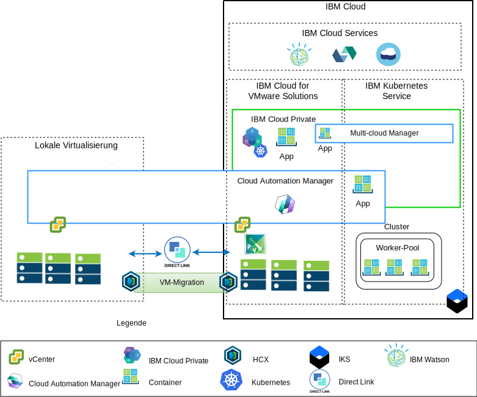
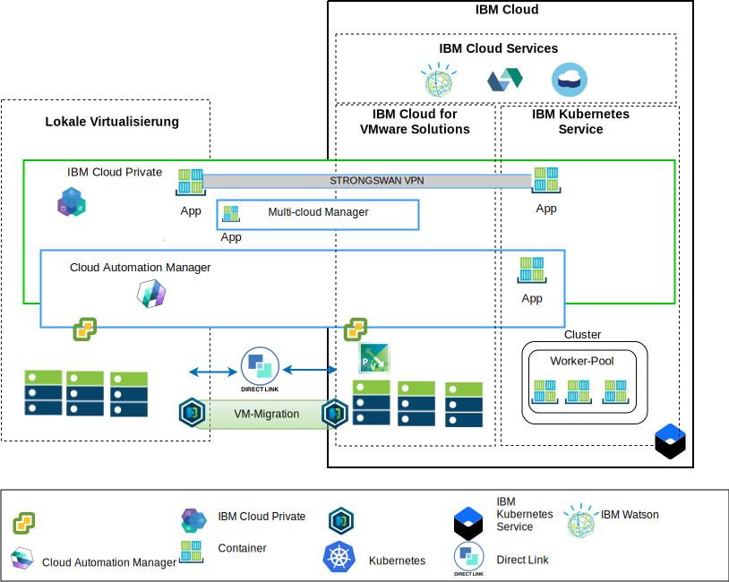

---

copyright:

  years:  2016, 2018

lastupdated: "2018-10-10"

---

# Übersicht über die Architektur

Die IBM Cloud for VMware-Angebote stellen die Automatisierungsfunktionen zur weltweiten Bereitstellung von VMware-Technologiekomponenten in IBM Cloud-Rechenzentren bereit. Die Architektur besteht aus einer einzelnen Cloudregion und unterstützt die Erweiterung in weitere Cloudregionen, die sich in einem anderen geografischen Gebiet und/oder in einem anderen IBM Cloud-Pod innerhalb desselben Rechenzentrums befinden.

Die Produkte IBM Cloud Private (ICP) und Cloud Automation Manager (CAM) können manuell auf Ihrer lokalen Virtualisierungsplattform bereitgestellt werden und ermöglichen so das Cloud-Management lokal am Standort. Alternativ werden ICP und CAM als Serviceerweiterungen für eine vorhandene oder neue VMware vCenter Server on IBM Cloud-Bereitstellung per Automation angeboten, wodurch das Cloud-Management über die IBM Cloud ermöglicht wird.

ICP ist eine Anwendungsplattform für die Entwicklung und das Management von lokalen containerisierten Anwendungen. Es handelt sich um eine integrierte Umgebung für die Verwaltung von Containern, die Kubernetes als Container-Orchestrator, ein privates Image-Repository, eine Managementkonsole und Überwachungsframeworks enthält.

IBM Multi-Cluster Manager (MCM) bietet Benutzertransparenz, anwendungsorientiertes Management (Richtlinien, Bereitstellungen, Vitalität, Betrieb) und die richtlinienbasierte Konformität über Clouds und Cluster hinweg. Mit MCM erhalten Sie die Kontrolle über Ihre Kubernetes-Cluster. Sie können sicherstellen, dass Ihre Cluster sicher sind, effizient arbeiten und eine Service-Management-Plattform zur Verfügung stellen, die unter ICP ausgeführt wird und die Entwickler und Administratoren dabei unterstützt, die Anforderungen Ihres Unternehmens zu erfüllen. Der Service Composer von Cloud Automation Manager ermöglicht es Ihnen, Hybrid-Cloud-Services im ICP-Katalog zugänglich zu machen.

## IBM Cloud-seitige Plattform für das Cloud-Management

Abbildung 1. Cloud-Management von der Cloud

Das obige Diagramm stellt ICP und CAM in der IBM Cloud-Infrastruktur mit Verbindungen zum lokalen, auf IBM Cloud bereitgestellten vCenter Service und IBM Kubernetes Service (IKS) dar. Die Benutzer können virtuelle Maschinen lokal und in VCS-Instanz und -Containern im ICP- und IKS-Cluster bereitstellen.

Im Diagramm erstellt CAM logische Cloudverbindungen zu den vCenter-, Cloud-Provider-, ICP- und IKS-Umgebungen. ICP-Cluster sollten in jeder Rechenzentrums- und Cloudumgebung bereitgestellt werden. MCM stellt den Mechanismus zur Verfügung, mit dem die ICP-Cluster in einer Managementansicht verbunden werden können.

ICP kann mit NSX-V- oder NSX-T-Komponenten bereitgestellt werden. Bei ICP mit NSX-V können die virtuellen Maschinen von ICP im VXLAN-Netz ausgeführt werden und das interne Netz von Kubernetes Calico nutzen.

Bei ICP mit NSX-T können die Benutzer den Netzbetrieb, Teilnetze und Richtlinien von der zentralen Benutzerschnittstelle (NSX-T Manager) steuern und konfigurieren. Informationen zu den Unterschieden zwischen NSX-V und NSX-T finden Sie unter [IBM Cloud VCS Networking-Referenzarchitektur](../vcsnsxt/vcsnsxt-intro.html).

## Lokale Cloud-Management-Plattform

Abbildung 2. Lokales Cloud-Management

Das obige Diagramm zeigt ICP und CAM in der lokalen Cloud-Infrastruktur mit Verbindungen zu vCenter und IKS, die in der IBM Cloud bereitgestellt sind. Die Benutzer können virtuelle Maschinen und Container lokal, virtuelle Maschinen in der vCenter Server-Instanz und Container im IKS-Cluster bereitstellen.

Das strongSwan-VPN wird verwendet, um die Verbindung zu den bereitgestellten IKS-Containern einzurichten. Dies wird möglicherweise durch eine Direct Link-Konnektivität ersetzt.

Im Diagramm erstellt CAM logische Cloudverbindungen zu den vCenter-, Cloud-Provider-, ICP- und IKS-Umgebungen. ICP-Cluster sollten in jeder Rechenzentrums- und Cloudumgebung bereitgestellt werden. MCM stellt den Mechanismus zur Verfügung, mit dem die ICP-Cluster in einer Managementansicht verbunden werden können.

### Zugehörige Links

* [VMware vCenter Server on IBM Cloud with Hybridity Bundle](../vcs/vcs-hybridity-intro.html)
