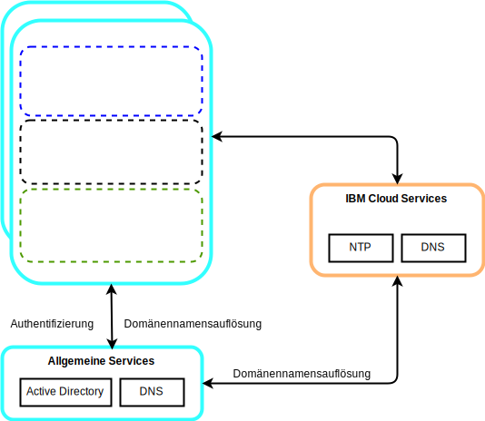
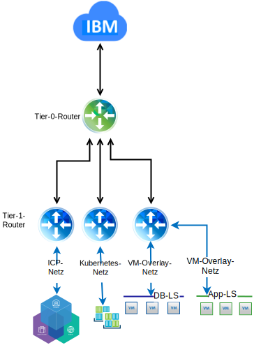

---

copyright:

  years:  2016, 2018

lastupdated: "2018-11-06"

---

# Detailliertes Design

## Allgemeine Servicekomponenten
Allgemeine Services stellen die Services bereit, die von anderen Services auf der Cloud-Management-Plattform verwendet werden. Dazu gehören Identitäts- und Zugriffsservices, Domänennamensservices und NTP-Services.

Abbildung 1. Allgemeine ICP-Services

### Identitäts- und Zugriffsservices
Im Rahmen der VCS-Automation wird Microsoft Active Directory (AD) für das Identitätsmanagement verwendet. Es wird eine einzelne AD-VSI (Virtual Server Instance) bereitgestellt. Das vCenter ist für die Verwendung der MS AD-Authentifizierung konfiguriert und ICP kann auch für die LDAP-Authentifizierung konfiguriert werden.

###	Domänennamensservices
Bei der VCS-Bereitstellung werden die bereitgestellten VSIs für Microsoft Active Directory (AD) als DNS-Server für die Instanz verwendet. Alle bereitgestellten Komponenten (vCenter, PSC, NSX und ESXi-Hosts) werden so konfiguriert, dass sie auf MS AD als Standard-DNS verweisen.

###	NTP-Services
Bei der VCS-Bereitstellung werden die NTP-Server der {{site.data.keyword.cloud}}-Infrastruktur verwendet. Alle bereitgestellten Komponenten werden so konfiguriert, dass sie diese NTP-Server verwenden. Dass alle Komponenten im Design dieselben NTP-Server verwenden, ist für die korrekte Funktion von Zertifikaten und die MS AD-Authentifizierung von kritischer Bedeutung.

## Netzbetrieb

### NSX-V-Netzbetrieb

NSX-V ist so konzipiert, dass eine einzelne NSX-V-Manager-Plattform an eine einzelne vCenter Server-Instanz gebunden ist. Es stellt Netzservices für Anwendungen bereit, die in einer vSphere-Umgebung ausgeführt werden.

Wenn Sie den NSX-V-Netzbetrieb in der VCS-Bereitstellung verwenden, können Sie ICP in einem VXLAN-Overlay-Netz bereitstellen.

ICP wird mit dem Calico-Standardnetzstack für Kubernetes bereitgestellt, der die Netzisolation in Ihrem Cluster ermöglicht.

Abbildung 2. ICP mit NSX-V-Netzbetrieb

Weitere Informationen finden Sie im [vCenter Server Networking - Leitfaden](../vcsnsxt/vcsnsxt-intro.html).

### NSX-T-Netzbetrieb

NSX-T ist so konzipiert, dass eine einzelne Netzplattform eine Verbindung zu einer beliebigen Anwendung herstellen kann, unabhängig davon, ob sie VM- oder containerbasiert ist und ob sie innerhalb oder außerhalb einer vSphere-Umgebung ausgeführt wird.

ICP bietet eine Option zum Ersetzen des Calico-Netzbetriebs durch eine NSX-T-Instanz, sodass eine zentrale Stelle für die Verwaltung des Netzes und der Sicherheit zur Verfügung steht.

Abbildung 3. ICP mit NSX-T-Netzbetrieb

### Zugehörige Links

* [Übersicht über VCS Hybridity Bundle](../vcs/vcs-hybridity-intro.html)
