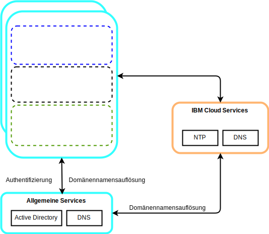
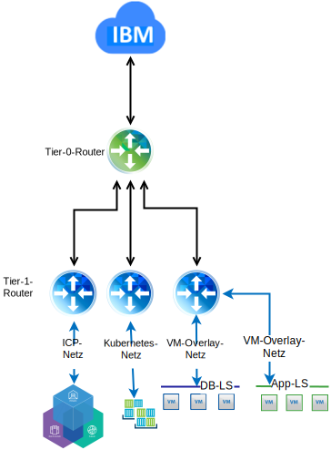

---

copyright:

  years:  2016, 2019

lastupdated: "2019-05-09"

subcollection: vmware-solutions

---

# Detailliertes Design
{: #vcsicp-detail-design}

## Allgemeine Servicekomponenten
{: #vcsicp-detail-design-common-services}

Allgemeine Services stellen die Services bereit, die von anderen Services auf der Cloud-Management-Plattform verwendet werden. Zu den allgemeinen Services gehören Identitäts-und Zugriffsservices, Domänennamensservices und NTP-Services.

### Identitäts- und Zugriffsservices
{: #vcsicp-detail-design-identity}

Im Rahmen der Automation von VMware vCenter Server on {{site.data.keyword.cloud}} wird Microsoft Active Directory (AD) für das Identitätsmanagement verwendet. Es wird eine einzelne AD-VSI (Virtual Server Instance) bereitgestellt. Das vCenter ist für die Verwendung der AD-Authentifizierung konfiguriert und {{site.data.keyword.icpfull_notm}} kann für die LDAP-Authentifizierung konfiguriert werden.

###	Domänennamensservices
{: #vcsicp-detail-design-dns}

Die vCenter Server-Bereitstellung verwendet die bereitgestellten AD-VSIs als DNS-Server für die Instanz. Alle bereitgestellten Komponenten wie vCenter, PSC, NSX und ESXi-Hosts werden so konfiguriert, dass sie auf AD als Standard-DNS verweisen.

###	NTP-Services
{: #vcsicp-detail-design-ntp}

Bei der vCenter Server-Bereitstellung werden die NTP-Server der {{site.data.keyword.cloud_notm}}-Infrastruktur verwendet. Alle bereitgestellten Komponenten werden so konfiguriert, dass sie diese NTP-Server verwenden. Dass alle Komponenten im Design dieselben NTP-Server verwenden, ist für die korrekte Funktion von Zertifikaten und die AD-Authentifizierung von ausschlaggebender Bedeutung.

## Netzbetrieb
{: #vcsicp-detail-design-networking}

### NSX-V-Netzbetrieb
{: #vcsicp-detail-design-nsx-v}

NSX-V ist so konzipiert, dass eine einzelne NSX-V-Manager-Plattform an eine einzelne vCenter Server-Instanz gebunden ist. Es stellt Netzservices für Anwendungen bereit, die in einer vSphere-Umgebung ausgeführt werden.

Wenn Sie den NSX-V-Netzbetrieb in der VCS-Bereitstellung verwenden, können Sie {{site.data.keyword.icpfull_notm}} in einem VXLAN-Overlay-Netz bereitstellen.

{{site.data.keyword.icpfull_notm}} wird mit dem Calico-Standardnetzstack für Kubernetes bereitgestellt, der die Netzisolation in Ihrem Cluster ermöglicht.

Weitere Informationen finden Sie im [Leitfaden für den vCenter Server-Netzbetrieb](/docs/services/vmwaresolutions/archiref/vcsnsxt?topic=vmware-solutions-vcsnsxt-intro).

### NSX-T-Netzbetrieb
{: #vcsicp-detail-design-nst-t}

NSX-T ist so konzipiert, dass eine einzelne Netzplattform eine Verbindung zu einer beliebigen Anwendung herstellen kann, unabhängig davon, ob sie VM- oder containerbasiert ist und ob sie innerhalb oder außerhalb einer vSphere-Umgebung ausgeführt wird.

{{site.data.keyword.icpfull_notm}} bietet eine Option zum Ersetzen des Calico-Netzbetriebs durch eine NSX-T-Instanz, sodass eine zentrale Stelle für die Verwaltung des Netzes und der Sicherheit zur Verfügung steht.

## Zugehörige Links
{: #vcsicp-detail-design-related}

* [Übersicht über vCenter Server on {{site.data.keyword.cloud_notm}} with Hybridity Bundle](/docs/services/vmwaresolutions/archiref/vcs?topic=vmware-solutions-vcs-hybridity-intro)
