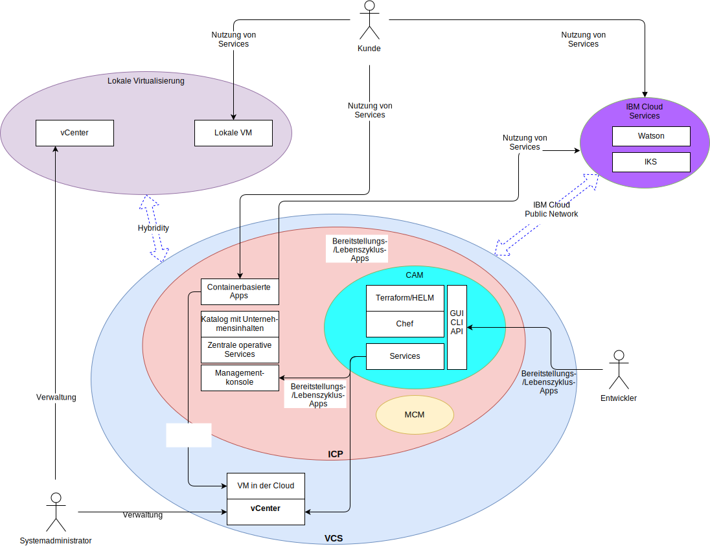

---

copyright:

  years:  2016, 2019

lastupdated: "2019-02-15"

---

# Systemkontext
{: #vcsicp-systemcontext}

Abbildung 1. Systemkontextdiagramm

Folgende Komponenten sind Kernkomponenten:

- **Lokale Virtualisierung** - Diese Komponente ist eine VMware-Umgebung, die am Standort des Kunden oder eines anderen Anbieters gehostet wird und die derzeit die virtuellen Maschinen (VMs) hostet, die die zu modernisierenden Anwendungen ausführen. Die lokale Virtualisierung ist die Quellenumgebung für VM-Migrationen und ist mit einer {{site.data.keyword.cloud}}-Instanz über VMware Hybridity (HCX) lose gekoppelt.
- **vCenter Server** - VMware vCenter Server on {{site.data.keyword.cloud_notm}} ist eine {{site.data.keyword.vmwaresolutions_short}}-Instanz, die das Ziel für migrierte VMs aus der lokalen Umgebung ist. Zusammen mit der lokalen virtualisierten Umgebung bildet sie eine Hybridumgebung, die es VMs ermöglicht, von einem Standort an einen anderen zu wechseln.
- **{{site.data.keyword.containerlong_notm}}** - {{site.data.keyword.containerlong_notm}} verwendet Kubernetes als Lösung zur Containerorchestrierung. IBM ist für den Betrieb und das Management des Kubernetes-Masterknotens verantwortlich, während die Workerknoten in einer vom Kunden verwalteten Infrastruktur bereitgestellt werden. IBM stellt Management-Tools für die Bereitstellung der Betriebssystempatches, Docker-Engine-Upgrades und neuer Kubernetes-Versionen zur Verfügung. {{site.data.keyword.containerlong_notm}} bietet eine isolierte und sichere Plattform für das Management von Containern, die portierbar und erweiterbar sind und die über eine automatische Fehlerbehebungsfunktion für Failover-Situationen verfügen.
- **{{site.data.keyword.icpfull_notm}}** - {{site.data.keyword.icpfull_notm}} ist eine Anwendungsplattform zur Entwicklung und Verwaltung von containerisierten Anwendungen. Bei {{site.data.keyword.icpfull_notm}} handelt es sich um eine integrierte Umgebung, die Kubernetes als Container-Orchestrator, ein privates Image-Repository, eine Managementkonsole, Überwachungsframeworks und eine grafische Benutzerschnittstelle enthält, von der aus Sie Anwendungen zentral bereitstellen, verwalten, überwachen und skalieren können.
- **{{site.data.keyword.cloud_notm}} Automation Manager** - CAM ist eine auf Unternehmen abgestimmte IaC-Plattform (IaC = Infrastructure as Code), die eine zentrale Bereitstellung von VMware-basierten Workloads neben Kubernetes-basierten Workloads bietet. Die Plattform ermöglicht eine automatisierte Workloadbereitstellung für virtuelle Maschinen und Container, deren Infrastrukturvoraussetzungen über CAM aktiviert sind.
- **IBM Multi Cloud Manager** - MCM bietet Benutzertransparenz, anwendungsorientiertes Management (Richtlinien, Bereitstellungen, Vitalität, Betrieb) und die richtlinienbasierte Konformität über Clouds und Cluster hinweg. Mit MCM erhalten Sie die Kontrolle über Ihre Kubernetes-Cluster.
- **{{site.data.keyword.cloud_notm}} Services** - {{site.data.keyword.cloud_notm}} Services bieten eine breite Palette an nutzbaren Services, einschließlich Analyse-, AI- und IoT-Angebote.

## Akteure
{: #vcsicp-systemcontext-actors}

Tabelle 1. Akteure

Akteur | Beschreibung
--|--
Systemadministrator | Mitarbeiter mit VMware vSphere-Know-how, der vCenter Server verwendet, um die lokale Virtualisierung und die vCenter Server-Instanz zu verwalten.
Entwickler | Mitarbeiter mit Container-Know-how, der die CAM-Konsole verwendet, um Container zu erstellen und zu verwalten. Er richtet die neuen Services im Rahmen der Anwendungsmodernisierung ein. Mit CAM können die Entwickler die Workloads auf vCenter Server, {{site.data.keyword.icpfull_notm}} oder {{site.data.keyword.containerlong_notm}} bereitstellen, die mit VMs und Containern erstellten Services zusammensetzen und koordinieren und DevOps-Toolchains und Day-2-ITSM-Lösungen integrieren.
Kunde | Externer Akteur, der Services des Unternehmens nutzt. Bei Acme Skateboards ist der Kunde ein Skater, der Skateboarding-Produkte erwerben möchte. Der Kunde benötigt einen sicheren Internetzugriff auf den Katalog.
{{site.data.keyword.containerlong_notm}} | IBM Mitarbeiter, der den {{site.data.keyword.containerlong_notm}}-Masterknoten für den Service verwaltet.

## Systeme
{: #vcsicp-systemcontext-systems}

Tabelle 2. Systeme

Akteur | Beschreibung
--|--
vCenter Server | Primäre Schnittstelle, die der Systemadministrator verwendet, um die lokalen VMs und die {{site.data.keyword.cloud_notm}}-VMs in der vCenter Server-Instanz zu verwalten.
Lokale VMs| Virtualisierte Server, die Anwendungen hosten, die in die {{site.data.keyword.cloud_notm}} migriert werden sollen. (Ursprünglich als VMs migriert und für die Anwendungsmodernisierung aus VMs in Container umstrukturiert.)
{{site.data.keyword.cloud_notm}}-VMs | Virtualisierte Server, die Anwendungen hosten, die aus dem lokalen Rechenzentrum migriert wurden. Im Falle dieser Referenzarchitektur und für Acme Skateboards ist eine der {{site.data.keyword.cloud_notm}}-VMs ein Datenbankserver, der Teil der Workload der Onlinepräsenz ist.
Enterprise Content-Katalog | Zentrale Position, von der aus Sie Pakete in Ihrem Cluster suchen und installieren können. Der Katalog enthält eine Reihe von IBM Paketen, die zum Erstellen von Containern und für den Zugriff auf Helm-Diagramme verwendet werden. Helm ist ein Tool für das Management von Kubernetes-Diagrammen. Diagramme sind Pakete mit vorkonfigurierten Kubernetes-Ressourcen, mit denen Sie Containerbereitstellungen versionieren, paketieren, freigeben, bereitstellen, löschen, aktualisieren und sogar rückgängig machen können. Helm ist das native Paketmanagementsystem von Kubernetes und wird für das Anwendungsmanagement innerhalb eines {{site.data.keyword.icpfull_notm}}-Clusters verwendet.
Zentrale operative Services | {{site.data.keyword.icpfull_notm}} enthält eine Reihe von Tools zum Erfassen, Speichern und Abfragen von Protokollen und Metriken. Diese Tools stellen einen zentralen Speicher für alle Protokolle und Metriken bereit und bieten eine verbesserte Leistung und erhöhte Stabilität beim Zugriff auf bzw. Abfragen von Protokollen und Metriken.
Managementkonsole | Die {{site.data.keyword.icpfull_notm}}-Managementkonsole führt das Management, die Überwachung und die Fehlerbehebung Ihrer Anwendungen und Cluster von einer einzigen, zentralen und sicheren Managementkonsole aus.
Terraform | Terraform steuert die Bereitstellung von Cloud- und Infrastrukturressourcen durch die Verwendung von Providern wie VMware vSphere, {{site.data.keyword.cloud_notm}}, Microsoft Azure, Amazon Web Services, Google Cloud Platform und OpenStack.
Helm | Paketmanager für Kubernetes. Helm-Diagramme werden verwendet, um Kubernetes-Ressourcen zu definieren und Anwendungen bereitzustellen.
Chef | Verantwortlich für das Konfigurationsmanagement und die Compliance-Automatisierung. Chef stellt die Middleware und Anwendungen bereit und konfiguriert sie, nachdem Terraform die Ersteinrichtung abgeschlossen hat.
Services | Stellt den Service Composer dar, in dem die Administratoren die Services erstellen, zusammenfassen und entwerfen, die aus Kubernetes-Ressourcen und einer oder mehreren VMs erstellt wurden.
Containerisierte Anwendungen | Anwendungen, die die Anwendungsmodernisierung durchlaufen haben und jetzt als Container ausgeführt werden. Im Falle dieser Referenzarchitektur und für Acme Skateboards ist eine der containerisierten Anwendungen ein Web-Server, der Teil der Workload der Onlinepräsenz ist.
Watson | Im Falle dieser Referenzarchitektur und bei Acme Skateboards stellt Watson den AI-Service dar, der in der Concept-Car-Architektur verwendet wird.

Die Anwendungsmigration, der Netzbetrieb und die Sicherheit stellen häufig die anspruchsvollsten Aspekte der Anwendungsmodernisierung dar. vCenter Server, VMware Hybridity, VMware NSX, {{site.data.keyword.icpfull_notm}} und {{site.data.keyword.containerlong_notm}} decken diese Herausforderungen ab und ermöglichen Ihnen das Erstellen widerstandsfähiger, sicherer und leistungsfähiger moderner Anwendungen.

## Zugehörige Links
{: #vcsicp-systemcontext-related}

* [Übersicht über vCenter Server on {{site.data.keyword.cloud_notm}} with Hybridity Bundle](/docs/services/vmwaresolutions/archiref/vcs?topic=vmware-solutions-vcs-hybridity-intro)
