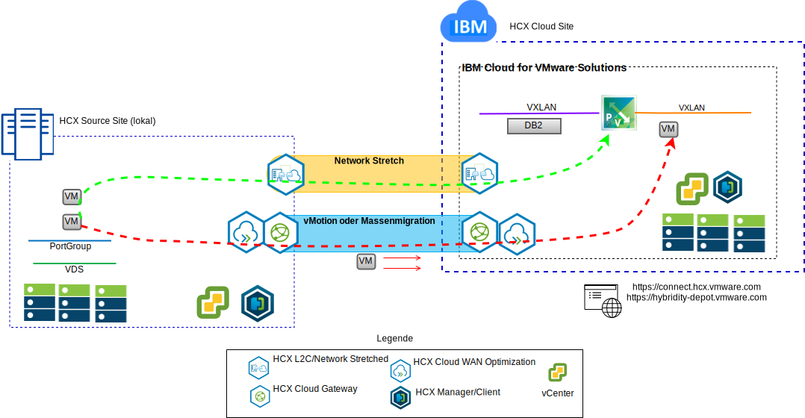
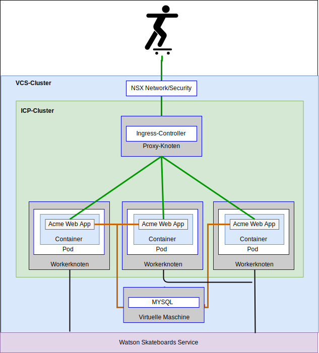

---

copyright:

  years:  2016, 2018

lastupdated: "2018-10-30"

---

# Anwendungsfälle

## Migration der Workload auf IBM Cloud
Acme Skateboards möchte das lokale VMware SDDC nahtlos in eine VCS-Instanz unter IBM Cloud erweitern. Gleichzeitig sollen die Geschäftsabläufe aber nach Möglichkeit nicht unterbrochen werden und die Ausfallzeiten sollen minimiert werden. Das Rekonfigurieren der Anwendungen für die Ausführung in der Cloud ist keine optimal Lösung.

Der Service "VMware Hybridity on IBM Cloud" ermöglicht das Einrichten nahtloser Verbindungen zwischen IBM Cloud und einem lokalen virtualisierten VMware-Rechenzentrum.

Das vCenter Server with Hybridity Bundle-Angebot von IBM Cloud ermöglicht sichere Verbindungen zwischen dem lokalen Peer-Quellenstandort und dem IBM Cloud-Zielstandort.

Abbildung 1. VMware Hybridity-Services

Dadurch wird eine flexible Verbindung zwischen Standorten und IBM Cloud eingerichtet und z. B. folgende Funktionalität zur Verfügung gestellt:
- **Einfache Interkonnektivität** - Logische Netzverbindungen können ohne großen Aufwand über eine beliebige physische Verbindung hergestellt werden, z. B. über das öffentliche Internet, ein privates VPN oder über IBM Cloud Direct Link.
- **Layer-2-Erweiterung** – Lokale Netze werden in die Cloud erweitert, einschließlich lokaler Teilnetze und IP-Adressierung.
- **Verschlüsselung** - Der Datenaustausch im Netz wird zwischen den Peerstandorten sicher verschlüsselt.
- **Netzoptimierung** – Wählt die beste Verbindung aus und nutzt die Verbindung effizient aus, sodass der Datenaustausch im Netz mit maximaler Geschwindigkeit erfolgt.
- **Datendeduplizierung** – Eine Reduzierung von bis zu 50% des Netzverkehrs ist möglich.
- **Intelligentes Routing** – Wenn eine Workload verlagert wird, kann das "Proximity Routing" den Netzpfad (d. h. Gateway) ändern, sodass der Datenaustausch im Netz das Gateway des Zielstandorts verwendet (anstelle des ursprünglichen Standorts).
- **Migration ohne Ausfallzeit** - Eine aktive virtuelle Maschine kann mit vMotion in die Cloud verlagert werden (oder umgekehrt).
- **Geplante Migration**: Eine beliebige Anzahl virtueller Maschinen kann an den Zielstandort repliziert und dann zu einem bestimmten Zeitpunkt an diesem Standort aktiviert werden, um die Systeme, die am ursprünglichen Standort ausgeführt werden, zu ersetzen.
- **Migration von Sicherheitsrichtlinien** - Wenn NSX lokal verwendet wird, werden alle Sicherheitsrichtlinien, Firewalls usw. zusammen mit der Workload verlagert.

Mithilfe dieser Lösung konnte Acme Skateboards die VMware-Workloads erfolgreich auf die IBM Cloud migrieren - bei minimaler (oder ganz ohne) Ausfallzeit und ohne erneute Anwendungskonfiguration.

## Bereitstellung einer Hybridarchitektur

Acme Skateboards möchte für den Prozess (Journey) der Anwendungsmodernisierung eine Hybridarchitektur auf IBM Cloud bereitstellen, die aus VCS und ICP besteht. Dabei sollen die Datenbanken auf virtuellen Maschinen ausgeführt werden, die Anwendungen und Web-Services in Containern, und es soll eine gemeinsame Gruppe von Tools für das Netz- und Sicherheitsmanagement verwendet werden.

Abbildung 2. Hybridanwendung von Acme Skateboards

Die IBM Cloud for VMware-Lösungen stellen die Automatisierungsfunktionen zur weltweiten Bereitstellung von VMware-Technologiekomponenten in IBM Cloud-Rechenzentren bereit. Die Architektur besteht aus einer einzelnen Cloudregion und unterstützt die Erweiterung in weitere Cloudregionen, die sich in einem anderen geografischen Gebiet und/oder in einem anderen IBM Cloud-Pod innerhalb desselben Rechenzentrums befinden.

Die Produkte IBM Cloud Private (ICP) und Cloud Automation Manager (CAM) werden manuell auf Ihrer lokalen Virtualisierungsplattform bereitgestellt und ermöglichen so das Cloud-Management lokal am Standort. Alternativ werden ICP und CAM als Serviceerweiterung für eine vorhandene oder neue VCS-Bereitstellung per Automation angeboten, wodurch das Cloud-Management über die IBM Cloud ermöglicht wird.

Das Diagramm unten stellt ICP bei Ausführung auf einer VCS-Instanz dar. NSX-V ist mit einem dedizierten Switch/VXLAN, einem DLR und einem ESG speziell für das ICP-Overlay-Netz konfiguriert. Das Routing wird über das ESG für den Zugriff auf das Underlay-Netz eingerichtet.

Mithilfe der IBM Cloud-Automatisierung kann Acme Skateboards eine Hybridlösung zur Verfügung stellen, die "VMware on IBM Cloud" zur Ausführung der Datenbank-VMs umfasst und "ICP on VMware on IBM Cloud" zur Ausführung der Apps und Front-End-Web-Services in Containern. NSX bietet ihnen eine gemeinsame Gruppe von Management-Tools für den Netzbetrieb und die Sicherheit im Overlay-Netz.

Abbildung 3. VCS mit ICP

### Zugehörige Links

* [Übersicht über VCS Hybridity Bundle](../vcs/vcs-hybridity-intro.html)
