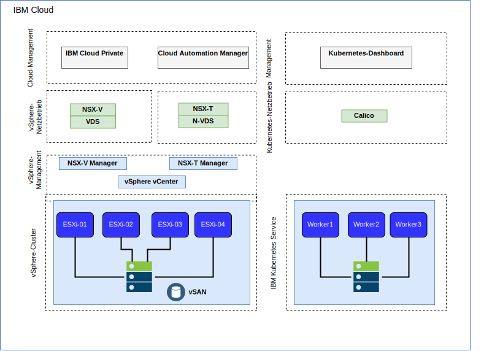
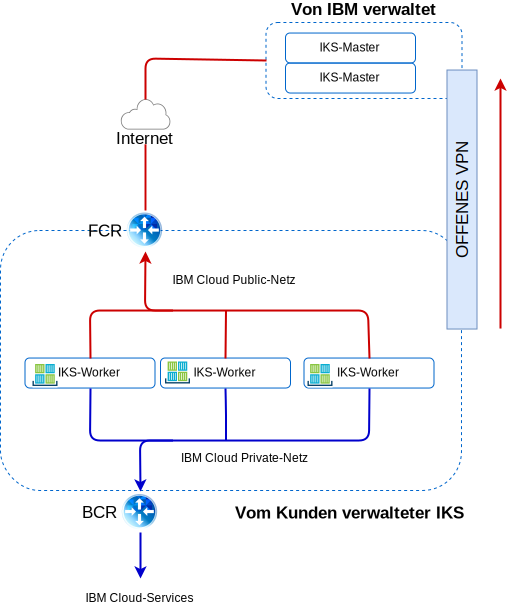

---

copyright:

  years:  2016, 2019

lastupdated: "2019-08-05"

subcollection: vmware-solutions

---

# IBM Cloud-Netzbetrieb und -Infrastruktur
{: #vcsiks-arch-overview-infrastructure}

## Virtual Routing and Forwarding
{: #vcsiks-arch-overview-infrastructure-vrf}

{{site.data.keyword.cloud}}-Konten können als Konto mit Virtual Routing and Forwarding (VRF) konfiguriert werden. VRF-Konten aktivieren das automatische globale Routing zwischen Teilnetz-IP-Blöcken. Alle Konten mit Direct Link-Verbindungen müssen in VRF-Konten konvertiert oder als solche erstellt werden.

## Direct Link
{: #vcsiks-arch-overview-infrastructure-direct-link}

{{site.data.keyword.cloud_notm}} Direct Link Connect bietet privaten Zugriff auf Ihre {{site.data.keyword.cloud_notm}}-Infrastruktur und auf alle anderen Clouds, die mit Ihrem Netzserviceanbieter über Ihr lokales {{site.data.keyword.CloudDataCent_notm}} verbunden sind. Diese Option ist optimal für die Konnektivität zu mehreren Clouds in einer einzelnen Umgebung geeignet.

Wir verbinden Kunden mithilfe einer gemeinsamen Bandbreitentopologie mit dem privaten {{site.data.keyword.cloud_notm}}-Netz. Wie bei allen Direct Link-Produkten können Sie globales Routing hinzufügen, das privaten Netzverkehr zu allen {{site.data.keyword.cloud_notm}}-Standorten ermöglicht.

## Virtuelle private Netze
{: #vcsiks-arch-overview-infrastructure-virt-private-network}

### strongSwan-VPN
{: #vcsiks-arch-overview-infrastructure-strongswan}

Der strongSwan-IPSec-VPN-Service stellt einen sicheren End-to-End-Kommunikationskanal über das Internet bereit, der auf der standardisierten IPSec-Protokollsuite (IPSec - Internet Protocol Security) basiert.

### Hybridität (HCX)
{: #vcsiks-arch-overview-infrastructure-hcx}

VMware vCenter Server on {{site.data.keyword.cloud_notm}} with Hybridity Bundle erweitert die Netze von lokalen Rechenzentren nahtlos in die {{site.data.keyword.cloud_notm}}. Dies ermöglicht die Migration von virtuellen Maschinen in die und aus der {{site.data.keyword.cloud_notm}}, ohne dass hierzu eine Konvertierung oder Änderung erforderlich ist.

## Physische Struktur
{: #vcsiks-arch-overview-infrastructure-physical-structure}

Die physische Infrastruktur, die zur Bereitstellung eines vCenter Server-Clusters erforderlich ist, setzt folgende Mindestspezifikationen voraus.

Tabelle 1. Spezifikationen für vCenter Server

  | NFS-Bereitstellung | VSAN-Bereitstellung
---|---|---
Anzahl Server | 3 | 4
CPU | 28 Kerne 2,2 GHZ | 28 Kerne 2,2 GHZ
RAM | 384 GB | 384 GB
Speicher| Management: 2 TB 2 IOPS, Workload: 2 TB 4 IOPS | Mindest-SSD: 960 GB (x2)   

Die Bereitstellungsoptionen für {{site.data.keyword.containerlong_notm}} variieren abhängig von Ihren Workerknotenanforderungen.

Tabelle 2. {{site.data.keyword.containerlong_notm}}-Spezifikationen

  | Virtuelle Maschine | Bare Metal
--|---|--
Anzahl Server | 3 | 3
CPU | 2 - 56 Kerne | 4 - 28 Kerne
RAM | 4 GB - 242 GB | 32 GB - 512 GB
Speicher | 100 GB |  SATA: 2 TB / SSD: 960 GB

## Virtuelle Struktur
{: #vcsiks-arch-overview-infrastructure-virtual-structure}

Innerhalb der vCenter Server-Instanz werden die virtuellen Maschinen des Kunden für dedizierte Instanzen von NSX Edge Services Gateway (ESG) und Distributed Logical Router (DLR) bereitgestellt.

Das ESG ist mit einer Quellen-NAT-Regel (SNAT) konfiguriert, um abgehenden Datenverkehr zu ermöglichen, wodurch die Internetverbindung zum Download der {{site.data.keyword.icpfull_notm}} -Voraussetzungen und zur Konnektivität mit GitHub und Docker befähigt wird. Alternativ können Sie einen Web-Proxy für die Internetkonnektivität verwenden. Das ESG ist für den Zugriff auf DNS- und NTP-Services über das private Netz konfiguriert. Die Integration in die {{site.data.keyword.containerlong_notm}}-Instanz ist über den {{site.data.keyword.cloud_notm}}-Netzbetrieb zwischen der vCenter Server-Instanz und {{site.data.keyword.containerlong_notm}} verfügbar.

## vCenter Server-Komponenten
{: #vcsiks-arch-overview-infrastructure-vcs-comp}

### Platform Service Controller
{: #vcsiks-arch-overview-infrastructure-psc}

Die vCenter Server-Bereitstellung verwendet einen einzelnen externen Platform Services Controller (PSC), der in einem portierbaren Teilnetz im privaten VLAN installiert ist, das Management-VMs zugeordnet ist. Das zugehörige Standardgateway wird auf den Back-End-Kundenrouter (BCR - Back-end Customer Router) eingestellt.

### vCenter Server
{: #vcsiks-arch-overview-infrastructure-vcs}

Wie der PSC wird vCenter Server als Appliance bereitgestellt. Darüber hinaus wird vCenter in einem portierbaren Teilnetz im privaten VLAN installiert, das den Management-VMs zugeordnet ist. Das zugehörige Standardgateway wird auf den BCR (Back-end Customer Router, Back-End-Kundenrouter) eingestellt.

### NSX-Manager
{: #vcsiks-arch-overview-infrastructure-nsx-manager}

Der NSX-Manager wird im ursprünglichen vCenter Server-Cluster bereitgestellt. Dem NSX-Manager wird eine IP-Adresse aus dem privaten, portierbaren Adressblock zugeordnet, der für Managementkomponenten vorgesehen ist.

### NSX-Controller
{: #vcsiks-arch-overview-infrastructure-nsx-controllers}

Die {{site.data.keyword.cloud_notm}}-Automatisierung stellt drei NSX-Controller im ursprünglichen Cluster bereit. Den Controllern werden IP-Adressen aus dem privaten portierbaren Teilnetz zugeordnet, das für Managementkomponenten vorgesehen ist.

### NSX ESGs / DLRs
{: #vcsiks-arch-overview-infrastructure-nsx-esg}

NSX Edge Services Gateway-Paare werden bereitgestellt. In allen Fällen wird ein Gateway-Paar für den abgehenden Datenverkehr aus Automatisierungskomponenten verwendet, die sich im privaten Netz befinden. Für vCenter Server und {{site.data.keyword.icpfull_notm}} wird ein zweites Gateway, das als ICP-verwaltete Edge bezeichnet wird, bereitgestellt und mit einem Uplink zum öffentlichen Netz sowie einer Schnittstelle, die dem privaten Netz zugeordnet ist, konfiguriert.

Alle erforderlichen NSX-Komponenten, wie z. B. Distributed Logical Router (DLR), logische Switches und Firewalls, können vom Administrator konfiguriert werden. Weitere Informationen zu den NSX Edge-Instanzen, die im Rahmen der Lösung bereitgestellt werden, enthält der [Leitfaden für den vCenter Server-Netzbetrieb](/docs/services/vmwaresolutions/archiref/vcsnsxt?topic=vmware-solutions-vcsnsxt-intro).

In den folgenden Tabellen sind die {{site.data.keyword.icpfull_notm}} ESG/DLR-Spezifikationen zusammengefasst.

Tabelle 3. {{site.data.keyword.icpfull_notm}} ESG-Spezifikationen

Attribut |  Spezifikation
--|--
Edge Service Gateway | Virtuelle Appliance
Edge-Größe "Large" | Anzahl vCPUs	2
Speicher	| 1 GB
Platte	| 1000 GB auf lokalem Datenspeicher

Tabelle 4. {{site.data.keyword.icpfull_notm}} DLR-Spezifikationen

Attribut  |  Spezifikation
--|--|
Distributed Logical Router |	Virtuelle Appliance
Edge-Größe "Compact" | Anzahl vCPUs	1
Speicher	| 512 MB
Platte	| 1000 GB auf lokalem Datenspeicher

## Komponenten des IBM Cloud Kubernetes-Service
{: #vcsiks-arch-overview-infrastructure-iks-comp}

### Kubernetes-Master
{: #vcsiks-arch-overview-infrastructure-kube-master}

Der Kubernetes-Master hat die Aufgabe, alle Rechen-, Netz- und Speicherressourcen im Cluster zu verwalten. Er stellt sicher, dass die Bereitstellung Ihrer containerisierten Anwendungen und Services gleichmäßig auf die Workerknoten im Cluster verteilt wird.

###	Workerknoten
{: #vcsiks-arch-overview-infrastructure-worker-node}

Jeder Worker-Knoten ist eine physische Maschine (Bare Metal) oder eine VM, die auf physischer Hardware in der Cloudumgebung ausgeführt wird. Bei der Bereitstellung eines Workerknotens legen Sie die Ressourcen fest, die für die auf diesem Workerknoten gehosteten Container verfügbar sind. Im Bereitstellungszustand sind Ihre Workerknoten mit einer von IBM verwalteten Docker Engine, separaten Rechenressourcen, Netzbetrieb und einem Datenträgerservice konfiguriert. Die integrierten Sicherheitsfunktionen bieten Isolation, Funktionalität für das Ressourcenmanagement sowie Einhaltung von Sicherheitsbestimmungen für Workerknoten.
