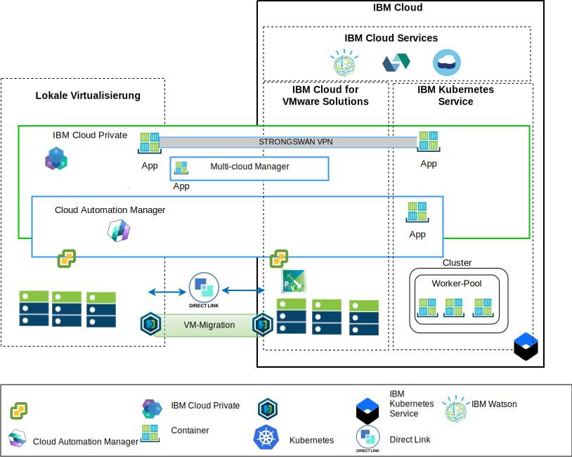

---

copyright:

  years:  2016, 2019

lastupdated: "2019-05-08"

subcollection: vmware-solutions

---

# Übersicht über die Architektur
{: #vcsiks-arch-overview}

Die {{site.data.keyword.vmwaresolutions_full}}-Produktangebote stellen eine Automatisierung zur weltweiten Bereitstellung von VMware-Technologiekomponenten in {{site.data.keyword.CloudDataCents_notm}} bereit. Die Architektur besteht aus einer einzelnen Cloudregion und unterstützt die Erweiterung in weitere Cloudregionen, die sich in einem anderen geografischen Gebiet oder in einem anderen {{site.data.keyword.cloud_notm}}-Pod innerhalb desselben Rechenzentrums befinden.

Die Produkte {{site.data.keyword.icpfull_notm}} und Cloud Automation Manager (CAM) können manuell auf Ihrer lokalen Virtualisierungsplattform bereitgestellt werden und ermöglichen so das Cloud-Management am lokalen Standort. Alternativ werden {{site.data.keyword.icpfull_notm}} und CAM als Serviceerweiterungen für eine vorhandene oder neue VMware vCenter Server on {{site.data.keyword.cloud_notm}}-Bereitstellung per Automation angeboten, wodurch das Cloud-Management über die {{site.data.keyword.cloud_notm}} ermöglicht wird.

{{site.data.keyword.icpfull_notm}} ist eine Anwendungsplattform für die Entwicklung und Verwaltung von lokalen, containerisierten Anwendungen. Bei {{site.data.keyword.icpfull_notm}} handelt es sich um eine integrierte Umgebung für die Verwaltung von Containern, die Kubernetes als Container-Orchestrator, ein privates Image-Repository, eine Managementkonsole und Überwachungsframeworks enthält.

IBM Multi-Cluster Manager (MCM) bietet Benutzertransparenz, anwendungsorientiertes Management (Richtlinien, Bereitstellungen, Vitalität, Betrieb) und die richtlinienbasierte Konformität über Clouds und Cluster hinweg. Mit IBM Multi-Cluster Manager erhalten Sie die Kontrolle über Ihre Kubernetes-Cluster. Sie können sicherstellen, dass Ihre Cluster sicher sind, effizient arbeiten und das von Anwendungen erwartete Service-Level zur Verfügung stellen.

{{site.data.keyword.cloud_notm}} Automation Manager (CAM) ist eine Self-Service-Managementplattform für mehrere Clouds, die unter {{site.data.keyword.cloud_notm}} Private ausgeführt wird und es Entwicklern und Administratoren ermöglicht, die Anforderungen des Unternehmens zu erfüllen. Der Service Composer von Cloud Automation Manager ermöglicht es Ihnen, Hybrid-Cloud-Services im IBM Cloud Private-Katalog zugänglich zu machen.

## IBM Cloud-seitige Plattform für das Cloud-Management
{: #vcsiks-arch-overview-ibm-cloud-side}

Das folgende Diagramm zeigt {{site.data.keyword.icpfull_notm}} und CAM mit Bereitstellung in der {{site.data.keyword.cloud_notm}}-Infrastruktur und mit Verbindungen zum lokalen vCenter- und {{site.data.keyword.containerlong_notm}}-Service, der in {{site.data.keyword.cloud_notm}} bereitgestellt ist. Benutzer können virtuelle Maschinen (VMs) lokal und in vCenter Server-Instanzen sowie Container im {{site.data.keyword.icpfull_notm}}- und {{site.data.keyword.containerlong_notm}}-Cluster bereitstellen.

Im Diagramm erstellt CAM logische Cloudverbindungen zu den vCenter-Instanzen, Cloud-Providern sowie den {{site.data.keyword.icpfull_notm}}- und {{site.data.keyword.containerlong_notm}}-Umgebungen. {{site.data.keyword.icpfull_notm}}-Cluster müssen in jedem Rechenzentrum oder jeder Cloudumgebung bereitgestellt werden. MCM stellt den Mechanismus zur Verfügung, mit dem die {{site.data.keyword.icpfull_notm}}-Cluster in einer Managementansicht verbunden werden können.

{{site.data.keyword.icpfull_notm}} kann mit NSX-V- oder NSX-T-Komponenten bereitgestellt werden. Bei {{site.data.keyword.icpfull_notm}} mit NSX-V können die {{site.data.keyword.icpfull_notm}}-VMs im VXLAN-Netz ausgeführt werden und das interne Netz von Kubernetes Calico nutzen.

Bei {{site.data.keyword.icpfull_notm}} mit NSX-T können die Benutzer den Netzbetrieb, Teilnetze und Richtlinien von der zentralen Benutzerschnittstelle (NSX-T Manager) steuern und konfigurieren. Informationen zu den Unterschieden zwischen NSX-V und NSX-T finden Sie unter [Referenzarchitektur für den Netzbetrieb mit {{site.data.keyword.cloud_notm}} VCS](/docs/services/vmwaresolutions?topic=vmware-solutions-vcsnsxt-intro#vcsnsxt-intro).

## Lokale Cloud-Management-Plattform
{: #vcsiks-arch-overview-on-premises}

Das folgende Diagramm zeigt {{site.data.keyword.icpfull_notm}} und CAM mit Bereitstellung in der lokalen Cloudinfrastruktur und Verbindungen zu vCenter und {{site.data.keyword.containerlong_notm}}, die in der {{site.data.keyword.cloud_notm}} bereitgestellt sind. Benutzer können VMs und Container lokal, VMs in vCenter Server-Instanzen sowie Container im {{site.data.keyword.containerlong_notm}}-Cluster bereitstellen.

Das strongSwan-VPN wird verwendet, um die Verbindung zu den bereitgestellten {{site.data.keyword.containerlong_notm}}-Containern einzurichten. strongSwan könnte später dann durch Direct Link-Konnektivität ersetzt werden.

Im Diagramm erstellt CAM logische Cloudverbindungen zu den vCenter-Instanzen, Cloud-Providern sowie den {{site.data.keyword.icpfull_notm}}- und {{site.data.keyword.containerlong_notm}}-Umgebungen. {{site.data.keyword.icpfull_notm}}-Cluster müssen in jedem Rechenzentrum oder jeder Cloudumgebung bereitgestellt werden. MCM stellt den Mechanismus zur Verfügung, mit dem die {{site.data.keyword.icpfull_notm}}-Cluster in einer Managementansicht verbunden werden können.

## Zugehörige Links
{: #vcsiks-arch-overview-related}

* [Übersicht über vCenter Server on {{site.data.keyword.cloud_notm}} with Hybridity Bundle](/docs/services/vmwaresolutions?topic=vmware-solutions-vcs-hybridity-intro#vcs-hybridity-intro)
