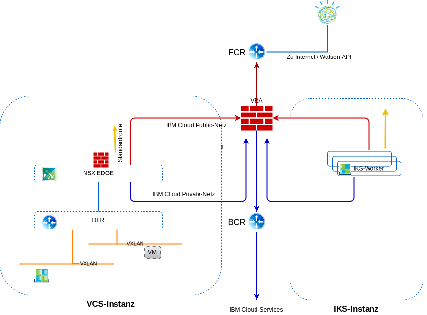

---

copyright:

  years:  2016, 2019

lastupdated: "2019-05-08"

subcollection: vmware-solutions

---

# Netzbetrieb, Sicherung, Disaster-Recovery und Skalierbarkeit
{: #vcsiks-overview-network}

Lesen Sie die Informationen zu den Aspekten des Netzbetriebs, der Sicherung, der Disaster-Recovery (DR) und der Skalierbarkeit.

## Netzbetrieb
{: #vcsiks-overview-network-networking}

{{site.data.keyword.cloud}} verfügt über zwei Netze. Über das öffentliche Netz können Server aus dem Internet erreicht werden. Das private Netz ermöglicht Servern über einen Hochgeschwindigkeitsbackbone in allen {{site.data.keyword.CloudDataCents_notm}} die Kommunikation miteinander.

{{site.data.keyword.containerlong_notm}} richtet den Cluster standardmäßig mit Zugriff auf ein öffentliches VLAN und ein privates VLAN ein.
- Für jeden Workerknoten gibt es eine öffentliche IP-Adresse, wodurch Workerknoten eine Schnittstelle für das öffentliche Netz erhalten.
  - Für alle Workerknoten ist der gesamte abgehende Datenaustausch im Netz zulässig.
  - Der eingehende Datenaustausch im Netz wird bis auf wenige Ports gesperrt. Diese Ports sind geöffnet, damit IBM den Datenaustausch im Netz überwachen und Sicherheitsupdates für den Kubernetes-Masterknoten automatisch installieren kann.
- Für jeden Workerknoten gibt es eine private IP-Adresse, wodurch Workerknoten eine Schnittstelle für das private Netz erhalten.
- Zwischen allen Workerknoten und dem Masterknoten besteht automatisch eine sichere OpenVPN-Verbindung.

### Integration des IBM Cloud Kubernetes-Service und von vCenter Server
{: #vcsiks-overview-network-iks-vcs-integration}

Bei den folgenden Szenarios werden {{site.data.keyword.containerlong_notm}} und VMware vCenter Server in den {{site.data.keyword.cloud_notm}}-Netzbetrieb integriert:
- **VRA-Routing** - Dieses Szenario setzt voraus, dass die {{site.data.keyword.containerlong_notm}}-Workerknoten in demselben VLAN wie die vCenter Server-Instanz bereitgestellt werden. Auf diese Weise kann für ein ESG über BGP ein Peering mit VRA erreicht und das Routing aus dem Overlay-Netz in das Underlay-Netz zwischen vCenter Server und {{site.data.keyword.containerlong_notm}} ermöglicht werden. Auf den {{site.data.keyword.containerlong_notm}}-Workerknoten wird für jedes VXLAN-Netz eine statische Route benötigt, damit diese Anforderungen an den BCR/VRA zurückgeleitet werden und das Routing ordnungsgemäß erfolgt.
- **strongSwan-VPN** - Dieses Szenario verwendet die Standardlösung für die Konnektivität von {{site.data.keyword.containerlong_notm}} zum Unternehmen. Ein strongSwan-Container stellt ein VPN-Gateway für den Cluster bereit, das Pakete über einen IPSec-Tunnel zum fernen Gateway an ferne Netze weiterleitet. Dieses ferne Gateway ist eine ESG-Instanz auf der vCenter Server-Instanz. Auf den Gateways sind Routen konfiguriert, die alle Cluster- und Service-IP-Bereiche an den StrongSwan-Container und alle BYOIP-Adressen von vCenter Server an die ESG-Instanz senden. Die Ziel-IP-Adressen für die Gateways sind zum einen die private portierbare IP-Adresse der Lastausgleichsfunktion, die dem strongSwan-Container zugeordnet ist, und zum zweiten die private portierbare IP-Adresse der ESG-Instanz.

#### Netz-VLANs des IBM Cloud Kubernetes-Service
{: #vcsiks-overview-network-iks-vlans}

Die folgenden Informationen beziehen sich auf öffentliche VLAN-Teilnetze:
- Das primäre öffentliche Teilnetz bestimmt die öffentlichen IP-Adressen, die den Workerknoten während der Clustererstellung zugeordnet werden. Mehrere Cluster in demselben VLAN können ein primäres öffentliches Teilnetz gemeinsam nutzen.
- Das portierbare öffentliche Teilnetz ist nur an einen einzigen Cluster gebunden und stellt dem Cluster acht öffentliche IP-Adressen zur Verfügung. Drei IP-Adressen sind für Netzfunktionen reserviert. Eine IP-Adresse wird vom Standard-ALB für die öffentliche Ingress-Instanz genutzt und vier IP-Adressen werden zum Erstellen von öffentlichen Netzservices für die Lastausgleichsfunktion verwendet.
- Portierbare öffentliche IP-Adressen sind permanente, festgelegte IP-Adressen, die für den Zugriff auf Lastausgleichsservices über das Internet verwendet werden.

Die folgenden Informationen beziehen sich auf private VLAN-Teilnetze:
- Das primäre private Teilnetz bestimmt die privaten IP-Adressen, die den Workerknoten während der Clustererstellung zugeordnet werden. Mehrere Cluster in demselben VLAN können ein primäres privates Teilnetz gemeinsam nutzen.
- Das portierbare private Teilnetz ist nur an einen einzigen Cluster gebunden und stellt dem Cluster acht private IP-Adressen zur Verfügung. Drei IP-Adressen sind für Netzfunktionen reserviert. Eine IP-Adresse wird vom Standard-ALB für die private Ingress-Instanz genutzt und vier IP-Adressen werden zum Erstellen von privaten Netzservices für die Lastausgleichsfunktion verwendet.
- Portierbare private IP-Adressen sind permanente, festgelegte IP-Adressen, die für den Zugriff auf Lastausgleichsservices über das Internet verwendet werden.

#### Calico-Netz-Plug-in
{: #vcsiks-overview-network-calico}

Jeder Kubernetes-Cluster wird mit einem Netz-Plug-in namens "Calico" konfiguriert.

Es gibt konfigurierte Standardnetzrichtlinien, die die öffentliche Netzschnittstelle jedes Workerknotens im {{site.data.keyword.containerlong_notm}} schützen. Falls Sie spezielle Sicherheitsanforderungen haben oder einen Mehrzonencluster mit aktiviertem VLAN-Spanning oder VRF (Virtual Routing and Forwarding) nutzen, können Sie mithilfe von Calico und Kubernetes Netzrichtlinien für einen Cluster erstellen. Mit Kubernetes-Netzrichtlinien können Sie den Datenaustausch im Netz angeben, den Sie von einem und an einen Pod in einem Cluster zulassen oder sperren wollen.

Wenn Sie komplexere Netzrichtlinien wie beispielsweise das Sperren von eingehendem Datenverkehr (Ingress) an Laustausgleichsservices festlegen wollen, verwenden Sie Calico-Netzrichtlinien.

Kubernetes-Netzrichtlinien geben an, wie Pods mit anderen Pods und mit öffentlichen Netzserviceendpunkten kommunizieren können. Der Datenverkehr kann auch nach Pod- und Namensbereichsbezeichnungen gefiltert werden. Kubernetes-Netzrichtlinien werden mit kubectl-Befehlen oder den Kubernetes-APIs angewendet. Wenn diese Richtlinien angewendet werden, werden sie automatisch in Calico-Netzrichtlinien konvertiert und von Calico durchgesetzt.

Calico-Netzrichtlinien für Kubernetes sind eine übergeordnete Menge der Kubernetes-Netzrichtlinien und werden mithilfe von calicoctl-Befehlen angewendet.

Calico-Richtlinien fügen die folgenden Funktionen hinzu:
- Der Datenaustausch im Netz kann an bestimmten Netzschnittstellen ungeachtet der IP-Quellenadresse oder -Zieladresse bzw. CIDR für den Kubernetes-Pod zugelassen oder gesperrt werden.
- Datenaustausch im Netz für Pods kann namensbereichsübergreifend zugelassen oder gesperrt werden.
- Eingehender Datenverkehr (Ingress) für die Kubernetes-Services "LoadBalancer" oder "NodePort" kann gesperrt werden.

Calico setzt diese Richtlinienn zusammen mit allen etwaigen Kubernetes-Netzrichtlinien durch, indem Linux-Regeln für IP-Tabellen auf den Kubernetes-Workerknoten festgelegt werden. Regeln für IP-Tabellen dienen für den Workerknoten als Firewall, um die Merkmale zu definieren, die vom Datenaustausch im Netz erfüllt werden müssen, damit er an die Zielressource weitergeleitet wird.

### Datenfluss
{: #vcsiks-overview-network-traffic-flows}

#### Von externem Benutzer im Internet an eine Webschicht, die in einem Container im IBM Cloud Kubernetes-Service gehostet wird
{: #vcsiks-overview-network-web-tier-iks}

1. Der externe Benutzer stellt über die URL eine Anforderung an die Webschicht.
2. DNS wird verwendet, um die IP-Adresse zu ermitteln. Bei dieser IP-Adresse handelt es sich um eine öffentliche {{site.data.keyword.cloud_notm}}-Adresse in einem portierbaren Teilnetz, das dem ALB oder Ingress-Service zugeordnet ist.
3. Das öffentliche Netz leitet die Anforderung automatisch an den Workerknoten weiter, der den ALB oder Ingress-Service hostet.
4. Der Workerknoten leitet die Anforderung an die interne Cluster-IP-Adresse und an die Portnummer des ALB oder des Ingress-Service weiter. Diese interne Cluster-IP-Adresse ist nur innerhalb des Clusters zugänglich.
5. Innerhalb des Workerknotens leitet "kube-proxy" die Anforderung an den ALB oder Ingress-Service weiter.
6. Wenn sich die Anwendung auf demselben Workerknoten befindet, wird "iptables" verwendet, um zu ermitteln, welche interne Schnittstelle zum Weiterleiten der Anforderung verwendet wird. Falls sich die Anwendung auf einem anderen Workerknoten befindet, nimmt der Calico vRouter-Knoten die Weiterleitung unter Verwendung der IP-in-IP-Kapselung nur dann an den entsprechenden Workerknoten weiter, wenn sich der Workerknoten in einem anderen Teilnetz befindet.

#### Von einer Webschicht, die in einem Container in IBM Cloud Kubernetes Service gehostet wird, an eine Datenbankschicht, die in einer virtuellen Maschine in vCenter Server gehostet wird
{: #vcsiks-overview-network-web-tier-vm}

Es werden Endpunktressourcen mit Details über die virtuellen Maschinen für die externe Datenbank (z. B. NAT-IP-Adresse und Portnummer der virtuellen Maschinen für die MySQL-Datenbank) erstellt.

- Art: Endpunkte
- API-Version: v1
- Metadaten:
  - Name: mysqldb
- Subsets:
  - Adressen:
      - IP: 10.x.x.x
  - Ports:
      - Port: 3306

Die Endpunktressource kann mehrere aufgelistete Adressen besitzen; Kubernetes führt einen Umlauf unter diesen Adressen durch.  

Mithilfe von Serviceressourcen werden eine IP-Adresse und ein DNS-Name in "kube-dns" für Services erstellt:

- Art: Service
- API-Version: v1
- Metadaten:
  - Name: mysqldb
- Bezeichnungen:
  - Name: mysqldb
- Spezifikation:
  - Ports:
    - Protokoll: TCP
    - Port: 3306

#### Ablauf
{: #vcsiks-overview-network-flow}

1. Die Webschicht, die in einem Container in {{site.data.keyword.containerlong_notm}} ausgeführt wird, gibt durch den Aufruf von "mysqldb" eine Anforderung die Datenbank aus, die auf einer VM in derselben vCenter Server-Instanz ausgeführt wird. Kubernetes löst diesen Namen in eine IP-Adresse auf und sendet diese Anforderung aus dem Cluster mit der genateten (also geänderten) IP-Adresse des Datenbankservers (10.x/26) als IP-Zieladresse und einer IP-Quellenadresse des Workerknotens (10.x/26).
2. Da sich die IP-Zieladresse nicht in demselben Teilnetz wie der Workerknoten befindet, wird sie an den BCR von {{site.data.keyword.cloud_notm}} weitergeleitet.
3. Der BCR leitet die Anforderung weiter und stellt sie in das VLAN **Privat A** (das Teilnetz des Kunden für Workloads), mit dem "customer-nsx-edge" verbunden ist.

Diese NSX Edge-Instanz verfügt über Folgendes:
- Eine Firewallregel, die diese Verbindung zulässt.
- Eine DNAT-Regel, die die IP-Zieladresse aus der 10.x-Adresse in die Adresse 192.168 ändert, die für den Datenbankserver verwendet wird.
4. Das ESG nimmt die Weiterleitung dann an den DLR vor.
5. Der DLR stellt die Anfrage an das erforderliche VXLAN.
6. Die Datenbank-VM empfängt die Anforderung.

## Sicherung und Disaster-Recovery
{: #vcsiks-overview-network-backup-dr}

### Sicherung von vCenter Server
{: #vcsiks-overview-network-vcs-backup}

Als Teil von {{site.data.keyword.vmwaresolutions_short}} wird die Veeam-Sicherungssoftware optional auf einer {{site.data.keyword.cloud_notm}} VSI (Virtual Server Instance) bereitgestellt, die {{site.data.keyword.cloud_notm}} Endurance-Speicher außerhalb des VMware-Clusters verwendet. Diese Software dient dazu, Sicherungskopien für die Managementkomponenten in dieser Lösung zu erstellen.

### NSX-Sicherung
{: #vcsiks-overview-network-nsx-backup}

Eine ordnungsgemäße Sicherung aller NSX-Komponenten ist von entscheidender Bedeutung, um den Betriebszustand eines Systems wiederherzustellen, wenn ein Fehler aufgetreten ist. Eine Sicherung allein der NSX-VMs ist nicht ausreichend. Für eine ordnungsgemäße Sicherung muss die NSX-Sicherungsfunktion innerhalb des NSX-Managers verwendet werden. Für diese Sicherung ist es erforderlich, dass ein FTP- oder SFTP-Server für das Repository der NSX-Sicherungsdaten angegeben ist. Die NSX-Manager-Sicherung
umfasst die gesamte NSX-Konfiguration, einschließlich Controller,
logischer Switching- und Routing-Entitäten, Sicherheitsfunktionen,
Firewallregeln und aller anderen Komponenten, die Sie in der NSX Manager-UI oder -API konfigurieren. Die vCenter-Datenbank und die zugehörigen Elemente wie die virtuellen Switches werden separat gesichert. Das Sichern der NSX-Konfiguration muss zusammen mit einer vCenter-Sicherung vorgenommen werden.

### Sicherung und Disaster-Recovery für IBM Cloud Kubernetes-Service
{: #vcsiks-overview-network-backup-dr-iks}

Sicherungen der etcd-Datenbank werden dem Kunden als Teil des verwalteten Service zur Verfügung gestellt. Alle Anwendungsdaten müssen von Ihnen selbst gesichert werden.

## Skalierbarkeit
{: #vcsiks-overview-network-scalability}

### Skalierbarkeit von vCenter Server
{: #vcsiks-overview-network-vcs-scalability}

Nach der Erstbereitstellung der Hosts kann der Benutzer die Rechenkapazität aus dem {{site.data.keyword.vmwaresolutions_short}}-Portal heraus skalieren. Für dieses Skalieren der Umgebung gibt es die folgenden Möglichkeiten:
- Hinzufügen neuer Standorte, die von separaten vCenter Server-Instanzen verwaltet werden
- Hinzufügen neuer Cluster
- Hinzufügen neuer Hosts zu einem vorhandenen Cluster

#### Bereitstellungen mit mehreren Standorten
{: #vcsiks-overview-network-multi-site}

VMware on {{site.data.keyword.cloud_notm}} kann dank der weltweiten Verfügbarkeit von IBM Cloud-Rechenzentren und des integrierten Netzbackbones die Bereitstellung und Funktion verschiedener Anwendungsfälle in unterschiedlichsten Regionen unterstützen, und dies zu einem Bruchteil des Zeitaufwands, der ansonsten für den Neuaufbau einer solchen Infrastruktur erforderlich wäre.

#### Skalierung mit neuem Cluster
{: #vcsiks-overview-network-scale-out-new-cluster}

Der Benutzer kann die Rechenkapazität auch dadurch skalieren, dass er einen neuen Cluster über die Konsole erstellt und Hosts bestellt; die neuen Hosts werden dem neuen Cluster dann automatisch hinzugefügt. Diese Option erstellt einen zusätzlichen Cluster in der Umgebung und gibt Benutzern die Möglichkeit, Management-Workloads physisch und logisch von Anwendungsworkloads zu trennen, Workloads basierend auf anderen Merkmalen (z. B. Microsoft SQL-Datenbankcluster) zu trennen und Anwendungen in hochverfügbaren Topologien bereitzustellen.

#### Skalierung vorhandener Cluster
{: #vcsiks-overview-network-scale-out-existing-cluster}

Der Benutzer kann einen vorhandenen Cluster skalieren, indem er Hosts von der Konsole aus bestellt; die neuen Hosts werden dann automatisch zum Cluster hinzugefügt.
Die Benutzer müssen die Reservierungsrichtlinie für Hochverfügbarkeit (HA) möglicherweise für den Cluster entsprechend den Reservierungsanforderungen anpassen.

### Erweiterung für IBM Cloud Kubernetes-Service
{: #vcsiks-overview-network-iks-expansion}

Benutzer können eine {{site.data.keyword.containerlong_notm}}-Umgebung über das {{site.data.keyword.cloud_notm}}-Portal bereitstellen, um eine Containerumgebung zu erweitern oder zu nutzen. Anwendungsbereitstellungen in {{site.data.keyword.containerlong_notm}} können über folgende Schritte ausgeführt werden:
  - {{site.data.keyword.containerlong_notm}}-Verbindungen und -Services werden in CAM entwickelt und im {{site.data.keyword.icpfull_notm}}-Katalog veröffentlicht.
  - Zukünftige Erweiterung des Multi-Cloud-Managers für das Management von {{site.data.keyword.containerlong_notm}}-Instanzen.
  - Helm-Befehlszeilenschnittstelle.
  - Verwenden von Clustern mit mehreren Zonen, um die Verfügbarkeit zu erhöhen.

Im Abschnitt über die [Planung der Cluster- und Workerknotenkonfiguration](/docs/containers?topic=containers-plan_clusters#plan_clusters) sind die Optionen und der Prozess für die Gestaltung einer Lösung beschrieben, die Ihre Anforderungen erfüllt.

## Sicherheit und Konformität
{: #vcsiks-overview-network-sec-compliance}

Wenn es darum geht, strenge Branchenrichtlinien zu erfüllen, hat {{site.data.keyword.cloud_notm}} diese Arbeit durch die Förderung einer echten Einhaltung von Vorschriften bereits für Sie erledigt. Der Abschnitt über die [Einhaltung von Vorschriften in der {{site.data.keyword.cloud_notm}}](https://www.ibm.com/cloud/compliance) enthält ausführliche Informationen zu den speziellen Compliance-Zertifizierungen, globalen Regelungen, Ausrichtungen und Frameworks für Sicherheit und Datenschutz. Die Sicherheitsfunktionen von {{site.data.keyword.containerlong_notm}} sind im Abschnitt über die [ Sicherheit für den {{site.data.keyword.containerlong_notm}}](/docs/containers?topic=containers-security#security) ausführlich beschrieben.

## Zugehörige Links
{: #vcsiks-overview-network-related}

* [Übersicht über vCenter Server on {{site.data.keyword.cloud_notm}} with Hybridity Bundle](/docs/services/vmwaresolutions/archiref/vcs?topic=vmware-solutions-vcs-hybridity-intro)
