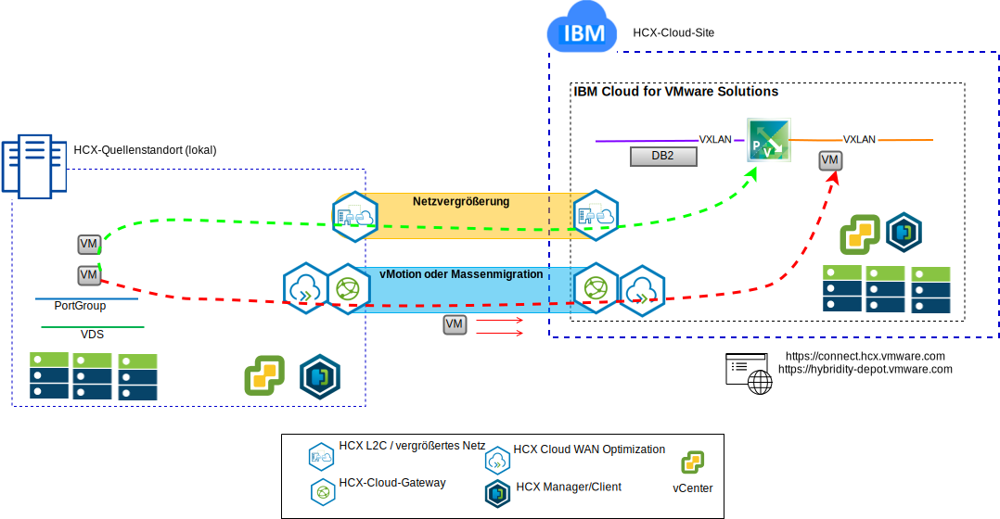

---

copyright:

  years:  2016, 2019

lastupdated: "2019-01-23"

---

# Anwendungsfälle

## Migration der Workload auf IBM Cloud

Acme Skateboards möchte das lokale VMware SDDC nahtlos in eine VMware vCenter Server on {{site.data.keyword.cloud}}-Instanz erweitern. Gleichzeitig sollen die Geschäftsabläufe aber nach Möglichkeit nicht unterbrochen werden und die Ausfallzeiten sollen minimiert werden. Das Rekonfigurieren der Anwendungen für die Ausführung in der Cloud ist keine optimal Lösung.

VMware vCenter Server on {{site.data.keyword.cloud_notm}} with Hybridity Bundle ermöglicht die Erstellung von nahtlosen Verbindungen zwischen {{site.data.keyword.cloud_notm}} und einem lokalen virtuellen VMware-Rechenzentrum.

Das vCenter Server with Hybridity Bundle-Angebot von {{site.data.keyword.cloud_notm}} ermöglicht sichere Verbindungen zwischen dem lokalen Peer-Quellenstandort und dem {{site.data.keyword.cloud_notm}}-Zielstandort.

Abbildung 1. VMware Hybridity-Services

vCenter Server with Hybridity Bundle richtet eine flexible Verbindung zwischen Standorten und {{site.data.keyword.cloud_notm}} ein und stellt z. B. folgende Funktionalität zur Verfügung:
- **Einfache Interkonnektivität** - Logische Netzverbindungen können ohne großen Aufwand über eine beliebige physische Verbindung hergestellt werden, z. B. über das öffentliche Internet, ein privates VPN oder über {{site.data.keyword.cloud_notm}} Direct Link.
- **Layer-2-Erweiterung** - Lokale Netze werden in die Cloud erweitert, einschließlich lokaler Teilnetze und IP-Adressierung.
- **Verschlüsselung** - Der Datenaustausch im Netz wird zwischen den Peerstandorten sicher verschlüsselt.
- **Netzoptimierung** - Wählt die beste Verbindung aus und nutzt die Verbindung effizient aus, sodass der Datenaustausch im Netz mit maximaler Geschwindigkeit erfolgt.
- **Datendeduplizierung** - Eine Reduzierung von bis zu 50% des Netzverkehrs ist möglich.
- **Intelligentes Routing** - Wenn eine Workload verlagert wird, kann das "Proximity Routing" den Netzpfad (oder das Gateway) ändern, sodass der Datenaustausch im Netz das Gateway des Zielstandorts verwendet (anstelle eines "Hairpinnings" zum ursprünglichen Standort).
- **Migration ohne Ausfallzeit** - Eine aktive virtuelle Maschine kann mit vMotion in die Cloud verlagert werden (oder umgekehrt).
- **Geplante Migration**: Eine beliebige Anzahl virtueller Maschinen kann an den Zielstandort repliziert und dann zu einem bestimmten Zeitpunkt an diesem Standort aktiviert werden, um die Systeme, die am ursprünglichen Standort ausgeführt werden, zu ersetzen.
- **Migration von Sicherheitsrichtlinien** - Wenn NSX lokal verwendet wird, werden alle Sicherheitsrichtlinien, Firewalls usw. zusammen mit der Workload verlagert.

Mithilfe dieser Lösung konnte Acme Skateboards die VMware-Workloads erfolgreich auf die {{site.data.keyword.cloud_notm}} migrieren - bei minimaler (oder ganz ohne) Ausfallzeit und ohne erneute Anwendungskonfiguration.

## Bereitstellung einer Hybridarchitektur

Acme Skateboards möchte für den Prozess (Journey) der Anwendungsmodernisierung eine Hybridarchitektur auf {{site.data.keyword.cloud_notm}} bereitstellen, die aus vCenter Server und {{site.data.keyword.icpfull_notm}} besteht. Dabei sollen die Datenbanken auf virtuellen Maschinen ausgeführt werden, die Anwendungen und Web-Services in Containern, und es soll eine gemeinsame Gruppe von Tools für das Netz- und Sicherheitsmanagement verwendet werden.

Abbildung 2. Hybridanwendung von Acme Skateboards

{{site.data.keyword.vmwaresolutions_short}} stellt eine Automatisierung zur weltweiten Bereitstellung von VMware-Technologiekomponenten in {{site.data.keyword.CloudDataCents_notm}} bereit. Die Architektur besteht aus einer einzelnen Cloudregion und unterstützt die Erweiterung in weitere Cloudregionen, die sich in einem anderen geografischen Gebiet oder in einem anderen {{site.data.keyword.cloud_notm}}-Pod innerhalb desselben Rechenzentrums befinden.

Die Produkte {{site.data.keyword.icpfull_notm}} und Cloud Automation Manager (CAM) werden manuell auf Ihrer lokalen Virtualisierungsplattform bereitgestellt und ermöglichen so das Cloud-Management am lokalen Standort. Alternativ werden {{site.data.keyword.icpfull_notm}} und CAM als Serviceerweiterung für eine vorhandene oder neue vCenter Server-Bereitstellung per Automation angeboten, wodurch das Cloud-Management über die {{site.data.keyword.cloud_notm}} ermöglicht wird.

Das Diagramm unten stellt {{site.data.keyword.icpfull_notm}} bei Ausführung auf einer vCenter Server-Instanz dar. NSX-V ist mit einem dedizierten Switch/VXLAN, einem DLR und einem ESG speziell für das {{site.data.keyword.icpfull_notm}}-Overlay-Netz konfiguriert. Das Routing wird über das ESG für den Zugriff auf das Underlay-Netz eingerichtet.

Mithilfe der {{site.data.keyword.cloud_notm}}-Automatisierung kann Acme Skateboards eine Hybridlösung zur Verfügung stellen, die "VMware on {{site.data.keyword.cloud_notm}}" zur Ausführung der Datenbank-VMs umfasst, und "{{site.data.keyword.icpfull_notm}} on VMware on {{site.data.keyword.cloud_notm}}" zur Ausführung der Apps und Front-End-Web-Services in Containern. NSX bietet ihnen eine gemeinsame Gruppe von Management-Tools für den Netzbetrieb und die Sicherheit im Overlay-Netz.

### Zugehörige Links

* [Übersicht über vCenter Server on {{site.data.keyword.cloud_notm}} with Hybridity Bundle](/docs/services/vmwaresolutions/archiref/vcs/vcs-hybridity-intro.html)
